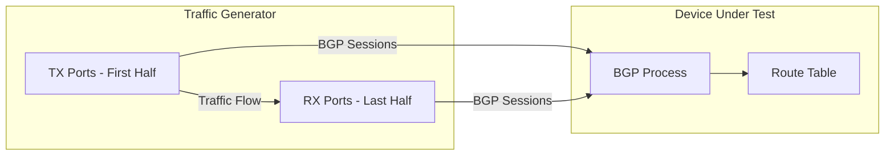
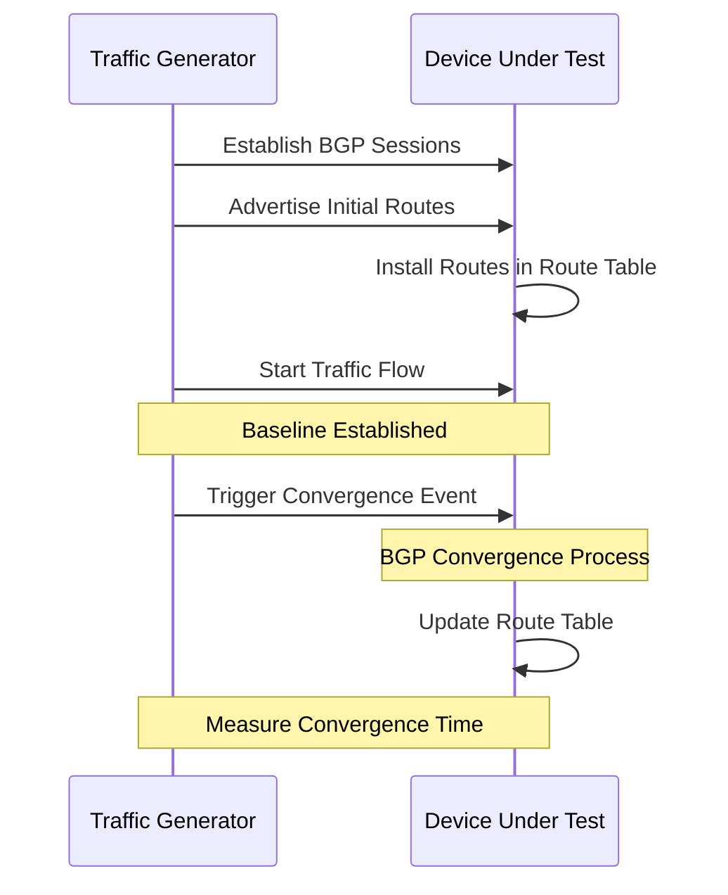

# Snappi-based BGP Convergence Test

1. [1. Test Objective](#1-test-objective)
2. [2. Test Setup](#2-test-setup)
   1. [2.1. Test port and traffic setup](#21-test-port-and-traffic-setup)
   2. [2.2. Route setup](#22-route-setup)
   3. [2.3. Metrics monitoring](#23-metrics-monitoring)
3. [3. Test parameters](#3-test-parameters)
4. [4. Test Cases](#4-test-cases)
   1. [4.1. Pretest Setup](#41-pretest-setup)
   2. [4.2. Test Case 1: Single Port Down](#42-test-case-1-single-port-down)
      1. [4.2.1. Supported Event Types](#421-supported-event-types)
      2. [4.2.2. Test Steps](#422-test-steps)
   3. [4.3. Test Case 2: Single Port Up](#43-test-case-2-single-port-up)
      1. [4.3.1. Supported Event Types](#431-supported-event-types)
      2. [4.3.2. Test Steps](#432-test-steps)
   4. [4.4. Test Case 3: Device Unisolation](#44-test-case-3-device-unisolation)
      1. [4.4.1. Supported Event Types](#441-supported-event-types)
      2. [4.4.2. Test Steps](#442-test-steps)
5. [5. Metrics to collect](#5-metrics-to-collect)
   1. [5.1. Common Metric Labels](#51-common-metric-labels)
   2. [5.2. Collected Metrics](#52-collected-metrics)

## 1. Test Objective

This test aims to evaluate BGP convergence behavior and performance of SONiC switches during network topology changes, including route withdrawal, route injection, and link or device failures.

## 2. Test Setup

This test uses the Network Under Test (NUT) testbed configuration. For detailed testbed setup instructions, refer to [README.testbed.NUT.md](../testbed/README.testbed.NUT.md).

The test expects BGP sessions to be pre-established between devices and the traffic generator using the `deploy-cfg` command as described in the NUT testbed documentation.

### 2.1. Test port and traffic setup

This test will use available ports on the traffic generator to establish BGP sessions and generate traffic.

The test will read the port configuration from the device config and use it to configure the traffic generator ports accordingly.

For port allocation, the first half of available ports will be designated as TX (transmit) ports and the last half as RX (receive) ports. This configuration ensures high traffic load testing across the system by utilizing maximum port density.

Traffic will be configured to flow from TX ports to RX ports with destination prefixes advertised via BGP from the RX side.

### 2.2. Route setup

All devices in the testbed should have BGP sessions configured with the traffic generator.

During the test setup phase, the test will establish BGP sessions between the traffic generator and the device under test to inject and withdraw routes dynamically.

The test will inject baseline routes and establish stable traffic flows before triggering convergence events.

### 2.3. Metrics monitoring

The test will monitor the following metrics to track the key BGP convergence performance:

- **Data plane downtime**: Duration of traffic loss during convergence events (typically completes first)
- **Route convergence time**: A.k.a. Control plane downtime. Time from event trigger until all affected routes are updated in the route table (typically completes after data plane recovery)

For detailed metrics information, please refer to the Metrics section below.

For more details on telemetry interface usage, refer to the [Telemetry Interface Documentation](https://github.com/sonic-net/sonic-mgmt/tree/master/test_reporting/telemetry).

## 3. Test parameters

The test needs to support the following parameters:

| Parameter Name   | Description                              | Supported Values                                        |
|------------------|------------------------------------------|---------------------------------------------------------|
| `route_scale`    | The number of routes to inject           | `1000`, `10000`, `100000`, `500000`, `1000000`          |
| `prefix_length`  | The prefix length for IPv4/IPv6          | `24`, `32` for IPv4; `64`, `119`, `128` for IPv6        |
| `traffic_rate`   | The rate of baseline traffic             | `100`                                                   |
| `frame_size`     | The frame size for traffic generation    | `64`, `128`, `256`, `512`, `1024`, `4096`, `8192` bytes |
| `address_family` | Address family for BGP routes            | `ipv4`, `ipv6`                                          |
| `event_type`     | The type of convergence event to trigger | Test case specific (see individual test cases)          |

## 4. Test Cases

### 4.1. Pretest Setup

The following setup steps are common to all test cases:

1. Establish BGP sessions between traffic generator and device under test.
2. Inject baseline routes and verify route installation.

### 4.2. Test Case 1: Single Port Down

This test case evaluates BGP convergence behavior when a single port or route is removed from the network.

#### 4.2.1. Supported Event Types

| Event Type         | Description                                                          |
|--------------------|----------------------------------------------------------------------|
| `t0_port_shutdown` | Physical port shutdown on a T0 switch connected to RX ports          |
| `route_withdrawal` | BGP route withdrawal from one RX port while keeping physical port up |

#### 4.2.2. Test Steps

1. Execute pretest setup (Section 4.1).
2. Start baseline traffic flow and verify steady state with all ports operational.
3. Trigger the specified shutdown event:
   - **T0 port shutdown**: Select target T0 port connected to RX ports and trigger administrative shutdown
   - **Route withdrawal**: Select one RX port and withdraw BGP routes while keeping the physical port up
4. Monitor and measure data plane downtime (time until traffic recovery) and route convergence time.
5. Verify final state and collect metrics.

### 4.3. Test Case 2: Single Port Up

This test case evaluates BGP convergence behavior when a previously shut down port or withdrawn route is restored.

#### 4.3.1. Supported Event Types

| Event Type        | Description                                                                         |
|-------------------|-------------------------------------------------------------------------------------|
| `t0_port_startup` | Bringing up a previously shut down T0 port connected to RX ports                    |
| `route_injection` | BGP route injection (advertisement) from one RX port while keeping physical port up |

#### 4.3.2. Test Steps

1. Execute pretest setup (Section 4.1) with appropriate initial state:
   - **T0 port startup**: One T0 port connected to RX in shutdown state (e.g., from Test Case 1 or manually configured)
   - **Route injection**: One RX port not advertising routes
2. Start baseline traffic flow and verify steady state with traffic flowing through alternate/existing paths.
3. Trigger the specified startup event:
   - **T0 port startup**: Bring the target T0 port back up (remove administrative shutdown)
   - **Route injection**: Inject (advertise) BGP routes from the selected RX port while keeping the physical port up
4. Monitor and measure data plane downtime (time until traffic recovery) and route convergence time.
5. Verify final state matches expected routing behavior and collect metrics.

### 4.4. Test Case 3: Device Unisolation

This test case evaluates the performance from complete device isolation (all ports down) until full traffic recovery. It supports multiple isolation/recovery events.

#### 4.4.1. Supported Event Types

| Event Type              | Description                                             |
|-------------------------|---------------------------------------------------------|
| `config_reload`         | Reload device configuration causing temporary isolation |
| `all_ports_startup`     | Bring all ports down then back up                       |
| `bgp_container_restart` | Restart BGP container                                   |

#### 4.4.2. Test Steps

1. Execute pretest setup (Section 4.1).
2. Trigger the specified isolation event (takedown phase):
   - **Config reload**: Skip takedown phase, proceed to step 3
   - **All ports startup**: Administratively shut down all ports
   - **BGP container restart**: Stop BGP container
3. Start baseline traffic flow and verify complete traffic loss across all ports.
4. Trigger recovery event:
   - **Config reload**: Execute `config reload` command on device
   - **All ports startup**: Bring all ports back up
   - **BGP container restart**: Start BGP container
5. Monitor recovery process and measure data plane downtime (time until traffic recovery) and route convergence time.
6. Verify final state matches initial baseline and collect metrics.

## 5. Metrics to collect

During this test, we focus on collecting the two key metrics that define BGP convergence performance (note that data plane typically recovers faster than control plane):

- **Route convergence time**: Time from the convergence event trigger until all affected routes are fully updated in the route table
- **Data plane downtime**: Time from event trigger until traffic recovery

### 5.1. Common Metric Labels

All metrics include the following common labels based on test parameters:

| User Interface Label                     | Label Key in DB           | Example Value    |
|------------------------------------------|---------------------------|------------------|
| `METRIC_LABEL_TEST_PARAMS.EVENT_TYPE`    | test.params.event_type    | t0_port_shutdown |
| `METRIC_LABEL_TEST_PARAMS_ROUTE_SCALE`   | test.params.route_scale   | 100000           |
| `METRIC_LABEL_TEST_PARAMS_PREFIX_LENGTH` | test.params.prefix_length | 24               |
| `METRIC_LABEL_TG_TRAFFIC_RATE`           | tg.traffic_rate           | 100              |
| `METRIC_LABEL_TG_FRAME_SIZE`             | tg.frame_size             | 64               |
| `METRIC_LABEL_TG_IP_VERSION`             | tg.ip_version             | ipv4             |

### 5.2. Collected Metrics

| User Interface Metric Name                      | Metric Name in DB                 | Example Value |
|-------------------------------------------------|-----------------------------------|---------------|
| `METRIC_NAME_BGP_CONVERGENCE_ROUTE_TIME_MS`     | bgp.convergence.route.time.ms     | 1250          |
| `METRIC_NAME_BGP_CONVERGENCE_DATAPLANE_TIME_MS` | bgp.convergence.dataplane.time.ms | 2300          |
