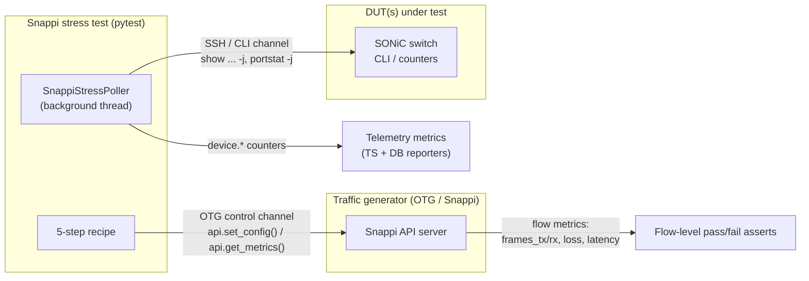
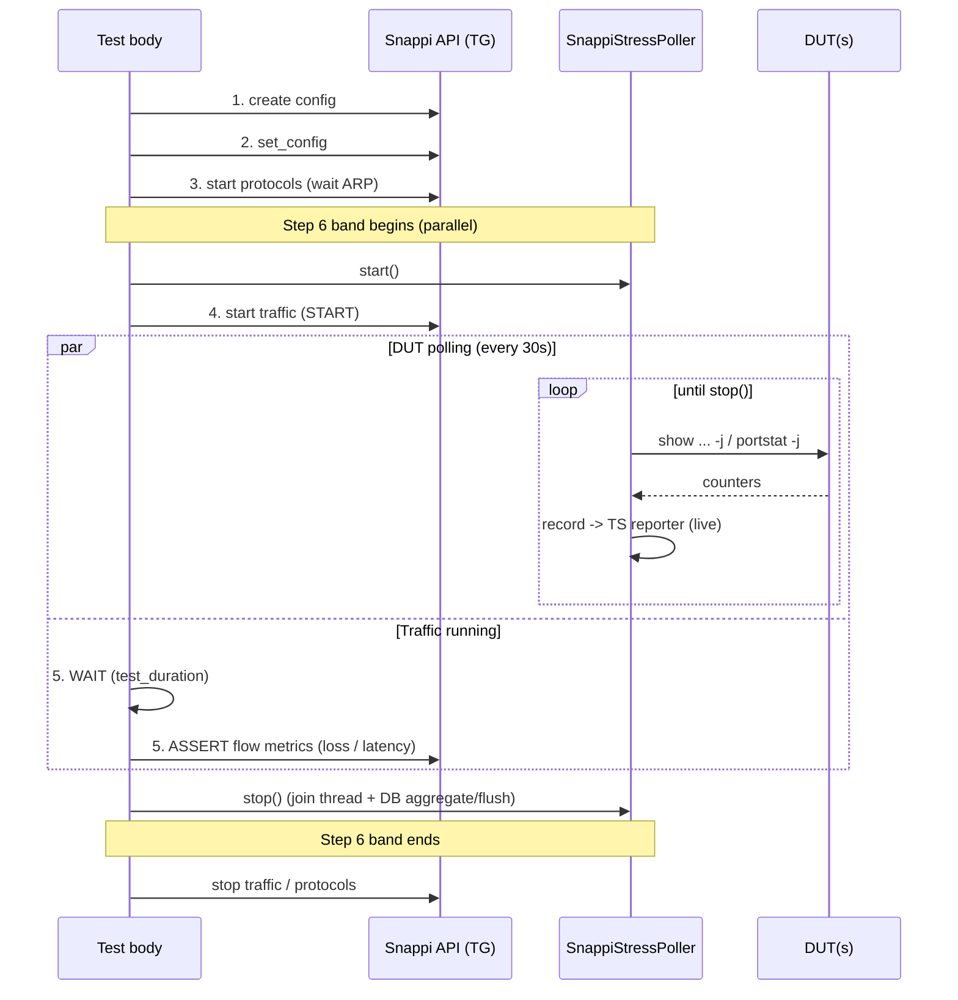

# Snappi Stress Test Telemetry

1. [1. Overview](#1-overview)
2. [2. Scope](#2-scope-and-non-scope)
3. [3. Architecture and design](#3-architecture-and-design)
   1. [3.1. Data source separation](#31-data-source-separation)
   2. [3.2. `SnappiStressCounters` metric families](#32-snappistresscounters-metric-families)
   3. [3.3. The poller](#33-the-poller)
   4. [3.4. Multi-DUT model](#34-multi-dut-model)
   5. [3.5. Integration with the Snappi recipe ("Step 6")](#35-integration-with-the-snappi-recipe-step-6)
   6. [3.6. DB reporter aggregation contract](#36-db-reporter-aggregation-contract)
4. [4. Rollout plan](#4-rollout-plan)
5. [5. Testing and validation](#5-testing-and-validation)

## 1. Overview

Long-running Snappi stress tests have a "black box" interval between the moment traffic starts
and the final assertion. Today the traffic generator's view of the flows is captured (frames,
loss, latency), but the **DUT's own state during that interval is not**. When a stress run
regresses, there is no record of what the switch was doing - queue build-up, PFC storms, ECN
marking, optics drift, thermal or PSU behavior - at the time of the failure.

This document proposes a reusable, Snappi-aware **DUT counter poller** that closes that gap. It
**extends [`tests/common/telemetry`](../../../tests/common/telemetry/)** (the framework described in
[telemetry.md](../../tests/telemetry.md)) with a timer-based poller plus new platform and optics
metric families, and adopts it across the Snappi stress suite under
[`tests/snappi_tests/`](../../../tests/snappi_tests/).

The outcome is a **dual-pipeline view** for every Snappi stress test, reusing the two reporters
the framework already provides:

| Pipeline       | Reporter   | Purpose                          | When            |
|----------------|------------|----------------------------------|-----------------|
| **Live**       | TS reporter | In-flight debugging (OpenTelemetry -> Grafana) | Each poll tick |
| **Historical** | DB reporter | Cross-run trend analysis (file -> OLTP)        | End of test     |

This is a thin, additive layer. It introduces no new reporter, no new transport, and no new
storage; it feeds the existing pipelines with a new, Snappi-aware data source.

## 2. Scope

- A reusable, timer-based DUT counter polling module under
  [`tests/common/telemetry/`](../../../tests/common/telemetry/).
- Adoption of the poller across the Snappi stress suite under
  [`tests/snappi_tests/`](../../../tests/snappi_tests/).
- Metric-family extensions for **platform fan**, **platform SSD**, and **optics DOM**, plus
  PFC and ECN families used by the RDMA stress tests.
- An **aggregation behavior** for the DB reporter (per-metric statistics over the test window).
- Unit tests and baselines following the existing
  [`tests/common/telemetry/tests/`](../../../tests/common/telemetry/tests/) pattern.
- The lab-side OpenTelemetry collector, Prometheus, and Grafana stack.
- Grafana dashboard authoring.

## 3. Architecture and design

### 3.1. Data source separation

The single most common confusion in review is conflating the two data sources. A Snappi stress
test draws from **two physically distinct sources over two distinct channels**:

- The **traffic generator** is reached over the OTG control channel. It already exposes
  *flow-level* metrics - `frames_tx`, `frames_rx`, `bytes_tx/rx`, loss, and latency - per the
  [OTG model](https://otg.dev/). These remain the basis of every test's pass/fail assertion and
  are **not** re-collected on the DUT side.
- The **DUT** is reached over the SSH/CLI channel via `duthost.command(...)`. This is where
  switch-internal state lives: per-port, per-queue, PFC, ECN, optics DOM, and platform sensors.

The poller collects **only DUT-side counters**. Flow truth stays with the generator; switch
truth comes from the switch. Keeping them separate avoids duplicating what OTG already provides.

### 3.2. `SnappiStressCounters` metric families

`SnappiStressCounters` is a composite that, given a reporter, instantiates one `MetricCollection`
per family (reusing the existing collections and adding new ones). It follows the
`MetricDefinition` pattern documented in [telemetry.md §3.5](../../tests/telemetry.md#35-creating-custom-metric-fixtures)
and the dotted `lowercase.snake_case.dot_separated` naming convention. Names that embed a unit
suffix (`*.bps`, `*.bytes`) match the established framework names so existing dashboards keep
working.

| Family          | Status   | Metric names                                                                 | Key labels                              | DUT source |
|-----------------|----------|------------------------------------------------------------------------------|-----------------------------------------|------------|
| **Port**        | existing | `port.{rx,tx}.{bps,util,ok,err,drop,overrun}`                                | `device.port.id`                        | `portstat -j` |
| **Queue**       | existing | `queue.watermark.bytes`                                                       | `device.queue.id`, `device.queue.cast`  | `show queue watermark` |
| **PFC**         | **new**  | `pfc.rx.frames`, `pfc.tx.frames`, `pfc.rx.pause_duration`                     | `device.port.id`, `device.priority.id`  | `pfcstat -j` |
| **ECN**         | **new**  | `ecn.marked.packets`, `ecn.marked.bytes`, `wred.dropped.packets`, `wred.dropped.bytes` | `device.port.id`, `device.queue.id` | `show queue counters -j` |
| **Optics DOM**  | **new**  | `optics.dom.temperature`, `optics.dom.voltage`, `optics.dom.tx_bias`, `optics.dom.tx_power`, `optics.dom.rx_power` | `device.port.id`, `device.optics.lane.id` | `show interfaces transceiver eeprom -d` |
| **Platform fan**| **extend** | existing `fan.{speed,status}` + `fan.speed.target`, `fan.direction`        | `device.fan.id`                         | `show platform fan -j` |
| **Platform SSD**| **new**  | `ssd.health`, `ssd.temperature`, `ssd.io.reads`, `ssd.io.writes`             | `device.ssd.id`                         | `show platform ssdhealth` |
| **PSU**         | existing | `psu.{voltage,current,power,status,led}`                                     | `device.psu.id`                         | `show platform psu -j` |
| **Temperature** | existing | `temperature.{reading,high_th,low_th,crit_high_th,crit_low_th,warning}`      | `device.sensor.id`                      | `show platform temperature -j` |

New constants to add to [`constants.py`](../../../tests/common/telemetry/constants.py): labels
`device.priority.id`, `device.optics.lane.id`, `device.ssd.id`; units `dbm`, `milliamperes`,
`microseconds`. The metric names above are proposed for explicit sign-off in this document (see
[open question Tier 2 #5](#tier-2--design-decisions)) so that PRs reference the doc rather than
renaming after merge.

### 3.3. The poller

- **Polling cadence.** Default **60 s** (`interval_sec`), configurable via a fixture flag.
  Cadence is drift-free: each tick subtracts the work time from the sleep.
- **Concurrency model.** A single **background thread** started at traffic `START` and joined at
  `ASSERT`. `duthost.command()` is blocking (Ansible/paramiko) and the test body is synchronous,
  so a thread is the natural fit; an async coroutine would need an event loop the test does not run.
- **Lifecycle.** Use the poller as a context manager so `stop()` runs on the normal path **and**
  when an assertion raises mid-band - the thread is always joined and the DB reporter is always
  flushed.
- **Error handling.** If a DUT is transiently unreachable (e.g., a mid-test reboot), the poller
  catches the connection error, records a `dut.unreachable` gauge (`1`) for that DUT, skips the
  tick, and resumes automatically once the DUT answers again. Polling never aborts the test.

### 3.4. Multi-DUT model

A **single** `SnappiStressPoller` instance covers all DUTs in the testbed. Records are
disambiguated by the `device.id` label (set to the DUT hostname). This
keeps one thread, one cadence, and one flush point regardless of DUT count, and matches how the
framework's other collections are labeled. One-instance-per-DUT was considered and rejected: it
multiplies threads and flush points without adding information that a `device.id` label does not
already carry.

### 3.5. Integration with the Snappi recipe ("Step 6")

Snappi stress tests follow a 5-step recipe (build config -> `set_config` -> start protocols →
start traffic -> wait/assert; see [`run_traffic()`](../../../tests/common/snappi_tests/traffic_generation.py)).
DUT polling is added as a **parallel "Step 6"** that spans `START -> WAIT -> ASSERT`:

The flow-level assert continues to use the OTG metrics from `snappi_api`; the poller only adds the
DUT-side `device.*` time series alongside it.

### 3.6. DB reporter aggregation contract

A stress test produces many samples per metric (e.g., a 1-hour run at 30 s cadence yields ~120
samples per metric per label set). The live TS pipeline streams every sample. For the historical
pipeline we do **not** want 120 raw rows per metric in the OLTP DB; we want a compact statistical
summary that supports cross-run trend analysis.

- **Statistics (phase 1):** `avg`, `p50`, `p95`, `p99`, `max` per metric, per label set, per test.
- **Time window (phase 1):** the **full test window** - one summary spanning `START → ASSERT`.
- **Time window (phase 2):** **per-minute buckets**, to localize transients within a long run.

The poller keeps a per-`(metric, labels)` sample buffer for the DB path; at `stop()` it computes
the statistics and records them as derived gauges, distinguished by an `aggregation` label, then
calls `db_reporter.report()` once. The metric name is unchanged, so the OLTP shape is:

| Column        | Example                                  |
|---------------|------------------------------------------|
| `metric_name` | `queue.watermark.bytes`                  |
| `labels`      | `{device.id, device.port.id, device.queue.id, ...}` |
| `aggregation` | `p95`                                    |
| `window`      | `full_test` (phase 1) / `bucket` (phase 2) |
| `value`       | `1048576`                                |
| `timestamp`   | test end (phase 1) / bucket end (phase 2) |

This keeps exact percentiles (sample buffer, not bucketed estimates) and leaves the existing
gauge semantics and TS pipeline untouched.

## 4. Rollout plan

**Pilot:** [`tests/snappi_tests/dataplane/test_switch_capacity.py`](../../../tests/snappi_tests/dataplane/test_switch_capacity.py).
It already contains the ad-hoc polling pattern this module generalizes, so the pilot is a
refactor-and-prove rather than a green-field change.

**Sequencing (exit criteria per phase):**

1. **Phase 1 - reusable poller + pilot.** Land `SnappiStressPoller` and `SnappiStressCounters`
   (existing families only) and convert the pilot. *Exit:* pilot green end-to-end on a real stress
   run; live metrics visible against a local OTel collector; DB summary written; unit tests +
   baselines merged.
2. **Phase 2 - enable across the stress suite + PFC/ECN families.** Adopt the poller in the
   RDMA-heavy directories. *Exit:* `pfc/`, `pfcwd/`, `ecn/` instrumented; PFC/ECN metric names
   signed off and emitting.
3. **Phase 3 - platform/optics families.** Add platform fan, platform SSD, and optics DOM
   (developed in parallel with phase 2). *Exit:* families emitting on a platform that supports
   them; gracefully skipped where unsupported.
4. **Phase 4 - DB aggregation + reboot directory.** Per-minute bucketing and the reboot-safe
   path. *Exit:* `reboot/` instrumented with `dut.unreachable` coverage; per-minute buckets in DB.

Full rollout targets the upcoming **202611** community release branch; the pilot is expected on
`master` within ~2 weeks of sign-off.

**Per-subdirectory rollout table:**

| Sub-directory                                            | Topology        | Phase | Primary metric families             | Notes |
|----------------------------------------------------------|-----------------|-------|-------------------------------------|-------|
| [`dataplane/`](../../../tests/snappi_tests/dataplane/)      | `nut`           | 1     | port, queue, psu, temp, fan, ssd, optics | Pilot lives here |
| [`pfc/`](../../../tests/snappi_tests/pfc/)                  | `tgen` / `multidut-tgen` | 2 | pfc, queue, port, ecn          | Lossless-priority focus |
| [`pfcwd/`](../../../tests/snappi_tests/pfcwd/)              | `tgen`          | 2     | pfc, queue, port                    | Watchdog storm windows |
| [`ecn/`](../../../tests/snappi_tests/ecn/)                  | `tgen`          | 2     | ecn, queue, port                    | WRED / ECN marking |
| [`qos/`](../../../tests/snappi_tests/qos/)                  | `tgen`          | 3     | queue, port, pfc                    | |
| [`packet_trimming/`](../../../tests/snappi_tests/packet_trimming/) | `tgen`   | 3     | queue, port (drop counters)         | Trim/drop visibility |
| [`reboot/`](../../../tests/snappi_tests/reboot/)            | `tgen`          | 4     | port, psu, temp + `dut.unreachable` | **Special:** DUT-unreachable windows; poller must survive reboot |

## 5. Testing and validation

- **Unit tests.** Add `ut_snappi_stress.py` to
  [`tests/common/telemetry/tests/`](../../../tests/common/telemetry/tests/), following the existing
  `ut_*.py` + `baselines/` pattern with `MockReporter` and `validate_recorded_metrics()`. Coverage:
  - parsing + recording for each new family (PFC, ECN, optics DOM, platform SSD, platform fan
    extensions) from captured sample `show ... -j` JSON;
  - the poller's cadence and lifecycle using a fake clock and a mock DUT;
  - the reboot-safe path: a mock DUT that raises a connection error mid-run must produce a
    `dut.unreachable` record and then resume;
  - the DB aggregation pass: a known sample series must yield the expected `avg/p50/p95/p99/max`.
- **Baselines.** Regenerate with the existing flow:
  `SONIC_MGMT_GENERATE_BASELINE=1 ./run_tests.sh ... -c common/telemetry/tests/ut_snappi_stress.py`.
- **End-to-end.** Demonstrate against one real stress run of the pilot: capture a live trace
  (TS reporter → local OTel collector) for one metric across the band, plus the resulting DB
  summary file, and attach both to the pilot PR.
