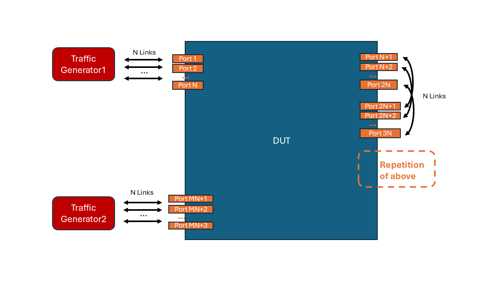

# SONiC Switch SRv6 Dataplane Performance Test

- [Test Objective](#test-objective)
- [Test Setup](#test-setup)
- [Test Parameters](#test-parameters)
- [Test Steps](#test-steps)
- [Metrics to Collect](#metrics-to-collect)

## Test Objective

This test aims to assess the data-plane performance of the SRv6 forwarding function of a SONiC switch.

## Test Setup

### Network Topology Setup

The test is designed to be topology-aganostic.
The recommded topology to use includes:
1. nut-2tiers as defined in [nut-2tiers.yml](../../../ansible/vars/nut_topos/nut-2tiers.yml). The example topology figure is shown in [NUT doc](../../testbed/README.testbed.NUT.md).
2. Snake topo as shown in 

### Network Configuration

The DUT should have SRv6 and route configurations as follows:
- Every Device Under Test(DUT) should be configured with a number of SRv6 SIDs up to the maximum number of parallel links between DUT and the neighbors. If using fcbb:bbbb:: as the locator block, the SRv6 SIDs of a switch with I as device index in the topo and Q as the number of maximum parallel links can be configured to be fcbb:bbbb:hex(I << 8 + 1)::/48 ~ fcbb:bbbb:hex(I << 8 + Q)::/48.
- Every Traffic Generator(TG) should also be configured a number of SRv6 SIDs each of which corresponds to a link between the traffic generator and the DUT. If using fcbb:bbbb:: as the locator block, the SRv6 SIDs of a traffic generator, with I as device index and N ports connected to the switch, can be as fcbb:bbbb:hex(I << 8 + 1)::/48 ~ fcbb:bbbb:hex(I << 8 + N)::/48.
- The DUT should have a static route entry configured for each SRv6 SID that its neighbors (including both DUTs and TGs) have.

An example configuration for snake topology is shown below:
```
{
    "INTERFACE": {
        "Ethernet0": {},
        "Ethernet0|10.0.3.2/30": {},
        "Ethernet0|fc0a::302/126": {},
        "Ethernet1": {},
        "Ethernet1|10.0.4.1/30": {},
        "Ethernet1|fc0a::401/126": {},
        "Ethernet2": {},
        "Ethernet2|10.0.4.2/30": {},
        "Ethernet2|fc0a::402/126": {},
        "Ethernet3": {},
        "Ethernet3|10.0.5.1/30": {},
        "Ethernet3|fc0a::501/126": {},
        "Ethernet4": {},
        "Ethernet4|10.0.5.2/30": {},
        "Ethernet4|fc0a::502/126": {},
        "Ethernet5": {},
        "Ethernet5|10.0.6.1/30": {},
        "Ethernet5|fc0a::601/126": {},
        "Ethernet6": {},
        "Ethernet6|10.0.6.2/30": {},
        "Ethernet6|fc0a::602/126": {},
        "Ethernet7": {},
        "Ethernet7|10.0.7.1/30": {},
        "Ethernet7|fc0a::701/126": {},
        "Ethernet8": {},
        "Ethernet8|10.0.7.2/30": {},
        "Ethernet8|fc0a::702/126": {},
        "Ethernet9": {},
        "Ethernet9|10.0.8.1/30": {},
        "Ethernet9|fc0a::801/126": {}
    },
    "STATIC_ROUTE": {
        "default|fcbb:bbbb:2::/48": {
            "nexthop": "fc0a::402",
            "ifname": "Ethernet1"
        },
        "default|fcbb:bbbb:3::/48": {
            "nexthop": "fc0a::502",
            "ifname": "Ethernet3"
        },
        "default|fcbb:bbbb:4::/48": {
            "nexthop": "fc0a::602",
            "ifname": "Ethernet5"
        },
        "default|fcbb:bbbb:5::/48": {
            "nexthop": "fc0a::702",
            "ifname": "Ethernet7"
        },
        "default|fcbb:bbbb:206::/48": {
            "nexthop": "fc0a::802",
            "ifname": "Ethernet9"
        }
    },
    "SRV6_MY_LOCATORS": {
        "loc1": {
            "prefix": "fcbb:bbbb:1::",
            "func_len": 0
        },
        "loc2": {
            "prefix": "fcbb:bbbb:2::",
            "func_len": 0
        },
        "loc3": {
            "prefix": "fcbb:bbbb:3::",
            "func_len": 0
        },
        "loc4": {
            "prefix": "fcbb:bbbb:4::",
            "func_len": 0
        },
        "loc5": {
            "prefix": "fcbb:bbbb:5::",
            "func_len": 0
        }
    },
    "SRV6_MY_SIDS": {
        "loc1|fcbb:bbbb:1::/48": {
            "action": "uN",
            "decap_dscp_mode": "pipe"
        },
        "loc2|fcbb:bbbb:2::/48": {
            "action": "uN",
            "decap_dscp_mode": "pipe"
        },
        "loc3|fcbb:bbbb:3::/48": {
            "action": "uN",
            "decap_dscp_mode": "pipe"
        },
        "loc4|fcbb:bbbb:4::/48": {
            "action": "uN",
            "decap_dscp_mode": "pipe"
        },
        "loc5|fcbb:bbbb:5::/48": {
            "action": "uN",
            "decap_dscp_mode": "pipe"
        }
    }
}
```

### Traffic Generation Configuration

The traffic generators should be configured to send traffic with SRv6 SIDs in IPv6 header and optionally Segment Routing Header.
The exact way of configuring the SRv6 SIDs in the header depends on the topology and the traffic path the users want to test.

However, there are three principles to follow:
1. We should split the ports of the traffic generators into two groups (e.g. first half vs last half) with equal number of ports.
2. Each port of the traffic generators should mutually exclusively communicate with a single port in the other group in a bidrectional way.
3. Every pair of ports should communicate using a SRv6 path (by specifying SRv6 SID list in IPv6 header) that does not share any link with any other pair of ports so that the network is congestion free by design.

We give two examples for nut2tiers topology and snake topology here:

#### SRv6 SIDs configuration for `nut-2tiers` Topology

For a NUT which have M T0 devices with M traffic generators that has N ports, the SRv6 paths used by each traffic generator port can be calculated as follows:
- The ports of the i-th (0 <= i < M/2) traffic generator (in the first group) can use SRv6 paths:
    - fcbb:bbbb:hex(i)01:hex(16M)01:hex(M/2 + i)01:hex(M/2 + i)hex(N + 1)::
    - fcbb:bbbb:hex(i)02:hex(16M)02:hex(M/2 + i)02:hex(M/2 + i)hex(N + 2)::
    - ...
    - fcbb:bbbb:hex(i)10:hex(16M)hex(N):hex(M/2 + i)10:hex(M/2 + i)hex(2N)::
- The ports of the i-th (M/2 <= i < M) traffic generator (in the second group) can use SRv6 paths:
    - fcbb:bbbb:hex(i)01:hex(16M)01:hex(i - M/2)01:hex(i - M/2)hex(N + 1)::
    - fcbb:bbbb:hex(i)02:hex(16M)02:hex(i - M/2)02:hex(i - M/2)hex(N + 2)::
    - ...
    - fcbb:bbbb:hex(i)10:hex(16M)hex(N):hex(i - M/2)10:hex(i - M/2)hex(2N)::

#### SRv6 SIDs configuration for Snake Topology
Supposedly, there are two groups of traffic generator ports on both sides of the 'Snake'.
If one group of traffic generator ports consists of N ports, for a port of indexed by i (1 <= i <= N), the packet sent by the traffic generator should have SRv6 SID list in IPv6 header (and potentially Segment Routing Header) as follows:
- fcbb:bbbb:i00:i:hex(N + i):hex(2N + i)...hex(MN + i):hex(N+i)00::, note: hex(N+i)00 refers to the SRv6 SID of the receiving traffic generator.

To maximize the stress on the DUT, the i-th port of the traffic generators on the other side of the topology should send packets to the DUT with SRv6 SID list as follows:
- fcbb:bbbb:hex(N+i)00:hex(MN + i):hex((M-1)N + i):...:i:i00::, note: this is essentially the reverse of the SID list used by the other side.

### Metrics Monitoring

The test should perform the following metrics monitoring:
- Collects all metrics listed in [Switch Capability Test](./switch_capacity_test.md), [Switch Packet Drop Threshold Test](./switch-packet-drop-threshold-tests.md) and [Switch latency Tests](./switch-latency-tests.md) periodically from switches during the test.
- Collects additional metrics listed in [Metrics to Collect](#metrics-to-collect) periodically from switches during the test.

## Test Parameters

- `test_duration`: The duration of the test in minutes, which supports 1min, 5min, 15mins, 60mins, 1day and 2days.
- `packet_size`: The size of the packets in bytes to be sent in the traffic, which supports 128, 256, 4096, and mix of packet size (In the mix, the 128 packet size should always only occupy 1% of the traffic).
- `collect_interval`: The interval between two metrics collection operations on the switch.

## Test Steps

1. For each combination of test parameters, start the traffic generator to generate traffic according to the parameters provided.
2. Start the monitoring thread to collect metrics from all SONiC devices in the testbed.
3. Wait until the test to be completed.
4. Stop the traffic generator.

##  Additional Metrics to collect

During this test, we are going to collect the following additional metrics from the SONiC device in the testbed:

### SRv6 MY_SID Metrics

The `show srv6 stat` command is used on the switch to retrieve the packets and bytes counter for every SRv6 MY_SID entry configured on the device. The following labels are expected to be provided:

| Metrics Label                     | Label Key in DB  | Example Value   |     Description   |
|-----------------------------------|------------------|-----------------|-------------------|
| `METRIC_LABEL_DEVICE_ID`          | device.id        | switch-A        | Switch Identifier |
| `METRIC_LABEL_DEVICE_SRV6_MY_SID` | device.srv6.my_sid | fcbb:bbbb:1::/48 | IP Prefix of the SRv6 SID entry |

| User Interface Metric Name             | Metric Name in DB               | Example Value       |
|----------------------------------------|---------------------------------|---------------------|
| `METRIC_NAME_SRV6_MY_SID_BYTES`        | srv6.my_sid.rx.bytes               | 10000               |
| `METRIC_NAME_SRV6_MY_SID_PACKETS`      | srv6.my_sid.rx.packets             | 2                   |