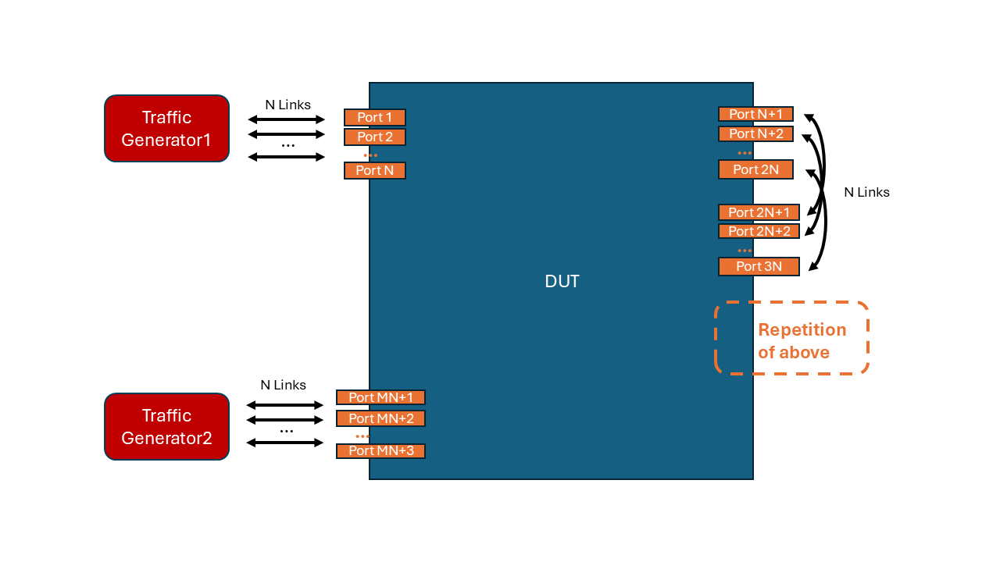

# SONiC Switch SRv6 Dataplane Performance Test -- Snake Stress Testing Setup

- [Test Objective](#test-objective)
- [Test Setup](#test-setup)
- [Test Parameters](#test-parameters)
- [Test Steps](#test-steps)
- [Metrics to Collect](#metrics-to-collect)

## Test Objective

This test aims to assess the data-plane performance of the SRv6 forwarding function of a SONiC switch in an approximately full load condition.

## Test Setup

### Network Topology Setup

- The test is designed to be run againts a single device.
- The device under test(DUT) should have a small subset of its ports connected to the traffic generators while all the other ports connected to each other to form a snake topology.

An example of the topology is shown in the following figure:

### Network Configuration

The DUT should have SRv6 and route configurations as follows:
- The DUT should be configured with a number of SRv6 SIDs each of which corresponds to an active switch port. If using fcbb:bbbb:: as the locator block, the SRv6 SIDs of a switch with Q ports can be configured to be fcbb:bbbb:1::/48 ~ fcbb:bbbb:hex(Q)::/48.
- Every Traffic Generator should also be configured a number of SRv6 SIDs each of which corresponds to a link between the traffic generator and the DUT. If using fcbb:bbbb:: as the locator block, the SRv6 SIDs of a traffic generator with N ports can be as fcbb:bbbb:100::/48 ~ fcbb:bbbb:hex(N)00::/48.
- The DUT should have a static route entry configured for each SRv6 SID that it has and the traffic generators have.

### Traffic Generation Configuration

The traffic generators should be configured to send traffic as follows:

For a port of the traffic generator indexed by i (1 <= i <= N), the packet sent by the traffic generator should have SRv6 SID list in IPv6 header (and potentially Segment Routing Header) as follows:
- fcbb:bbbb:i00:i:hex(N + i):hex(2N + i)...hex(MN + i):hex(N+i)00::, note: hex(N+i)00 refers to the SRv6 SID of the receiving traffic generator.

To maximize the stress on the DUT, the i-th port of the other traffic generator should send packets to the DUT with SRv6 SID list as follows:

- fcbb:bbbb:hex(N+i)00:hex(MN + i):hex((M-1)N + i):...:i:i00::, note: this is essentially the reverse of the SID list used by the other side.

### Metrics Monitoring

The test should perform the following metrics monitoring:
- Collects all metrics listed in [Switch Capability Test](./switch_capacity_test.md) periodically from switches during the test.
- Collects additional metrics listed in [Metrics to Collect](#metrics-to-collect) periodically from switches during the test.
- Measure the throughput of the traffic on the receiver side.
- Measure the latency of every packet received and log the data.

## Test Parameters

- `test_duration`: The duration of the test in minutes, which supports 1min, 5min, 15mins, 60mins, 1day and 2days.
- `packet_size`: The size of the packets in bytes to be sent in the traffic, which supports 128, 256, 512, 1024, 2048, 4096 and 8192.
- `collect_interval`: The interval between two metrics collection operations on the switch.

## Test Steps

1. For each combination of test parameters, start the traffic generator to generate traffic according the parameters provided.
2. Start the monitoring thread to collect metrics from all SONiC devices in the testbed.
3. Wait until the test to be completed.
4. Stop the traffic generator.

## Metrics to collect

During this test, we are going to collect the following metrics from the SONiC device in the testbed:

### SRv6 MY_SID Metrics

The `show srv6 stat` command is used on the switch to retrieve the packets and bytes counter for every SRv6 MY_SID entry configured on the device. The following labels are expected to be provided:

| Metrics Label                     | Label Key in DB  | Example Value   |     Description   |
|-----------------------------------|------------------|-----------------|-------------------|
| `METRIC_LABEL_DEVICE_ID`          | device.id        | switch-A        | Switch Identifier |
| `METRIC_LABEL_DEVICE_SRV6_MY_SID` | device.srv6.my_sid | fcbb:bbbb:1::/48 | IP Prefix of the SRv6 SID entry |

| User Interface Metric Name             | Metric Name in DB               | Example Value       |
|----------------------------------------|---------------------------------|---------------------|
| `METRIC_NAME_SRV6_MY_SID_BYTES`        | srv6.my_sid.rx.bytes               | 10000               |
| `METRIC_NAME_SRV6_MY_SID_PACKETS`      | srv6.my_sid.rx.packets             | 2                   |