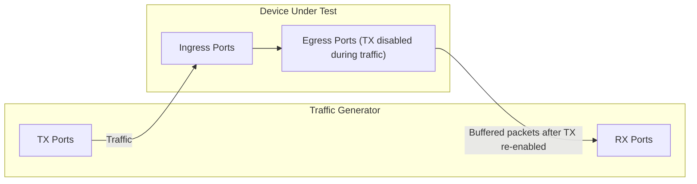

# Snappi-based ECN Marking Accuracy Tests

1. [1. Test Objective](#1-test-objective)
2. [2. Testbed Topology](#2-testbed-topology)
   1. [2.1. Test port configuration](#21-test-port-configuration)
   2. [2.2. Route announcement](#22-route-announcement)
3. [3. Common test parameters](#3-common-test-parameters)
4. [4. Test Cases](#4-test-cases)
   1. [4.1. Test setup](#41-test-setup)
      1. [4.1.1. Enabling SAI thrift APIs](#411-enabling-sai-thrift-apis)
      2. [4.1.2. Port allocation](#412-port-allocation)
      3. [4.1.3. QoS config discovery](#413-qos-config-discovery)
      4. [4.1.4. Traffic stream setup](#414-traffic-stream-setup)
   2. [4.2. Test case 1: ECN marking accuracy test](#42-test-case-1-ecn-marking-accuracy-test)
      1. [4.2.1. Test steps](#421-test-steps)
      2. [4.2.2. ECN marking validation](#422-ecn-marking-validation)
5. [5. Metrics to collect](#5-metrics-to-collect)

## 1. Test Objective

This test aims to verify that the ECN marking on the SONiC switch is not only happening, but also happening accurately as configured. For each queue with ECN enabled, the test builds up the egress queue to a known depth, then checks the ECN marking probability of the dequeued packets against the WRED profile config (min threshold, max threshold and max marking probability) on the switch.

## 2. Testbed Topology

The test is designed to be topology-agnostic. It expects the testbed to be built following the [Multi-device multi-tier testbed HLD](../../testbed/README.testbed.NUT.md).

However, since this test needs to call the SAI APIs directly to control the port egress, it will be running against the switch whose egress ports are directly connected to the RX ports of the traffic generator.

### 2.1. Test port configuration

This test will use all available ports to this testbed on the traffic generator to run the test. The available ports are split into 2 halves: the first half as TX ports and the second half as RX ports. Each TX port sends traffic to its paired RX port (1:1 mapping), so the queue build-up on each egress port is deterministic.

The test will read the port configuration from the testbed and device config and use it to configurate the traffic generator ports accordingly, such as speed, fec and so on.

### 2.2. Route announcement

During the pretest phase, the test will leverage the traffic generator or the device connected directly to the traffic generator to inject the routes into the testbed. This facilitates the traffic routing and allows us to inject the any number of routes into the testbed for testing purposes.

## 3. Common test parameters

The test needs to support the following parameters:

- `ip_version`: IPv4 or IPv6, which supports `ipv4` and `ipv6`.
- `frame_bytes`: The size of the packets to be sent in the traffic, which supports 64, 128, 256, 512, 1024, 4096 and 8192 bytes.
- `packet_count`: The number of packets to send from each TX port. It should be large enough to build the queue depth beyond the max threshold of the WRED profile under test.
- `marking_accuracy_tolerance`: The allowed deviation between the observed marking probability and the configured marking probability, which supports 10% by default.

## 4. Test Cases

### 4.1. Test setup

#### 4.1.1. Enabling SAI thrift APIs

To control the port egress precisely, this test needs to call the SAI APIs directly on the switch. To achieve this, the test replaces the `syncd` container with the `syncd-rpc` container during the test setup phase, which runs the SAI thrift server. The test then uses the py-thrift bindings (`sai_thrift`) to call the SAI APIs from the test host.

Replacing `syncd` is a risky operation: if the test crashes in the middle (e.g. network disconnection, python exception or test run timeout) and `syncd-rpc` is left running, all subsequent tests will run on the wrong `syncd`. To avoid leaving the testbed in a bad state, the test follows the rules below:

- The `syncd` replacement and restore is implemented as a pytest fixture, with the restore placed in the fixture cleanup path (try/finally), so the original `syncd` container is restored no matter whether the test passes, fails or crashes in the middle.
- Before running any test traffic, the test runs a preflight check to verify that the `syncd-rpc` container can be started, the SAI thrift server is reachable, and the restore path works.
- If the restore fails, the testbed is in an unknown state and manual recovery is required. In this case, the test must fail loudly with a clear error message, instead of letting the subsequent tests run on the wrong `syncd`.

> NOTE: As an alternative, blocking the egress with regular SAI config without replacing `syncd`, such as setting the scheduler weight of the queue to 0, is worth investigating. If it works reliably across platforms, it can remove the `syncd` replacement risk completely.

#### 4.1.2. Port allocation

The test splits all the available ports on the traffic generator into 2 halves:

- TX ports: The first half of the ports.
- RX ports: The second half of the ports.

Each TX port is paired with one RX port, and the traffic only flows within each pair.

#### 4.1.3. QoS config discovery

Same as the [Basic ECN marking tests](switch-ecn-marking-tests.md), the test walks through the QoS configuration on the SONiC switch to learn the queue setup, instead of assuming a fixed config:

1. Read the `DSCP_TO_TC_MAP` table to get the DSCP to traffic class mappings.
2. Read the `TC_TO_QUEUE_MAP` table to get the traffic class to queue mappings.
3. Read the `QUEUE` and `WRED_PROFILE` tables to learn which queues have ECN marking enabled, and their WRED profile config: min threshold (kMin), max threshold (kMax) and max marking probability (probability).

After this step, the test builds a list of `(dscp, queue, kMin, kMax, probability)` tuples for all the ECN-enabled queues. For each queue, one representative DSCP value is selected to drive the traffic into that queue. The test will run the test case below for every queue in this list.

#### 4.1.4. Traffic stream setup

For each queue under test, the test creates 1 traffic stream from each TX port to its paired RX port, configured as below:

- The DSCP field is set to the representative DSCP value of the queue under test, so the traffic lands on the specified queue.
- The ECN field is set to ECT(1) (ECN-capable transport), so the switch can mark the packets with CE instead of dropping them when congestion happens.
- The number of packets is set to `packet_count`, sent as a fixed-count burst instead of continuous traffic.
- The frame size is set to `frame_bytes`.

### 4.2. Test case 1: ECN marking accuracy test

#### 4.2.1. Test steps

For each ECN-enabled queue learned in the QoS config discovery step, the test runs the following steps:

1. Call `sai_thrift_port_tx_enable` to disable the TX side of the egress ports on the switch that connect to the RX ports of the traffic generator.
2. Start the traffic streams from the TX ports. Since the egress ports are disabled, all packets will be buffered in the egress queue, which builds up the queue depth.
3. Stop the traffic after all `packet_count` packets are sent.
4. Start the packet capture on the RX ports of the traffic generator.
5. Call `sai_thrift_port_tx_enable` to re-enable the egress ports on the switch. The buffered packets will be drained from the queue and captured by the traffic generator.
6. Walk through the captured packets, count the CE-marked and non-marked packets, and validate the marking probability against the WRED profile config (see below).
7. Clear the counters and captures, then move on to the next queue.

#### 4.2.2. ECN marking validation

When the egress port is disabled, the queue builds up as the packets arrive, so each packet is enqueued at a known queue depth: the i-th packet sent from a TX port is enqueued when the queue already holds roughly `(i - 1) * frame_bytes` of data. This allows the test to reconstruct the expected marking probability of each captured packet from its position:

- Packets enqueued when the queue depth is below kMin: expected to have no CE marking.
- Packets enqueued when the queue depth is between kMin and kMax: expected to be CE-marked with a probability that increases linearly from 0 to the configured max marking probability.
- Packets enqueued when the queue depth is above kMax: expected to be 100% CE-marked.

The test groups the captured packets into buckets by their enqueue-time queue depth, computes the observed marking probability of each bucket, and asserts that it matches the expected probability within `marking_accuracy_tolerance`.

> NOTE: Some ASICs evaluate the WRED curve at dequeue time instead of enqueue time. In that case, the queue depth seen by each packet is the remaining queue depth when it is dequeued, which decreases as the queue drains. The test needs to pick the expected probability model based on the platform behavior, while the bucketing and validation logic stays the same.

## 5. Metrics to collect

During this test, we are going to collect the following metrics from the traffic generator, using [FinalMetricsReporter interface](../../../test_reporting/telemetry/README.md). The metrics will be reported to a database for further analysis.

| Metric Name                                 | Metric Name in DB           | Description                                                                            | Example Value |
|---------------------------------------------|-----------------------------|----------------------------------------------------------------------------------------|---------------|
| `METRIC_NAME_TG_TX_FRAMES`                  | tg.tx.frames                | The number of frames sent from the TX ports in the burst.                              | 100000        |
| `METRIC_NAME_TG_RX_FRAMES`                  | tg.rx.frames                | The number of frames received on the RX ports after the egress ports are re-enabled.   | 100000        |
| `METRIC_NAME_TG_RX_ECN_CE_FRAMES`           | tg.rx.ecn_ce.frames         | The number of received frames that are marked with ECN CE.                             | 23117         |
| `METRIC_NAME_TG_RX_ECN_CE_RATIO`            | tg.rx.ecn_ce.ratio          | The observed CE marking probability in percent: CE-marked frames / received frames.    | 23.12         |
| `METRIC_NAME_TG_RX_ECN_CE_RATIO_EXPECTED`   | tg.rx.ecn_ce.ratio.expected | The expected CE marking probability in percent, calculated from the WRED profile config. | 25.00         |

The metrics needs to be reported with the following labels:

| User Interface Label                       | Label Key in DB         | Example Value |
|--------------------------------------------|-------------------------|---------------|
| `METRIC_LABEL_TG_IP_VERSION`               | tg.ip_version           | 4             |
| `METRIC_LABEL_TG_FRAME_BYTES`              | tg.frame_bytes          | 1024          |
| `METRIC_LABEL_TG_DSCP`                     | tg.dscp                 | 3             |
| `METRIC_LABEL_DEVICE_QUEUE_ID`             | device.queue.id         | 3             |
| `METRIC_LABEL_DEVICE_QUEUE_DEPTH_BYTES`    | device.queue.depth.bytes| 2097152       |
