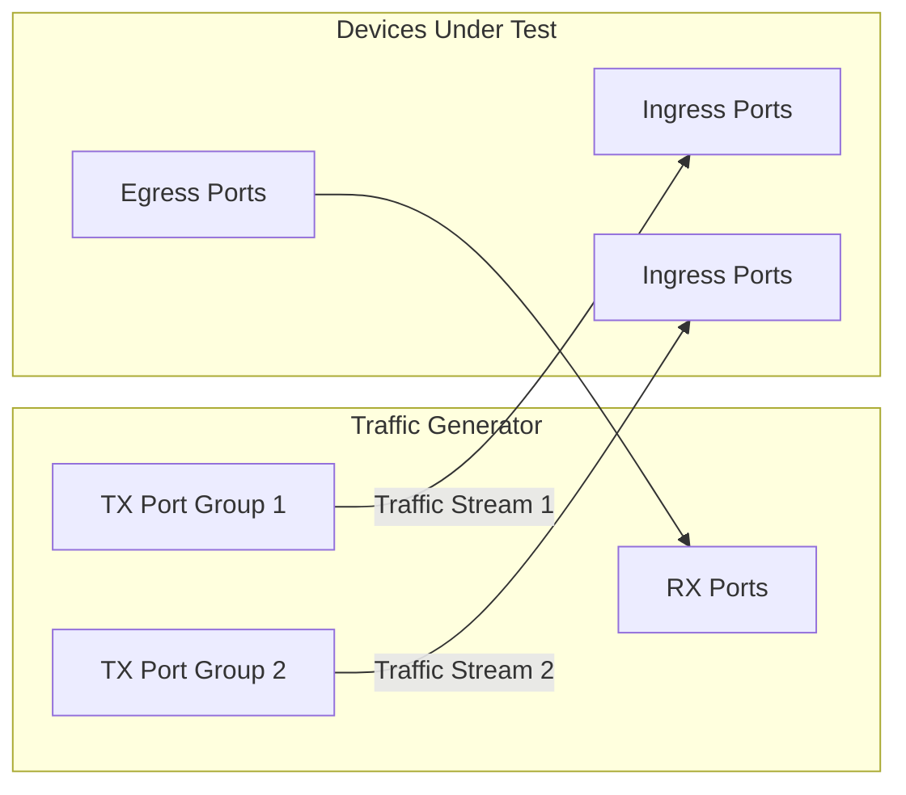

# Snappi-based ECN Marking Tests

1. [1. Test Objective](#1-test-objective)
2. [2. Testbed Topology](#2-testbed-topology)
   1. [2.1. Test port configuration](#21-test-port-configuration)
   2. [2.2. Route announcement](#22-route-announcement)
3. [3. Common test parameters](#3-common-test-parameters)
4. [4. Test Cases](#4-test-cases)
   1. [4.1. Test setup](#41-test-setup)
      1. [4.1.1. Port allocation](#411-port-allocation)
      2. [4.1.2. QoS config discovery](#412-qos-config-discovery)
      3. [4.1.3. Traffic stream setup](#413-traffic-stream-setup)
   2. [4.2. Test case 1: Basic ECN marking test](#42-test-case-1-basic-ecn-marking-test)
5. [5. Metrics to collect](#5-metrics-to-collect)

## 1. Test Objective

This test aims to verify that ECN marking is properly enabled or disabled for each queue configured on the SONiC switch. For each queue, the test creates congestion on the egress port and checks that packets are marked with ECN CE (Congestion Experienced) when congestion happens, and that no packets are marked when there is no congestion.

## 2. Testbed Topology

The test is designed to be topology-agnostic. It expects the testbed to be built following the [Multi-device multi-tier testbed HLD](../../testbed/README.testbed.NUT.md), which allows us to test the ECN marking behavior of either a single switch or a multi-tier network.

### 2.1. Test port configuration

This test will use all available ports to this testbed on the traffic generator to run the test. Based on the test parameter `rx_port_count`, the available ports are split into TX ports and RX ports, where the number of TX ports is 2 times the number of RX ports. The TX ports are further split into 2 equal groups, where each group has the same number of ports as the RX ports. The traffic is configured as all-to-all from each TX port group to the RX ports, so a single group alone does not create congestion, while both groups together oversubscribe every RX port.

The test will read the port configuration from the testbed and device config and use it to configurate the traffic generator ports accordingly, such as speed, fec and so on.

### 2.2. Route announcement

During the pretest phase, the test will leverage the traffic generator or the device connected directly to the traffic generator to inject the routes into the testbed. This facilitates the traffic routing and allows us to inject the any number of routes into the testbed for testing purposes.

## 3. Common test parameters

The test needs to support the following parameters:

- `ip_version`: IPv4 or IPv6, which supports `ipv4` and `ipv6`.
- `rx_port_count`: The number of RX ports to use. The number of TX ports will be 2 times this value. The rest of the available ports will not be used.
- `frame_bytes`: The size of the packets to be sent in the traffic, which supports 64, 128, 256, 512, 1024, 4096 and 8192 bytes.
- `test_duration`: The duration of each traffic run in seconds, which supports 60 seconds by default.
- `traffic_rate`: The rate of the traffic for each traffic stream, which is set to 70% of the line rate by default. With both streams running, the RX ports will receive 140% of the line rate, which guarantees congestion.

## 4. Test Cases

### 4.1. Test setup

#### 4.1.1. Port allocation

Based on the `rx_port_count` test parameter, the test splits all the available ports on the traffic generator as below:

- RX ports: The last `rx_port_count` ports.
- TX port group 1: The first `rx_port_count` ports.
- TX port group 2: The next `rx_port_count` ports.

If the testbed does not have at least `3 * rx_port_count` ports available, the test will be skipped.

#### 4.1.2. QoS config discovery

The test walks through the QoS configuration on the SONiC switch to learn the queue setup, instead of assuming a fixed config:

1. Read the `DSCP_TO_TC_MAP` table to get the DSCP to traffic class mappings.
2. Read the `TC_TO_QUEUE_MAP` table to get the traffic class to queue mappings.
3. Read the `QUEUE` and `WRED_PROFILE` tables to learn which queues have ECN marking enabled (`ecn` set to `ecn_all` or alike in the WRED profile) and their min/max thresholds.

After this step, the test builds a list of `(dscp, tc, queue, ecn_enabled)` tuples. For each queue, one representative DSCP value is selected to drive the traffic into that queue. The test will run the test case below for every queue in this list.

#### 4.1.3. Traffic stream setup

For each queue under test, the test creates 2 traffic streams:

- Traffic stream 1: From all ports in TX port group 1 to all RX ports, configured as all-to-all.
- Traffic stream 2: From all ports in TX port group 2 to all RX ports, configured as all-to-all.

Since each TX port group has the same number of ports as the RX ports and the traffic is all-to-all, the traffic of a single stream is evenly distributed across all RX ports without creating congestion. When both streams are running, each RX port receives traffic from 2 times the number of TX ports, which creates congestion on all RX ports.

Both traffic streams are configured as below:

- The DSCP field is set to the representative DSCP value of the queue under test, so the traffic lands on the specified queue.
- The ECN field is set to ECT(1) (ECN-capable transport), so the switch can mark the packets with CE instead of dropping them when congestion happens.
- The traffic rate is set to `traffic_rate` (70% of the line rate by default) on each stream.
- The frame size is set to `frame_bytes`.

### 4.2. Test case 1: Basic ECN marking test

For each queue learned in the QoS config discovery step, the test runs the following steps:

1. Start traffic stream 1 only and run it for `test_duration` seconds.
   1. Since the number of TX ports equals the number of RX ports and the traffic is all-to-all, each RX port only receives 70% of the line rate, so no congestion should happen.
   2. Capture the received packets on the RX ports and check the ECN field.
   3. Assert that no received packet is marked with CE, no matter whether ECN is enabled on the queue or not.
2. Start traffic stream 2, so both streams are running, and run them for `test_duration` seconds.
   1. Since each RX port now receives traffic from 2 times the number of TX ports at 140% of the line rate, congestion will happen on the egress queue of all RX ports.
   2. Capture the received packets on the RX ports and check the ECN field.
   3. If ECN is enabled on the queue, assert that received packets are marked with CE.
   4. If ECN is not enabled on the queue, assert that no received packet is marked with CE.
3. Stop all traffic streams, clear the counters on the traffic generator and the switch, then move on to the next queue.

## 5. Metrics to collect

During this test, we are going to collect the following metrics from the traffic generator, using [FinalMetricsReporter interface](../../../test_reporting/telemetry/README.md). The metrics will be reported to a database for further analysis.

| User Interface Metric Name          | Metric Name in DB     | Example Value |
|-------------------------------------|-----------------------|---------------|
| `METRIC_NAME_TG_TX_FRAMES`          | tg.tx.frames          | 124218975     |
| `METRIC_NAME_TG_RX_FRAMES`          | tg.rx.frames          | 124218975     |
| `METRIC_NAME_TG_RX_ECN_CE_FRAMES`   | tg.rx.ecn_ce.frames   | 5832110       |
| `METRIC_NAME_TG_RX_ECN_CE_RATIO`    | tg.rx.ecn_ce.ratio    | 4.69          |

The metrics needs to be reported with the following labels:

| User Interface Label                    | Label Key in DB          | Example Value |
|-----------------------------------------|--------------------------|---------------|
| `METRIC_LABEL_TG_IP_VERSION`            | tg.ip_version            | 4             |
| `METRIC_LABEL_TG_TRAFFIC_RATE`          | tg.traffic_rate          | 70            |
| `METRIC_LABEL_TG_FRAME_BYTES`           | tg.frame_bytes           | 1024          |
| `METRIC_LABEL_TG_DSCP`                  | tg.dscp                  | 3             |
| `METRIC_LABEL_DEVICE_QUEUE_ID`          | device.queue.id          | 3             |
| `METRIC_LABEL_TEST_PARAMS_DURATION_SEC` | test.params.duration.sec | 60            |
| `METRIC_LABEL_TEST_PARAMS_CONGESTION`   | test.params.congestion   | true          |
