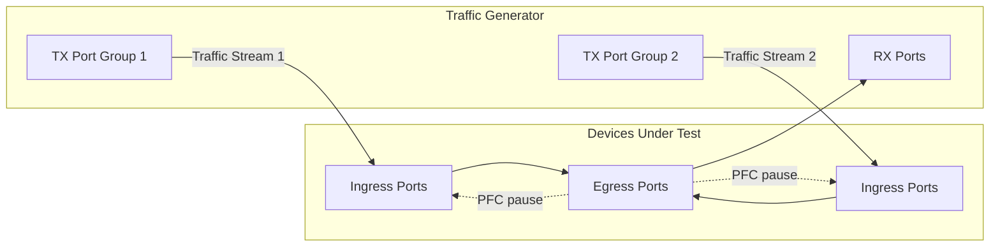

# Snappi-based ECN vs PFC Ordering Tests

1. [1. Test Objective](#1-test-objective)
2. [2. Testbed Topology](#2-testbed-topology)
   1. [2.1. Test port configuration](#21-test-port-configuration)
   2. [2.2. Route announcement](#22-route-announcement)
3. [3. Common test parameters](#3-common-test-parameters)
4. [4. Test Cases](#4-test-cases)
   1. [4.1. Test setup](#41-test-setup)
      1. [4.1.1. Port allocation](#411-port-allocation)
      2. [4.1.2. QoS config discovery](#412-qos-config-discovery)
      3. [4.1.3. Traffic stream setup](#413-traffic-stream-setup)
   2. [4.2. Test case 1: ECN before PFC test](#42-test-case-1-ecn-before-pfc-test)
5. [5. Metrics to collect](#5-metrics-to-collect)

## 1. Test Objective

On a lossless priority, ECN marking and PFC work together to handle congestion: as the queue fills up, the switch should first start ECN marking (between kMin and kMax of the WRED profile) to signal congestion to the end hosts, and only assert PFC pause (at the xoff threshold) when the queue keeps growing as the last resort to avoid packet loss. This ordering relies on the WRED thresholds being configured below the PFC xoff threshold.

This test aims to verify that, on each lossless queue, ECN marking starts before PFC pause is asserted, so the congestion is signaled to the end hosts before the upstream link is paused. This is critical for RoCEv2 / RDMA deployments, where wrong ordering leads to PFC storms and head-of-line blocking instead of graceful congestion control.

## 2. Testbed Topology

The test is designed to be topology-agnostic. It expects the testbed to be built following the [Multi-device multi-tier testbed HLD](../../testbed/README.testbed.NUT.md).

### 2.1. Test port configuration

The test port configuration is the same as the [Basic ECN marking tests](switch-ecn-marking-tests.md). Based on the test parameter `rx_port_count`, the available ports are split into TX ports and RX ports, where the number of TX ports is 2 times the number of RX ports. The TX ports are further split into 2 equal groups, where each group has the same number of ports as the RX ports. The traffic is configured as all-to-all from each TX port group to the RX ports, so a single group alone does not create congestion, while both groups together oversubscribe every RX port.

The TX ports are configured to honor the PFC pause frames sent by the switch, so the queue build-up and the PFC behavior reflect a real lossless deployment.

The test will read the port configuration from the testbed and device config and use it to configurate the traffic generator ports accordingly, such as speed, fec and so on.

### 2.2. Route announcement

During the pretest phase, the test will leverage the traffic generator or the device connected directly to the traffic generator to inject the routes into the testbed. This facilitates the traffic routing and allows us to inject the any number of routes into the testbed for testing purposes.

## 3. Common test parameters

The test needs to support the following parameters:

- `ip_version`: IPv4 or IPv6, which supports `ipv4` and `ipv6`.
- `rx_port_count`: The number of RX ports to use. The number of TX ports will be 2 times this value. The rest of the available ports will not be used.
- `frame_bytes`: The sizes of the packets to be sent in the traffic. This is a list parameter, which currently only needs 64 bytes.
- `test_duration`: The duration of each traffic run in seconds, which supports 60 seconds by default.
- `traffic_rate`: The rate of the traffic for each traffic stream, which is set to 70% of the line rate by default.

## 4. Test Cases

### 4.1. Test setup

#### 4.1.1. Port allocation

Same as the [Basic ECN marking tests](switch-ecn-marking-tests.md), the test splits all the available ports on the traffic generator as below:

- RX ports: The last `rx_port_count` ports.
- TX port group 1: The first `rx_port_count` ports.
- TX port group 2: The next `rx_port_count` ports.

If the testbed does not have at least `3 * rx_port_count` ports available, the test will be skipped.

#### 4.1.2. QoS config discovery

Same as the [Basic ECN marking tests](switch-ecn-marking-tests.md), the test walks through the QoS configuration on the SONiC switch (`DSCP_TO_TC_MAP`, `TC_TO_QUEUE_MAP`, `QUEUE` and `WRED_PROFILE` tables) to build the DSCP/TC/queue mappings and the WRED profile of each queue.

On top of this, the test reads the lossless config to find the queues under test:

1. Read the `PORT_QOS_MAP` table to find the lossless priorities (`pfc_enable`) on each port.
2. Read the `BUFFER_PROFILE` table to learn the PFC xon/xoff thresholds of the lossless queues.

After this step, the test builds a list of `(dscp, tc, queue, wred_config, pfc_thresholds)` tuples for all the lossless queues that also have ECN marking enabled. The test will run the test case below for every queue in this list, and skip the queues that are not lossless or do not have ECN enabled.

#### 4.1.3. Traffic stream setup

Same as the [Basic ECN marking tests](switch-ecn-marking-tests.md), the test creates 2 all-to-all traffic streams, one from each TX port group to all RX ports, where a single stream does not create congestion and both streams together create congestion on all RX ports. Each stream runs at `traffic_rate` (70% of the line rate by default) with the frame size set to `frame_bytes`.

Both traffic streams are configured as below:

- The DSCP field is set to the representative DSCP value of the lossless queue under test, so the traffic lands on that queue.
- The ECN field is set to ECT(1) (ECN-capable transport), so the switch can mark the packets with CE.

The TX ports are configured to honor PFC pause frames on the priority of the queue under test, so the traffic slows down when the switch asserts PFC.

### 4.2. Test case 1: ECN before PFC test

For each lossless ECN-enabled queue learned in the QoS config discovery step, the test runs the following steps:

1. Start traffic stream 1 only and run it for `test_duration` seconds.
   1. Since there is no congestion, assert that no packet is marked with CE, and no PFC pause frame is received on the TX ports.
2. Start traffic stream 2, so both streams are running, and run them for `test_duration` seconds. This builds up the queue and triggers the congestion handling.
3. Collect the following from the traffic generator and the switch:
   1. The timestamp and count of the first CE-marked packet received on the RX ports.
   2. The timestamp and count of the first PFC pause frame (for the priority under test) received on the TX ports.
   3. The switch-side ECN marked counter and PFC tx counter for the queue/priority under test.
4. Assert the ordering and the behavior:
   1. ECN marking happens: CE-marked packets are observed on the RX ports.
   2. ECN marking happens before PFC: the first CE-marked packet is observed before the first PFC pause frame, which confirms the WRED thresholds are below the PFC xoff threshold.
   3. The switch-side ECN marked counter increases, and matches the CE-marked packet count observed on the traffic generator within a small tolerance.
5. Stop all traffic streams, clear the counters on the traffic generator and the switch, then move on to the next queue.

## 5. Metrics to collect

During this test, we are going to collect the following metrics from the traffic generator and the switch, using [FinalMetricsReporter interface](../../../test_reporting/telemetry/README.md). The metrics will be reported to a database for further analysis.

| Metric Name                          | Metric Name in DB         | Description                                                                                  | Example Value |
|--------------------------------------|---------------------------|----------------------------------------------------------------------------------------------|---------------|
| `METRIC_NAME_ECN_TO_PFC_GAP_NS`      | ecn.to_pfc_gap.ns         | The time from the first CE-marked packet received to the first PFC pause frame received, in ns. | 4200000       |
| `METRIC_NAME_TG_RX_ECN_CE_FRAMES`    | tg.rx.ecn_ce.frames       | The number of received frames that are marked with ECN CE.                                    | 581032        |
| `METRIC_NAME_TG_RX_PFC_FRAMES`       | tg.rx.pfc.frames          | The number of PFC pause frames received on the TX ports for the priority under test.          | 1820          |
| `METRIC_NAME_QUEUE_ECN_MARKED_PKTS`  | device.queue.ecn_marked   | The switch-side WRED ECN marked packet counter for the queue under test.                      | 581520        |

The metrics needs to be reported with the following labels:

| User Interface Label                    | Label Key in DB          | Example Value |
|-----------------------------------------|--------------------------|---------------|
| `METRIC_LABEL_TG_IP_VERSION`            | tg.ip_version            | 4             |
| `METRIC_LABEL_TG_TRAFFIC_RATE`          | tg.traffic_rate          | 70            |
| `METRIC_LABEL_TG_FRAME_BYTES`           | tg.frame_bytes           | 64            |
| `METRIC_LABEL_DEVICE_ID`                | device.id                | switch-A      |
| `METRIC_LABEL_DEVICE_QUEUE_ID`          | device.queue.id          | 3             |
| `METRIC_LABEL_TEST_PARAMS_DURATION_SEC` | test.params.duration.sec | 60            |
