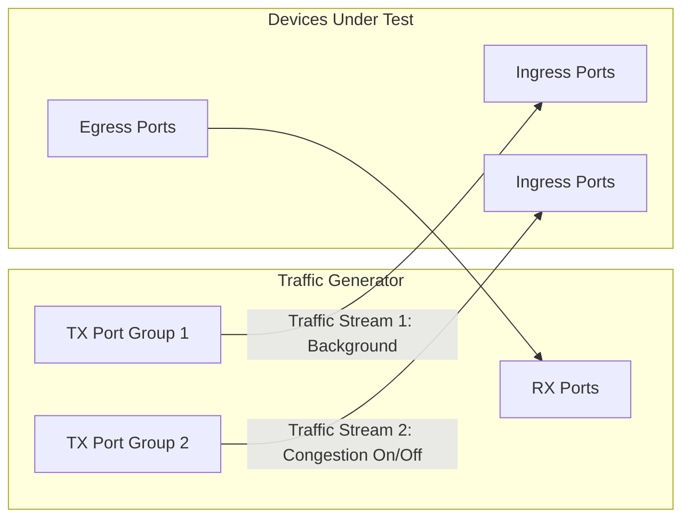

# Snappi-based ECN Response Time Tests

1. [1. Test Objective](#1-test-objective)
2. [2. Testbed Topology](#2-testbed-topology)
   1. [2.1. Test port configuration](#21-test-port-configuration)
   2. [2.2. Route announcement](#22-route-announcement)
3. [3. Common test parameters](#3-common-test-parameters)
4. [4. Test Cases](#4-test-cases)
   1. [4.1. Test setup](#41-test-setup)
      1. [4.1.1. Port allocation](#411-port-allocation)
      2. [4.1.2. QoS config discovery](#412-qos-config-discovery)
      3. [4.1.3. Traffic stream setup](#413-traffic-stream-setup)
   2. [4.2. Test case 1: ECN response time test](#42-test-case-1-ecn-response-time-test)
      1. [4.2.1. ECN enter time](#421-ecn-enter-time)
      2. [4.2.2. ECN exit time](#422-ecn-exit-time)
      3. [4.2.3. Test steps](#423-test-steps)
5. [5. Metrics to collect](#5-metrics-to-collect)

## 1. Test Objective

This test aims to measure how quickly the switch reacts to congestion with ECN marking. For each ECN-enabled queue on the SONiC switch, the test measures 2 durations:

- **ECN enter time**: How long it takes for the switch to start marking packets with ECN CE after the congestion starts.
- **ECN exit time**: How long it takes for the switch to stop marking packets with ECN CE after the congestion stops.

## 2. Testbed Topology

The test is designed to be topology-agnostic. It expects the testbed to be built following the [Multi-device multi-tier testbed HLD](../../testbed/README.testbed.NUT.md), which allows us to test the ECN response time of either a single switch or a multi-tier network.

### 2.1. Test port configuration

The test port configuration is the same as the [Basic ECN marking tests](switch-ecn-marking-tests.md). Based on the test parameter `rx_port_count`, the available ports are split into TX ports and RX ports, where the number of TX ports is 2 times the number of RX ports. The TX ports are further split into 2 equal groups, where each group has the same number of ports as the RX ports. The traffic is configured as all-to-all from each TX port group to the RX ports, so a single group alone does not create congestion, while both groups together oversubscribe every RX port.

The test will read the port configuration from the testbed and device config and use it to configurate the traffic generator ports accordingly, such as speed, fec and so on.

### 2.2. Route announcement

During the pretest phase, the test will leverage the traffic generator or the device connected directly to the traffic generator to inject the routes into the testbed. This facilitates the traffic routing and allows us to inject the any number of routes into the testbed for testing purposes.

## 3. Common test parameters

The test needs to support the following parameters:

- `ip_version`: IPv4 or IPv6, which supports `ipv4` and `ipv6`.
- `rx_port_count`: The number of RX ports to use. The number of TX ports will be 2 times this value. The rest of the available ports will not be used.
- `frame_bytes`: The size of the packets to be sent in the traffic, which supports 64, 128, 256, 512, 1024, 4096 and 8192 bytes.
- `congestion_duration`: How long traffic stream 2 keeps running to hold the congestion, which supports 60 seconds by default.
- `traffic_rate`: The rate of the traffic for each traffic stream, which is set to 70% of the line rate by default.
- `num_iterations`: The number of times to repeat the measurement for each queue, which supports 1 by default. More iterations give more stable results, since the measured durations can vary from run to run.

## 4. Test Cases

### 4.1. Test setup

#### 4.1.1. Port allocation

Same as the [Basic ECN marking tests](switch-ecn-marking-tests.md), the test splits all the available ports on the traffic generator as below:

- RX ports: The last `rx_port_count` ports.
- TX port group 1: The first `rx_port_count` ports.
- TX port group 2: The next `rx_port_count` ports.

If the testbed does not have at least `3 * rx_port_count` ports available, the test will be skipped.

#### 4.1.2. QoS config discovery

Same as the [Basic ECN marking tests](switch-ecn-marking-tests.md), the test walks through the QoS configuration on the SONiC switch (`DSCP_TO_TC_MAP`, `TC_TO_QUEUE_MAP`, `QUEUE` and `WRED_PROFILE` tables) to build a list of `(dscp, tc, queue, ecn_enabled)` tuples, and selects one representative DSCP value for each queue.

Since the response time can only be measured when ECN marking happens, the test will run the test case below for every ECN-enabled queue in this list, and skip the queues without ECN.

#### 4.1.3. Traffic stream setup

For each queue under test, the test creates 2 traffic streams:

- Traffic stream 1 (background): From all ports in TX port group 1 to all RX ports, configured as all-to-all. This stream keeps running throughout the test without creating congestion.
- Traffic stream 2 (congestion): From all ports in TX port group 2 to all RX ports, configured as all-to-all. Starting and stopping this stream turns the congestion on and off on all RX ports.

Both traffic streams are configured as below:

- The DSCP field is set to the representative DSCP value of the queue under test, so the traffic lands on the specified queue.
- The ECN field is set to ECT(1) (ECN-capable transport), so the switch can mark the packets with CE instead of dropping them when congestion happens.
- The traffic rate is set to `traffic_rate` (70% of the line rate by default) on each stream.
- The frame size is set to `frame_bytes`.

### 4.2. Test case 1: ECN response time test

#### 4.2.1. ECN enter time

The ECN enter time is measured around the start of traffic stream 2:

- Start time: The timestamp of the first packet of traffic stream 2 being sent out from the TX ports.
- End time: The timestamp of the first CE-marked packet being received on the RX ports.
- ECN enter time = End time - Start time.

#### 4.2.2. ECN exit time

The ECN exit time is measured around the stop of traffic stream 2:

- Start time: The timestamp of the last packet of traffic stream 2 being sent out from the TX ports.
- End time: The timestamp of the last CE-marked packet being received on the RX ports.
- ECN exit time = End time - Start time.

#### 4.2.3. Test steps

For each ECN-enabled queue learned in the QoS config discovery step, the test runs the following steps:

1. Start traffic stream 1 and wait until the traffic reaches the steady state. Since there is no congestion, no packet should be marked with CE.
2. Start the packet capture with timestamps on the TX ports of TX port group 2 and all RX ports.
3. Start traffic stream 2 and record the timestamp of its first packet being sent out.
4. Watch the captured packets on the RX ports for the first CE-marked packet, and calculate the ECN enter time.
5. Keep both streams running for `congestion_duration` seconds to hold the congestion.
6. Stop traffic stream 2 and record the timestamp of its last packet being sent out.
7. Watch the captured packets on the RX ports for the last CE-marked packet, and calculate the ECN exit time.
8. Assert that CE-marked packets are observed during the congestion, and no CE-marked packets are observed after the ECN exit, otherwise the measurement is invalid.
9. Stop all traffic streams and captures, clear the counters, then repeat for `num_iterations` times before moving on to the next queue.

The test does not impose a fixed pass/fail threshold on the measured durations, since they are platform and config dependent. Instead, the measured durations are reported as metrics to the database for further analysis and regression tracking.

## 5. Metrics to collect

During this test, we are going to collect the following metrics from the traffic generator, using [FinalMetricsReporter interface](../../../test_reporting/telemetry/README.md). The metrics will be reported to a database for further analysis.

| User Interface Metric Name        | Metric Name in DB  | Example Value |
|-----------------------------------|--------------------|---------------|
| `METRIC_NAME_ECN_ENTER_TIME_NS`   | ecn.enter_time.ns  | 1250000       |
| `METRIC_NAME_ECN_EXIT_TIME_NS`    | ecn.exit_time.ns   | 8730000       |

The metrics needs to be reported with the following labels:

| User Interface Label                    | Label Key in DB          | Example Value |
|-----------------------------------------|--------------------------|---------------|
| `METRIC_LABEL_TG_IP_VERSION`            | tg.ip_version            | 4             |
| `METRIC_LABEL_TG_TRAFFIC_RATE`          | tg.traffic_rate          | 70            |
| `METRIC_LABEL_TG_FRAME_BYTES`           | tg.frame_bytes           | 1024          |
| `METRIC_LABEL_TG_DSCP`                  | tg.dscp                  | 3             |
| `METRIC_LABEL_TG_RX_PORT_ID`            | tg.rx_port.id            | Port 5        |
| `METRIC_LABEL_DEVICE_QUEUE_ID`          | device.queue.id          | 3             |
| `METRIC_LABEL_TEST_PARAMS_DURATION_SEC` | test.params.duration.sec | 60            |
