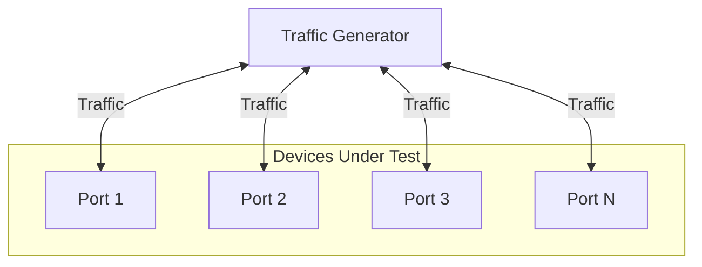

# Snappi-based Switch Latency Test

1. [1. Test Objective](#1-test-objective)
2. [2. Testbed Topology](#2-testbed-topology)
   1. [2.1. Test port configuration](#21-test-port-configuration)
   2. [2.2. Route announcement](#22-route-announcement)
3. [3. Common test parameters](#3-common-test-parameters)
4. [4. Test Cases](#4-test-cases)
   1. [4.1. Test warmup](#41-test-warmup)
   2. [4.2. Test case 1: Full-mesh latency test](#42-test-case-1-full-mesh-latency-test)
   3. [4.3. Test case 2: Oversubscribed latency test](#43-test-case-2-oversubscribed-latency-test)
5. [5. Metrics to collect](#5-metrics-to-collect)

## 1. Test Objective

This test aims to measure the latency introduced by a switch under the fully loaded condition.

## 2. Testbed Topology

The test is designed to be topology-agnostic. It expects the testbed to be built following the [Multi-device multi-tier testbed HLD](../../testbed/README.testbed.NUT.md), which allows us to test the latency of either a single switch or a multi-tier network.

### 2.1. Test port configuration

This test will use all available ports to this testbed on the traffic generator to run the test.

The test will read the port configuration from the testbed and device config and use it to configurate the traffic generator ports accordingly, such as speed, fec and so on.

### 2.2. Route announcement

During the pretest phase, the test will leverage the traffic generator or the device connected directly to the traffic generator to inject the routes into the testbed. This facilitates the traffic routing and allows us to inject the any number of routes into the testbed for testing purposes.

## 3. Common test parameters

The test needs to support the following parameters:

- `ip_version`: IPv4 or IPv6, which supports `ipv4` and `ipv6`.
- `test_duration`: The duration of the test in minutes, which supports 1min by default.
- `frame_bytes`: The size of the packets to be sent in the traffic, which supports 64, 128, 256, 512, 1024, 4096 and 8192 bytes.
- `route_count`: The total number of routes to be injected, which supports 0 (only peer IP is used), 1024, 16384 and 131072.
- `route_prefix_length`: The route prefix length, which supports 24 (IPv4) and 64, 104, 120 (IPv6).

## 4. Test Cases

### 4.1. Test warmup

Before all the test cases below, we need to do 2 steps to warm up the testbed:

1. Step 1: Run the same traffic that each test is testing for 1 minute.
2. Step 2: Clean up the counters on the traffic generator.

### 4.2. Test case 1: Full-mesh latency test

This test requires more parameters to be setup besides the ones defined above:

- `traffic_rate`: The rate of the traffic to be sent, which supports 10%, 25%, 50%, 75% and 100% of the line rate.
- `rfc2889_enabled`: Enables the RFC2889 mode in the traffic generator, which is a flag that can be set to `true` or `false`.

The test consists of the following steps:

1. Generate any-to-any traffic between all ports on the traffic generator, based on the test parameters defined above.
   1. NOTE: The traffic generator should be configured to have at least one IP per each injected route, so all the routes can be hit during the test.
2. Measure and report the latency of each traffic item.

### 4.3. Test case 2: Oversubscribed latency test

This test requires more parameters to be setup besides the ones defined above:

- `rx_port_index`: The index of RX port on the traffic generator. By default, the last port will be used as the RX port, and the rest will be used as TX ports.
- `tx_port_count`: The number of TX ports to use. This helps creates the oversubscription, which supports 1 (1:1), 2 (2:1), 4 (4:1) and 8 (8:1). We always starts from the first available port on the traffic generator as the first TX port.
- `traffic_rate`: The rate of the traffic to be sent. This is set to 100%.

The test consists of the following steps:

1. Generate traffic from all tx ports to the rx port, based on the test parameters defined above.
2. Measure and report the latency of each traffic item.

## 5. Metrics to collect

During this test, we are going to collect the following metrics from the traffic generator, using [FinalMetricsReporter interface](../../../test_reporting/telemetry/README.md). The metrics will be reported to a database for further analysis.

| User Interface Metric Name      | Metric Name in DB | Example Value |
|---------------------------------|-------------------|---------------|
| `METRIC_NAME_LATENCY_L3_MIN_NS` | latency.l3.min.ns | 5891          |
| `METRIC_NAME_LATENCY_L3_MAX_NS` | latency.l3.max.ns | 7620          |
| `METRIC_NAME_LATENCY_L3_AVG_NS` | latency.l3.avg.ns | 6387          |

The metrics needs to be reported with the following labels:

| User Interface Label                              | Label Key in DB                    | Example Value |
|---------------------------------------------------|------------------------------------|---------------|
| `METRIC_LABEL_TG_IP_VERSION`                      | tg.ip_version                      | 4             |
| `METRIC_LABEL_TG_TRAFFIC_RATE`                    | tg.traffic_rate                    | 50            |
| `METRIC_LABEL_TG_FRAME_BYTES`                     | tg.frame_bytes                     | 4096          |
| `METRIC_LABEL_TG_RFC2889_ENABLED`                 | tg.rfc2889.enabled                 | true          |
| `METRIC_LABEL_TEST_PARAMS_DURATION_SEC`           | test.params.duration.sec           | 60            |
| `METRIC_LABEL_TEST_PARAMS_OVERSUBSCRIPTION_RATIO` | test.params.oversubscription_ratio | 4             |
| `METRIC_LABEL_TEST_PARAMS_ROUTE_COUNT`            | test.params.route_count            | 16384         |
| `METRIC_LABEL_TEST_PARAMS_ROUTE_PREFIX_LENGTH`    | test.params.route_prefix_length    | 104           |
