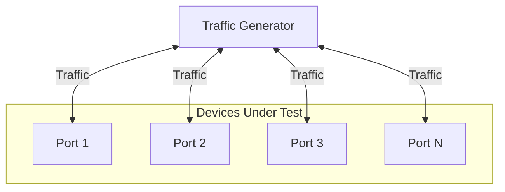

# Snappi-based Packet Drop Threshold Tests

1. [1. Test Objective](#1-test-objective)
2. [2. Testbed Topology](#2-testbed-topology)
   1. [2.1. Test port configuration](#21-test-port-configuration)
   2. [2.2. Route announcement](#22-route-announcement)
3. [3. Test parameters](#3-test-parameters)
4. [4. Test steps](#4-test-steps)
5. [5. Metrics to collect](#5-metrics-to-collect)

## 1. Test Objective

This test aims to determine the maximum traffic rate that results in 0% packet loss across different packet sizes.

## 2. Testbed Topology

The test is designed to be topology-agnostic. It expects the testbed to be built following the [Multi-device multi-tier testbed HLD](../../testbed/README.testbed.NUT.md), which allows us to test the latency of either a single switch or a multi-tier network.

### 2.1. Test port configuration

This test will use all available ports to this testbed on the traffic generator to run the test.

The test will read the port configuration from the testbed and device config and use it to configurate the traffic generator ports accordingly, such as speed, fec and so on.

### 2.2. Route announcement

During the pretest phase, the test will leverage the traffic generator or the device connected directly to the traffic generator to inject the routes into the testbed. This facilitates the traffic routing and allows us to inject the any number of routes into the testbed for testing purposes.

## 3. Test parameters

The test needs to support the following parameters:

- `ip_version`: IPv4 or IPv6, which supports `ipv4` and `ipv6`.
- `frame_bytes`: The size of the packets to be sent in the traffic, which supports 64, 128, 256, 512, 1024, 4096 and 8192 bytes.
- `rfc2889_enabled`: Enables the RFC2889 mode in the traffic generator, which is a flag that can be set to `true` or `false`.

## 4. Test steps

This test requires more parameters to be setup besides the ones defined above:

1. Configurate traffic based on the test parameters in traffic generator, such as IP version, frame size, and RFC2889 mode.
2. Start with 100% of the line rate and check for packet loss.
3. If any traffic flow experiences packet loss, reduce the traffic rate to 10% of the line rate and test again.
4. Continue adjusting the traffic rate using a binary search approach to determine the maximum rate at which 0% packet loss is observed.
5. Log and report the result.

## 5. Metrics to collect

In this test, we are going to collect the following metrics from the traffic generator, using [FinalMetricsReporter interface](../../../test_reporting/telemetry/README.md). The metrics will be reported to a database for further analysis.

| User Interface Metric Name     | Metric Name in DB | Example Value |
|--------------------------------|-------------------|---------------|
| `METRIC_NAME_NO_LOSS_MAX_RATE` | no_loss_max_rate  | 99.87         |

The metrics needs to be reported with the following labels:

| User Interface Label              | Label Key in DB    | Example Value |
|-----------------------------------|--------------------|---------------|
| `METRIC_LABEL_TG_IP_VERSION`      | tg.ip_version      | 4             |
| `METRIC_LABEL_TG_FRAME_BYTES`     | tg.frame_bytes     | 4096          |
| `METRIC_LABEL_TG_RFC2889_ENABLED` | tg.rfc2889.enabled | true          |
