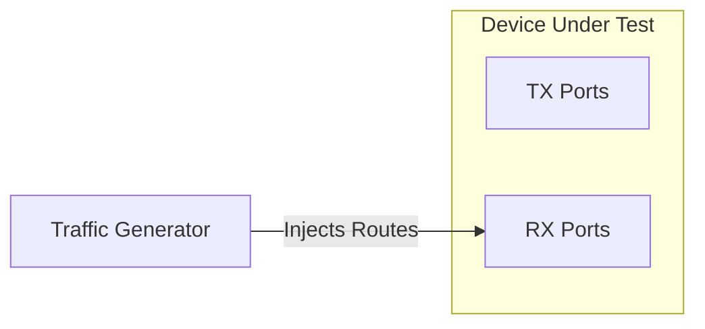
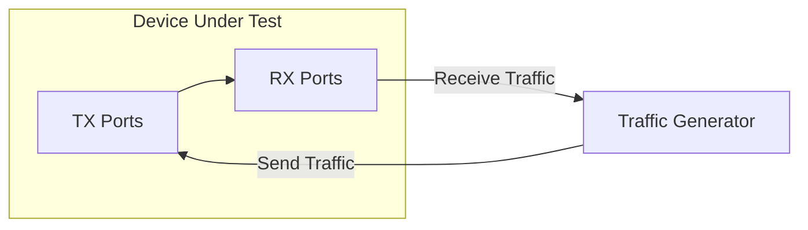

# Snappi-based Switch Capacity Test

1. [1. Test Objective](#1-test-objective)
2. [2. Test Setup](#2-test-setup)
   1. [2.1. Test port and traffic setup](#21-test-port-and-traffic-setup)
   2. [2.2. Route setup](#22-route-setup)
   3. [2.3. Metrics monitoring](#23-metrics-monitoring)
3. [3. Test parameters](#3-test-parameters)
4. [4. Test Steps](#4-test-steps)
5. [5. Metrics to collect](#5-metrics-to-collect)
   1. [5.1. Interface Metrics](#51-interface-metrics)
   2. [5.2. Queue Metrics](#52-queue-metrics)
   3. [5.3. PSU Metrics](#53-psu-metrics)
   4. [5.4. Sensor Temperature Metrics](#54-sensor-temperature-metrics)

## 1. Test Objective

This test aims to evaluate the true capacities of SONiC switches.

## 2. Test Setup

The test is designed to be topology-agnostic. It does not rely on or impose a fixed topology, wiring, or device configuration.

To achieve this, the test expectes the testbeds to be configured in the way that routes can be dynamically injected for traffic routing.

### 2.1. Test port and traffic setup

This test will use all available ports on the traffic generator to run the test.

The test will read the port configuration from the device config and use it to configurate the traffic generator ports accordingly, such as speed, fec and so on.

The traffic needs to be configured as all to all.

### 2.2. Route setup

All devices in the testbed should have BGP sessions configured.

During test setup phase, the test will leverage the traffic generator or the device connected directly to the traffic generator to inject the routes into the testbed.

After this, the traffic will start flowing from the TX ports to the RX ports, allowing the test to run without needing to modify the test case itself.

### 2.3. Metrics monitoring

Because there is no pass/fail criteria for this kind of test, the test will not impose a specific pass/fail criteria. Instead, it uses the telemetry interfaces to collect all related metrics and report them into the database.

To achieve this, the test implements a monitoring thread:

- It tracks key metrics, including port counters, queue watermark, power usage, and sensor temperature across all SONiC switches in a testbed.
- After traffic generation begins, the script runs periodically to check and report the health status of all SONiC devices.
- The testbed could have more than one SONiC device, and the test will collect metrics from all of them.

For the detailed list of metrics collected, refer to the Metrics section below.

For more details on telemetry interface usage, refer to the [Telemetry Interface Documentation](https://github.com/sonic-net/sonic-mgmt/tree/master/test_reporting/telemetry).

## 3. Test parameters

The test needs to support the following parameters:

- `test_duration`: The duration of the test in minutes, which supports 1min, 5min, 15mins, 60mins, 1day and 2days.
- `packet_size`: The size of the packets to be sent in the traffic, which supports 64, 128, 256, 512, 1024, 4096 and 8192 bytes.
- `traffic_rate`: The rate of the traffic to be sent, which supports 10%, 25%, 50%, 75% and 100% of the line rate.

## 4. Test Steps

1. Start the traffic generator to generate traffic according the parameters provided.
2. Start the monitoring thread to collect metrics from all SONiC devices in the testbed.
3. Wait until the test to be completed.
4. Stop the traffic generator.

## 5. Metrics to collect

During this test, we are going to collect the following metrics from the SONiC devices in the testbed:

### 5.1. Interface Metrics

The `show interface counters` is used on the switch to retrieve interface metrics. The following labels are expected to be provided:

| User Interface Label          | Label Key in DB | Example Value |
|-------------------------------|-----------------|---------------|
| `METRIC_LABEL_DEVICE_ID`      | device.id       | switch-A      |
| `METRIC_LABEL_DEVICE_PORT_ID` | device.port.id  | Ethernet8     |

| User Interface Metric Name    | Metric Name in DB | Example Value  |
|-------------------------------|-------------------|----------------|
| `METRIC_NAME_PORT_STATE`      | port.state        | OPER_STATUS.UP |
| `METRIC_NAME_PORT_RX_BPS`     | port.rx.bps       | 26.38          |
| `METRIC_NAME_PORT_RX_UTIL`    | port.rx.util      | 0.00           |
| `METRIC_NAME_PORT_RX_OK`      | port.rx.ok        | 5190           |
| `METRIC_NAME_PORT_RX_ERR`     | port.rx.err       | 0              |
| `METRIC_NAME_PORT_RX_DROP`    | port.rx.drop      | 248            |
| `METRIC_NAME_PORT_RX_OVERRUN` | port.rx.overrun   | 0              |
| `METRIC_NAME_PORT_TX_BPS`     | port.tx.bps       | 9.76           |
| `METRIC_NAME_PORT_TX_UTIL`    | port.tx.util      | 0.00           |
| `METRIC_NAME_PORT_TX_OK`      | port.tx.ok        | 4896           |
| `METRIC_NAME_PORT_TX_ERR`     | port.tx.err       | 0              |
| `METRIC_NAME_PORT_TX_DROP`    | port.tx.drop      | 10             |
| `METRIC_NAME_PORT_TX_OVERRUN` | port.tx.overrun   | 0              |

### 5.2. Queue Metrics

The `show queue watermark unicast` or  `show queue watermark multicast` is used on the switch to retrieve queue metrics. The following labels are expected to be provided:

| User Interface Label             | Label Key in DB   | Example Value |
|----------------------------------|-------------------|---------------|
| `METRIC_LABEL_DEVICE_ID`         | device.id         | switch-A      |
| `METRIC_LABEL_DEVICE_PORT_ID`    | device.port.id    | Ethernet8     |
| `METRIC_LABEL_DEVICE_QUEUE_ID`   | device.queue.id   | MC1           |
| `METRIC_LABEL_DEVICE_QUEUE_CAST` | device.queue.cast | multicast     |

| User Interface Metric Name          | Metric Name in DB     | Example Value |
|-------------------------------------|-----------------------|---------------|
| `METRIC_NAME_QUEUE_WATERMARK_BYTES` | queue.watermark.bytes | 7620          |

### 5.3. PSU Metrics

The `show platform psu` command is used on the switch to retrieve PSU metrics. The following labels are expected to be provided:

| User Interface Label             | Label Key in DB   | Example Value   |
|----------------------------------|-------------------|-----------------|
| `METRIC_LABEL_DEVICE_ID`         | device.id         | switch-A        |
| `METRIC_LABEL_DEVICE_PSU_ID`     | device.psu.id     | PSU 1           |
| `METRIC_LABEL_DEVICE_PSU_MODEL`  | device.psu.model  | PWR-ABCD        |
| `METRIC_LABEL_DEVICE_PSU_SERIAL` | device.psu.serial | 1Z011010112349Q |
| `METRIC_LABEL_DEVICE_PSU_HW_REV` | device.psu.hw_rev | 02.00           |

| User Interface Metric Name | Metric Name in DB | Example Value   |
|----------------------------|-------------------|-----------------|
| `METRIC_NAME_PSU_VOLTAGE`  | psu.voltage       | 12.09           |
| `METRIC_NAME_PSU_CURRENT`  | psu.current       | 18.38           |
| `METRIC_NAME_PSU_POWER`    | psu.power         | 222.00          |
| `METRIC_NAME_PSU_STATUS`   | psu.status        | PSU_STATUS.OK   |
| `METRIC_NAME_PSU_LED`      | psu.led           | LED_STATE.GREEN |

### 5.4. Sensor Temperature Metrics

The `show platform temperature` command is used on the switch to retrieve sensor temperatuer metrics. Among the outputs, the "CPU temp sensor" and "Switch Card temp sensor" are of particular interest. The following labels are expected to be provided:

| User Interface Label            | Label Key in DB  | Example Value   |
|---------------------------------|------------------|-----------------|
| `METRIC_LABEL_DEVICE_ID`        | device.id        | switch-A        |
| `METRIC_LABEL_DEVICE_SENSOR_ID` | device.sensor.id | Cpu temp sensor |

| User Interface Metric Name             | Metric Name in DB        | Example Value       |
|----------------------------------------|--------------------------|---------------------|
| `METRIC_NAME_TEMPERATURE_READING`      | temperature.reading      | 29.5                |
| `METRIC_NAME_TEMPERATURE_HIGH_TH`      | temperature.high_th      | 95                  |
| `METRIC_NAME_TEMPERATURE_LOW_TH`       | temperature.low_th       | 0                   |
| `METRIC_NAME_TEMPERATURE_CRIT_HIGH_TH` | temperature.crit_high_th | 115                 |
| `METRIC_NAME_TEMPERATURE_CRIT_LOW_TH`  | temperature.crit_low_th  | -5                  |
| `METRIC_NAME_TEMPERATURE_WARNING`      | temperature.warning      | WARNING_STATUS.TRUE |
