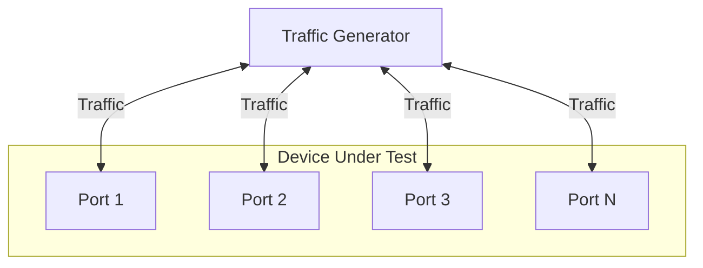

# Snappi-based CRC Error Handling Test

1. [1. Test Objective](#1-test-objective)
2. [2. Testbed Topology](#2-testbed-topology)
3. [3. Test parameters](#3-test-parameters)
4. [4. Test Cases](#4-test-cases)
   1. [4.1. Test Case 1: Line-rate CRC-error traffic test](#41-test-case-1-line-rate-crc-error-traffic-test)
   2. [4.2. Test Case 2: CRC-error isolation test](#42-test-case-2-crc-error-isolation-test)
      1. [4.2.1. 1-to-1 parallel links](#421-1-to-1-parallel-links)
      2. [4.2.2. Mixed-traffic on a single port](#422-mixed-traffic-on-a-single-port)
5. [5. Metrics to collect](#5-metrics-to-collect)
   1. [5.1. Metrics labels](#51-metrics-labels)
   2. [5.2. Metrics](#52-metrics)

## 1. Test Objective

This test aims to validate that a SONiC switch:

- Drops **100%** of Ethernet frames with CRC errors on ingress at line rate.
- Assesses the impact of traffic with CRC error. Valid frames should be unaffected by the presence of CRC errors on the same or different ports.

## 2. Testbed Topology

This tests expects the testbed to be built using the `nut-single-dut` topology, following the [Multi-device multi-tier testbed HLD](../../testbed/README.testbed.NUT.md), which allows us to test the CRC error in a flexible way.

## 3. Test parameters

The CRC error handling tests are parameterized to allow flexible testing across different scenarios. The following parameters can be adjusted:

| Parameter           | Description                           | Example Values                   |
|---------------------|---------------------------------------|----------------------------------|
| `crc_error_type`    | FCS corruption mode                   | `zero`, `random`                 |
| `tx_port_count`     | Number of concurrent ingress TG ports | `1`, `4`, `8`, `max`             |
| `packet_size`       | Ethernet frame length (bytes)         | 128, 256, 1024, 1518, 4096, 8192 |
| `ip_version`        | IPv4, or IPv6                         | `IPv4`, `IPv6`                   |
| `test_duration_sec` | Traffic transmission time (Seconds)   | 60                               |

## 4. Test Cases

### 4.1. Test Case 1: Line-rate CRC-error traffic test

For each combination of test parameters, the following steps are executed:

1. Select the last available traffic generator port as the RX port.
2. Select the first `tx_port_count` traffic generator ports as TX ports.
   - When `max` is selected for `tx_port_count`, use all the rest available TG ports as TX ports, except the last port.
3. Configurate the traffic stream on traffic generator with the following parameters:
   - **CRC error type**: `crc_error_type` (e.g., `zero`, `random`).
   - **Packet size**: `packet_size`.
   - **IP version**: `ip_version`.
   - **Line rate**: 100% of the port speed.
4. Start traffic stream at **100% line rate** for `test_duration`.
5. Stop traffic and Retrieve stats from the traffic generator and DUT.
6. Validate the results, and pass the test if the following conditions are met:
   - Traffic generator RX port should receive **0 frames**.
   - DUT ingress RX error counter must equal the Tx frame count.

### 4.2. Test Case 2: CRC-error isolation test

#### 4.2.1. 1-to-1 parallel links

For each combination of test parameters, the following steps are executed:

1. Select first 2x `tx_port_count` TG ports as TX ports, and the last `tx_port_count` TG ports as RX ports.
   - When `max` is selected for `tx_port_count`, use the first 2/3 of the available TG ports as TX ports, and the last 1/3 as RX ports.
2. Configure two traffic flows on the TX ports interleaved (first port index is 0):
   - **Flow-Bad**: On all even ports, bad-CRC frames at 100% line rate.
   - **Flow-Good**: On all odd ports, good-CRC frames at 100% line rate.
   - Each pair of TX ports should send traffic to the same RX port (e.g., TX1 & TX2 → RX1, TX3 & TX4 → RX2).
3. Start all traffic flows concurrently at **100% line rate** for `test_duration`.
4. Stop traffic and retrieve stats from the traffic generator and DUT.
5. Report the following stats using metrics interface:
   - Traffic rate of Flow-Good and Flow-Bad on all RX ports.
6. Validate the results and fail the test if the following conditions are met:
   - Any RX port received any bad-CRC frames.
   - DUT ingress RX error counter delta matches total bad-CRC TX frame count across all ports.

#### 4.2.2. Mixed-traffic on a single port

For each combination of test parameters, the following steps are executed:

1. Select the first 2x `tx_port_count` TG ports as TX ports, and the last `tx_port_count` TG ports as RX ports.
   - When `max` is selected for `tx_port_count`, use the first 2/3 of the available TG ports as TX ports, and the last 1/3 as RX ports.
2. Configure two traffic flows on each TX port:
   - **Flow-Good**: good-CRC frames at 50% line rate.
   - **Flow-Bad**: bad-CRC frames at 50% line rate.
   - Each pair of TX ports should send traffic to the same RX port (e.g., TX1 & TX2 → RX1, TX3 & TX4 → RX2) with interleaved transmission.
3. Start both traffic flows concurrently on all ports for `test_duration`.
4. Stop traffic and retrieve stats from the traffic generator and DUT.
5. Report the following stats using metrics interface:
   - Traffic rate of Flow-Good and Flow-Bad on all RX ports.
6. Validate the results and fail the test if the following conditions are met:
   - Any RX port received any bad-CRC frames (Flow-Bad).
   - DUT ingress RX error counter delta matches total bad-CRC TX frame count across all ports.

## 5. Metrics to collect

### 5.1. Metrics labels

All metrics collected during the tests will include the following labels to provide context and facilitate filtering:

| Label Name                                  | Label                           | Description                          | Example          |
|---------------------------------------------|---------------------------------|--------------------------------------|------------------|
| `METRIC_NAME_TG_IP_VERSION`                 | `tg.ip_version`                 | IP version                           | 4, 6             |
| `METRIC_NAME_TG_CRC_ERROR_TYPE`             | `tg.crc_error_type`             | CRC error type                       | `zero`, `random` |
| `METRIC_NAME_TG_FRAME_BYTES`                | `tg.frame_bytes`                | Ethernet frame length in bytes       | 1518             |
| `METRIC_NAME_TG_TX_PORT_COUNT`              | `tg.tx_port_count`              | Number of TX ports after calculation | 1, 4, 200        |
| `METRIC_NAME_TEST_PARAMS_TX_PORT_COUNT`     | `test.params.tx_port_count`     | Number of TX ports                   | 1, 4, max        |
| `METRIC_NAME_TEST_PARAMS_TEST_DURATION_SEC` | `test.params.test_duration_sec` | Traffic transmission time in seconds | 60               |

### 5.2. Metrics

The following metrics will be collected during test execution to validate CRC error handling and measure performance:

| Metric Name                   | Metric Name in DB | Description                              | Example Value |
|-------------------------------|-------------------|------------------------------------------|---------------|
| `METRIC_NAME_TG_TX_GOOD_UTIL` | `tg.tx.good.util` | Total TX utilization of good-CRC traffic | 95.33         |
| `METRIC_NAME_TG_RX_GOOD_UTIL` | `tg.rx.good.util` | Total RX utilization of good-CRC traffic | 62.53         |
| `METRIC_NAME_TG_TX_BAD_UTIL`  | `tg.tx.bad.util`  | Total TX utilization of bad-CRC traffic  | 95.33         |
| `METRIC_NAME_TG_RX_BAD_UTIL`  | `tg.rx.bad.util`  | Total RX utilization of bad-CRC traffic  | 0.00          |
