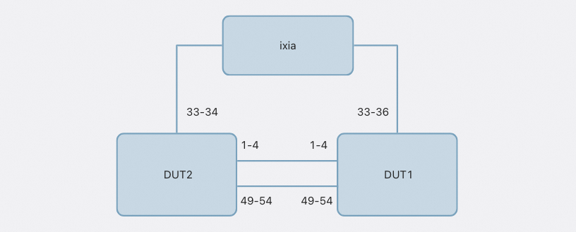
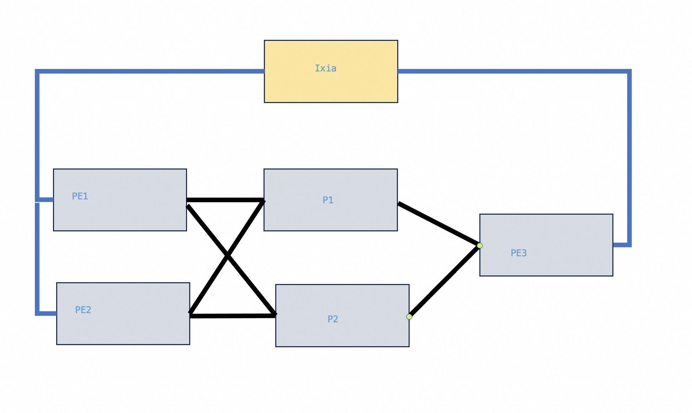

# SRv6 PhoenixWing Spytest Test Plan
<!-- omit in toc -->
### Revision
| Rev |     Date    |           Author           | Change Description                |
|:---:|:-----------:|:--------------------------:|-----------------------------------|
| 0.1 | Aug 2024    |  Eddie Ruan / Kang Jiang   | Initial Draft                     |

<!-- omit in toc -->
## Table of Contents
- [SRv6 PhoenixWing Spytest Test Plan](#srv6-phoenixwing-spytest-test-plan)
  - [Overview](#overview)
  - [Test Topology](#test-topology)
  - [Test Scripts Enhancements](#test-scripts-enhancements)
    - [Move from bgpcfgd to frrcfgd](#move-from-bgpcfgd-to-frrcfgd)
    - [Remove platform specific keyword in Config\_DB json](#remove-platform-specific-keyword-in-config_db-json)
    - [Update CLI / Output parsing](#update-cli--output-parsing)
    - [Keywords in Test scripts](#keywords-in-test-scripts)
  - [SRv6 VPN Test Cases (Total 11 cases)](#srv6-vpn-test-cases-total-11-cases)
    - [test\_base\_config\_srvpn\_locator\_01](#test_base_config_srvpn_locator_01)
      - [Set Up](#set-up)
      - [Test procedures](#test-procedures)
    - [test\_base\_config\_srvpn\_2kl\_route\_learn\_02](#test_base_config_srvpn_2kl_route_learn_02)
      - [Set up](#set-up-1)
      - [Test procedures](#test-procedures-1)
    - [test\_base\_config\_srvpn\_multi\_vrf\_03](#test_base_config_srvpn_multi_vrf_03)
      - [Set up](#set-up-2)
      - [Test procedures](#test-procedures-2)
    - [test\_srvpn\_ecmp\_04](#test_srvpn_ecmp_04)
      - [Set up](#set-up-3)
      - [Test procedures](#test-procedures-3)
    - [test\_srvpn\_mirror\_config\_05](#test_srvpn_mirror_config_05)
      - [Set up](#set-up-4)
      - [Test procedures](#test-procedures-4)
    - [test\_srvpn\_mirror\_config\_redistribute\_vrf\_06](#test_srvpn_mirror_config_redistribute_vrf_06)
      - [Set up](#set-up-5)
      - [Test procedures](#test-procedures-5)
    - [test\_srvpn\_mirror\_config\_bgp\_flap\_07](#test_srvpn_mirror_config_bgp_flap_07)
      - [Set up](#set-up-6)
      - [Test procedures](#test-procedures-6)
    - [test\_srvpn\_mirror\_config\_underlay\_link\_flap\_08](#test_srvpn_mirror_config_underlay_link_flap_08)
      - [Set up](#set-up-7)
      - [Test procedures](#test-procedures-7)
    - [test\_srvpn\_mirror\_config\_underlay\_ecmp\_switch\_09](#test_srvpn_mirror_config_underlay_ecmp_switch_09)
      - [Set up](#set-up-8)
      - [Test procedures](#test-procedures-8)
    - [test\_end\_x\_action](#test_end_x_action)
      - [Set up](#set-up-9)
      - [Test procedures](#test-procedures-9)
    - [test\_srvpn\_performance\_2M (VPN case)](#test_srvpn_performance_2m-vpn-case)
    - [test\_srvpn\_performance\_1M (global IPv6 case)](#test_srvpn_performance_1m-global-ipv6-case)
  - [SRv6 Policy Test Cases (Total 10 cases)](#srv6-policy-test-cases-total-10-cases)
    - [test\_srte\_policy\_2k\_vrf\_1k\_policy\_01](#test_srte_policy_2k_vrf_1k_policy_01)
      - [Set up](#set-up-10)
      - [Test procedures](#test-procedures-10)
    - [test\_srte\_policy\_2k\_vrf\_1k\_policy\_color\_only\_02](#test_srte_policy_2k_vrf_1k_policy_color_only_02)
      - [Set up](#set-up-11)
      - [Test procedures](#test-procedures-11)
    - [test\_srte\_policy\_2k\_vrf\_2k\_policy\_03](#test_srte_policy_2k_vrf_2k_policy_03)
    - [test\_srte\_policy\_2k\_vrf\_2k\_policy\_color\_only\_04](#test_srte_policy_2k_vrf_2k_policy_color_only_04)
    - [test\_srte\_policy\_2k\_vrf\_4k\_policy\_05](#test_srte_policy_2k_vrf_4k_policy_05)
    - [test\_srte\_policy\_2k\_vrf\_4k\_policy\_flap\_06](#test_srte_policy_2k_vrf_4k_policy_flap_06)
      - [Set up](#set-up-12)
      - [Test procedures](#test-procedures-12)
    - [test\_srte\_policy\_2k\_vrf\_ipv4\_ipv6\_07](#test_srte_policy_2k_vrf_ipv4_ipv6_07)
      - [Set up](#set-up-13)
      - [Test procedures](#test-procedures-13)
    - [test\_srte\_policy\_2k\_vrf\_ipv4\_ipv6\_flap\_08](#test_srte_policy_2k_vrf_ipv4_ipv6_flap_08)
      - [Set up](#set-up-14)
      - [Test procedures](#test-procedures-14)
    - [test\_locator\_128\_endx\_ecmp](#test_locator_128_endx_ecmp)
      - [Set up](#set-up-15)
      - [Test procedures](#test-procedures-15)
  - [Convergence Testing, total 6 cases](#convergence-testing-total-6-cases)
    - [Local IGP link failure with global 1M v6 routes](#local-igp-link-failure-with-global-1m-v6-routes)
    - [remote IGP failure with global 1M v6 routes](#remote-igp-failure-with-global-1m-v6-routes)
    - [Remote BGP PE failure with global 1M v6 routes](#remote-bgp-pe-failure-with-global-1m-v6-routes)
    - [Local IGP link failure with 1M SRv6 VPNv4 Routes](#local-igp-link-failure-with-1m-srv6-vpnv4-routes)
    - [remote IGP failure with 1M SRv6 VPNv4 Routes](#remote-igp-failure-with-1m-srv6-vpnv4-routes)
    - [Remote BGP PE failure with 1M SRv6 VPNv4 Routes](#remote-bgp-pe-failure-with-1m-srv6-vpnv4-routes)

## Overview
The Phoenix Wing initiative will verify four hardware platforms. Two of these platforms, equipped with Cisco's Q200 chip, will be supplied by Cisco and Inspur. The other two, using Broadcom's Q3D chip, will come from Huaqin and Ruijie.

This document outlines all the test cases planned for these four platforms. It also details an infrastructure change aimed at abstracting platform-specific differences, enabling the same test cases to run across all platforms.

## Test Topology
<figure align=center>
    
    <figcaption>Figure 1. SRv6 Spytest Topology <figcaption>
</figure>

This is a two-node test topology featuring a traffic generator. The two DUTs are connected back-to-back with a total of 10 physical links. Each DUT is also connected to a traffic generator, with DUT1 having 4 ports linked to it and DUT2 having 2 ports connected to the generator.

## Test Scripts Enhancements
The initial spytest template comes from Alibaba based on its internal image's testing. There are some changes required before using in community.

### Move from bgpcfgd to frrcfgd
Current configurations are based on Alibaba internal bgpcfgd, while Phoenix Wing project uses frrcfgd. Need to update config_db.json accordingly.

### Remove platform specific keyword in Config_DB json
Current config_db.json contains the following platform specific configurations.

```
    "INTERFACE": {
        "Ethernet1|2011::179/64": {
            "family": "IPv6",
            "scope": "global"
        },
        "Ethernet2|2022::179/64": {
            "family": "IPv6",
            "scope": "global"
        },
        "Ethernet3|2033::179/64": {
            "family": "IPv6",
            "scope": "global"
        },
        "Ethernet4|2044::179/64": {
            "family": "IPv6",
            "scope": "global"
        }
    },
```
We could change them to j2 template and fill the platform specific interface name based on HWSKU.

### Update CLI / Output parsing
Alibaba's CLI/output may not be exactly the same as the one used in community. Some twists are required.

For example, Alibaba uses "cli" to wrap "vtysh". We need to change them accordingly to fit community image's usage and output.
```
        cmd = "cli -c 'no page' -c 'show ip interface br'"
```

### Keywords in Test scripts
Some hardware specific information are coded in the test script. Need to fill them in with proper platform specific information based on HWSKU.

```
        cmd = "cli -c 'no page' -c 'show interface Ethernet3'"
```

## SRv6 VPN Test Cases (Total 11 cases)
### test_base_config_srvpn_locator_01
The purpose for this test case is to test locator and VPN rotues distribution in BGP.
#### Set Up
1. Pick two pair of back to back connected ports from DUT1 and DUT2 and set up BEP peer as interface peering
2. Let BGP peer publish DUT's loopback address
3. Set up another BGP peer as loopback peering with ipv4 vpn address family active
4. Config locators on DUT1 with two end-dt46 opcode
#### Test procedures
1. Check the locator's corresponding static route exists and is correct on DUT1
2. Check SRV6_LOCATOR in DUT1's CONFIG DB
3. Check SRV6_MY_SID_TABLE in DUT1's APPDB
4. Set up a static route with blackhole as nexthop on DUT1, and config redistribute static on DUT1, use "show bgp ipv4 vpn" to check this route is in vpn on DUT2
5. Remove opcode on DUT1, check static route
6. Remove locator on DUT1, check static route
7. On DUT1 's BGP config, remove srv6-locator via "no srv6-locator", check BGP ipv4 VPN routes in DUT2
8. Recover locator, opcode, and srv6-locator on DUT1, and check BGP ipv4 VPN routes in DUT2.

### test_base_config_srvpn_2kl_route_learn_02
The purpose for this test case is to validate VPN routes' learning capability with 100 Vrfs.
#### Set up
1. Pick two pair of back to back connected ports from DUT1 and DUT2 and set up BEP peer as interface peering
2. Let BGP peer publish DUT's loopback address
3. Set up another BGP peer as loopback peering with ipv4 vpn address family active
4. On DUT1, config 2K end-dt46 local SID
5. Config 100 vlan ports at DUT1 and DUT2 to connect with the traffic generator. Each vlan port is under a different Vrf.
6. Send up BGP sessions via each vlan port between DUT1 and the traffic generator. DUT1 learns 5k /32 routes from the traffic generator, with total 500K routes (5K * 100 vlans).

#### Test procedures
1. Check routes in ASICDB on DUT1 and count total 500K routes learning time. Pass this test case if it could be finished in 3 minutes, a.k.a great than 3.3 K routes / sec.
2. Check routes in ASICDB on DUT2 and count total 500K routes learning time. Pass this test case if it could be finished in 3 minutes, a.k.a great than 3.3 K routes / sec.

Note:  It is the minimum target. We could raise this bar higher later.

### test_base_config_srvpn_multi_vrf_03
The purpose for this test case is to verify basic traffic with 100 Vrfs
#### Set up
Same as test_base_config_srvpn_2kl_route_learn_02
#### Test procedures
1. Check DUT2 has already learnt 500K VPn routes from DUT1
2. Pick 10 VRFs randomly and check each VRF contains 5000 VPN routes on DUT2. Run 12 traffic flow with 10K packets each, expect no traffic loss.
3. Pick on VRF, modify route-target vpn import, and increase import VRF from 1 to 5 on DUT2, check if we get 25K VPN routes on this VRF, and verify leaked VPN routes' prefix and VPN SID are correct.
4. Modify BGP srv6-locator to different local SID on DUT1, check DUT2 relearns new VPN SIDs. Use traffic to verify, and expect no traffic loss.

### test_srvpn_ecmp_04
The purpose for this test case is to verify overlay ECMP
#### Set up
Similar to test_base_config_srvpn_2kl_route_learn_02, except on VRF on DUT2 would learn VPN routes from two peers from DUT1 and the prefix are the same.

#### Test procedures
1. Check if we have learnt 10K VPN routes oN DUT2
2. Check if overlay ECMP is formed on DUT2, check NEXTHOP GROUP TABLE and PIC_CONTEXT TABLE in DUT2.
3. Run traffic over these 5K VPN routes to expect traffic would be evenly distributed。

### test_srvpn_mirror_config_05
Enable / Disable mirror to make sure no negative impact. Mirror could be used for debugging purpose.
#### Set up
At test_base_config_srvpn_2kl_route_learn_02, add mirror configuration.
#### Test procedures
1. Check mirror configuration is enabled
2. Repeat test_base_config_srvpn_2kl_route_learn_02 to make sure no traffic loss.

### test_srvpn_mirror_config_redistribute_vrf_06
Verify "redistribute vrf route-map"
#### Set up
With test_srvpn_mirror_config_05's mirror enabled, Add / remove route-map to control BGP redistribution.
#### Test procedures
1. Apply route-map for redistribute vrf on DUT1
2. On DUT1, use show bgp vrf  ACTN_TC0 ipv4 unicast 14.1.64.1/32 and show bgp vrf  ACTN_TC1 ipv4 unicast 14.1.64.1/32 to check imported routes in ACTN_TC0 and redistributed routes in ACTN_TC1
3. Check these routes' entries in APPDB.

### test_srvpn_mirror_config_bgp_flap_07
Check the impact after BGP flapping.
#### Set up
Same as test_base_config_srvpn_2kl_route_learn_02
#### Test procedures
1. Flapping BGP peer multiple times.
2. Wait some time after flapping and run traffic to make sure all routes are reinstalled, and no traffic loss.

### test_srvpn_mirror_config_underlay_link_flap_08
Check the impact after unerlay link flapping.
#### Set up
Same as test_base_config_srvpn_2kl_route_learn_02
#### Test procedures
1. Flapping underlay interface 5 times.
2. Wait some time after flapping and run traffic to make sure all routes are reinstalled, and no traffic loss.

### test_srvpn_mirror_config_underlay_ecmp_switch_09
Verify overlay routes impact from underlay ECMP flapping.
#### Set up
Similar to test_base_config_srvpn_2kl_route_learn_02, except we will have multiple links to form underlay ECMPs
Cases:
1. Underlay ECMP one member down, 3 -> 2
2. Underlay ECMP one member down, 2 -> 1
3. Underlay ECMP one member up, 1 -> 2
4. Underlay ECMP one member up, 2 -> 3
#### Test procedures
1. Check no overlay routes reprogramming, a.k.a PIC core kick in.
2. Traffic loss is minimal when one member is down.

### test_end_x_action
Verify END_X behavior
#### Set up
Similar to test_base_config_srvpn_2kl_route_learn_02, config one local sid with END_X action and use srv6-locator to set it as VPN SID for a given VRF.
#### Test procedures
Use traffic to check if we hit on END_X SID and if the traffic goes via a specified port provided in END_X.

### test_srvpn_performance_2M (VPN case)
When preparing this test case, the test script would
1. Set both ports connected to traffic generator are vrf ports.
2. Set up eBGP session between DUT1 and traffic generator Traffic via vrf ports.
3. Set up BGP session between DUT1 and DUT2 for advertising these VPN routes via v6 fabric, a.k.a SRv6 fabric.
4. Start traffic stream from DUT2 to DUT1 with 2M different destination IPs.

There are two sub tests in this test case.
1. Traffic generate would inject 2M routes from DUT1 as vpn routes, which would be advertised to DUT2. Test function would measure the duration for receiving traffic rate from 0 to sending rate. This duration value would be used to calculate routes loading time.
2. Traffic generate would withdraw 2M routes. Test function would measure the duration for receiving traffic rate from sending rate to 0. This duration would be used to calculate routes withdraw time.

Note:
This test case focuses on
1. Basic SRv6 VPN functionality verification
2. Loading time / withdraw time measurement to secure the enhancement result.

### test_srvpn_performance_1M (global IPv6 case)
Similar than test_srvpn_performance_2M, except we use the traffic generateor to publish 1M global IPv6 routes. On DUTs, we use port's global IPv6 address to peer with the traffic generator, a.k.a, no vrf case.

## SRv6 Policy Test Cases (Total 10 cases)
Note: Due to we don't have SBFD hardware offload enabled, we can't have high scale SBFD sessions to protect high number of cpaths. We apply work around either config less SBFD sessions or not config SBFD sessions. This work around would be removed once SBFD hardware offload is supported.

### test_srte_policy_2k_vrf_1k_policy_01
#### Set up
Similar to test_base_config_srvpn_2kl_route_learn_02, except we have 2K VRFs to be configured.
#### Test procedures
1. Config 1K policy on DUT2. Each policy has 4 cpath with the same sidlist. Each cpath has a sbfd session for protection. All 4 cpaths has different priorities.
2. Shut down high priority cpath, the traffic will use next priority cpath
3. So on so forth, we shut down higher priority cpath to let traffic to lower priority cpath.
4. Then we do no shut one by one until we get traffic back highest priority cpath.

Note: we use small number of cpaths be protected by SBFD as a workaround.

### test_srte_policy_2k_vrf_1k_policy_color_only_02
#### Set up
Similar to test_srte_policy_2k_vrf_1k_policy_01, except the testing Policy is color only case.
#### Test procedures
Same step as test_srte_policy_2k_vrf_1k_policy_01.

### test_srte_policy_2k_vrf_2k_policy_03
Repeat test_srte_policy_2k_vrf_1k_policy_01 with 2K policies.

### test_srte_policy_2k_vrf_2k_policy_color_only_04
Repeat ttest_srte_policy_2k_vrf_1k_policy_color_only_02 with 2K policies.

### test_srte_policy_2k_vrf_4k_policy_05
Repeat test_srte_policy_2k_vrf_1k_policy_01 with 4K policies.

### test_srte_policy_2k_vrf_4k_policy_flap_06
The purpose for this test is to verify BGP would be able to resolve routes to SRv6 Policy properly under scale.
This test case would not use SBFD.

#### Set up
Based on test_base_config_srvpn_2kl_route_learn_02, configure 4K Policies. Each policy contains 1 cpath. Each routes go over two policies. We have total 200K routes, 2K vrf *100 routes per vrf.
#### Test procedures
1. Flapping BGP sessions.
2. After flapping, check the correctness of the traffic.

### test_srte_policy_2k_vrf_ipv4_ipv6_07
The purpose for this test case is to verify 4K policies
#### Set up
Similar to test_srte_policy_2k_vrf_4k_policy_flap_06
#### Test procedures
1. Inject 200k V4 routes from ixia and make sure routes are resolved via proper policies, traffic verification is ok.
2. Withdraw 200k v4 routes
3. Inject 200K v6 routes from ixia and make sure routes are resolved via proper policies, traffic verification is ok.
4. Withdraw 200k v6 routes

### test_srte_policy_2k_vrf_ipv4_ipv6_flap_08
The purpose for this test case is to verify 4K policies under BGP flapping.
#### Set up
Similar to test_srte_policy_2k_vrf_4k_policy_flap_06
#### Test procedures
1. Inject 200K v6 routes from ixia and make sure routes are resolved via proper policies, traffic verification is ok.
2. Flapping BGP and verify traffic after flapping.
3. Withdraw 200k v6 routes and add 200K v4 routes
4. Flapping BGP and verify traffic after flapping.

### test_locator_128_endx_ecmp
Verify END_X SID with ECMP.
#### Set up
Config an end_x sid with 128 nexthops, and form 128 member ECMP for END_X SID. SID would cover both compress and none-compress end_x SID and nexthop would cover v4 nexthop and v6 next hop.
#### Test procedures
Config each combination and run traffic to verify.

## Convergence Testing, total 6 cases
The purpose for this set of test cases are for verifying Prefix Independent Convergence (PIC) at various cases.
<figure align=center>
    
    <figcaption>Figure 2. SRv6 Spytest 5-node Topology <figcaption>
</figure>

This topology is a trimmed version from 7-node ptf testbed. We have three PE devices, each of them are connected with the traffic generator. We have two P devices.

Ixia would publish routes from PE1/PE2 to PE3 via MP-BGP. The traffic would be sent from PE3 to PE1/PE2. The purpose for this test suite is to validate PIC related changes in both global table and VPN table.
### Local IGP link failure with global 1M v6 routes
The interfaces connecting with Ixia and PE1 are under global table. PE1 and PE2 use eBGP interface peering with ixia. Ixia publishes 1M V6 routes to PE1 and PE2. PE1 and PE2 would redistribute them to PE3.

Traffic will be sent from PE3 to PE1 and PE2 via them 1M routes as destination IPs. We want to measure the traffic loss during outage.

In this case, we shut the link between PE3 and P1. PE3's orchagent would be aware traffic loss and make quick fix up first.

### remote IGP failure with global 1M v6 routes
The setting is similar to " Local IGP link failure with global 1M v6 routes".

During the test, we will shut the link between PE1 and P1 to simulate remote IGP link failure. This test focus on verifying PIC core's fix up.

### Remote BGP PE failure with global 1M v6 routes
The setting is similar to " Local IGP link failure with global 1M v6 routes".

During the test, we will shut down two links. One link is between PE1 and P1, and the other is between PE1 and P2. This test is to simulate remote BGP node failure, a.k.a focusing PIC edge's verification.


### Local IGP link failure with 1M SRv6 VPNv4 Routes
The setting is similar to " Local IGP link failure with global 1M v6 routes", except PE1 and PE2 uses VRF interface to peer with ixia. Ixia would publish V4 routes to PE1 and PE2.

Traffic will be sent from PE3 to PE1 and PE2 via them 1M routes as destination IPs. We want to measure the traffic loss during outage.

In this case, we shut the link between PE3 and P1. PE3's orchagent would be aware traffic loss and make quick fix up first.

### remote IGP failure with 1M SRv6 VPNv4 Routes
The setting is similar to "Local IGP link failure with 1M SRv6 VPNv4 Routes"

During the test, we will shut the link between PE1 and P1 to simulate remote IGP link failure. This test focus on verifying PIC core's fix up.

### Remote BGP PE failure with 1M SRv6 VPNv4 Routes
The setting is similar to "Local IGP link failure with 1M SRv6 VPNv4 Routes"

During the test, we will shut down two links. One link is between PE1 and P1, and the other is between PE1 and P2. This test is to simulate remote BGP node failure, a.k.a focusing PIC edge's verification.
