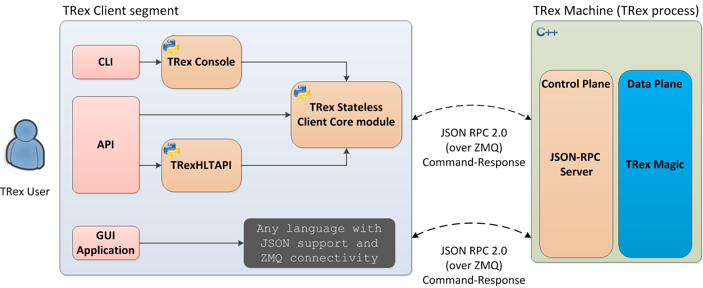

<!-- omit in toc -->
# SRv6 PhoenixWing Taffic Test Plan using TRex
<!-- omit in toc -->
### Revision
| Rev |     Date    |           Author           | Change Description                |
|:---:|:-----------:|:--------------------------:|-----------------------------------|
| 0.1 | Oct 2024    | Shenglin Zhu / Eddie Ruan  | Initial Draft                     |

<!-- omit in toc -->
## Table of Contents
- [Overview](#overview)
  - [Scopes](#scopes)
- [Why we need TRex](#why-we-need-trex)
- [Install TRex in 7-node PTF testbed](#install-trex-in-7-node-ptf-testbed)
    - [7-node PTF Testbed](#7-node-ptf-testbed)
    - [Use OVS links](#use-ovs-links)
    - [Install TRex](#install-trex)
    - [TRex agent](#trex-agent)
    - [TRex tcp port NAT for GUI](#trex-tcp-port-nat-for-gui)
  - [new functions based on TRex](#new-functions-based-on-trex)
    - [how to run Trex traffic](#how-to-run-trex-traffic)
    - [how to check packet encapsulation](#how-to-check-packet-encapsulation)
    - [test case example](#test-case-example)
- [Test Plan](#test-plan)
  - [SRv6 VPN](#srv6-vpn)
    - [SRv6 VPN for single homing](#srv6-vpn-for-single-homing)
    - [SRv6 VPN for Dual homing](#srv6-vpn-for-dual-homing)
    - [Dual homing - IGP local failure case](#dual-homing---igp-local-failure-case)
    - [Dual homing - IGP remote failure case](#dual-homing---igp-remote-failure-case)
    - [Dual homing - BGP remote PE failure case](#dual-homing---bgp-remote-pe-failure-case)
  - [SRv6 Policy and SBFD](#srv6-policy-and-sbfd)
    - [SRv6 policy with single or multiple candidate-paths](#srv6-policy-with-single-or-multiple-candidate-paths)
    - [SRv6 policies](#srv6-policies)
    - [SRv6-TE and SRv6-BE hybrid mode](#srv6-te-and-srv6-be-hybrid-mode)


## Overview
The PhoenixWing Initiative aims to incorporate SRv6 features and some infrastructure level enhancements into the SONiC community code base. In the previous testplan doc "SRv6-phoenixwing-ptf-testplan.md", we proposed a 7-node PTF testbed to run SRv6 test cases. In this doc, we add TRex into the testbed which will be used as a traffic generator and a packet counter. The traffic test and convergence test of SRv6 cases can be coverd by using TRex.

### Scopes
The main scopes for this document include the following information
1. why we need TRex
2. Install TRex in 7-node PTF testbed
   1. testbed enhancements
   2. install TRex
   3. How we use TRex
3. The Traffic test based on TRex
   1. SRv6 VPN
   2. SRv6 Policy


## Why we need TRex
TRex is a fast realistic open source traffic generation tool based on DPDK,  which is initialy designed for DPDK supported NICs to get a maximum performance. Also, TRex can run on a hypervisor with virtual NICs (with reduced performance).
- advantages of TRex compared to PTF

1) Use scapy to build packet templates, can rewrite any specified changed parts

```
src = {'start': "0.0.0.1", 'end': "255.255.255.254"}
pkt_base  = Ether()/IP(dst = dip, tos=(dscp<<2))/UDP(dport=5000,sport=5001)

vm = [ STLVmFlowVar(name="src",min_value=src['start'],max_value=src['end'],size=4,op="random"),
       STLVmWrFlowVar(fv_name="src",pkt_offset= "IP.src"),
       #fix checksum
       STLVmFixIpv4(offset = "IP")
     ]
return STLPktBuilder(pkt = pkt_base/pkt_pyld, vm  = vm)
```

2) Use dpdk to send packets

3) Traffic statistics on all ports

```
  #stats example on a port
  0: {
	 	'tx_util': 0.0098748502734375,
	 	'rx_bps': 0.0,
	 	'obytes': 1040104,
	 	'rx_pps': 0.0,
	 	'ipackets': 0,
	 	'oerrors': 0,
	 	'rx_util': 0.0,
	 	'opackets': 10001,
	 	'tx_pps': 995.4486083984375,
	 	'tx_bps': 828213.25,
	 	'ierrors': 0,
	 	'rx_bps_L1': 0,
	 	'tx_bps_L1': 987485.0273437499,
	 	'ibytes': 0
	}
```

- 3 ways to use TRex:

<figure align=center>
    
    <figcaption>Figure 1. 1-Trex introduction <figcaption>
</figure> 

## Install TRex in 7-node PTF testbed

#### 7-node PTF Testbed

In the previous 7-node PTF Testbed, three vSONiC instatnces are used as PE (Provider Edge) devices. They are connected with PTF via Ethernet24 from each node. These ports are VRF ports, a.k.a customer facing ports. The remaining four vSONiC instances are used as P (Provider) devices. They form a v6 only fabric which is used to connect PE devices. 

We will apply some changes to this 7-node PTF testbed to make TRex work properly.

<figure align=center>
    
    <figcaption>Figure 2. 1- trex Testbed <figcaption>
</figure> 

#### Use OVS links
To observe the traffics on all paths, we replace all the device connections in the testbed with OVS links. This allows us to get a traffic copy for each link in PTF, and Trex can calculate the traffic on each link.

```
  OVS_LINKs:
    OVS1:
      vlans:
        - 34
      start_vm_offset: 0
      start_vm_port_idx: 1
      end_vm_offset: 3
      end_vm_port_idx: 1
      use_ovs : 1
    OVS2:
      vlans:
        - 35
      start_vm_offset: 1
      start_vm_port_idx: 2
      end_vm_offset: 3
      end_vm_port_idx: 2
      use_ovs : 1
    ...
```

#### Install TRex

TRex will be installed in ptf docker, and works in stateless mode. "Stateless" mode is meant to test networking gear that does not manage any state per flow (instead operating on a per packet basis). This is usually done by injecting customized packet streams to the device under test.

```
cat /etc/trex_cfg.yaml
- port_limit      : 14
  version         : 2
  limit_memory    : 16384
  interfaces    : ["backplane.100","eth28","eth29","eth34","eth35","backplane.400","eth16","eth36","eth17","eth37","eth39","eth40","backplane.200","backplane.300"]
  port_info       :  # Port IPs. Change to suit your needs. In case of loopback, you can leave as is.
          - dest_mac   : '52:54:00:df:1c:5e'  # port 0
            src_mac    : '92:4d:48:bb:3c:f6'
          - dest_mac   : '52:54:00:df:0c:4e'  # port 1
            src_mac    : '56:ef:21:02:b9:1c'
          - dest_mac   : '52:54:00:96:90:d5'  # port 2
            src_mac    : '76:2e:ae:b4:12:1d'
          - dest_mac   : '52:54:00:df:0c:4e'  # port 3
            src_mac    : '26:69:d4:f5:70:22'
          - dest_mac   : '52:54:00:96:90:d5'  # port 4
            src_mac    : 'b2:8f:23:db:14:23'
          - dest_mac   : '52:54:00:df:1c:5e'  # port 5
            src_mac    : '92:01:8e:6a:03:55'
          - dest_mac   : '52:54:00:96:90:d5'  # port 6
            src_mac    : 'd2:3b:60:e0:56:10'
          - dest_mac   : '52:54:00:df:0c:4e'  # port 7
            src_mac    : 'f6:57:be:b3:09:24'
          - dest_mac   : '52:54:00:96:90:d5'  # port 8
            src_mac    : 'd6:31:cd:04:35:11'
          - dest_mac   : '52:54:00:df:1c:5e'  # port 9
            src_mac    : '3e:80:61:35:0e:25'
          - dest_mac   : '52:54:00:96:90:d5'  # port 10
            src_mac    : '6e:fc:2e:56:21:27'
          - dest_mac   : '52:54:00:df:1c:5e'  # port 11
            src_mac    : 'c2:68:6a:7b:c2:28'
          - dest_mac   : '52:54:00:df:0c:4e'  # port 12
            src_mac    : '6e:fc:2e:56:21:27'
          - dest_mac   : '52:54:00:96:90:d5'  # port 13
            src_mac    : 'c2:68:6a:7b:c2:28'
```

TRex daemon:

```
root@aa04c8ee2253:~# ps -ef | grep t-rex
root         905       1  0 Oct15 ?        00:00:00 /bin/bash /var/log/v2.87/t-rex-64 -i --stl
root         955     905 99 Oct15 ?        20:43:32 ./_t-rex-64 -i --stl
```

#### TRex agent

When integrating the TRex api into pytest test cases, we encountered a scapy library conflicting issue, as shown in the figure below.

The standard scapy library in sonic-mgmt conflicts with the customized version of the scapy library that comes with TRex, We cannot load both in a same process. 

To resolve this issue, we introduced trex_agent. trex_agent is a standalone process which communicates directly with TRex to implement traffic generation and return statistical results. Pytest cases connect to trex_agent via a socket, send requests to it and wait for the result.

<figure align=center>
    
    <figcaption>Figure 2. 2- trex agent <figcaption>
</figure> 


#### TRex tcp port NAT for GUI 
When designing test cases or troubleshooting issues, we usually need to connect to the testbed through the TRex GUI directly, for example to do some manually traffic testing. Trex runs on the following three TCP ports, and we need to configure the port mapping on pytest_vm to make this work. This is done by figuring the NAT ports during topo construction.


```
root@aa04c8ee2253:~# netstat -na | grep LISTEN | grep ":450"
tcp        0      0 0.0.0.0:4500            0.0.0.0:*               LISTEN     
tcp        0      0 0.0.0.0:4501            0.0.0.0:*               LISTEN     
tcp        0      0 0.0.0.0:4507            0.0.0.0:*               LISTEN
```

```
cat ansible/roles/vm_set/tasks/add_topo.yml
- name: Start PTF container
  block:
  - name: Create ptf container ptf_{{ vm_set_name }}
    docker_container:
      name: ptf_{{ vm_set_name }}
      image: "{{ docker_registry_host }}/{{ ptf_imagename }}:{{ ptf_imagetag }}"
      pull: yes
      state: started
      restart: no
      published_ports:
        - "4500:4500"
        - "4501:4501"
        - "4507:4507"
      detach: True
      capabilities:
        - net_admin
      privileged: yes
      memory: 16G
      memory_swap: 16G
    become: yes
```

TRex GUI example:

<figure align=center>
    
    <figcaption>Figure 2. 3-trex gui <figcaption>
</figure> 

### new functions based on TRex

#### how to run Trex traffic

To simplify the traffic generation process, We encapsulated the TRex functions in a more simple way, two types of APIs are provided for test cases:

- TRex sync mode: 
  
  run trex with a fixed duration, will block and wait for the result. (traffic is fixed to 1K/pps.)

```
   result = trex_run("192.168.0.1", dscp = 0, duration = 10, single_stream = False)
   #result example {'ptf_tot_tx': 10000, 'ptf_tot_rx': 10000, 'P1_tx_to_PE2': 2500, 'P1_tx_to_PE1': 2500, 'P3_tx_to_PE2': 2500, 'P3_tx_to_PE1': 2500, 'PE3_tx_to_P2': 5000, 'PE3_tx_to_P4': 5000, ...}
```

- TRex async mode
  mainly used in convergence test scenarios. start trex and stop trex at your choice, stop will return the result. (traffic is fixed to 1K/pps.)

```
   trex_start("192.168.0.1", dscp = 0, duration = 10, single_stream = False)
   sleep(10) or do something else here
   result = trex_stop("192.168.0.1")
   #result example {'ptf_tot_tx': 10000, 'ptf_tot_rx': 10000, 'P1_tx_to_PE2': 2500, 'P1_tx_to_PE1': 2500, 'P3_tx_to_PE2': 2500, 'P3_tx_to_PE1': 2500, 'PE3_tx_to_P2': 5000, 'PE3_tx_to_P4': 5000, ...}
```


#### how to check packet encapsulation
PTF provides a complete set of packet inspection capabilities. Packet sent by Trex, is transmitted in topo links, and can all be captured by the PTF framework. We will reuse PTF's packet verification capabilities to check packet encapsulation, However we can do some simple encapsulation on the ptf functions, to make them more easy-to-use for SRv6 traffic. 

3 APIs are provided to:
 1) check raw IP(v6) packet, 2) check IP(v6)inIPv6 packet (VPN case), 3) IP(v6)inIPv6withSRH packet (TE case).

```
ptf_port_for_backplane = 18
ptf_port_for_P2_to_P1 = 16
ptf_port_for_P2_to_P3 = 36
ptf_port_for_P4_to_P1 = 17
ptf_port_for_P4_to_P3 = 37
ptf_port_for_PE3_to_P2 = 39
ptf_port_for_PE3_to_P4 = 40
ptf_port_for_P1_to_PE1 = 28
ptf_port_for_P1_to_PE2 = 29
ptf_port_for_P3_to_PE1 = 34
ptf_port_for_P3_to_PE2 = 35

#check raw IP/IPv6 packets to CE, packet should be in format as:
# Ether()/IP(dst = dst_ip, tos=(dscp<<2))/UDP()
check_topo_recv_pkt_raw(ptfadapter, port=0, dst_ip="", dscp = 0, no_packet = False)
#check SRv6 VPN packets(IPinIPv6 or IPv6inIPv6), packet should be in format as:
# Ether()/IPv6(dst=vpnsid, nh=4)/IP(dst = dst_ip, tos=(dscp<<2))/UDP()
check_topo_recv_pkt_vpn(ptfadapter, port=0, dst_ip="", dscp = 0, vpnsid = "", no_packet = False)
#check SRv6 TE packets(IPinIPv6Srh or IPv6inIPv6Srh), packet should be in format as:
# Ether()/IPv6(dst=segment, nh=43)/IPv6ExtHdrSegmentRouting(addresses=[vpnsid], nh=4, segleft=1)/IP(dst = dst_ip, tos=(dscp<<2))/UDP()
check_topo_recv_pkt_srh_te(ptfadapter, port=0, dst_ip="", dscp = 0, vpnsid = "", segment = "", no_packet = False)
```

#### test case example
A typical test case example, which demonstrates how to use the Trex functions and PTF functions to check the SRv6 traffic.

```
    test_ipv4_dip = "192.168.0.1"
    result = trex_run(test_ipv4_dip, dscp = 4, duration = 10)
    check_list = {"ptf_tot_rx": 10000, "ptf_tot_tx": 10000, "P1_tx_to_PE1": 2500, "P1_tx_to_PE2": 2500, "P2_tx_to_PE1": 2500, "P2_tx_to_PE2": 2500}
    pytest_assert(thresh_check(result, check_list))

    check_topo_recv_pkt_raw(ptfadapter, port=ptf_port_for_backplane, dst_ip=test_ipv4_dip, dscp = 4)
    check_topo_recv_pkt_vpn(ptfadapter, port=ptf_port_for_P1_to_PE1, dst_ip=test_ipv4_dip, dscp = 4, vpnsid = NNI_ANY_PUBLIC_TC2)
    check_topo_recv_pkt_srh_te(ptfadapter, port=ptf_port_for_PE3_to_P2, dst_ip=test_ipv4_dip, dscp = 4, vpnsid = NNI_ANY_PUBLIC_TC2, segment = SEGMENT_LIST_P2_P1)
    reset_topo_pkt_counter(ptfadapter)
```

## Test Plan
Previous testplan doc "SRv6-phoenixwing-ptf-testplan.md" has detailed the SRv6 test scenarios including SRv6 VPN and SRv6 Policy. In this testplan, We will add Trex traffic check in all these scenarios. The traffic check includes: packet loss, packet encapsulation, traffic ecmp result, and traffic convergence.

### SRv6 VPN

#### SRv6 VPN for single homing
Publish VRF routes from PE1 to PE3, and run TRex traffic from PE3.

- no packet loss: for example run trex for 10s and check {"ptf_tot_rx": 10000, "ptf_tot_tx": 10000} 
- traffic ecmp from ingress PE to P: check {'PE3_tx_to_P2': 5000, 'PE3_tx_to_P4': 5000}
- traffic ecmp from egress P to PE: check {'P1_tx_to_PE1': 5000, 'P1_tx_to_PE2': 0, 'P3_tx_to_PE1': 5000, 'P3_tx_to_PE2': 0}
- packet encapsulation check: from PE3 to P2/P4, is IPinIPv6 packet with correct vpn sid; from P1/P3 to PE1, is IPinIPv6 packet with vpn correct sid
- if send a single stream to PE3, the packet can only be found on a single path

#### SRv6 VPN for Dual homing
Publish VRF routes from PE1 and PE2 to PE3, and TRex run traffic from PE3.

- no packet loss: for example run trex for 10s and check {"ptf_tot_rx": 10000, "ptf_tot_tx": 10000} 
- traffic ecmp from ingress PE to P: check {'PE3_tx_to_P2': 5000, 'PE3_tx_to_P4': 5000}
- traffic ecmp from egress P to PE: check {'P1_tx_to_PE1': 2500, 'P1_tx_to_PE2': 2500, 'P3_tx_to_PE1': 2500, 'P3_tx_to_PE2': 2500}
- packet encapsulation check: from PE3 to P2/P4, is IPinIPv6 packet with correct vpn sid; from P1/P3 to PE1/PE2, is IPinIPv6 packet with vpn correct sid
- if send a single stream to PE3, the packet can only be found on a single path

#### Dual homing - IGP local failure case
Start trex stream and wait 5 seconds; Shut down port between P2 and PE3; wait 5 seconds and Stop Trex stream.

- no packet loss: check {"ptf_tot_rx": 10000, "ptf_tot_tx": 10000} 
- traffic ecmp from ingress PE to P: check {'PE3_tx_to_P2': 2500, 'PE3_tx_to_P4': 7500}
- traffic ecmp from egress P to PE: check {'P1_tx_to_PE1': 2500, 'P1_tx_to_PE2': 2500, 'P3_tx_to_PE1': 2500, 'P3_tx_to_PE2': 2500}
- packet encapsulation check: from PE3 to P2/P4, is IPinIPv6 packet with correct vpn sid; from P1/P3 to PE1/PE2, is IPinIPv6 packet with vpn correct sid


#### Dual homing - IGP remote failure case
Start trex stream and wait 5 seconds; Shut down the links (P2, P1), (P2, P3), (P2, P4) to simulate remote IGP failure; wait 5 seconds and Stop Trex stream

- no packet loss: check {"ptf_tot_rx": 10000, "ptf_tot_tx": 10000} 
- traffic ecmp from ingress PE to P: check {'PE3_tx_to_P2': 2500, 'PE3_tx_to_P4': 7500}
- traffic ecmp from egress P to PE: check {'P1_tx_to_PE1': 2500, 'P1_tx_to_PE2': 2500, 'P3_tx_to_PE1': 2500, 'P3_tx_to_PE2': 2500}
- packet encapsulation check: from PE3 to P2/P4, is IPinIPv6 packet with correct vpn sid; from P1/P3 to PE1/PE2, is IPinIPv6 packet with vpn correct sid


#### Dual homing - BGP remote PE failure case
Start trex stream and wait 5 seconds; Shut down the links (PE2, P1), (PE2, P3) to simulate remote PE node failure; wait 5 seconds and Stop Trex stream

- no packet loss: check {"ptf_tot_rx": 10000, "ptf_tot_tx": 10000} 
- traffic ecmp from ingress PE to P: check {'PE3_tx_to_P2': 5000, 'PE3_tx_to_P4': 5000}
- traffic ecmp from egress P to PE: check {'P1_tx_to_PE1': 3750, 'P1_tx_to_PE2': 1250, 'P3_tx_to_PE1': 3750, 'P3_tx_to_PE2': 1250}
- packet encapsulation check: from PE3 to P2/P4, is IPinIPv6 packet with correct vpn sid; from P1/P3 to PE1/PE2, is IPinIPv6 packet with vpn correct sid


### SRv6 Policy and SBFD

#### SRv6 policy with single or multiple candidate-paths 
Configure multiple candidate-paths for one policy, and run traffic from PE3 to P1. Use traffic to check policy traffic works. 
1. Configure candidate-path with different preference (to P2:High preference, to P4:Low preference) and enable S-BFD; start trex stream and wait 5 seconds; Shutdown S-BFD of the high preference candidate-path, the traffic switches to the lower-priority candidate-path; wait 5 seconds and Stop Trex stream
- no packet loss: check {"ptf_tot_rx": 10000, "ptf_tot_tx": 10000}
- traffic ecmp from ingress PE to P: check {'PE3_tx_to_P2': 5000, 'PE3_tx_to_P4': 5000}
- traffic ecmp from egress P to PE: check {'P1_tx_to_PE1': 2500, 'P1_tx_to_PE2': 2500, 'P3_tx_to_PE1': 2500, 'P3_tx_to_PE2': 2500}
- packet encapsulation check: from PE3 to P2, is IPinIPv6SRH packet with correct vpn sid and High-prio cpath sids 
- packet encapsulation check: from PE3 to P4, is IPinIPv6SRH packet with correct vpn sid and Low-prio cpath sids
- packet encapsulation check: from P1/P3 to PE1/PE2, is IPinIPv6 packet with vpn correct vpn sid
  
2. Configure multiple candidate-paths with identical preference (P2 and P4) and enable S-BFD, Run TRex stream for 10s, verify that traffic behaves as expected (ECMP over candidate-paths).
- no packet loss: check {"ptf_tot_rx": 10000, "ptf_tot_tx": 10000}
- traffic ecmp from ingress PE to P: check {'PE3_tx_to_P2': 5000, 'PE3_tx_to_P4': 5000}
- traffic ecmp from egress P to PE: check {'P1_tx_to_PE1': 2500, 'P1_tx_to_PE2': 2500, 'P3_tx_to_PE1': 2500, 'P3_tx_to_PE2': 2500}
- packet encapsulation check: from PE3 to P2, is IPinIPv6SRH packet with correct vpn sid and correct cpath sids 
- packet encapsulation check: from PE3 to P4, is IPinIPv6SRH packet with correct vpn sid and correct cpath sids
- packet encapsulation check: from P1/P3 to PE1/PE2, is IPinIPv6 packet with vpn correct vpn sid

#### SRv6 policies
Deploy multiple SRv6 TE policies between the PEs, and enable S-BFD. Publish same routes from PE1 and PE2 respectively to PE3.
1. Run TRex stream for 10s, Verify that traffic behaves as expected (ECMP over policies).
- no packet loss: check {"ptf_tot_rx": 10000, "ptf_tot_tx": 10000}
- traffic ecmp from ingress PE to P: check {'PE3_tx_to_P2': 5000, 'PE3_tx_to_P4': 5000}
- traffic ecmp from egress P to PE: check {'P1_tx_to_PE1': 2500, 'P1_tx_to_PE2': 2500, 'P3_tx_to_PE1': 2500, 'P3_tx_to_PE2': 2500}
- packet encapsulation check: from PE3 to P2, is IPinIPv6SRH packet with correct vpn sid and correct cpath sids 
- packet encapsulation check: from PE3 to P4, is IPinIPv6SRH packet with correct vpn sid and correct cpath sids
- packet encapsulation check: from P1/P3 to PE1/PE2, is IPinIPv6 packet with vpn correct vpn sid
  
2. Shutdown the S-BFD of one policy (P2), Run TRex stream for 10s, verify that traffic behaves as expected.
- no packet loss: check {"ptf_tot_rx": 10000, "ptf_tot_tx": 10000}
- traffic ecmp from ingress PE to P: check {'PE3_tx_to_P2': 0, 'PE3_tx_to_P4': 10000}
- traffic ecmp from egress P to PE: check {'P1_tx_to_PE1': 2500, 'P1_tx_to_PE2': 2500, 'P3_tx_to_PE1': 2500, 'P3_tx_to_PE2': 2500}
- packet encapsulation check: from PE3 to P2, there should be NO IPinIPv6SRH packet 
- packet encapsulation check: from PE3 to P4, is IPinIPv6SRH packet with correct vpn sid and correct cpath sids
- packet encapsulation check: from P1/P3 to PE1/PE2, is IPinIPv6 packet with vpn correct vpn sid
   
#### SRv6-TE and SRv6-BE hybrid mode
Deploy SRv6 TE policy between PE1 and PE3 and SRv6 BE between PE2 and PE3. Publish same routes from PE1 and PE2 respectively to PE3.
1. In this case, routes will recursion to the SRv6 TE Policy (P4). Run TRex stream for 10s, Verify that traffic behaves as expected.
- no packet loss: check {"ptf_tot_rx": 10000, "ptf_tot_tx": 10000}
- traffic ecmp from ingress PE to P: check {'PE3_tx_to_P2': 0, 'PE3_tx_to_P4': 10000}
- traffic ecmp from egress P to PE: check {'P1_tx_to_PE1': 5000, 'P1_tx_to_PE2': 0, 'P3_tx_to_PE1': 5000, 'P3_tx_to_PE2': 0}
- packet encapsulation check: from PE3 to P2, there should be NO IPinIPv6SRH packet 
- packet encapsulation check: from PE3 to P4, is IPinIPv6SRH packet with correct vpn sid and correct cpath sids

2. Shutdown the SRv6 TE Policy, routes will recursion to the SRv6 BE, Run TRex strem for 10s, verify that traffic behaves as expected.
- no packet loss: check {"ptf_tot_rx": 10000, "ptf_tot_tx": 10000} 
- traffic ecmp from ingress PE to P: check {'PE3_tx_to_P2': 5000, 'PE3_tx_to_P4': 5000}
- traffic ecmp from egress P to PE: check {'P1_tx_to_PE1': 2500, 'P1_tx_to_PE2': 2500, 'P3_tx_to_PE1': 2500, 'P3_tx_to_PE2': 2500}
- packet encapsulation check: from PE3 to P2/P4, is IPinIPv6 packet with correct vpn sid; from P1/P3 to PE1/PE2, is IPinIPv6 packet with vpn correct sid
- if send a single stream to PE3, the packet can only be found on a single path
