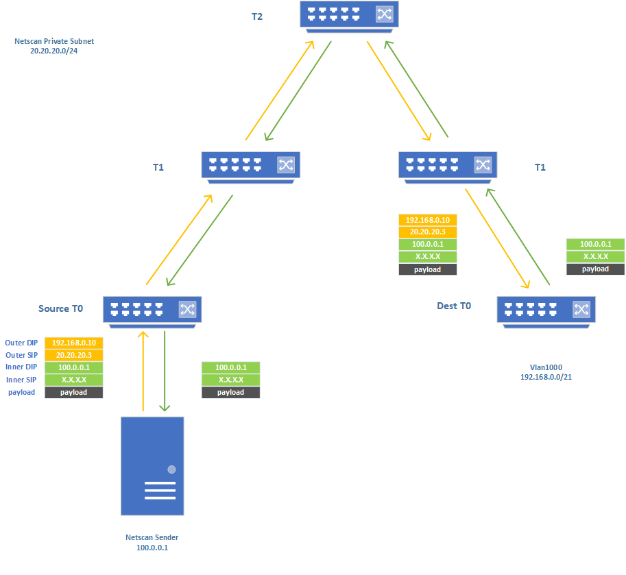

# Subnet decap test plan

- [Overview](#overview)
  - [Scope](#scope)
  - [Topology](#topology)
  - [Testbed setup](#testbed-setup)
- [Test Cases](#test-cases)
  - [Test case 1 - Verify IPinIP packet targeting at VLAN subnet is decapsulated (T0 only)](#test-case-1---verify-ipinip-packet-targeting-at-vlan-subnet-is-decapsulated-t0-only)
  - [Test case 2 - Verify IPinIP packet targeting at VIP is decapsulated (T0 only)](#test-case-2---verify-ipinip-packet-targeting-at-vip-is-decapsulated-t0-only)
  - [Test case 3 - Verify IPinIP packet targeting at vnet route is decapsulated (T1 only)](#test-case-3---verify-ipinip-packet-targeting-at-vnet-route-is-decapsulated-t1-only)
  - [Test case 4 - Verify subnet src_ip update](#test-case-4---verify-subnet-src_ip-update)
  - [Test case 5 - Verify subnet decap can be enabled via warm-reboot (T0 only)](#test-case-5---verify-subnet-decap-can-be-enabled-via-warm-reboot-t0-only)
  - [Test case 6 - Stress test](#test-case-6---stress-test)

## Overview

The purpose is to test the functionality of subnet decap.

## Scope

The test is targeting a running SONiC system with fully functioning configuration.

In Azure, Netscan probes the network paths/devices by sending IPinIP traffic. The IPinIP packet crafted by the Netscan sender has the outer DIP equals the destination device Loopback address, and the inner DIP equals the IP address of the Netscan sender. When the IPinIP packet is routed to/received by the destination device, they will be decapsulated and the inner packet will be routed back to the Netscan sender. As of today, Netscan uses this IP-decap based probing to detect route blackholes in the Azure network. The limitation is that Netscan is only able to probe the networking switches without the capability to detect any route blackholes for host nodes, especially VLAN subnet IPs. Due to the fact that the host nodes don’t have native IP-decap functionality, it is more appropriate to implement the IP-decap functionality on T0 SONiC as SONiC supports IPinIP decapsulation, and T0 SONiC will respond to the Netscan probes on behalf of the host nodes to decapsulate the Netscan IPinIP probe packets with DIP as any VLAN subnet IPs. In this design, subnet decap is introduced to enhance SONiC with the capability to generate the decap rules for the VLAN subnet so IPinIP packets from Netscan with DIP as either VLAN subnet IPs could be decapsulated and forwarded back to the Netscan sender to allow Netscan to have the awareness of any possible route blackholes to those destinations.



## Topology

Supported topologies: T0 and T1

## Testbed setup

The test requires subnet decap being enabled on the DUT. It can be enabled by injecting below configuration into CONFIG_DB.
```
{
    "SUBNET_DECAP|subnet_type": {
        "status": "enable",
        "src_ip": "20.20.20.0/24",
        "src_ip_v6": "fc01::0/120"
    }
}
```
On T0 topology, the default vlan (Vlan1000) is required for testing. The IP of Vlan1000 is `192.168.0.1/21` and `fc02:1000::1/64`.
## Test cases

### Test case 1 - Verify IPinIP packet targeting at VLAN subnet is decapsulated (T0 only)
#### Test steps
#### IPV4 positive scenario
1. Craft `IPinIP` packet with signature as below.

  - Outer DIP: Any IP in `192.168.0.1/21`
  - Outer SIP: Any IP in `20.20.20.0/24`
  - Inner DIP: Any dummy IP routed by default route
  - Inner SIP: Any IP

2. Ingress the packet from upstream ports to DUT.
3. Verify packet is decapsulated and routed to inner DIP.

#### IPV4 negative scenario
1. Craft `IPinIP` packet with signature as below.

  - Outer DIP: Any IP in `192.168.0.1/21`
  - Outer SIP: Any IP **NOT** in `20.20.20.0/24`
  - Inner DIP: Any dummy IP routed by default route
  - Inner SIP: Any IP
2. Setup ARP responder on ptf and trigger MAC learning with `ping` from DUT.
3. Ingress the packet from upstream ports to DUT.
4. Verify packet is forwarded to expected VLAN port.

#### IPV6 positive scenario
1. Craft `IPV6inIPV6` packet with signature as below.

  - Outer DIP: Any IP in `fc02:1000::1/64`
  - Outer SIP: Any IP in `fc01::0/120`
  - Inner DIP: Any dummy IP routed by default route
  - Inner SIP: Any IP

2. Ingress the packet from upstream ports to DUT.
3. Verify packet is decapsulated and routed to inner DIP.

#### IPV6 negative scenario
1. Craft `IPV6inIPV6` packet with signature as below.

  - Outer DIP: Any IP in `fc02:1000::1/64`
  - Outer SIP: Any IP **NOT** in `fc01::0/120`
  - Inner DIP: Any dummy IP routed by default route
  - Inner SIP: Any IP

2. Setup ARP responder on ptf and trigger NBR discovery with `ping` from DUT.
3. Ingress the packet from upstream ports to DUT.
4. Verify packet is forwarded to expected VLAN port.

### Test case 2 - Verify IPinIP packet targeting at VIP is decapsulated (T0 only)
#### Test setup
1. Setup SLB BGP neighbor on ptf and establish BGP sessions with DUT.
2. Announce some routes (including both IPv4 and IPv6) to DUT from SLB.
#### Test steps
#### IPV4 scenario
1. Verify `STATE_DB` entries are created as expected.
2. Craft packet with below signature
  - Outer DIP: Any IP in the prefix announced by SLB
  - Outer SIP: Any IP in `20.20.20.0/24`
  - Inner DIP: Any dummy IP routed by default route
  - Inner SIP: Any IP
3. Ingress the packet from upstream ports to DUT.
4. Verify packet is decapsulated and forwarded to inner_dip.
5. Withdraw IPv4 prefix announced from SLB.
6. Verify `STATE_DB` entries are removed as expected.
7. Ingress the same packet and verify decapsulation is not happening.

#### IPV6 scenario
1. Verify `STATE_DB` entries are created as expected.
2. Craft packet with below signature
  - Outer DIP: Any IP in the prefix announced by SLB
  - Outer SIP: Any IP in `fc01::0/120`
  - Inner DIP: Any dummy IP routed by default route
  - Inner SIP: Any IP
3. Ingress the packet from upstream ports to DUT.
4. Verify packet is decapsulated and forwarded to inner_dip.
5. Withdraw IPv6 prefix announced from SLB.
6. Verify `STATE_DB` entries are removed as expected.
7. Ingress the same packet and verify decapsulation is not happening.

### Test case 3 - Verify IPinIP packet targeting at vnet route is decapsulated (T1 only)
#### Test steps
#### IPV4 scenario
1. Configure IPv4 vnet routes with RESTAPI on DUT.
2. Verify `STATE_DB` entries are created as expected.
3. Craft packet with below signature
  - Outer DIP: Any IP in the vnet routes configured in step 1.
  - Outer SIP: Any IP in `20.20.20.0/24`
  - Inner DIP: Any dummy IP routed by default route
  - Inner SIP: Any IP
4. Ingress the packet from upstream ports to DUT.
5. Verify packet is decapsulated and forwarded to inner_dip.
6. Withdraw vnet route with RESTAPI.
7. Verify `STATE_DB` entries are removed as expected.
8. Ingress the same packet and verify decapsulation is not happening.

#### IPV6 scenario
1. Configure IPv6 vnet routes with RESTAPI on DUT.
2. Verify `STATE_DB` entries are created as expected.
3. Craft packet with below signature
  - Outer DIP: Any IP in the vnet routes configured in step 1.
  - Outer SIP: Any IP in `fc01::0/120`
  - Inner DIP: Any dummy IP routed by default route
  - Inner SIP: Any IP
4. Ingress the packet from upstream ports to DUT.
5. Verify packet is decapsulated and forwarded to inner_dip.
6. Withdraw vnet route with RESTAPI.
7. Verify `STATE_DB` entries are removed as expected.
8. Ingress the same packet and verify decapsulation is not happening.

### Test case 4 - Verify subnet src_ip update
#### Test steps
1. Update `src_ip` and `src_ip_v6` in `SUBNET_DECAP` table.
2. Verify `STATE_DB` entries are updated.
3. Repeat [IPV4 positive scenario](#ipv4-positive-scenario) and [IPV6 positive scenario](#ipv6-positive-scenario) to verify the updated `src_ip` and `src_ip_v6` is taken by ASIC.


### Test case 5 - Verify subnet decap can be enabled via warm-reboot (T0 only)
This particular test scenario can be covered in upgrade path warm-reboot test.
#### Test steps
1. Install image without subnet decap feature.
2. Upgrade to image with subnet decap enabled via warm-reboot.
3. Confirm warm upgrade is finished successfully.
4. Repeat [IPV4 positive scenario](#ipv4-positive-scenario) and [IPV6 positive scenario](#ipv6-positive-scenario) to verify the feature is enabled after warm-reboot.

### Test case 6 - Stress test
The test is to verify orchagent/syncd doesn't crash if there is no sufficient resource to create the tunnel decap terminations.
#### Test steps
1. Configure vnet routes (>6K) with RESTAPI.
2. Verify `STATE_DB` entries are created for IPinIP decap terminations that are successfully created.
3. Verify error log shows up in syslog.
4. Verify no service crash happened.


## Reference
1. [Subnet Decapsulation with SONiC HLD](https://github.com/sonic-net/SONiC/blob/5f9c839ac239a5d3532b18163b348c20f3468a15/doc/decap/subnet_decap_HLD.md)

[def]: #test-case-1
