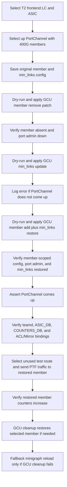

# PortChannel 400G Member Add GCU Test Plan

## 1. Purpose

This document describes the pytest test that validates adding a removed 400G
PortChannel member back to a T2 chassis linecard using Generic Config Updater
(GCU).

The test starts from a minigraph-derived PortChannel with at least two external
400G member ports. Setup removes one member's port-scoped configuration and
sets that port admin down, then lowers the PortChannel `min_links` value to the
remaining member count. The test body restores the removed member and the
original `min_links` value with GCU. After the restore patch, the test validates
control-plane, ASIC, counter, ACL/Mirror binding, and dataplane behavior for the
restored LAG member.

Test module:

`tests/generic_config_updater/add_cluster/test_portchannel_400G_member_add.py`

Related documents:

- Generic Config Updater add-cluster coverage:
  `docs/testplan/Add-cluster-with-GCU.md`
- Distributed VOQ chassis LAG coverage:
  `docs/testplan/chassis-lag-test-plan.md`

## 2. Applicability

### 2.1 Supported environments

The test runs on T2 testbeds.

Static and runtime gating:

| Mechanism | Requirement |
|-----------|-------------|
| `pytest.mark.topology("t2")` | Topology must be T2 |
| Runtime config | Selected PortChannel must have a configured `min_links` value |

### 2.2 Runtime PortChannel selection

At runtime, the test uses `enum_rand_one_per_hwsku_frontend_hostname`, so pytest
creates one parameter for each frontend LC HWSKU in the testbed. For each
parameter, runtime selection is restricted to frontend LCs with that same HWSKU.
The test scans those same-HWSKU frontend linecards and frontend ASICs until it
finds a qualifying PortChannel. It randomly selects one PortChannel that meets
all of the following conditions:

1. The PortChannel has at least two external member ports.
2. All external members are configured at 400G.
3. All external members are admin up and oper up.
4. The PortChannel is oper up before setup starts.
5. The original PortChannel config has `min_links` configured.

Internal and backplane member ports are excluded from selection.

If no PortChannel satisfies these conditions for a HWSKU parameter, that
parameter is skipped before any GCU patch is applied. Other HWSKU parameters can
still run independently.

If every HWSKU parameter in a testbed is skipped, the run provides no functional
GCU member-restore verification on that testbed. That outcome should be treated
as a topology coverage gap, not as evidence that GCU member restore was
validated.

The reusable helper
`find_portchannels_by_member_speed(config_facts, interface_status_map,
portchannel_status_map, speed, ...)` performs the speed-based PortChannel
discovery. This test passes `400000`, and the same helper can be reused by a
future 100G case with `100000`.

## 3. Test Objectives

The test confirms that GCU can restore a selected 400G PortChannel member after
that member was moved to the default admin-down state:

1. Remove one external member from `PORTCHANNEL_MEMBER`.
2. Remove the selected port's port-scoped cluster configuration.
3. Set the selected port admin down.
4. Lower `min_links` to the remaining member count.
5. Add the selected member and port-scoped config back using GCU.
6. Restore the original PortChannel `min_links` value using GCU.
7. Verify the final selected-port `CONFIG_DB` entries, member existence, port
   admin state, and `min_links` value.
8. Verify the PortChannel operational state is up after the removed member is
   restored.
9. Verify teamd/lag state reports the restored member selected.
10. Verify ASIC_DB has SAI LAG_MEMBER objects for all expected members and
    none of those members are egress-disabled.
11. Verify COUNTERS_DB exposes the restored member and LAG counter mappings.
12. Verify ACL and Mirror table bindings still reference the restored LAG.
13. Verify PTF dataplane traffic can hash to the restored member and that the
    restored member TX counters increase from a pre-traffic baseline.

## 4. GCU Patch Behavior

### 4.1 Setup patch: remove one member

The setup fixture applies GCU patches that:

- remove the selected `PORTCHANNEL_MEMBER` entry
- remove selected-port entries from `DEVICE_NEIGHBOR`
- remove selected-port entries from `INTERFACE`
- remove selected-port entries from `BUFFER_PG`
- remove selected-port entries from `PORT_QOS_MAP`
- remove selected-port entries from `QUEUE`
- remove selected-port entries from `PFC_WD`
- remove selected-port entries from `CABLE_LENGTH|AZURE`
- set `PORT|<member>/admin_status` to `down`
- set `PORTCHANNEL|<portchannel>/min_links` to the remaining member count

The test waits for the PortChannel to come up after lowering `min_links`. Per
test requirement, timeout does not fail the test; it logs an error with the last
PortChannel status command output and continues.

### 4.2 Test patch: add the member back

The test body applies one GCU patch that:

- adds the selected `PORTCHANNEL_MEMBER` entry back from the original running
  config
- restores selected-port entries in `DEVICE_NEIGHBOR`
- restores selected-port entries in `INTERFACE`
- restores selected-port entries in `BUFFER_PG`
- restores selected-port entries in `PORT_QOS_MAP`
- restores selected-port entries in `QUEUE`
- restores selected-port entries in `PFC_WD`
- restores selected-port entries in `CABLE_LENGTH|AZURE`
- restores the selected port's original `admin_status`
- restores the original PortChannel `min_links` value

Each patch is first validated with `config apply-patch -d` before the real GCU
apply.

## 5. Test Procedure

### 5.1 Select DUT, ASIC, PortChannel, and member

1. Use `enum_rand_one_per_hwsku_frontend_hostname` to select one frontend DUT
   for a HWSKU parameter.
2. Restrict runtime candidates to frontend DUTs with the same HWSKU.
3. Scan frontend ASIC namespaces on each candidate DUT.
4. Read running config facts and interface status for each ASIC.
5. Select a PortChannel with at least two 400G external oper-up members.
6. Select one member to remove and save the original member and PortChannel
   config values.

### 5.2 Prepare base state

1. Register GCU cleanup before applying any patch.
2. Dry-run and apply the selected-member removal patch.
3. Verify the removed member is absent from `CONFIG_DB` and the member port is
   admin down.
4. Dry-run and apply the `min_links` update to match remaining member count.
5. Verify the reduced `min_links` value in `CONFIG_DB`.
6. Poll PortChannel operational state and log an error if it does not come up.

### 5.3 Add the member back

1. Build an add patch from original running config facts.
2. Dry-run and apply the add patch.
3. Verify the member exists in `CONFIG_DB`.
4. Verify the selected port-scoped `CONFIG_DB` entries match the saved original
   config, including `DEVICE_NEIGHBOR`, `INTERFACE`, `BUFFER_PG`,
   `PORT_QOS_MAP`, `QUEUE`, `PFC_WD`, and `CABLE_LENGTH|AZURE`.
5. Verify the selected port admin state matches its original value.
6. Verify PortChannel `min_links` matches the original value.
7. Poll aggregate PortChannel operational state through
   `show interfaces portchannel` and fail if it does not come up.
8. Verify `lag_facts`/teamd state reports:
   - the aggregate PortChannel is up
   - all expected members are configured
   - the restored member is selected
   - the restored `min_links` value is active
9. Verify ASIC_DB has one `SAI_OBJECT_TYPE_LAG_MEMBER` entry for every expected
   member, none of those members are egress-disabled, and all expected member
   entries reference the same SAI LAG object.
10. Verify COUNTERS_DB has a restored member OID and readable TX counters. If a
    LAG counter object is present, verify its counter hash can be read.
11. Verify existing ACL and Mirror tables that reference the restored
    PortChannel or member still have bindings in CONFIG_DB and APP_DB.
12. Select an oper-up PTF source port outside the tested PortChannel.
13. Select an unused temporary IPv4 route from the test candidate list, advertise
    it through the restored member's neighbor ExaBGP port, and wait for the
    route to appear on the selected ASIC.
14. Send PTF traffic with multiple hash attempts until traffic selects the
    restored member.
15. Clear traffic counters, capture a post-clear pre-traffic baseline, send the
    PTF traffic without clearing counters again, then verify `portstat -j` and
    COUNTERS_DB TX counter deltas for the restored member meet or exceed the
    sent packet count.
16. Withdraw only the temporary route installed by this test and assert it is
    removed from the selected ASIC.

### 5.4 Cleanup

Cleanup runs after normal completion, assertion failure, or partial setup
failure:

1. Dry-run and apply the same member-add/original-`min_links` GCU patch if the
   selected PortChannel member is not already restored.
2. Verify the selected member, selected port-scoped `CONFIG_DB` entries,
   selected port admin status, and PortChannel `min_links` are back to their
   original values.
3. Fall back to `config reload` from minigraph with `safe_reload=True` and
   `wait_for_bgp=True` only if the GCU cleanup path fails.

## 6. Loganalyzer Handling

During GCU apply, the test registers selective loganalyzer ignores for expected
transient LAG and buffer-programming errors on the selected DUT.

If teardown falls back to config reload, the common `config_reload` helper
handles reload-time stabilization.

## 7. Pass Criteria

The test passes when:

1. A qualifying 400G external PortChannel is selected, or unsupported testbeds
   are skipped.
2. The setup GCU patches remove the selected member, set it admin down, and
   lower `min_links`.
3. The test GCU patch adds the selected member back and restores original
   `min_links`.
4. `CONFIG_DB` shows the expected final member existence, selected-port config,
   admin status, and `min_links` value.
5. PortChannel operational state is up after the final member restore.
6. teamd/lag state reports the restored member selected.
7. ASIC_DB exposes SAI LAG_MEMBER objects for the expected LAG members and none
   of those members are egress-disabled.
8. COUNTERS_DB exposes readable restored-member TX counters, and LAG counters
   are readable when the platform exposes a LAG counter object.
9. Existing ACL and Mirror bindings for the restored LAG remain present.
10. PTF traffic can hash to the restored member and the restored member TX
    counters increase.
11. Cleanup restores the selected PortChannel member config through GCU, with
   minigraph reload reserved as a fallback.

PortChannel operational state timeout after the setup `min_links` reduction is
logged as an error and is not a pass or fail criterion. Aggregate PortChannel
operational state after the final member restore is a pass criterion and is
checked through `show interfaces portchannel`.

## 8. Out of Scope

1. Non-T2 topologies.
2. Internal or backplane PortChannels.
3. PortChannels with fewer than two external 400G members.
4. Mixed-speed PortChannel member validation.
5. Removing or adding more than one member in a single test run.
6. Mixed IPv4/IPv6 dataplane traffic coverage; the restored-member traffic
   validation uses a temporary IPv4 route.
7. Full ACL, Everflow, ERSPAN, or other feature traffic behavior over the
   restored LAG. The test validates binding preservation, not every feature's
   forwarding behavior.
8. Negative malformed-patch or fail-safe validation.
9. Persistence across reboot, warm boot, or fast boot.

The items above are intentionally left to LAG dataplane, chassis LAG, generic
hash, feature-specific, and broader GCU negative/fail-safe coverage. This test
focuses on GCU patch dry-run/apply behavior, CONFIG_DB restoration of the
selected member-scoped entries, restored LAG operational state, and a targeted
PTF dataplane hash check for the restored member.
