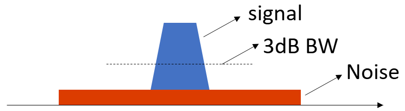
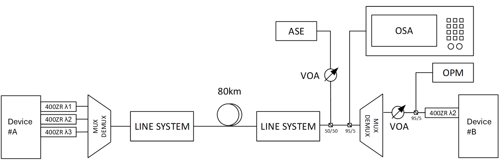
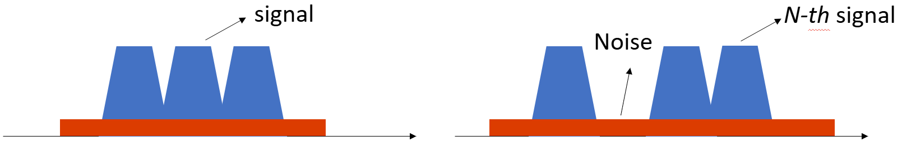

# ZR/3PO SONIC System Design Verification Test (SDVT) Plan

## Document Information

| Rev | Description | Editor | Date |
|-----|-------------|--------|------|
| 1.0 | Initial ZR and 3PO optics SDVT test plan document | Azure Networking Optical Team | 2026/01/21 |

---

## 1. Introduction

### 1.1 Purpose
This document defines the System Design Verification Test (SDVT) plan for coherent and IMDD optical transceivers — including both **400ZR** and **3PO (2xDR4 etc.)** optics — operating on SONiC-based network switches. The test plan validates the transceiver functionality and interoperability with different routers in SONIC OS.

> Some tests are specific to one optics type; others apply to both. The applicability is indicated in the Test Categories Overview (Section 2).

### 1.2 Scope
The SDVT covers the following test categories:

- **TC1**: Link State Management Tests (Shut/No-Shut, Reset, Low Power, Wavelength Sweep, Neighboring Channel Disturbance)
- **TC2**: EEPROM and Debug Loopback Tests
- **TC3**: Module Information, DOM Reading, and BER Tests
- **TC4**: Firmware Upgrade Tests
- **TC5**: System Resilience Tests (Service/Process/Chassis Restart)
- **TC6**: Signal Integrity, Receiver Sensitivity, Reflection, and OSNR Tests
- **TC7**: Traffic Soak, Temperature Cycling, and Vcc Ramping Tests
- **TC8**: Signal Integrity Optimization Presentation
- **TC9**: Physical OIR (Insertion and Removal) Tests

### 1.3 Test Environment

#### ZR Optics Under Test

Share offline.

#### 3PO Optics Under Test

Share offline.

#### Network Equipment Under Test

Share offline.

#### Test Infrastructure

- Test Setup for TC1–TC5

```
+-----------------+     +-----------------+
|           Port 1|<--->|Port 1           |
|                 |     |                 |
|    Device A     |     |     Device Z    |
|                 |     |                 |
|                 |     |                 |
+-----------------+     +-----------------+
```

> **Note:** Requires at least two linecards for chassis routers, or two routers for pizzabox routers, such that the link could be built between switch A and switch Z.

- VOA (Variable Optical Attenuator), optical power meters, ASE source, and OSA for TC6-2
- Traffic generator for TC7


---

## 2. Test Categories Overview

> **Note:** This test plan is designed for **new hardware onboarding**. For new firmware (FW) or operating system (OS) onboarding, specific point tests may need to be added or test priorities may be adjusted accordingly based on the scope of changes.

> **Note:** The router vendor should focus on the **Router Onboarding** column, and the optics vendor should focus on the **Optics Qualification** column.

| Test ID | Test Name | Priority | Optics Qualification | Router Onboarding | ZR Optics | 3PO Optics |
|---------|-----------|----------|----------------------|-------------------|:---------:|:----------:|
| TC1-1 | SONIC SNS (Shut/No-Shut) Test | P0 | Y | Y | Y | Y |
| TC1-2 | SONIC Reset SNS Test | P1 | Y | Y | Y | Y |
| TC1-3 | SONIC Low Power SNS Test | P1 | Y | Y | Y | Y |
| TC1-4 | Wavelength Sweep Turnup Test | P0 | Y | Y | Y | N |
| TC1-5 | Neighboring Channel Disturbance Test | P1 | Y | Y | Y | N |
| TC2-1 | sfputil EEPROM Info Test | P1 | Y | Y | Y | Y |
| TC2-2 | sfputil DOM Test | P1 | Y | Y | Y | Y |
| TC2-3 | CMIS Debug Loopback Test | P1 | Y | Y | Y | Y |
| TC3 | Module Info / DOM / BER Test | P0 | Y | Y | Y | Y |
| TC4-1 | Invalid Firmware Upgrade Test | P1 | Y | N | Y | Y |
| TC4-2 | Valid Firmware Upgrade Test | P0 | Y | Y | Y | Y |
| TC5-1 | Restart xcvrd Test | P1 | N | Y | Y | Y |
| TC5-2 | Restart pmon Test | P1 | N | Y | Y | Y |
| TC5-3 | Config Reload Test | P1 | N | Y | Y | Y |
| TC5-4 | Cold Linecard/Chassis Restart Test | P0 | Y | Y | Y | Y |
| TC6-1 | TP0 FIR Change Test | P1 | Y | Y | Y | Y |
  | TC6-2-1 | Receiver Sensitivity Test | P1 (ZR) / P0 (3PO) | Y | N | Y | Y |
| TC6-2-2 | Media Crosstalk / Reflection Test | P1 | Y | N | N | Y |
| TC6-2-3 | OSNR Single Channel Test | P0 | Y | N | Y | N |
| TC6-2-4 | OSNR WDM Test | P1 | Y | N | Y | N |
| TC6-3 | TP4 FIR Change Test | P1 | Y | Y | Y | Y |
| TC7-1 | Traffic Soak (Nominal Temp) | P0 | Y | Y | Y | Y |
| TC7-2 | Traffic Soak (Temperature Cycling) | P1 | Y | Y | Y | Y |
| TC7-3 | Traffic Soak (Vcc Ramping) | P1 | Y | Y | Y | Y |
| TC8-1 | TP0 SI optimization | P1 | Y | Y | Y | Y |
| TC8-2 | TP4 SI optimization | P1 | Y | Y | Y | Y |
| TC9 | Physical OIR Test | P0 | Y | Y | Y | Y |

---

## 3. Detailed Test Cases

### 3.1 TC1: Link State Management Tests

#### TC1-1: SONIC Shut/No-Shut (SNS) Test

**Objective:** Verify that the optical link recovers correctly after interface shut/no-shut operations on both sides of the link

**Input Parameters:**

| Parameter | Type | Description |
|-----------|------|-------------|
| `ip_a` | String | IP address of switch A |
| `ip_z` | String | IP address of switch Z |
| `user` | String | Username for SSH login |
| `psw` | String | Password for SSH login |
| `interface_As` | String | Comma-separated interface numbers on switch A |
| `interface_Zs` | String | Comma-separated interface numbers on switch Z |
| `repeat` | Integer | Number of test iterations |
| `VERBOSE` | Boolean | Enable detailed logging (optional) |

**Test Procedure:**

1. Verify initial link status on both sides (should be UP)
1. Record initial flap count on both interfaces
1. Shut down interface on switch A
1. Wait for shutdown to complete
1. Verify link status on both sides (should be DOWN)
1. Verify flap count incremented by 1 on both sides
1. Bring up interface on switch A
1. Wait for link to establish
1. Verify link status on both sides (should be UP)
1. Verify flap count incremented by 2 on both sides
1. Repeat steps 3-10 for switch Z side
1. Verify final flap count incremented by 4 on both sides

**Pass/Fail Criteria:**

| Criteria | Expected Result |
|----------|-----------------|
| Link recovery after shut/no-shut | Link UP within timeout |
| Flap count increment | Exactly +4 after full test cycle |
| Link info post-recovery | Within healthy range |

**Command:**

```bash
%run TC1-1_SONIC_SNS_test.py <ip_a> <ip_z> <user> <psw> <interface_As> <interface_Zs> <repeat> [VERBOSE]
```

---

#### TC1-2: SONIC Reset SNS Test

**Objective:** Verify that the optical link recovers correctly after module reset operations
Similar to TC1-1

**Command:**

```bash
%run TC1-2_SONIC_ResetSNS_test.py <ip_a> <ip_z> <user> <psw> <interface_As> <interface_Zs> <repeat> [VERBOSE]
```

---

#### TC1-3: SONIC Low Power Mode SNS Test

**Objective:** Verify that the optical link recovers correctly after putting the module in low power mode.

Similar to TC1-1

**Command:**

```bash
%run TC1-3_SONIC_LPSNS_test.py <ip_a> <ip_z> <user> <psw> <interface_As> <interface_Zs> <repeat> [VERBOSE]
```

---

#### TC1-4: Wavelength Sweep Turnup Test

> **Applicability:** ZR optics

**Objective:** Verify module interoperability across different vendor and hardware generation combinations, and measure module turnup time after shut/no-shut across all supported frequency channels and TX power configurations. This test validates that the module can successfully turn up across the full range of supported wavelengths and TX power settings. It also tests interoperability between different module vendors and hardware generations.

**Input Parameters:**

| Parameter | Type | Description |
|-----------|------|-------------|
| `ip_a` | String | IP address of switch A |
| `ip_z` | String | IP address of switch Z |
| `user` | String | Username for SSH login |
| `psw` | String | Password for SSH login |
| `interface_As` | String | Comma-separated interface numbers on switch A |
| `interface_Zs` | String | Comma-separated interface numbers on switch Z |

**Test Procedure:**

1. Verify initial link status on all optical pairs
1. For each TX power configuration (e.g., -10 dBm, -13 dBm):
   1. For each frequency channel (1-65):
      1. Shut down both modules in the pair
      1. Configure the target frequency channel on both modules
      1. Configure the TX output power on both modules
      1. Clear interface counters on both sides
      1. Unshut both modules
      1. Wait for link to establish and record turnup time
      1. Collect module performance measurements:
         - Link status
         - Flap count
         - Frequency offset
         - TX power, RX power
         - Case temperature
         - preFEC BER, postFEC BER
      1. Log results for this configuration

> **Note:** When transitioning from -10 dBm to -13 dBm TX power, do NOT clear counters or shut down the optics. This tests the module's response to RX power drop during operation.

1. Total test iterations: 2 TX power configurations × 65 frequency channels = **130 shut/no-shut cycles per optical pair**
1. Save consolidated results to log file

**Pass/Fail Criteria:**

| Criteria | Expected Result |
|----------|-----------------|
| Link status | UP |
| Turnup time | < 4 minutes |
| Flap count | 0 (after link established) |
| Frequency offset | ≤ 1.5 GHz |
| TX power offset | ≤ 1 dB |
| RX power offset | ≤ 2 dB |
| Case temperature | Inphi ≈ 55°C; Acacia ≈ 45°C |
| preFEC BER | Inphi and Acacia GEN2 ≤ 1e-3; Acacia GEN1 ≤ 2e-3 |
| postFEC BER | 0 |

**Command:**
```bash
%run TC1-4_Wavelength_Sweep_Turnup.py <ip_a> <ip_z> <user> <psw> <interface_As> <interface_Zs> [VERBOSE]
```

---

#### TC1-5: Neighboring Channel Disturbance Test

> **Applicability:** ZR optics

**Objective:** Verify that shut/no-shut, reset, or low power mode operations on one channel do not cause unexpected disturbances (link flaps, BER spikes, or errors) to neighboring frequency channels. This test should be performed in a setup with amplifiers and line systems.

**Background:** In WDM systems, operations on one optical channel may potentially cause transient power fluctuations or signal disturbances that affect adjacent channels sharing the same line system or amplifiers. This test validates channel isolation.

**Input Parameters:**

| Parameter | Type | Description |
|-----------|------|-------------|
| `ip_a` | String | IP address of switch A |
| `ip_z` | String | IP address of switch Z |
| `user` | String | Username for SSH login |
| `psw` | String | Password for SSH login |
| `interface_As` | String | Comma-separated interface numbers on switch A (ordered by frequency) |
| `interface_Zs` | String | Comma-separated interface numbers on switch Z (ordered by frequency) |
| `repeat` | Integer | Number of test iterations per target interface |
| `operation` | String | Operation type: 'shut', 'reset', 'lpmode', or 'reseat' |

> **Note:** The interface arrays must be ordered consistently with the optical frequency channel configuration. Adjacent elements in the array represent neighboring frequency channels. For example, if interfaces 0, 8, 16 are configured on channels 1, 2, 3 respectively, the input should be `0,8,16`.

**Test Procedure:**

1. Turn up all channels and verify all links are healthy
1. For each interface in the array (index `i`):
   1. Identify neighboring channels (interfaces at index `i-1` and `i+1`, if they exist)
   1. Record initial flap counts, BER baselines, and power levels for the neighboring channels
   1. Clear FCS error counters on the neighboring channels
   1. Perform the specified operation on the target channel:
      - **Shut/No-Shut:** Shut down and bring up the target interface
      - **Reset:** Reset the target module
      - **Low Power Mode:** Put target module in low power mode and recover
      - **Reseat:** Physically remove and reinsert the target optics module
   1. Monitor the neighboring channels during and after the operation:
      - Check for any link flaps
      - Check for DOM value spikes (BER, TX/RX power) or degradation
      - Check for FCS errors
   1. Verify neighboring channels remain stable throughout
   1. Repeat for specified iterations (`repeat` times per target)
   1. Log results for this target and its neighbors
1. Aggregate results across all interfaces
1. Save consolidated results to log file

**Pass/Fail Criteria:**

| Criteria | Expected Result |
|----------|-----------------|
| Neighboring link stability | Zero link flaps on neighboring channels during any operation |
| Neighboring DOM | No DOM spikes or degradation on neighboring channels |
| Neighboring FCS errors | Zero FCS errors on neighboring channels |
| Consistency across interfaces | Pass criteria met for all target interfaces tested |

**Command:**
```bash
%run TC1-5_Neighboring_Channel_Disturbance.py <ip_a> <ip_z> <user> <psw> <interface_As> <interface_Zs> <repeat> <operation> [VERBOSE]
```

**Example:**
```bash
%run TC1-5_Neighboring_Channel_Disturbance.py 10.0.0.1 10.0.0.2 admin password 0,8,16 0,8,16 5 shut VERBOSE
```

This example tests 3 interfaces ordered by frequency channel. Each interface is disturbed in turn while its neighbors are monitored:
- When interface 0 is disturbed, interface 8 is monitored (only right neighbor)
- When interface 8 is disturbed, interfaces 0 and 16 are monitored (both neighbors)
- When interface 16 is disturbed, interface 8 is monitored (only left neighbor)

Total: 3 targets × 5 iterations = 15 operations.

---

### 3.2 TC2: EEPROM and Loopback Tests

#### TC2-1: sfputil EEPROM Info Test

**Objective:** Verify that the EEPROM information can be read correctly via sfputil CLI commands.

**Command:**

```bash
%run TC2-1_sfputil_info.py <ip> <user> <psw> <interfaces> <repeat> [VERBOSE]
```

---

#### TC2-2: sfputil DOM Test

**Objective:** Verify Digital Optical Monitoring (DOM) readings via sfputil CLI.

**Command:**

```bash
%run TC2-2_sfputil_dom.py <ip> <user> <psw> <interfaces> <repeat> [VERBOSE]
```

---

#### TC2-3: Single Side Loopback Test

**Objective:** Verify module loopback functionality (Host Input/Output and Media Input/Output loopback modes).

**Input Parameters:**

| Parameter | Type | Description |
|-----------|------|-------------|
| `ip_a` | String | IP address of switch A |
| `ip_z` | String | IP address of switch Z |
| `user` | String | Username |
| `psw` | String | Password |
| `interface_As` | String | Interface numbers on switch A |
| `interface_Zs` | String | Interface numbers on switch Z |
| `repeat` | Integer | Number of iterations |

**Test Procedure:**

1. Enable debug loopback on one side
1. Verify loopback status in EEPROM
1. Verify signal loops back correctly
1. Disable loopback and verify normal operation
1. Repeat for Media Input Loopback

**Pass/Fail Criteria:**

| Criteria | Expected Result |
|----------|-----------------|
| Loopback mode activation | Activates correctly |
| Link state verification | Loops back correctly |
| Normal operation | Restored after disabling loopback |

**Command:**

```bash
%run TC2-3_SingleSide_Loopback.py <ip_a> <ip_z> <user> <psw> <interface_As> <interface_Zs> <repeat> [VERBOSE]
```

---

### 3.3 TC3: Module Information, DOM Reading, and BER Test

#### TC3: Module Info / DOM / BER Test

**Objective:** Verify that module information, Digital Optical Monitoring (DOM) readings, and Bit Error Rate (BER) data can be read correctly via SONiC CLI and are within healthy thresholds.

**Input Parameters:**

| Parameter | Type | Description |
|-----------|------|-------------|
| `ip_a` | String | IP address of switch A |
| `ip_z` | String | IP address of switch Z |
| `user` | String | Username for SSH login |
| `psw` | String | Password for SSH login |
| `interface_As` | String | Interface numbers on switch A |
| `interface_Zs` | String | Interface numbers on switch Z |
| `repeat` | Integer | Number of test iterations |

**Test Procedure:**

1. Verify initial link status on both sides
1. For each test iteration, for each (port_A, port_Z) pair:
   1. Collect module info, DOM summary, and TP1/TP3 BER data from both sides.
   1. Generate SKU-specific pass/fail criteria using the module's model number and firmware version
   1. Run pass/fail criteria check against SKU-specific thresholds on both sides (module info, DOM, and BER)
   1. On first iteration: store as baseline; on subsequent iterations: also compare counters against baseline
1. Aggregate and print test summary

**Pass/Fail Criteria:**

| Criteria | Expected Result |
|----------|------------------|
| Module info fields | Vendor, model, serial, FW version read correctly |
| Per-lane TX power | Within SKU-specific thresholds |
| Per-lane RX power | Within SKU-specific thresholds |
| Per-lane TX bias | Within SKU-specific thresholds |
| Temperature | Within operating range |
| Vcc | Within specification |
| TP1 BER (host-side preFEC) | Within healthy range per SKU specification |
| TP3 BER (media-side preFEC) | Within healthy range per SKU specification |
| Counter stability | No unexpected counter increments vs. baseline |
| Link status | UP on both sides |

**Scripts:**

The test is implemented across three scripts that can be run individually or in sequence:

```bash
%run TC3_show_module_info.py <ip_a> <ip_z> <user> <psw> <interface_As> <interface_Zs> <repeat> [VERBOSE]
```

---

### 3.4 TC4: Firmware Upgrade Tests

#### TC4-1: Invalid Firmware Upgrade Test

**Objective:** Verify that the system correctly rejects invalid firmware images and maintains link stability.
Similar to TC4-2.

**Command:**

```bash
%run TC4-1_trans_INVALID_firmware_upgrade.py <ip_a> <ip_z> <user> <psw> <port_As> <port_Zs> <firmware_path> <repeat> [VERBOSE]
```

---

#### TC4-2: Valid Firmware Upgrade Test

**Objective:** Verify successful firmware upgrade process and link recovery.

**Input Parameters:**

| Parameter | Type | Description |
|-----------|------|-------------|
| `ip_a` | String | IP address of switch A |
| `ip_z` | String | IP address of switch Z |
| `user` | String | Username |
| `psw` | String | Password |
| `port_As` | String | Port numbers on switch A |
| `port_Zs` | String | Port numbers on switch Z |
| `firmware_path` | String | Path to valid firmware image |
| `gold_image` | String | Expected firmware version |
| `repeat` | Integer | Number of iterations |
| `max_download_time` | Integer | Maximum download time (default: 600s) |

**Test Procedure:**

1. Record current active and inactive firmware versions
1. Record current flap counts
1. Download valid firmware image
1. Verify download completes successfully
1. Activate and commit new firmware
1. Reset optic and perform shut/no-shut
1. Verify active FW matches expected version
1. Verify inactive FW matches previous active version
1. Verify exactly 2 link flaps (due to reset)
1. Verify module in nominal operating range

**Pass/Fail Criteria:**

| Criteria | Expected Result |
|----------|-----------------|
| Download completion | Within timeout |
| Activation | Successful |
| Firmware version | Matches expected |
| Link flaps | Exactly 2 |
| Link recovery | Healthy state |

**Command:**
```bash
%run TC4-2_trans_firmware_upgrade.py <ip_a> <ip_z> <user> <psw> <port_As> <port_Zs> <firmware_path> <gold_image> <repeat> [max_download_time] [VERBOSE]
```

---

### 3.5 TC5: System Resilience Tests

#### TC5-1: Restart xcvrd Test

**Objective:** Verify link stability after restarting the transceiver daemon (xcvrd).

**Input Parameters:**

| Parameter | Type | Description |
|-----------|------|-------------|
| `ip_a` | String | IP address of switch A |
| `ip_z` | String | IP address of switch Z |
| `user` | String | Username |
| `psw` | String | Password |
| `interface_As` | String | Interface numbers on switch A |
| `interface_Zs` | String | Interface numbers on switch Z |
| `repeat` | Integer | Number of iterations |

**Test Procedure:**

1. Verify initial link status
1. Restart xcvrd service on switch A
1. Wait for service to restart
1. Verify link status recovers
1. Verify DOM readings are valid
1. Repeat for switch Z

**Pass/Fail Criteria:**

| Criteria | Expected Result |
|----------|-----------------|
| xcvrd restart | Successful |
| Link recovery | Within timeout |
| Link flaps | No unexpected flaps |
| DOM readings | Valid post-restart |

**Command:**
```bash
%run TC5-1_restart_xcvrd.py <ip_a> <ip_z> <user> <psw> <interface_As> <interface_Zs> <repeat> [VERBOSE]
```

---

#### TC5-2: Restart pmon Test

**Objective:** Verify link stability after restarting the platform monitor daemon (pmon).

**Input Parameters:**
Same as TC5-1

**Test Procedure:**

1. Verify initial link status
1. Restart pmon service on switch A
1. Wait for service to restart
1. Verify link status recovers
1. Repeat for switch Z

**Pass/Fail Criteria:**

| Criteria | Expected Result |
|----------|-----------------|
| pmon restart | Successful |
| Link recovery | Within timeout |
| Module monitoring | Resumes correctly |

**Command:**
```bash
%run TC5-2_restart_pmon.py <ip_a> <ip_z> <user> <psw> <interface_As> <interface_Zs> <repeat> [VERBOSE]
```

---

#### TC5-3: Config Reload Test

**Objective:** Verify link stability after SONiC configuration reload.

**Input Parameters:**
Same as TC5-1

**Test Procedure:**

1. Verify initial link status
1. Execute `config reload` on switch A
1. Wait for switch to reload configuration
1. Verify link status recovers
1. Verify all interfaces come up correctly

**Pass/Fail Criteria:**

| Criteria | Expected Result |
|----------|-----------------|
| Config reload | Completes successfully |
| Interface recovery | All interfaces recover |
| Link status | Returns to healthy state |

**Command:**

```bash
%run TC5-3_config_reload.py <ip_a> <ip_z> <user> <psw> <interface_As> <interface_Zs> <repeat> [VERBOSE]
```

---

#### TC5-4: Cold Linecard/Chassis Restart Test

**Objective:** Verify link recovery after cold chassis restart or linecard restart.

**Input Parameters:**
Same as TC5-1

**Test Procedure:**

1. Verify initial link status
1. Execute cold chassis restart on switch A
1. Wait for switch to boot completely
1. Verify link status recovers
1. Verify all modules initialize correctly

**Pass/Fail Criteria:**

| Criteria | Expected Result |
|----------|-----------------|
| Chassis boot | Successful |
| Module detection | All modules detected and initialized |
| Link recovery | Healthy state |

**Command:**
```bash
%run TC5-4_restart_chassis_cold.py <ip_a> <ip_z> <user> <psw> <interface_As> <interface_Zs> <repeat> [VERBOSE]
```

---

### 3.6 TC6: Signal Integrity, Receiver Sensitivity, Reflection, and OSNR Tests

#### TC6-1: TP0 FIR Change Test

**Objective:** Characterize link behavior when changing transmitter (TP0) FIR tap settings.

**Input Parameters:**

| Parameter | Type | Description |
|-----------|------|-------------|
| `ip_a` | String | IP address of TX switch |
| `ip_z` | String | IP address of RX switch |
| `user` | String | Username |
| `psw` | String | Password |
| `interface_A` | Integer | TX interface number |
| `interface_Z` | Integer | RX interface number |
| `main_tap_step` | Integer | Step size for main tap sweep |
| `iterations` | Integer | Number of sweep points |
| `repeat` | Integer | Number of iterations |

**Test Procedure:**

1. Verify link is healthy before sweep
1. Collect baseline measurements
1. Sweep TP0 FIR main tap values:
   - Read link info and EEPROM data
   - Read TP1/TP3/TP5 BER from Z side
   - Perform baseline comparison
   - Check pass/fail criteria
1. Generate plots and data output

**Pass/Fail Criteria:**

| Criteria | Expected Result |
|----------|-----------------|
| Link state | Up for good setting and Down for bad setting |
| BER | Healthy for good setting and unhealthy for bad setting |
| Alarms | Expected alarms should be triggered for bad setting |

**Output:**

- TP1/TP3/TP5 BER vs. TP0 FIR main tap plot
- Status bool changes vs. TP0 FIR main tap plot
- Data file (.npz format)

**Command:**
```bash
%run TC6-1_TP0_FIR_change.py <ip_a> <ip_z> <user> <psw> <interface_A> <interface_Z> <main_tap_step> <iterations> <repeat> [VERBOSE]
```

---

#### TC6-2-1: Receiver Sensitivity Test

> **Priority:** P1 for ZR optics, P0 for IMDD optics.

**Objective:** Characterize receiver sensitivity by measuring BER performance under varying received optical power levels using a VOA. Test in Channel 32 (center wavelength for the ease of comparison).

**Test Setup:**

```
[Switch A TX] ---> [VOA] ---> [Switch Z RX]
```

**Input Parameters:**

| Parameter | Type | Description |
|-----------|------|-------------|
| `ip_a` | String | IP address of TX switch |
| `ip_z` | String | IP address of RX switch |
| `user` | String | Username |
| `psw` | String | Password |
| `interface_A` | Integer | TX interface number |
| `interface_Z` | Integer | RX interface number |
| `ip_VOA` | String | VOA IP address |
| `VOA_slot` | Integer | VOA slot number |
| `attenuation_list` | String | Comma-separated attenuation values (dB) |
| `repeat` | Integer | Number of iterations |

**Test Procedure:**

1. Verify link is healthy at nominal power (0 dB attenuation)
1. Collect baseline measurements (TX power, RX power, BER)
1. Sweep attenuation values from low to high:
   1. Set VOA to target attenuation
   1. Wait for link to stabilize
   1. Record RX power from DOM readings
   1. Read TP1/TP3/TP5 BER from Z side
   1. Check for alarms and warnings
1. Return to 0 dB attenuation and verify link recovery
1. Save data to .npz file

**Pass/Fail Criteria:**

| Criteria | Expected Result |
|----------|-----------------|
| Receiver sensitivity | Meets specification |
| BER vs RX power | Follows expected waterfall curve |
| Link recovery | Recovers when attenuation is removed |
| No false alarms | At nominal power conditions |

**Output:**

- RX power vs. pre-FEC BER waterfall plot
- Data file (.npz format)

**Command:**

```bash
%run TC6-2-1_Receiver_Sensitivity.py <ip_a> <ip_z> <user> <psw> <interface_A> <interface_Z> <ip_VOA> <VOA_slot> <attenuation_list> <repeat> [VERBOSE]
```

---

#### TC6-2-2: Media Crosstalk / Reflection Test

> **Applicability:** 3PO optics

**Objective:** Characterize the module's behavior under media-side crosstalk and back-reflection conditions by sweeping VOA attenuation from high to low (increasing RX power) and measuring BER and RX status at each level. This test validates that the module handles reflected or degraded media-side optical signals correctly — particularly important for 3PO optics operating in different modulation formats where reflection tolerance may differ from standard ZR.

**Test Setup:**

```
[Switch A TX] --------------> 70% ---+
                                     |--- [70/30 Coupler] ---> [Switch Z RX]
[Crosstalk TX] ---> [VOA] --> 30% ---+
```

> **Note:** A separate transceiver serves as the crosstalk source. Its output is attenuated by a VOA and combined with the signal from Switch A TX via a 70/30 optical coupler. The 70% port carries the primary signal; the 30% port carries the crosstalk. Sweeping the VOA attenuation from high to low (e.g., 40 dB → 5 dB → 40 dB) progressively increases the crosstalk power at the receiver. This tests how the module responds as media-side crosstalk power increases.

**Input Parameters:**
Same as TC6-2-1

**Test Procedure:**

1. Verify initial link status on both sides
1. Initialize VOA: connect to Keysight N7764A, turn on slot, set initial attenuation (typically high, e.g., 40 dB). Collect baseline measurements (TX power, RX power, BER)
1. Attenuation sweep from high to low:
   1. Set VOA to target attenuation
   1. Wait for VOA and link to settle
   1. Collect link info from both sides
   1. Record: OPM RX power, DOM RX power (per active lane), preFEC BER (TP5), RX LOS, RX CDR LOL, RX output status
   1. Run pass/fail criteria check against healthy link thresholds
1. Return to high attenuation and verify link state
1. Save data to `.npz` file
1. Repeat for specified iterations; aggregate pass/fail results

**Pass/Fail Criteria:**

| Criteria | Expected Result |
|----------|-----------------|
| Crosstalk tolerance | Meet the specs |
| BER vs Crosstalk Penalty Ratio | Follows expected curve |
| RX alarm behavior | Appropriate RX CDR LOL alarms at high crosstalk |
| Link recovery | Recovers when the crosstalk returns to nominal |

**Output:**

- `.npz` data file: `TP2-TP3_XTalk_Test_TXEth{A}_RXEth{Z}_{version}_{fw}_{datetime}.npz`
- Contains: `rx_power` (OPM and DOM), `ber_list`, `status_z` arrays

**Command:**
```bash
%run TC6-2-2_TP2-TP3_Reflection_test.py <ip_a> <ip_z> <user> <psw> <interface_A> <interface_Z> <ip_VOA> <VOA_slot> <VOA_att_list> <repeat> [VERBOSE]
```

---

#### TC6-2-3: OSNR Single Channel Test

> **Applicability:** ZR optics

**Objective:** Characterize receiver OSNR tolerance on a single wavelength channel using ASE noise loading. As indicated in the figure below, the single channel OSNR test measures OSNR with only one channel on while neighboring channels are shut down. This test needs to be performed three times at different optical frequency ranges.



**Test Setup (for both TC6-2-3 and TC6-2-4):**



**Input Parameters:**

| Parameter | Type | Description |
|-----------|------|-------------|
| `ip_a` | String | IP address of TX switch |
| `ip_z` | String | IP address of RX switch |
| `user` | String | Username |
| `psw` | String | Password |
| `interface_A` | Integer | TX interface number |
| `interface_Z` | Integer | RX interface number |
| `channel` | Integer | Channel number under test |
| `ip_MAP` | String | VIAVI MAP200 IP address |
| `ip_OSA` | String | Yokogawa OSA IP address |
| `ip_molex_top` | String | Top Molex line system IP |
| `ip_molex_bot` | String | Bottom Molex line system IP |
| `VOA_slot` | Integer | MAP VOA slot number (e.g., 2) |
| `ASE_slot` | Integer | MAP ASE slot number (e.g., 3) |
| `sig_power` | Float | Target signal power in dBm (e.g., -10) |

**OSNR Calculation Method:**

- The measurement is performed with high RBW (Resolution Bandwidth) setting in OSA (e.g., RBW = 4).
- OSA center frequency is set to the channel frequency with appropriate span (e.g., 200 GHz for single channel).
- The OSNR is calculated as: **OSNR = 10 × log10(S/N - 1)**, with signal power integrated within 3 dB bandwidth and noise power integrated from left to right side of the OSA measurements.
- Apply correction factor for RBW normalization to 0.1 nm reference bandwidth.

**Test Procedure:**

The VOA on the left (VOA1) controls the ASE noise loaded into the optical links. The VOA on the right (VOA2) and the optical power meter (OPM) are integrated in the line system — they are used to keep the Rx power at a constant value. We perform an attenuation sweep to measure the module performance.

1. Verify link is healthy at high OSNR (no ASE)
1. Collect baseline measurements (TX power, RX power, BER)
1. Calibrate ASE power level and set RX power to a constant target value using VOA2/OPM
1. Perform attenuation sweep on VOA1 to vary OSNR:
   - For each attenuation value, adjust VOA1 to load ASE noise
   - Record OSNR from the optical spectrum obtained via OSA using the calculation method above
   - Record client metrics from switch Z readings: preFEC BER and FCS errors
   - Check for alarms and warnings
1. Return to high OSNR (no ASE) and verify link recovery
1. Save data to .npz file
1. **Repeat the test three times to cover short-, center-, and long-wavelengths in the C-band**

**Interop Coverage:**

The measurement should cover all interop pairs (e.g., A→X/Y/Z and X/Y/Z→A when onboarding module A with modules X, Y, Z already in production), with neighboring channels shut down.

> **Note:** Use the exact same A module to measure and compare between different interop combinations.

**Pass/Fail Criteria:**

| Criteria | Expected Result |
|----------|-----------------|
| OSNR tolerance | Meets 400ZR specification (≥ 26 dB for BER < 1.25e-2) |
| BER vs OSNR | Follows expected waterfall curve |
| Link recovery | Recovers when ASE is removed |
| No false alarms | At high OSNR conditions |
| Interop variance | Less than 1 dB difference between different combinations |

**Output:**

- `SC_OSA.png`: Single channel OSA spectrum
- `SC_OSNR.png`: OSNR vs. preFEC BER waterfall plot with FEC limit line (1.25e-2)
- `ber_vs_osnr.npz`: Data file containing all measurement results
- Log file: `OSNR_logs/Tx_{tx_vendor}_Rx_{vendor}_{date}.log`

**Command:**
```bash
%run TC6-2-3_4_OSNR.py <ip_a> <ip_z> <user> <psw> <interface_A> <interface_Z> <channel> <ip_MAP> <ip_OSA> <ip_molex_top> <ip_molex_bot> <VOA_slot> <ASE_slot> <sig_power> <vendor> <tx_vendor> [VERBOSE]
```

---

#### TC6-2-4: OSNR WDM Test

> **Applicability:** ZR optics

**Objective:** Characterize receiver OSNR tolerance in a WDM environment with impacts from neighboring channels. The WDM test measures the OSNR performance when multiple co-propagating channels are present.



Test setup similar to TC6-2-3.

**OSNR Measurement Method:**

- Use **On/Off method** to retrieve signal and noise power separately in WDM environment.
- **Signal measurement:** Measure OSA spectrum with all channels ON, save as `{vendor}_ATT_{value}_dB_OSNR_result_sig`
- **Noise measurement:** Turn OFF target channel (channel 2), turn ON backup channel (channel 4) to maintain amplifier loading, measure noise floor, save as `{vendor}_ATT_{value}_dB_OSNR_result_noise`
- Calculate OSNR using fixed spectrum threshold method with 3 dB bandwidth integration.

**Test Procedure:**

1. Turn up all 4 channels and verify all links are healthy
1. Collect baseline measurements for all channels (TX power, RX power, BER)
1. Run amplifier auto gain equalization when switching from single-channel to multi-channel operation
1. Calibrate ASE power level and set RX power to a constant target value using VOA2/OPM
1. Perform attenuation sweep on VOA1 to vary OSNR:
   - For each attenuation value, adjust VOA1 to load ASE noise
   - Use On/Off method: turn off channel 2 and measure noise floor, turn on a balancing channel (e.g., channel 4)
   - Record OSNR from the optical spectrum obtained via OSA
   - Record client metrics from switch Z readings: preFEC BER and FCS errors for all channels
   - Record crosstalk and adjacent channel interference metrics
   - Check for alarms and warnings
1. Return to high OSNR (no ASE) and verify all links recover
1. Save data to .npz file
1. **Repeat the test three times to cover short-, center-, and long-wavelengths in the C-band**

**Interop Coverage:**

The measurement setup should cover combinations such as:

- AAAA → XXXX/YYYY/ZZZZ (4 new modules transmitting to 4 production modules)
- XXXX/YYYY/ZZZZ → AAAA (4 production modules transmitting to 4 new modules)

> **Note:** To simplify the experiment, single channel OSNR test (TC6-2-3) can be measured together with WDM OSNR test in the same script run. The script will automatically shut/unshut neighboring channels and generate a combined comparison plot.

**WDM Corner Case Test (Optional):**

In production, the neighboring channel of a module could be of any hardware version. To test the possible worst situation:

1. According to DVT results and previous measurements, select two hardware versions with the largest bandwidth (W1 and W2).
1. Measure the WDM OSNR with configurations: {W1 A W2 A} → {AAAA}, {W1 A W1 A} → {AAAA}, {W2 A W2 A} → {AAAA}, {W2 A W1 A} → {AAAA}.

**Pass/Fail Criteria:**

| Criteria | Expected Result |
|----------|-----------------|
| OSNR tolerance | Meets 400ZR specification (≥ 26 dB for BER < 1.25e-2) |
| BER vs OSNR | Follows expected waterfall curve |
| Adjacent channel impact | Minimal degradation vs single channel |
| Link recovery | All channels recover when ASE is removed |
| Interop variance | Less than 1 dB difference between different combinations |
| OIF ROSNR requirement | Meets OIF 400ZR ROSNR specification |

**Output:**

- `WDM_OSA.png`: WDM OSA spectrum showing all 4 channels
- `WDM_OSNR.png`: OSNR vs. preFEC BER waterfall plot for WDM measurement
- `combined_OSNR.png`: Overlay comparison of single channel (blue) and WDM (red) OSNR curves
- `ber_vs_osnr.npz`: Data file containing all measurement results
- Individual OSA traces: `{vendor}_ATT_{value}_dB_OSNR_result_sig` and `{vendor}_ATT_{value}_dB_OSNR_result_noise` for each attenuation point
- Log file: `OSNR_logs/Tx_{tx_vendor}_Rx_{vendor}_{date}.log`

**Command:** Same as TC6-2-3. The script `TC6-2-3_4_OSNR.py` runs both single channel and WDM tests sequentially.

---

#### TC6-3: TP4 FIR Change Test

**Objective:** Characterize link behavior when changing receiver (TP4) FIR tap settings.

**Input Parameters:**

| Parameter | Type | Description |
|-----------|------|-------------|
| `ip_a` | String | IP address of switch A |
| `ip_z` | String | IP address of switch Z |
| `user` | String | Username |
| `psw` | String | Password |
| `interface_A` | Integer | Interface A number |
| `interface_Z` | Integer | Interface Z number |
| `RX_amp_list` | String | Comma-separated RX amplitude values |
| `pre_tap_list` | String | Comma-separated pre-tap values |
| `post_tap_list` | String | Comma-separated post-tap values |
| `repeat` | Integer | Number of iterations |

**Test Procedure:**

1. Verify link is healthy
1. Record default TP4 FIR settings
1. Sweep TP4 FIR combinations:
   - Modify RX amplitude, pre-tap, post-tap
   - Verify settings applied correctly
   - Read BER and status information
   - Perform baseline comparison
1. Generate output table and data file

**Pass/Fail Criteria:**

| Criteria | Expected Result |
|----------|-----------------|
| Link state | Up for good setting and Down for bad setting |
| BER | Healthy for good setting and unhealthy for bad setting |
| Alarms | Expected alarms should be triggered for bad setting |

**Output Table Columns:**

| Column | Description |
|--------|-------------|
| RX amplitude | Receiver amplitude setting |
| RX pretap | Pre-tap value |
| RX posttap | Post-tap value |
| preFEC BER | Pre-FEC bit error rate |
| postFEC BER | Post-FEC bit error rate |
| Status | Link status |
| Baseline check | Comparison result |

**Command:**
```bash
%run TC6-3_TP4_FIR_change.py <ip_a> <ip_z> <user> <psw> <interface_A> <interface_Z> <RX_amp_list> <pre_tap_list> <post_tap_list> <repeat> [VERBOSE]
```

---

### 3.7 TC7: Traffic Soak, Temperature Cycling, and Thermal Tests

#### TC7-1: Traffic Soak at Nominal Temperature

**Objective:** Verify long-term link stability under nominal operating conditions.

**Pass/Fail Criteria:**

| Criteria | Expected Result |
|----------|-----------------|
| Link stability | No unexpected link flaps during soak period |
| Traffic integrity | Traffic input bits equals traffic output bits, zero packet loss / FCS errors |
| preFEC BER | Remains stable and within healthy range, FEC histogram bin <= 9 |
| postFEC BER | Zero post-FEC errors throughout soak |
| Module temperature | Remains within nominal operating range |
| Alarms | No unexpected alarms triggered |

**Command:**
```bash
%run TC7-1_traffic_soak_nominal_temp.py <ip_a> <ip_z> <user> <psw> <interface_As> <interface_Zs> <repeat> <interval> [VERBOSE]
```

---

#### TC7-2: Traffic Soak with Temperature Cycling

> **Applicability:** Only test if the switch vendor confirms that reducing fan speeds won't cause any damage.

**Objective:** Validate module stability under thermal stress by cycling fan speeds to change the operating temperature while monitoring link health and traffic integrity. Temperature cycling is critical for 3PO modules, which may have different thermal profiles than ZR modules. The fan speed list pattern (low→high→low) simulates a temperature cycle from hot→cold→hot.

**Input Parameters:**

| Parameter | Type | Description |
|-----------|------|-------------|
| `ip_a` | String | IP address of switch A |
| `ip_z` | String | IP address of switch Z |
| `user` | String | Username for SSH login |
| `psw` | String | Password for SSH login |
| `fan_speed_list` | String | Comma-separated fan speed values (0–255), e.g., `63,63,63,127,191,255,255,255,255,191,127,63` |
| `repeat` | Integer | Number of full temperature cycles |
| `interval` | Float | Wait time in seconds between fan speed changes |

**Test Procedure:**

1. Verify initial link status and traffic flow on both sides
1. For each repeat cycle:
   1. For each fan speed value in the list:
      1. Set fan speed on both switch A and switch Z
      1. Read back actual fan speed to confirm
      1. Wait for the specified interval to allow temperature stabilization
      1. Monitor link status and traffic counters
1. Restore fan speed to default (auto) mode
1. Verify link remains healthy after temperature cycling
1. Record total test time and any anomalies

> **Note:** This test should be run concurrently with traffic generation. TC7-1 pass/fail criteria apply to the traffic monitoring aspect. A typical fan speed list pattern like `63,63,63,127,191,255,255,255,255,191,127,63` ramps from low fan speed (high module temperature) through high fan speed (low module temperature) and back.

**Pass/Fail Criteria:**

| Criteria | Expected Result |
|----------|------------------|
| Link stability | No unexpected link flaps during temperature cycling |
| Traffic integrity | Zero packet loss / FCS errors throughout cycling |
| preFEC BER | Remains stable across temperature range |
| postFEC BER | Zero post-FEC errors during cycling |
| Module temperature | Stays within module operating specification |
| Alarm behavior | No false alarms; only expected thermal warnings at temperature limits |

**Command:**
```bash
%run TC7-2_traffic_soak_temp_cycle.py <ip_a> <ip_z> <user> <psw> <fan_speed_list> <repeat> <interval> [VERBOSE]
```

---

#### TC7-3: Traffic Soak with Vcc Ramping

> **Applicability:** Only test if the switch vendor confirms that changing the Vcc won't cause any damage.

**Objective:** Verify the module's capability of maintaining stable operation under Vcc (supply voltage) variations and noise conditions.

**Test Procedure:**

1. Verify link is healthy at nominal Vcc (3.3V)
1. Collect baseline measurements (TX power, RX power, BER, traffic counters)
1. Ramp Vcc through specified voltage steps (e.g., 3.1V → 3.2V → 3.3V → 3.4V → 3.5V)
1. At each Vcc level:
   - Wait for stabilization
   - Record module status, BER, and traffic counters
   - Check for alarms and warnings
1. Return to nominal Vcc and verify link recovery
1. Save data to .npz file

**Pass/Fail Criteria:**

| Criteria | Expected Result |
|----------|-----------------|
| Link stability | No unexpected link flaps during Vcc ramping |
| Traffic integrity | Traffic input bits equals traffic output bits: zero packet loss / FCS errors throughout ramping |
| preFEC BER | Remains stable across Vcc range |
| postFEC BER | Zero post-FEC errors during Vcc ramping |
| Vcc tolerance | Module operates correctly within specified Vcc range (typically 3.135V - 3.465V) |
| Alarms | Only expected Vcc warnings at voltage limits |

**Command:**
```bash
%run TC7-3_traffic_soak_vcc_ramping.py <ip_a> <ip_z> <user> <psw> <interface_As> <interface_Zs> <vcc_list> <repeat> <interval> [VERBOSE]
```

---

### 3.8 TC8: SI Optimization

#### TC8-1: TP0 SI Optimization

**Objective:** The switch vendor provides documentation on how TP0 (transmitter host-side) CTLE, FFE and DFE settings are optimized for the switch platform.

**Required Information:**

| Item | Description |
|------|-------------|
| TP0 FIR default settings | Default pre-cursor, main-cursor, and post-cursor tap values used in production |
| Port-to-port variation | Variation of TP0 FIR settings across different ports on the same linecard (e.g., ports at different physical locations), and whether per-port tuning is applied |
| Optimization methodology | How the vendor determines optimal TP0 FIR settings (e.g., eye diagram analysis, BER sweeps, simulation) |
| Interop considerations | Any TP0 adjustments required for specific optics vendors or SKUs |
| Validation data | Measurement results demonstrating the optimized settings provide healthy BER margin |

---

#### TC8-2: TP4 SI Optimization

**Objective:** The optics vendor provides documentation on how TP4 (receiver host-side) FIR parameters are optimized for the module.

**Required Information:**

| Item | Description |
|------|-------------|
| TP4 default settings | Default RX amplitude, pre-tap, and post-tap values used in production firmware |
| Optimization methodology | How the vendor determines optimal TP4 equalization settings (e.g., BER sweeps, eye analysis, adaptive algorithms) |
| Platform-specific tuning | Any TP4 adjustments required for specific switch platforms or linecard SKUs |
| Validation data | Measurement results demonstrating the optimized settings provide healthy BER margin |

---

### 3.9 TC9: Physical OIR Test

#### TC9: Physical Online Insertion and Removal Test

**Objective:** Verify link recovery after physical module removal and reinsertion.

**Input Parameters:**

| Parameter | Type | Description |
|-----------|------|-------------|
| `ip_a` | String | IP address of switch A |
| `ip_z` | String | IP address of switch Z |
| `user` | String | Username |
| `psw` | String | Password |
| `port_As` | String | Port numbers on switch A |
| `port_Zs` | String | Port numbers on switch Z |
| `repeat` | Integer | Number of iterations |

**Test Procedure:**

1. Verify initial link status on all interface pairs
1. Prompt tester to perform physical OIR on A side:
   - Wait for confirmation of module removal
   - Wait for confirmation of module reinsertion
1. Wait for link to recover and xcvrd to update
1. Verify link status (should be UP)
1. Verify flap count incremented by 2
1. Repeat for Z side
1. If link fails to recover, collect logs and register dumps

**Pass/Fail Criteria:**

| Criteria | Expected Result |
|----------|-----------------|
| Module detection | Detected after reinsertion |
| Link recovery | Within timeout |
| Flap count increment | 2 per OIR event |
| Interface state | All return to healthy state |

**Failure Handling:**

If link remains down after OIR:
1. Collect diagnostic logs
1. Perform register dump
1. Engage optical team for troubleshooting

**Command:**
```bash
%run TC9_PhysicalOIR.py <ip_a> <ip_z> <user> <psw> <port_As> <port_Zs> <repeat> [VERBOSE]
```

---

## 4. Pass/Fail Criteria Framework

### 4.1 JSON-based Criteria Files

Pass/fail criteria are defined in JSON files located in `./json_pf_criteria/`, with the file named as `{PartNumber}_{FirmwareVersion}.json`.

### 4.2 Criteria Generation Functions

| Function | Purpose |
|----------|---------|
| `generate_healthy_link_pf_criteria()` | Healthy link criteria |
| `generate_down_link_pf_criteria()` | Down link criteria |
| `generate_lpmode_link_pf_criteria()` | Low power mode criteria |
| `generate_MediaInput_LB_link_pf_criteria()` | Media loopback criteria |
| `generate_HostInput_LB_link_pf_criteria()` | Host loopback criteria |

### 4.3 Different Hardware SKU Support

Use `json_generation.create_healthy_metric_json()` to generate SKU-specific criteria files:
- Input: Base template JSON file
- Output: SKU-specific criteria file named `{PartNumber}_{FirmwareVersion}.json`

---

## 5. Test Coverage Requirements

### 5.1 Minimum Coverage for Optical Onboarding

| Requirement | Value |
|-------------|-------|
| Minimum optical links to test | 10 |
| Minimum functional test iterations per link | 1 |
| Minimum performance test iterations per link | 5 |
| Covers all interop cases | Required |

### 5.2 Rationale

- Detection of intermittent issues
- Hardware-specific issue identification
- Statistical confidence in results
- Platform-specific issue verification
- Environmental condition validation

---

## 6. Test Execution Guidelines

### 6.1 Pre-test Checklist

- [ ] Verify SONiC version on both switches
- [ ] Verify transceiver firmware version
- [ ] Verify link is UP and healthy
- [ ] Record initial flap counts
- [ ] Verify pass/fail criteria JSON files are correct for SKU

### 6.2 Logging

- Console output with colored status indicators
- Log files for detailed debugging
- Test summary with pass/fail statistics
