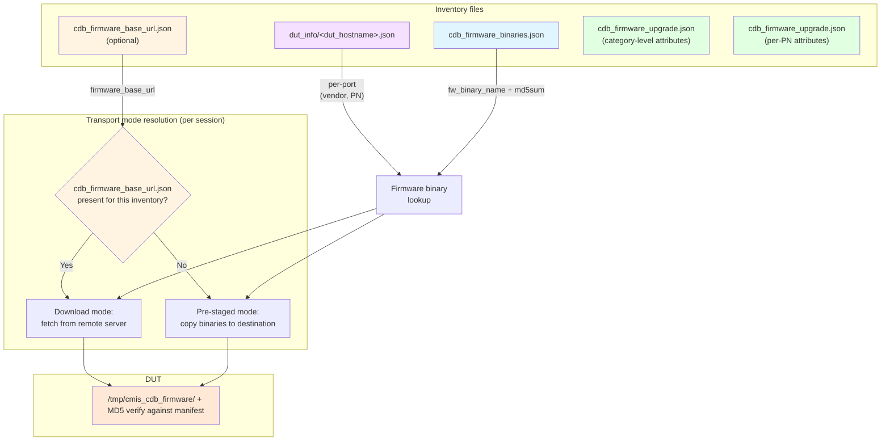

# CDB Firmware Upgrade Flow

## Inventory Files and Firmware Staging Flow

## Related documents

- See [CDB Firmware Upgrade Test Plan](../cdb_fw_upgrade_test_plan.md) for detailed attributes, file formats, and test cases.