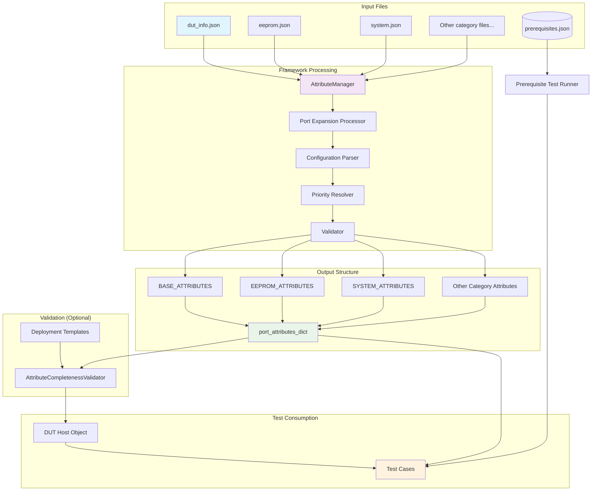
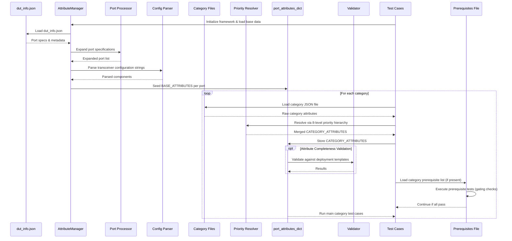

# Data Flow Architecture Diagram

## Overall System Architecture



## Detailed Processing Flow



## Data Transformation Examples

### Step 1: Port Expansion

```text
Input (dut_info.json):
{
  "dut_name_1": {
    "Ethernet4:7": {
      "vendor_name": "ACME Corp.",
      "transceiver_configuration": "AOC-100-QSFPDD-2x100G_100G_SIDE-0xFF-0xFF"
    }
  }
}

After Port Expansion:
- Ethernet4: same attributes
- Ethernet5: same attributes  
- Ethernet6: same attributes
```

### Step 2: Configuration Parsing

```text
Input: "AOC-100-QSFPDD-2x100G_100G_SIDE-0xFF-0xFF"

Parsed Components:
- cable_type: "AOC"
- speed_gbps: 100
- form_factor: "QSFPDD"
- deployment: "2x100G_100G_SIDE"
- media_lane_mask: "0xFF"
- host_lane_mask: "0xFF"
- media_lane_count: 8
- host_lane_count: 8
```

### Step 3: Attribute Merging

```text
For Ethernet4 EEPROM_ATTRIBUTES:

Priority Resolution:
1. defaults.dual_bank_supported = false
2. deployment_configurations.2x100G_100G_SIDE.dual_bank_supported = true  ← WINS
3. vendor.ACME_CORP.defaults.dual_bank_supported = false
4. No higher priority overrides found

Result: dual_bank_supported = true
```

### Step 4: Final Structure

```python
port_attributes_dict = {
    "Ethernet4": {
        "BASE_ATTRIBUTES": {
            "vendor_name": "ACME Corp.",
            "cable_type": "AOC",
            "speed_gbps": 100,
            "deployment": "2x100G_100G_SIDE",
            # ... other parsed fields
        },
        "EEPROM_ATTRIBUTES": {
            "dual_bank_supported": true,
            "vdm_supported": false,
            # ... other resolved attributes
        },
        "SYSTEM_ATTRIBUTES": {
            # ... resolved system attributes
        }
    }
    # ... other ports
}
```

## Key Benefits

1. **Separation of Concerns**: Base hardware data vs. test-specific attributes
2. **Modular Design**: Each category file is independent
3. **Flexible Overrides**: 8-level priority system handles all scenarios
4. **Efficient Grouping**: Port ranges reduce configuration overhead
5. **Deployment Patterns**: Shared attributes for similar deployments
6. **Extensible**: Easy to add new categories and attributes