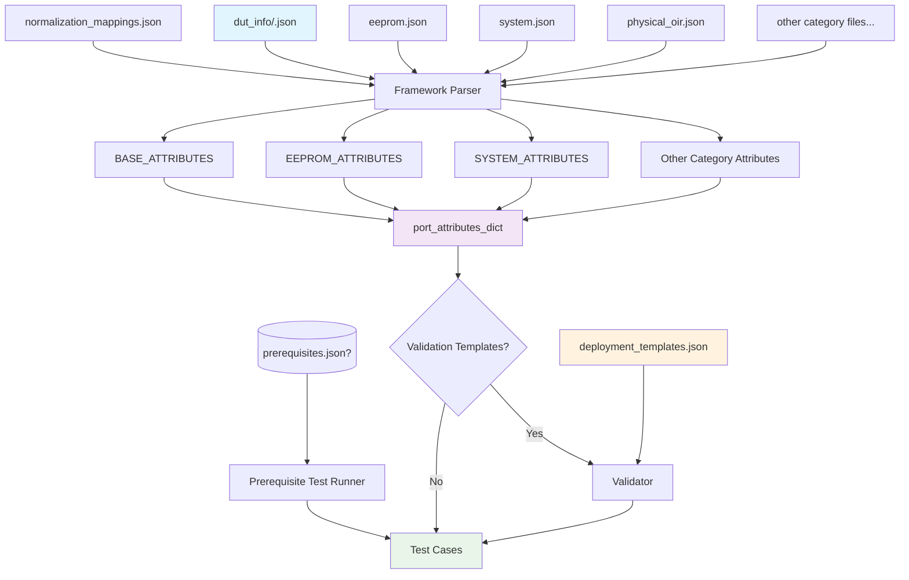

# File Organization Diagram

## Data and Configuration File Structure

```text
ansible/files/transceiver/inventory/
├── normalization_mappings.json             # Shared vendor/PN normalization rules
│
├── dut_info/                               # Per-DUT transceiver metadata
│   ├── sonic-device-01.json                # DUT 1 port configurations
│   ├── sonic-device-02.json                # DUT 2 port configurations
│   └── ...                                 # Additional DUT files
│
├── attributes/                             # Test category attribute files
│   ├── eeprom.json                         # EEPROM test attributes
│   ├── system.json                         # System test attributes
│   ├── physical_oir.json                   # Physical OIR attributes
│   ├── remote_reseat.json                  # Remote reseat attributes
│   ├── cdb_fw_upgrade.json                 # CDB FW upgrade attributes
│   ├── dom.json                            # DOM test attributes
│   ├── vdm.json                            # VDM test attributes
│   └── pm.json                             # PM test attributes
│
├── prerequisites.json                      # OPTIONAL grouped prerequisite tests (pre-category gating)
│
└── templates/                              # Validation templates (optional)
    └── deployment_templates.json           # Attribute completeness validation
```

## File Relationships



## Key Concepts

- **normalization_mappings.json**: Shared normalization rules for vendor names and part numbers across all DUTs
- **dut_info/<dut_hostname>.json**: Per-DUT port-specific transceiver configurations; improves scalability and independent management
- **Category files**: Modular test-specific attribute definitions for each type of transceiver
- **Templates**: Optional validation templates for attribute completeness checking
- **port_attributes_dict**: Final merged data structure used by test cases
- **prerequisites.json (optional)**: Grouped list of tests executed before each category's tests
- **BASE_ATTRIBUTES**: Core transceiver info parsed from per-DUT files
- **Category-specific attributes**: Merged from respective JSON files using priority hierarchy
- **Validation**: Optional post-processing step to ensure attribute completeness

## Python Test Code Structure

```text
tests/transceiver/
├── __init__.py
├── conftest.py                              # Shared pytest fixtures, uses infra and helper modules
│
├── infra/                                   # Infrastructure modules for attribute and DUT management and parsing
│   ├── __init__.py
│   ├── attribute_manager.py                 # Attribute loading and resolution
│   ├── config_parser.py                     # Configuration file parsing
│   ├── dut_info_loader.py                   # DUT information loading
│   ├── exceptions.py                        # Custom exceptions
│   ├── paths.py                             # Path constants
│   ├── port_spec.py                         # Port specification handling
│   ├── template_validator.py                # Template validation
│   ├── transceiver_attribute_infra_test.py  # Infra unit tests
│   └── utils.py                             # General utilities
│
├── helpers/                                 # Test-specific helper modules
│   ├── __init__.py
│   ├── verification.py                      # Standard Port Recovery and Verification Procedure
│   ├── state_management.py                  # State Preservation and Restoration helpers
│   ├── db_helpers.py                        # CONFIG_DB, STATE_DB, APPL_DB query wrappers
│   └── cli_helpers.py                       # CLI command wrappers (sfputil, config interface)
│
├── eeprom/
│   ├── __init__.py
│   ├── conftest.py                          # EEPROM-specific fixtures
│   ├── test_presence.py                     # TC 1-2: Transceiver presence verification
│   ├── test_eeprom_content.py               # TC 3-4: Basic EEPROM content verification
│   ├── test_firmware.py                     # TC 5: Firmware version validation
│   ├── test_hexdump.py                      # TC 6-7: Hexdump and read-eeprom verification
│   ├── test_error_handling.py               # TC 8: Error handling - Missing transceiver
│   ├── test_breakout_serial.py              # TC 9: Serial number pattern validation
│   ├── test_port_config.py                  # TC 10-11: Port speed and FEC validation
│   └── cmis/
│       ├── __init__.py
│       └── test_cdb_background_mode.py      # CMIS TC 1-2: CDB background mode tests
│
├── dom/
│   ├── __init__.py
│   ├── conftest.py                          # DOM-specific fixtures
│   ├── test_dom_availability.py             # Basic TC 1: DOM data availability
│   ├── test_dom_operational_range.py        # Basic TC 2: DOM sensor operational range
│   ├── test_dom_threshold.py                # Basic TC 3: DOM threshold validation
│   ├── test_dom_consistency.py              # Basic TC 4: DOM data consistency
│   └── advanced/
│       ├── __init__.py
│       ├── test_dom_interface_state.py      # Advanced TC 1: DOM during interface state changes
│       └── test_dom_polling.py              # Advanced TC 2: DOM polling and data freshness
│
├── system/
│   ├── __init__.py
│   ├── conftest.py                          # System-specific fixtures
│   │
│   ├── link_behavior/
│   │   ├── __init__.py
│   │   ├── test_port_link_toggle.py            # TC 1-2: Port link toggle tests
│   │
│   ├── process_restart/
│   │   ├── __init__.py
│   │   ├── test_xcvrd_restart.py            # TC 1-3: xcvrd restart tests
│   │   ├── test_pmon_restart.py             # TC 4: pmon docker restart
│   │   ├── test_swss_restart.py             # TC 5: swss docker restart
│   │   └── test_syncd_restart.py            # TC 6: syncd process restart
│   │
│   ├── recovery/
│   │   ├── __init__.py
│   │   ├── test_config_reload.py            # TC 1: Config reload impact
│   │   ├── test_cold_reboot.py              # TC 2: Cold reboot link recovery
│   │   ├── test_warm_reboot.py              # TC 3: Warm reboot link recovery
│   │   ├── test_fast_reboot.py              # TC 4: Fast reboot link recovery
│   │   └── test_power_cycle.py              # TC 5: Power cycle link recovery
│   │
│   ├── event_handling/
│   │   ├── __init__.py
│   │   ├── test_transceiver_reset.py        # TC 1: Transceiver reset validation
│   │   ├── test_low_power_mode.py           # TC 2-3: Low power mode tests
│   │   ├── test_tx_disable.py               # TC 4: Tx disable DataPath validation
│   │   ├── test_si_settings.py              # TC 5-6: Optics and Media SI settings
│   │   └── test_ccmis_tuning.py             # TC 7-8: C-CMIS frequency/tx power
│   │
│   ├── diagnostics/
│   │   ├── __init__.py
│   │   └── test_loopback.py                 # TC 1: Transceiver loopback validation
│   │
│   └── stress/
│       ├── __init__.py
│       ├── test_port_toggle_stress.py       # TC 1-2: Port toggle stress tests
│       ├── test_reboot_stress.py            # TC 3-5: Reboot stress tests
│       ├── test_link_stability.py           # TC 6: Link stability monitoring
│       └── test_power_cycle_stress.py       # TC 7: Power cycle stress test
```

## Module Relationship

```text
┌────────────────────────────────────────────────────────────────────────┐
│                            Test Files                                  │
│                  (eeprom/, dom/, system/)                              │
└──────────────────────────────┬─────────────────────────────────────────┘
                               │ uses
                               ▼
┌────────────────────────────────────────────────────────────────────────┐
│                             helpers/                                   │
│   verification.py, state_management.py, db_helpers.py, cli_helpers.py  │
└──────────────────────────────┬─────────────────────────────────────────┘
                               │ uses
                               ▼
┌────────────────────────────────────────────────────────────────────────┐
│                              infra/                                    │
│   attribute_manager.py, config_parser.py, dut_info_loader.py,          │
│   port_spec.py, utils.py, exceptions.py, paths.py                      │
└──────────────────────────────┬─────────────────────────────────────────┘
                               │ reads
                               ▼
┌────────────────────────────────────────────────────────────────────────┐
│                    Data Configuration Files                            │
│   ansible/files/transceiver/inventory/                                 │
│   ├── normalization_mappings.json                                      │
│   ├── dut_info/<hostname>.json                                         │
│   └── attributes/{eeprom,dom,system, etc}.json                         │
└────────────────────────────────────────────────────────────────────────┘
```
