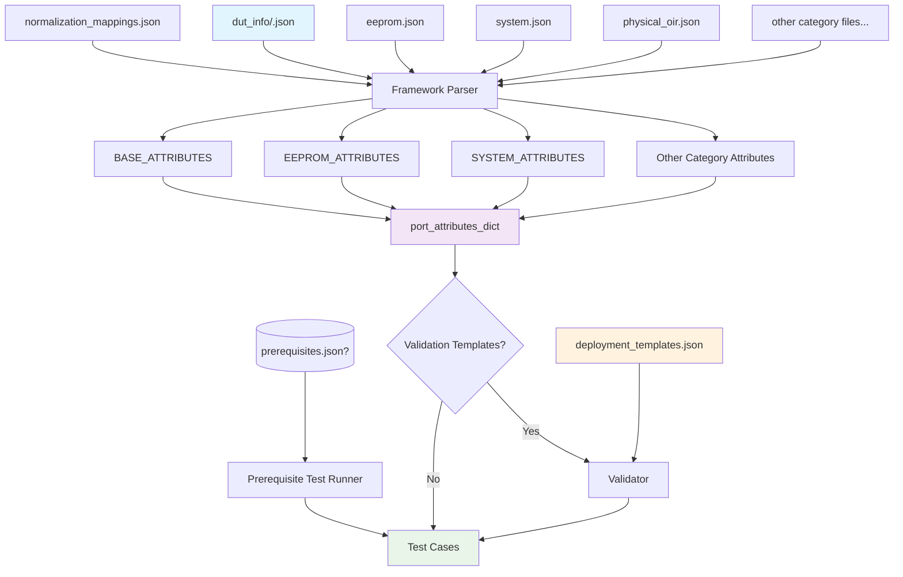

# File Organization Diagram

## Transceiver Test Framework File Structure

```text
ansible/files/transceiver/inventory/
├── normalization_mappings.json             # Shared vendor/PN normalization rules
│
├── dut_info/                               # Per-DUT transceiver metadata
│   ├── sonic-device-01.json                # DUT 1 port configurations
│   ├── sonic-device-02.json                # DUT 2 port configurations
│   └── ...                                 # Additional DUT files
│
├── attributes/                             # Test category attribute files
│   ├── eeprom.json                         # EEPROM test attributes
│   ├── system.json                         # System test attributes
│   ├── physical_oir.json                   # Physical OIR attributes
│   ├── remote_reseat.json                  # Remote reseat attributes
│   ├── cdb_fw_upgrade.json                 # CDB FW upgrade attributes
│   ├── dom.json                            # DOM test attributes
│   ├── vdm.json                            # VDM test attributes
│   └── pm.json                             # PM test attributes
│
├── prerequisites.json                      # OPTIONAL grouped prerequisite tests (pre-category gating)
│
└── templates/                              # Validation templates (optional)
    └── deployment_templates.json           # Attribute completeness validation
```

## File Relationships



## Key Concepts

- **normalization_mappings.json**: Shared normalization rules for vendor names and part numbers across all DUTs
- **dut_info/<dut_hostname>.json**: Per-DUT port-specific transceiver configurations; improves scalability and independent management
- **Category files**: Modular test-specific attribute definitions for each type of transceiver
- **Templates**: Optional validation templates for attribute completeness checking
- **port_attributes_dict**: Final merged data structure used by test cases
- **prerequisites.json (optional)**: Grouped list of tests executed before each category's tests
- **BASE_ATTRIBUTES**: Core transceiver info parsed from per-DUT files
- **Category-specific attributes**: Merged from respective JSON files using priority hierarchy
- **Validation**: Optional post-processing step to ensure attribute completeness
