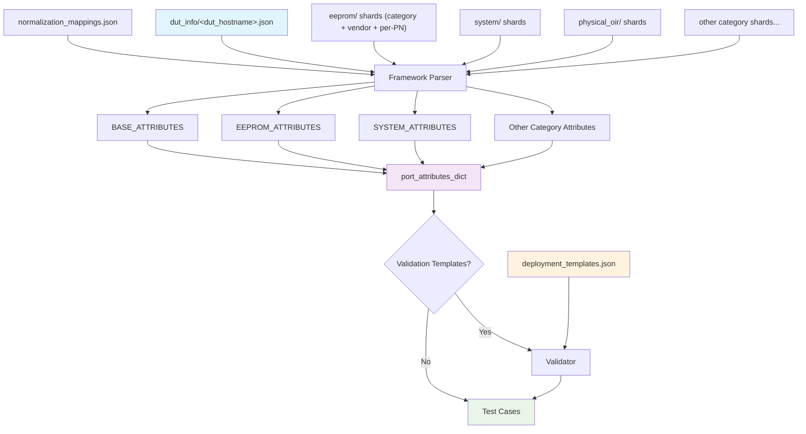

# File Organization Diagram

## Data and Configuration File Structure

```text
ansible/files/transceiver/inventory/
├── normalization_mappings.json             # Shared vendor/PN normalization rules
│
├── dut_info/                               # Per-DUT transceiver metadata
│   ├── sonic-device-01.json                # DUT 1 port configurations
│   ├── sonic-device-02.json                # DUT 2 port configurations
│   └── ...                                 # Additional DUT files
│
├── attributes/                             # Test category attribute files (sharded)
│   ├── eeprom/                             # EEPROM category
│   │   ├── eeprom.json                     # Category-level shard (mandatory/defaults/dut/deployment_configurations)
│   │   ├── platforms/                       # Platform/HWSKU shards (optional)
│   │   │   └── <PLATFORM>/                 # One directory per platform
│   │   │       ├── eeprom.json             # Platform-level shard (platform.<PLATFORM> only)
│   │   │       └── hwskus/
│   │   │           └── <HWSKU>.json        # HWSKU-level shard (hwsku.<HWSKU> only)
│   │   └── transceivers/
│   │       └── vendors/
│   │           ├── ACME_CORP/                  # One directory per normalized vendor name
│   │           │   ├── eeprom.json             # Vendor-level shard (vendors.<V>.defaults only)
│   │           │   └── part_numbers/
│   │           │       └── QSFP-2X100G-AOC-GENERIC_2_ENDM/   # One directory per normalized PN
│   │           │           └── eeprom.json     # Per-PN shard
│   │           └── NORTHSTAR_OPTICS/
│   │               ├── eeprom.json
│   │               └── part_numbers/
│   │                   └── QSFP-200G-LR4/
│   │                       └── eeprom.json
│   ├── system/                             # Same shape as eeprom/
│   ├── physical_oir/
│   ├── remote_reseat/
│   ├── cdb_firmware_upgrade/
│   ├── dom/
│   ├── vdm/
│   ├── pm/
│   └── port_config/
│
└── templates/                              # Validation templates (optional)
    └── deployment_templates.json           # Attribute completeness validation
```

## File Relationships


```mermaid
graph TD
    NM[normalization_mappings.json] --> B[Framework Parser]
    A["dut_info/&lt;dut_hostname&gt;.json"] --> B
    C["eeprom/ shards (category + vendor + per-PN)"] --> B
    D["system/ shards"] --> B
    E["physical_oir/ shards"] --> B
    F[other category shards...] --> B

    B --> H[BASE_ATTRIBUTES]
    B --> I[EEPROM_ATTRIBUTES]
    B --> J[SYSTEM_ATTRIBUTES]
    B --> K[Other Category Attributes]

    H --> G[port_attributes_dict]
    I --> G
    J --> G
    K --> G

    G --> M{Validation Templates?}
    M -->|Yes| N[Validator]
    M -->|No| L[Test Cases]
    N --> L
    O[deployment_templates.json] --> N

    style A fill:#e1f5fe
    style G fill:#f3e5f5
    style L fill:#e8f5e8
    style O fill:#fff3e0
```

## Key Concepts

- **normalization_mappings.json**: Shared normalization rules for vendor names and part numbers across all DUTs
- **dut_info/<dut_hostname>.json**: Per-DUT port-specific transceiver configurations; improves scalability and independent management
- **Category shards**: Modular test-specific attribute definitions, sharded by ownership level (category / platform / platform+HWSKU / vendor / per-PN) inside each `<category>/` directory. The loader deep-merges all shards in a category into one in-memory tree before priority resolution. DUT-scope overrides remain a `dut.<DUT_NAME>` map in the category-level shard.
- **Templates**: Optional validation templates for attribute completeness checking
- **port_attributes_dict**: Final merged data structure used by test cases
- **BASE_ATTRIBUTES**: Core transceiver info parsed from per-DUT files
- **Category-specific attributes**: Merged from respective JSON files using priority hierarchy
- **Validation**: Optional post-processing step to ensure attribute completeness

## Python Test Code Structure

```text
tests/transceiver/
├── __init__.py
├── conftest.py                              # Top-level fixtures:
│                                            #   - Session-scoped prerequisite fixtures (presence, gold FW, links up)
│                                            #     that call common/prerequisites.py (run once per session)
│                                            #   - Autouse per-test health check fixture that calls
│                                            #     common/health_checks.py (PID, logs, core files)
│
├── attribute_parser/                        # Attribute loading, normalization, priority resolution, and DUT management
│   ├── __init__.py
│   ├── attribute_manager.py                 # Attribute loading and resolution
│   ├── config_parser.py                     # Configuration file parsing
│   ├── dut_info_loader.py                   # DUT information loading
│   ├── exceptions.py                        # Custom exceptions
│   ├── paths.py                             # Path constants
│   ├── port_spec.py                         # Port specification handling
│   ├── template_validator.py                # Template validation
│   ├── transceiver_attribute_infra_test.py  # Infra unit tests
│   └── utils.py                             # General utilities
│
├── common/                                  # Shared modules across all transceiver test categories
│   ├── __init__.py
│   ├── health_checks.py                     # Per-test health: PID baseline/verify, log baseline/scan, core file check
│   ├── prerequisites.py                     # Cross-category prerequisite logic: presence check, gold FW check,
│   │                                        #   link-up check — called by conftest.py session fixtures
│   │                                        #   AND by the owning test category's reportable test cases
│   ├── verification.py                      # Standard Port Recovery and Verification Procedure
│   ├── state_management.py                  # State Preservation and Restoration helpers
│   ├── db_helpers.py                        # CONFIG_DB, STATE_DB, APPL_DB query wrappers
│   └── cli_helpers.py                       # CLI command wrappers (sfputil, config interface)
│
├── eeprom/
│   ├── __init__.py
│   ├── conftest.py                          # EEPROM-specific fixtures; autouse fixture requests
│                                            #   links_verified from top-level conftest.py.
│                                            #   (presence and gold-FW are EEPROM's own reportable
│                                            #   tests, so those gates are intentionally not consumed.)
│   ├── test_presence.py                     # TC 1-2: Transceiver presence verification (reportable test case;
│   │                                        #   calls common/prerequisites.py::check_presence_sfputil)
│   ├── test_eeprom_content.py               # TC 3-4: Basic EEPROM content verification
│   ├── test_hexdump.py                      # TC 5-7: Hexdump and read-eeprom verification
│   ├── test_error_handling.py               # TC 8: Error handling - Missing transceiver
│   ├── test_breakout_serial.py              # TC 9: Serial number pattern validation
│   ├── test_vdm_consistency.py              # TC 10: VDM support flag consistency
│   └── cmis/
│       ├── __init__.py
│       └── test_cdb_background_mode.py      # CMIS TC 1-2: CDB background mode tests
│
├── dom/
│   ├── __init__.py
│   ├── conftest.py                          # DOM-specific fixtures; autouse fixture requests
│   │                                        #   presence_verified, gold_fw_verified, links_verified
│   │                                        #   from top-level conftest.py; also adds DOM-specific
│   │                                        #   per-test setup (data freshness, baseline snapshot)
│   ├── test_dom_availability.py             # Basic TC 1: DOM data availability
│   ├── test_dom_operational_range.py        # Basic TC 2: DOM sensor operational range
│   ├── test_dom_threshold.py                # Basic TC 3: DOM threshold validation
│   ├── test_dom_consistency.py              # Basic TC 4: DOM data consistency
│   └── advanced/
│       ├── __init__.py
│       ├── test_dom_interface_state.py      # Advanced TC 1: DOM during interface state changes
│       ├── test_dom_polling.py              # Advanced TC 2: DOM polling and data freshness
│       └── test_dom_telemetry_profile.py    # Advanced TC 3: Telemetry update interval profiling
│
├── system/
│   ├── __init__.py
│   ├── conftest.py                          # System-specific fixtures; autouse fixture requests
│   │                                        #   presence_verified, gold_fw_verified, links_verified
│   │                                        #   from top-level conftest.py; also adds system-specific
│   │                                        #   per-test setup (link flap baseline)
│   │
│   ├── link_behavior/
│   │   ├── __init__.py
│   │   └── test_port_link_toggle.py         # TC 1-2: Port link toggle tests
│   │
│   ├── process_restart/
│   │   ├── __init__.py
│   │   ├── conftest.py                      # Overrides per-test health check: expects PID changes
│   │   ├── test_xcvrd_restart.py            # TC 1-3: xcvrd restart tests
│   │   ├── test_pmon_restart.py             # TC 4: pmon docker restart
│   │   ├── test_swss_restart.py             # TC 5: swss docker restart
│   │   └── test_syncd_restart.py            # TC 6: syncd process restart
│   │
│   ├── recovery/
│   │   ├── __init__.py
│   │   ├── conftest.py                      # Overrides per-test health check: re-establishes baselines
│   │   │                                    #   after reboot since PID/log baselines are invalidated
│   │   ├── test_config_reload.py            # TC 1: Config reload impact
│   │   ├── test_cold_reboot.py              # TC 2: Cold reboot link recovery
│   │   ├── test_warm_reboot.py              # TC 3: Warm reboot link recovery
│   │   ├── test_fast_reboot.py              # TC 4: Fast reboot link recovery
│   │   └── test_power_cycle.py              # TC 5: Power cycle link recovery
│   │
│   ├── event_handling/
│   │   ├── __init__.py
│   │   ├── test_transceiver_reset.py        # TC 1: Transceiver reset validation
│   │   ├── test_low_power_mode.py           # TC 2-3: Low power mode tests
│   │   ├── test_tx_disable.py               # TC 4: Tx disable DataPath validation
│   │   └── test_ccmis_tuning.py             # TC 5-6: C-CMIS frequency/tx power
│   │
│   ├── diagnostics/
│   │   ├── __init__.py
│   │   ├── test_loopback.py                 # TC 1: Transceiver loopback validation
│   │   ├── test_optics_si_settings.py       # TC 2: Optics SI settings validation
│   │   └── test_media_si_settings.py        # TC 3: Media SI settings validation
│   │
│   └── stress/
│       ├── __init__.py
│       ├── test_port_toggle_stress.py       # TC 1-2: Port toggle stress tests
│       ├── test_reboot_stress.py            # TC 3-5: Reboot stress tests
│       ├── test_link_stability.py           # TC 6: Link stability monitoring
│       └── test_power_cycle_stress.py       # TC 7: Power cycle stress test
│
├── cdb_firmware_upgrade/
│   ├── __init__.py
│   ├── conftest.py                          # CDB firmware upgrade-specific fixtures; autouse fixture requests
│   │                                        #   presence_verified, links_verified from top-level conftest.py
│   │                                        #   (gold FW is CDB firmware upgrade's own reportable test, so that gate is
│   │                                        #    intentionally not consumed.)
│   └── test_fw_upgrade.py                   # CDB firmware upgrade test cases; includes gold FW check
│                                            #   (reportable test case; calls common/prerequisites.py::check_gold_firmware)
│
├── port_config/
│   ├── __init__.py
│   ├── conftest.py                          # Port config-specific fixtures
│   └── test_port_config.py                  # Port speed, FEC, MTU, autoneg, DOM polling, subport
│
├── vdm/
│   ├── __init__.py
│   ├── conftest.py                          # VDM-specific fixtures
│   └── test_vdm.py                          # VDM specific test cases
│
└── pm/
    ├── __init__.py
    ├── conftest.py                          # PM-specific fixtures
    └── test_pm.py                           # PM specific test cases
```

## Module Relationship (Listed only few test categories for brevity)

```text
┌────────────────────────────────────────────────────────────────────────┐
│                        conftest.py (top-level)                         │
│   Session fixtures: presence_verified, gold_fw_verified, links_verified│
│   Autouse per-test: health_checks (PID, logs, cores)                   │
└──────────┬─────────────────────────────┬───────────────────────────────┘
           │ calls                       │ provides fixtures to
           ▼                             ▼
┌───────────────────────────┐  ┌──────────────────────────────────────────┐
│       common/             │  │           Category conftest.py           │
│  health_checks.py         │  │  eeprom/conftest.py  — requests links_   │
│  prerequisites.py         │  │                        verified only     │
│  verification.py          │  │                        (TC 1-2 own       │
│                           │  │                        presence/gold_fw) │
│  state_management.py      │  │  dom/conftest.py     — requests presence,│
│  db_helpers.py            │  │                        gold_fw, links    │
│  cli_helpers.py           │  │  system/conftest.py  — requests presence,│
│                           │  │                        gold_fw, links    │
│                           │  │  cdb_fw/conftest.py  — requests presence,│
│                           │  │                        links             │
└──────────┬────────────────┘  └──────────────────┬───────────────────────┘
           │ uses                                 │ uses
           ▼                                      ▼
┌────────────────────────────────────────────────────────────────────────┐
│                            Test Files                                  │
│  eeprom/test_presence.py  — reportable TC; calls prerequisites.py      │
│  cdb_fw/test_fw_upgrade.py — reportable TC; calls prerequisites.py     │
│  system/link_behavior/     — reportable TC; calls prerequisites.py     │
│  dom/test_dom_*.py         — pure tests; prerequisites gated by fixture│
└──────────────────────────────┬─────────────────────────────────────────┘
                               │ uses
                               ▼
┌────────────────────────────────────────────────────────────────────────┐
│                         attribute_parser/                              │
│   attribute_manager.py, config_parser.py, dut_info_loader.py,          │
│   port_spec.py, utils.py, exceptions.py, paths.py                      │
└──────────────────────────────┬─────────────────────────────────────────┘
                               │ reads
                               ▼
┌────────────────────────────────────────────────────────────────────────┐
│                    Data Configuration Files                            │
│   ansible/files/transceiver/inventory/                                 │
│   ├── normalization_mappings.json                                      │
│   ├── dut_info/<hostname>.json                                         │
│   └── attributes/<category>/{<category>.json, <VENDOR>/{<category>.json,<PN>.json}}
└────────────────────────────────────────────────────────────────────────┘
```
