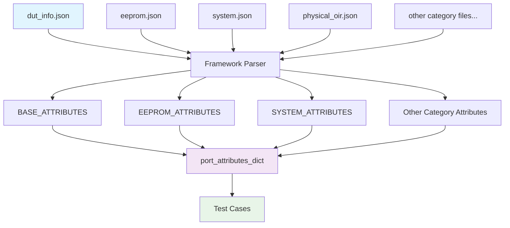

# File Organization Diagram

## Transceiver Test Framework File Structure

```text
ansible/files/transceiver/inventory/
├── dut_info.json                           # Core transceiver metadata
│   ├── normalization_mappings              # Vendor/PN normalization rules
│   └── dut_name_1/                         # Per-DUT configurations
│       └── Port specifications             # Various formats (ranges, lists)
│           ├── vendor_name                 # Raw vendor name
│           ├── vendor_pn                   # Raw part number  
│           └── transceiver_configuration   # 6-component format
│
└── attributes/                             # Test category attribute files
    ├── eeprom.json                         # EEPROM test attributes
    ├── system.json                         # System test attributes
    ├── physical_oir.json                   # Physical OIR attributes
    ├── remote_reseat.json                  # Remote reseat attributes
    ├── cdb_fw_upgrade.json                 # CDB FW upgrade attributes
    ├── dom.json                            # DOM test attributes
    ├── vdm.json                            # VDM test attributes
    └── pm.json                             # PM test attributes
```

## File Relationships


```mermaid
graph TD
    A[dut_info.json] --> B[Framework Parser]
    C[eeprom.json] --> B
    D[system.json] --> B
    E[physical_oir.json] --> B
    F[other category files...] --> B
    
    B --> H[BASE_ATTRIBUTES]
    B --> I[EEPROM_ATTRIBUTES]
    B --> J[SYSTEM_ATTRIBUTES]
    B --> K[Other Category Attributes]
    
    H --> G[port_attributes_dict]
    I --> G
    J --> G
    K --> G
    
    G --> L[Test Cases]
    
    style A fill:#e1f5fe
    style G fill:#f3e5f5
    style L fill:#e8f5e8
```

## Key Concepts

- **dut_info.json**: Single source of truth for transceiver hardware metadata
- **Category files**: Modular test-specific attribute definitions for each type of transceiver
- **port_attributes_dict**: Final merged data structure used by test cases
- **BASE_ATTRIBUTES**: Core transceiver info parsed from dut_info.json
- **Category-specific attributes**: Merged from respective JSON files using priority hierarchy