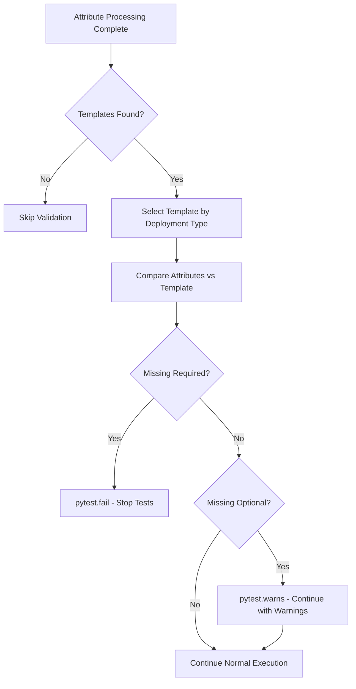
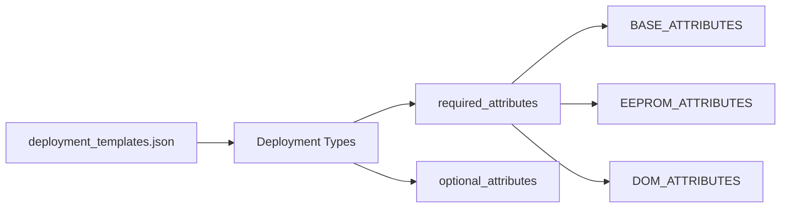

# Attribute Completeness Validation Flow

Visual overview of the validation process for ensuring comprehensive attribute coverage during transceiver qualification.

## Process Flow

## Template Structure

## Integration Points

- **Template Selection**: Uses `deployment` field from `BASE_ATTRIBUTES`
- **Validation**: Compares actual vs template requirements per category
- **Pytest Control**: Reports with INFO/WARNING/ERROR levels and execution control