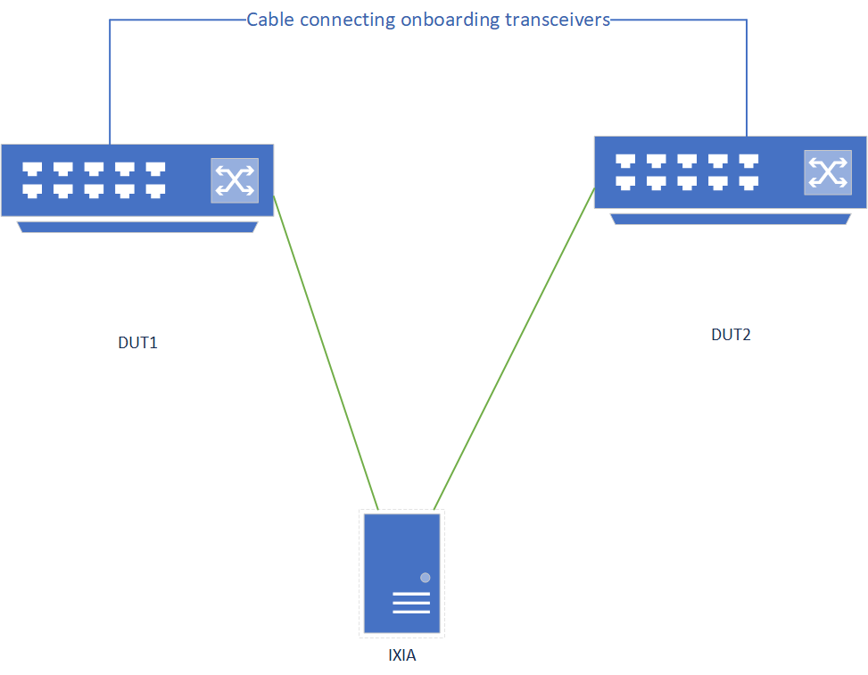

# Transceiver Onboarding Test Plan

### Scope

The scope of this test plan is to layout a framework of automated tests to ensure feature parity of new transceivers being onboarded to SONiC with the existing feature support.

The below features/properties of the transceiver are to be tested in this test plan.

- Verify link behavior with shut/no shut commands
- Verify link behavior with process crash scenarios
- Verify transceiver specific fields (such as Vendor name, part number and serial number) have expected value using CLI command.
- Check the fimware version is returned correctly and is one of the acceptable values suggested by vendor. The major and minor number can be qualified by a regex match with a predefined pattern
- Verify DOM data is read correctly and is in acceptable range.
- Check if any unexpected flags (such as LOS, LOL, DOM related warnings) are not set
- Ensure firmware download, upgrade and downgrade works fine.
- Verify that number of frames received is equal to number of frames sent in both northbound/southbound traffic flows for a predefined set period of time.
- Verify traffic at line rate

These are some of transceiver specific capabilities which should be tested if available.

- Verify that the transceiver is able to be configured to a different frequency and tx power
- Verify that the transceiver is able to be configured to a different FEC mode
- For breakout cable, ensure that only the specific lanes get affected upon issuing shut/no shut command.


### Testbed Setup

The testcases which do not require traffic testing can have 2 ports with the oboarding transceiver and should be connected with a cable.
Alternatively, 2 ports with the onboarding transceiver can be connected across 2 different DUTs as well.

For traffic related testcases, traffic from a different source (eg - IXIA) is required and 2 DUTs with both having 1 port of the onboarding transceiver should be connected with a cable.
2 ports of IXIA are connected to 1 port of each DUT and the traffic is sent from one port and received on the other port. Also, the traffic is expected to be forwarded via the module being onboarded (On each DUT, the port connected to IXIA and the port having the onboarding transceiver should be in the same vlan to validate L2 traffic).


The full testbed setup is shown below:



### CLI commands:

Issuing shutdown command for a port
```
sudo config interface shutdown <port>
```

Issuing startup command for a port
```
sudo config interface startup <port>
```

Check link status of a port
```
show interface status <port>
```

Check if CMIS initialization is successful in 1st attempt
```
1. Ensure the o/p "CMIS: <port>: READY" is seen upon executing the below command
sudo cat /var/log/syslog | grep READY

2. To ensure CMIS initialization is successful in 1st attempt, execute the below command and ensure not o/p is seen
cat syslog | grep $lport | grep DP_ACTIVATION | grep -v retries=0
```

Restart xcvrd

```
docker exec pmon supervisorctl restart xcvrd
```

Ensure from syslogs that xcvrd has restarted (below command should return the o/p being searched for)

```
sudo cat /var/log/syslog | grep "SfpStateUpdateTask: Posted all port DOM/SFP info to DB"
```

Ensure from syslogs that no link flap was observed for any ports (below command should return no o/p)

```
sudo cat /var/log/syslog | grep updatePort
```

Restart pmon

```
sudo systemctl restart pmon
```

Restart swss

```
sudo systemctl restart swss
```

Restart syncd

```
sudo systemctl restart syncd
```

config reload

```
sudo config reload
```

Cold reboot

```
sudo reboot -f
```

Warm reboot

```
sudo warm-reboot
```

sfputil reset

```
CLI
sudo sfputil reset <port>
```

Check if the port is in low power mode

```
sudo sfputil show lpmode -p <port>
```

Put port in low power mode

```
sudo sfputil lpmode on <port>
```

Check lpmode status of a port

```
sudo sfputil show lpmode -p <port>
```

Check if transceiver is present

```
sudo sfputil show presence -p <port>
```

Dump EEPROM of the module

```
sudo sfputil show eeprom -p <port>
```

Dump EEPROM hexdump of the module

```
sudo sfputil show eeprom-hexdump -p <port>
```

Check transceiver specific information through CLI relying on redis-db

```
show int transceiver info <port>
```

Check DOM data through CLI relying on redis-db

```
show int transceiver dom <port>
```

Check transceiver status through CLI relying on redis-db

```
show int transceiver status <port>
```

Check PM data through CLI relying on redis-db

```
show int transceiver pm <port>
```

Check FW version of the module

```
sudo sfputil show fwversion <port>
```

Download firmware

```
sudo sfputil download <port> <fwfile>
```

Run firmware

```
sudo sfputil firmware run <port>
```

Commit firmware

```
sudo sfputil firmware commit <port>
```

## Test Cases

1.  Tests not involving traffic

    These tests don't require traffic and are standalone tests which can run on a DUT which has the transceiver plugged in 2 ports and are connected with a cable (1 port on 2 different DUTs can also be used for these tests).

    Breakout cable related assumption for the below tests
    - The expectation is to connect all sides of the cable to the DUT and test each port individually.
    - For tests related to link toggling for a subport, it is mandatory to ensure that the link status of the neighboring subports is not affected.

    1.1 Link related tests


    | Step | Goal | Expected results |
    |-|-|-|
    | Issue CLI command to shutdown a port | Link status validation with CLI config | Ensure both local and remote sides show link down |
    | Issue CLI command to startup a port | Link status validation with CLI config | Ensure both local and remote sides show link up. For CMIS supported transceivers, ensure port is initialized in the first attempt  |
    | In a loop, issue startup/shutdown command 100 times  | Stress test to validate link status with CLI config | Ensure link status is up/down when the relevant startup/shutdown command is issued |
    | Restart xcvrd | Link stability | Ensure xcvrd has restarted and link doesn't flap for the interested ports |
    | Restart pmon | Module re-initialization and link up after process crash | Ensure xcvrd has restarted and the expected port links up again |
    | Restart swss | Module re-initialization and link up after process crash | Ensure xcvrd has restarted and the expected port links up again |
    | Restart syncd | Module re-initialization and link up after process crash | Ensure xcvrd has restarted and the expected port links up again |
    | Config reload | Module re-initialization and link up | Ensure xcvrd has restarted and the expected port links up again |
    | Cold reboot | Module re-initialization and link up after device reboot | Ensure the expected port links up again |
    | Warm reboot | Link stability | Ensure xcvrd has restarted and link doesn't flap for the interested ports |

    1.2 sfputil command tests
    | Step | Goal | Expected results |
    |-|-|-|
    | Reset the module followed by issuing shutdown and then startup command | Module reset validation | Ensure both local and remote sides show link down after reset and the local port is in low power mode. The shutdown and startup commands are later issued to re-initialize the port and bring the link up |
    | Put module in low power mode followed by issuing shutdown and then startup command | Module low power mode validation | Ensure both local and remote sides show link down after reset and the local port is in low power mode. The shutdown and startup commands are later issued to re-initialize the port and bring the link up |
    | Verify if transceiver presence works with CLI | Module presence validation | Ensure module presence is detected |
    | Verify EEPROM of the module using CLI | Module specific fields validation from EEPROM | Ensure module specific fields such as Active Firmware Version, Vendor Date Code, Vendor OUI, Vendor PN, Vendor Rev and Vendor SN are inline with the expected values |
    | Verify EEPROM hexdump of the module using CLI | Module EEPROM hexdump validation | Ensure the o/p shows Lower Page (0h) and Upper Page (0h) for all 128 bytes on each page |
    | Verify firmware version of the module using CLI | Firmware version validation | Ensure the active and inactive FW version is inline with the expectation |

    1.3 sfpshow command tests
    | Step | Goal | Expected results |
    |-|-|-|
    | Verify transceiver specific information through CLI | Validate CLI relying on redis-db | Ensure module specific fields such as Active Firmware Version, Vendor Date Code, Vendor OUI, Vendor PN, Vendor Rev and Vendor SN are inline with the expected values |
    | Verify DOM data is read correctly and is in acceptable range | Validate CLI relying on redis-db | Ensure DOM data is read correctly and is in acceptable range |
    | Verify transceiver status | Validate CLI relying on redis-db | Ensure no faults are detected |

    1.4 Firmware related tests
    | Step | Goal | Expected results |
    |-|-|-|
    | Download invalid firmware | Firmware download validation | Ensure that the active and inactive FW versions do not change. Also, ensure no link flap is seen during this process |
    | Execute “reboot” or kill the process which is downloading the FW | Firmware download validation | Ensure that the active and inactive FW versions do not change. Also, ensure no link flap is seen during this process |
    | Download firmware which is valid | Firmware download validation | Look for “Firmware download complete success” message to confirm if the FW is downloaded successfully. Also, return code 0 will denote CLI executed successfully. The inactive firmware version should show the FW which was downloaded and also ensure no link flap is seen |
    | Execute module reset after firmware download | Firmware download validation | Ensure that the active and inactive FW versions do not change. Ensure link goes down after module reset is performed and then perform shutdown followed by startup to bring the link up |
    | Execute firmware run command | Firmware run validation | Look for “Firmware run in mode=1 success” message to confirm if the FW is successfully running. Also, return code 0 will denote CLI executed successfully. With the FW version dump CLI, ensure “Active Firmware” shows the new FW version |
    | Execute firmware commit command | Firmware commit validation | Look for “Firmware commit successful” message. Please do not proceed further if this message is not seen. Also, return code 0 will denote CLI executed successfully. With the FW version dump CLI, ensure “Committed Image” field is updated with the relevant bank. Also ensure no link flap is seen during this process |

2. Traffic tests

    These tests require traffic from a different source (eg - IXIA) and 2 DUTs with each having 1 port of the onboarding transceiver and should be connected with a cable.
    2 ports of IXIA are connected to 1 port of each DUT and the traffic is sent from one port and received on the other port. Also, the traffic is expected to be forwarded via the onboarding transceiver (On each DUT, the port connected to IXIA and the port having module should be in the same vlan to validate L2 traffic).

    | Step | Goal | Expected results |
    |-|-|-|
    | Traffic quantity validation | No packet loss | Verify the number of frames sent and received from/to IXIA is same |
    | Traffic line rate validation for a finite time | No packet loss | Verify the number of frames sent and received from/to IXIA is same. Also, ensure no error counters are populated |
