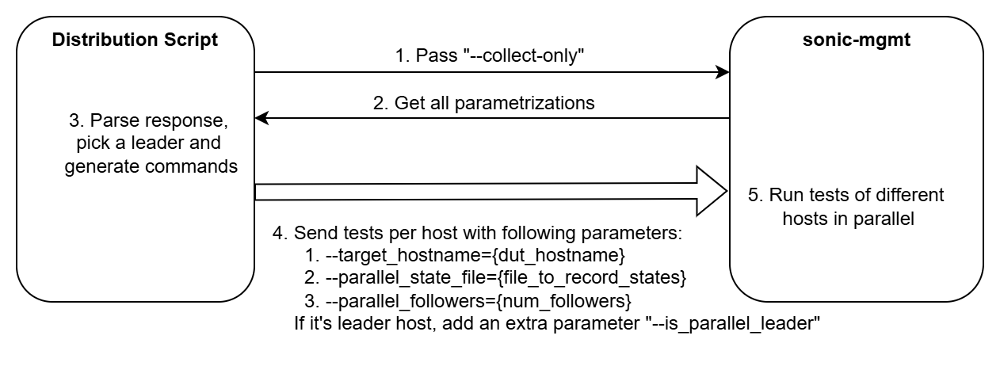

# Parallel Run Infra for sonic-mgmt

This documentation demonstrates the parallel run infrastructure built for `sonic-mgmt` to reduce the Nightly runtime for multi-DUT devices, such as T2 and dual-ToR Nightly runs. We will primarily focus on T2 in this documentation, as it clearly demonstrates the improvements and impact.

### Background

As more complex tests are added to `sonic-mgmt`, the Nightly runtime for multi-DUT devices has significantly increased. We have observed that the Nightly run for Cisco T2 chassis now takes approximately four days to complete, which adversely affects qualification efficiency. For instance, many tests, such as `crm/test_crm.py`, parameterize DUTs (LCs and/or RP) when running on T2, resulting in a runtime that is proportional to the number of parameterizations. To address this issue, we have developed a parallel run infrastructure to reduce the overall running time.

### Design

The parametrization is from fixtures like `enum_frontend_dut_hostname` and `enum_rand_one_per_hwsku_hostname` etc., so we created the following design to run a test module in parallel:



As shown in the above diagram, there are 5 major steps:

1. Execute the `pytest` command with `--collect-only` parameter

2. Get the discovery info of a test module,  including all parameterizations

3. Parse the response to determine which DUTs/hosts this test module will run on. For example, the discovery information for  `snmp/test_snmp_interfaces.py` below indicates that this test module will run on three DUTs: `inv-lc1-1`, `inv-lc3-1` , and `inv-sup-1`, which means we can create three Python `pytest` processes to run the test in parallel. Next, select a leader host from the active hosts to perform `sanity_check` and `core_dump_and_config_check` on **all hosts of the Testbed**, while follower hosts will skip these checks and wait for the leader host to complete them. Any DUT host can be chosen as the leader, but for T2 devices, it is more intuitive to select the supervisor as the leader if the discovery information includes a supervisor.
   ```
   <Package snmp>
     <Module test_snmp_interfaces.py>
       <Function test_snmp_interfaces.py::test_snmp_interfaces[inv-lc1-1-0]>
       <Function test_snmp_interfaces.py::test_snmp_interfaces_mibs[inv-lc1-1-0]>
       <Function test_snmp_interfaces.py::test_snmp_mgmt_interface[inv-lc1-1]>
       <Function test_snmp_interfaces.py::test_snmp_interfaces[inv-lc1-1-1]>
       <Function test_snmp_interfaces.py::test_snmp_interfaces_mibs[inv-lc1-1-1]>
       <Function test_snmp_interfaces.py::test_snmp_mgmt_interface[inv-lc3-1]>
       <Function test_snmp_interfaces.py::test_snmp_interfaces[inv-lc1-1-2]>
       <Function test_snmp_interfaces.py::test_snmp_interfaces_mibs[inv-lc1-1-2]>
       <Function test_snmp_interfaces.py::test_snmp_mgmt_interface[inv-sup-1]>
       <Function test_snmp_interfaces.py::test_snmp_interfaces[inv-lc3-1-0]>
       <Function test_snmp_interfaces.py::test_snmp_interfaces_mibs[inv-lc3-1-0]>
       <Function test_snmp_interfaces.py::test_snmp_interfaces[inv-lc3-1-1]>
       <Function test_snmp_interfaces.py::test_snmp_interfaces_mibs[inv-lc3-1-1]>
       <Function test_snmp_interfaces.py::test_snmp_interfaces[inv-lc3-1-2]>
       <Function test_snmp_interfaces.py::test_snmp_interfaces_mibs[inv-lc3-1-2]>
       <Function test_snmp_interfaces.py::test_snmp_interfaces[inv-sup-1-0]>
       <Function test_snmp_interfaces.py::test_snmp_interfaces_mibs[inv-sup-1-0]>
       <Function test_snmp_interfaces.py::test_snmp_interfaces[inv-sup-1-1]>
       <Function test_snmp_interfaces.py::test_snmp_interfaces_mibs[inv-sup-1-1]>
       <Function test_snmp_interfaces.py::test_snmp_interfaces[inv-sup-1-4]>
       <Function test_snmp_interfaces.py::test_snmp_interfaces_mibs[inv-sup-1-4]>
       <Function test_snmp_interfaces.py::test_snmp_interfaces[inv-sup-1-5]>
       <Function test_snmp_interfaces.py::test_snmp_interfaces_mibs[inv-sup-1-5]>
       <Function test_snmp_interfaces.py::test_snmp_interfaces[inv-sup-1-8]>
       <Function test_snmp_interfaces.py::test_snmp_interfaces_mibs[inv-sup-1-8]>
   ```

4. We will create multiple `pytest` processes simultaneously for each host with specific parameters to run them in parallel. Each process will have its own parameters:

   -  `--target_hostname={dut_hostname}`:  DUT/host name to run the test on
   - `--parallel_state_file={file_to_record_states}`: File to record the parallel states. All Python processes must share the same file. You find all the parallel states [here](https://github.com/sonic-net/sonic-mgmt/blob/master/tests/common/helpers/parallel_utils.py#L43)
   - ` --parallel_followers={num_of_followers}`: Number of followers, i.e., the total number of active DUTs/hosts minus one
   -  `--is-parallel_leader`: Required **only if** this is leader DUT/host

   For example, if  `inv-sup-1` is chosen as the leader host and the testbed name is called `inv-chassis-tb`, we will have the following `pytest` parameters for each DUT/host:

   - `inv-sup-1`: `--target_hostname=inv-sup-1 --parallel_state_file=test_snmp_interface_inv-chassis-tb_parallel_state.cfg --parallel_followers=2 --is_parallel_leader`
   - `inv-lc1-1`: `--target_hostname=inv-lc1-1 --parallel_state_file=test_snmp_interface_inv-chassis-tb_parallel_state.cfg --parallel_followers=2`
   - `inv-lc3-1`: `--target_hostname=inv-lc3-1 --parallel_state_file=test_snmp_interface_inv-chassis-tb_parallel_state.cfg --parallel_followers=2`

5. Multiple `pytest` processes will then run in parallel

To manage and coordinate all the `pytest` processes, a state machine is implemented to ensure that situations like "followers waiting for leader to complete initial checks (`sanity_check` and `core_dump_and_config_check`) setup stage before actual tests" are handled properly. For more details, you can refer to the happy path workflow in the `parallel_run_state_machine.png` image located in this folder. Additionally, the state machine code implementation can be found in [parallel_utils.py](https://github.com/sonic-net/sonic-mgmt/blob/master/tests/common/helpers/parallel_utils.py).

### Performance

Microsoft uses an internal tool called Elastictest for distributing the tests, and the parallel run tests distribution has been integrated into Elastictest since Oct 2024. We are actively using this feature for Cisco 8800 chassis qualification and we have implemented two parallel modes in Elastictest:

- Full Parallel: Run all processes simultaneously
- RP First: Runs the supervisor process first, followed by LCs' processes. This mode is helpful when the test includes supervisor reboot or reload

We have enabled parallel run for ~40 tests modules for Cisco 8800 chassis qualification, and observed reduced runtime for them, including: 

- `crm/test_crm.py`: Full Parallel; 272 min with parallel run disabled, 138 min with parallel run enabled
- `platform_tests/test_reboot.py`:  RP First; 300 min with parallel run disabled, 200 min with parallel run enabled
- `snmp/test_snmp_interfaces.py`: Full Parallel; 400 min with parallel run disabled, 134 min with parallel run enabled
- ...

You can find the full list of test modules that have parallel run enabled in [cisco_t2_8800.json](https://github.com/sonic-net/sonic-mgmt/blob/master/tests/test_parallel_modes/cisco_t2_8800.json).

### Future Plans

The parallel run support was added to the `sonic-mgmt` repo in PR [#14533](https://github.com/sonic-net/sonic-mgmt/pull/14533), with further enhancements merged later in PRs such as [#14952](https://github.com/sonic-net/sonic-mgmt/pull/14952) and [#17536](https://github.com/sonic-net/sonic-mgmt/pull/17536). However, we do not plan to open source Elastictest (the Distribution Script). Therefore, we need community's assistance in refactoring the existing [run_tests.sh](https://github.com/sonic-net/sonic-mgmt/blob/master/tests/run_tests.sh) script so that everyone in the community can utilize this feature to improve qualification efficiency.

### Q & A

**Q: How to determine if a test module is suitable for parallel run?**

A: We should always manually verify a test module. If a test module can be confirmed to run properly in parallel, we can enable it by adding it to the configuration.

**Q: Why do we need a Leader DUT/host?**

A: The primary role of the Leader DUT/host is to run `sanity_check` and `core_dump_and_config_check` for **all DUTs in the testbed** to ensure the testbed is healthy before and after the test. This is achieved by changing the value of `duthosts` fixture for the Leader at different stages of the test. Please see detailed implementation in [duthosts.py](https://github.com/sonic-net/sonic-mgmt/blob/master/tests/common/devices/duthosts.py).

**Q: How does `loganalyzer` work when parallel run is enabled?**

A: With the current parallel run design, [loganalyzer](https://github.com/sonic-net/sonic-mgmt/blob/master/tests/common/plugins/loganalyzer/__init__.py#L72) runs exclusively on the DUT of that `pytest` process. This limitation arises due to the implementation of [duthosts.py](https://github.com/sonic-net/sonic-mgmt/blob/master/tests/common/devices/duthosts.py), where the `duthosts` fixture is a list containing only the DUT host of the current `pytest` process during actual tests for Leader and Followers. Consequently, if a test module is parametrized solely on line cards and if an error syslog entry occurred on the Supervisor, this entry will not be analyzed by `loganalyzer` as there's no Supervisor `pytest` process. We plan to address this in a future update, and we also encourage community contributions to help improve this functionality.
