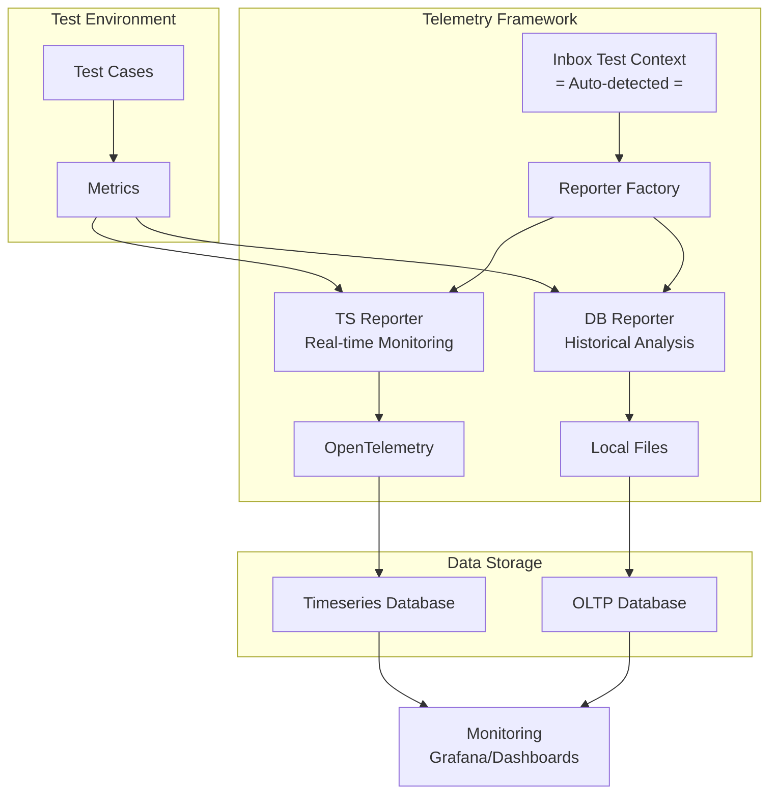

# SONiC Mgmt Test Telemetry Framework

1. [1. Overview](#1-overview)
2. [2. Design Principles](#2-design-principles)
   1. [2.1. OpenTelemetry Compatiable](#21-opentelemetry-compatiable)
   2. [2.2. Extentable with battery included](#22-extentable-with-battery-included)
3. [3. How to use](#3-how-to-use)
   1. [3.1. Emitting inbox metrics](#31-emitting-inbox-metrics)
   2. [3.2. Customizing Metrics](#32-customizing-metrics)
   3. [3.3. Emitting Test Results to Database](#33-emitting-test-results-to-database)
   4. [3.4. Bulk Monitoring with Fixtures](#34-bulk-monitoring-with-fixtures)
   5. [3.5. Creating Custom Metric Fixtures](#35-creating-custom-metric-fixtures)
4. [4. Framework-Provided Metrics and Labels](#4-framework-provided-metrics-and-labels)
   1. [4.1. Common Metrics](#41-common-metrics)
   2. [4.2. Common Metric Labels](#42-common-metric-labels)
      1. [4.2.1. Auto-Generated Labels](#421-auto-generated-labels)
      2. [4.2.2. Device Labels](#422-device-labels)
      3. [4.2.3. Traffic Generator Labels](#423-traffic-generator-labels)
5. [5. Configuration and Setup](#5-configuration-and-setup)
   1. [5.1. Reporter Configuration](#51-reporter-configuration)
   2. [5.2. Test Context Configuration](#52-test-context-configuration)
   3. [5.3. Development and Testing Configuration](#53-development-and-testing-configuration)
6. [6. Testing](#6-testing)
   1. [6.1. Test structure](#61-test-structure)
   2. [6.2. Running Tests](#62-running-tests)
   3. [Examples](#examples)

## 1. Overview

A comprehensive telemetry data collection and reporting framework for SONiC test infrastructure, designed to emit metrics for real-time monitoring and historical analysis.

The telemetry framework provides dual reporting pipelines optimized for different use cases:

| Reporter            | Purpose              | Integration                | Frequency       | Use Case                   |
|---------------------|----------------------|----------------------------|-----------------|----------------------------|
| **TS (TimeSeries)** | Real-time monitoring | OpenTelemetry              | Every 1 minutes | Debugging, live monitoring |
| **DB (Database)**   | Historical analysis  | Local File → OLTP Database | End of test     | Trend analysis, reporting  |

The overall architecture is shown as below:



## 2. Design Principles

### 2.1. OpenTelemetry Compatiable

All metrics follow OpenTelemetry naming conventions:

- **Format**: `lowercase.snake_case.dot_separated`
- **Labels**: Hierarchical namespace (`device.port.id`, `test.params.custom`)
- **Types**: Gauge, Counter, Histogram support

### 2.2. Extentable with battery included

- **Common Metrics**: Framework-provided fixtures for standard metrics groups (e.g., port, PSU, temperature)
- **Test Metrics**: Test cases can define custom metrics and labels, using `test.params.*`
- **Pytest Support**: Fixtures provided for easy integration with pytest test cases

## 3. How to use

### 3.1. Emitting inbox metrics

```python
import pytest
from common.telemetry import *

# Usage of db reporter is the same as ts reporter.
def test_periodic_telemetry(ts_reporter):
    """Example test with periodic telemetry metrics for real-time monitoring."""

    # Define device context
    device_labels = {METRIC_LABEL_DEVICE_ID: "switch-01"}

    # Record port metrics using dedicated metric class with common labels
    port_labels = {**device_labels, METRIC_LABEL_DEVICE_PORT_ID: "Ethernet0"}
    port_metrics = DevicePortMetrics(reporter=ts_reporter, labels=port_labels)
    port_metrics.tx_util.record(45.2)
    port_metrics.rx_bps.record(1000000000)  # 1Gbps

    # Record PSU metrics using dedicated metric class with common labels
    psu_labels = {**device_labels, METRIC_LABEL_DEVICE_PSU_ID: "PSU-1"}
    psu_metrics = DevicePSUMetrics(reporter=ts_reporter, labels=psu_labels)
    psu_metrics.power.record(222.0)
    psu_metrics.voltage.record(12.0)

    # Report all metrics to OpenTelemetry for real-time monitoring
    ts_reporter.report()
```

### 3.2. Customizing Metrics

For tests that need custom metrics beyond the framework's common device metrics, you can define metrics specific to your test scenario. This is ideal for measuring test-specific behaviors like convergence times, custom performance indicators, or feature-specific results.

```python
# Custom metrics for route scale testing using ts reporter
def test_route_scale(ts_reporter):
    duration_metric = GaugeMetric(
        name="test.duration",
        description="Total test execution time",
        unit="seconds",
        reporter=ts_reporter
    )

    # Test-specific parameters
    test_labels = {
        METRIC_LABEL_DEVICE_ID: "dut-01",
        "test.params.route_count": "1000000",
        "test.params.prefix_length": "24"
    }

    duration_metric.record(245.7, test_labels)  # 245.7 seconds

    ts_reporter.report()
```

### 3.3. Emitting Test Results to Database

Use the `db_reporter` fixture for collecting test completion metrics that will be stored for historical analysis and trend tracking. This is typically called once at the end of a test to capture overall test results and performance measurements.

```python
def test_record_performance(db_reporter):
    """Test using db reporter for test completion metrics."""
    # Custom final test metrics
    throughput_metric = GaugeMetric(
        name="test.result.throughput_mbps",
        description="Maximum achieved throughput",
        unit="mbps",
        reporter=db_reporter
    )
    throughput_metric.record(9850.5, result_labels)  # 9.85 Gbps

    # Export to local file for database upload and historical analysis
    db_reporter.report()
```

### 3.4. Bulk Monitoring with Fixtures

This pattern demonstrates how to efficiently monitor multiple devices and components using the framework's common metric fixtures. This approach is particularly useful for infrastructure monitoring where you need to collect the same metrics across multiple devices.

```python
def test_bulk_psu_monitoring(ts_reporter):
    """Monitor multiple PSUs across devices using dedicated metric class."""

    psu_metrics = PSUMetrics(reporter=ts_reporter)
    for device in ["switch-01", "switch-02", "switch-03"]:
        for psu_id in ["PSU-1", "PSU-2"]:
            # Create PSU metrics with common labels for each device/PSU combination
            psu_labels = {
                METRIC_LABEL_DEVICE_ID: device,
                METRIC_LABEL_DEVICE_PSU_ID: psu_id
            }

            # Read from device APIs
            psu_data = get_psu_readings(device, psu_id)

            # Record all PSU metrics (labels are automatically applied)
            psu_metrics.voltage.record(psu_data.voltage, psu_labels)
            psu_metrics.current.record(psu_data.current, psu_labels)
            psu_metrics.power.record(psu_data.power, psu_labels)
            psu_metrics.status.record(psu_data.status.value, psu_labels)

    # Report to OpenTelemetry for real-time monitoring
    ts_reporter.report()
```

### 3.5. Creating Custom Metric Fixtures

When you have a set of related metrics that you use frequently across multiple tests, you can create custom metric fixtures. This promotes code reuse and ensures consistent metric definitions across your test suite.

```python
from common.telemetry import *

class BGPMetrics(MetricCollection):
    """Custom BGP metrics collection with 2 key metrics."""

    # Define the metrics for this collection
    METRICS_DEFINITIONS = [
        MetricDefinition(
            "convergence_time",
            metric_name=METRIC_NAME_BGP_CONVERGENCE_TIME_PORT_RESTART,  # "bgp.convergence_time.port_restart"
            description="BGP convergence time after port restart",
            unit=UNIT_SECONDS
        ),
        MetricDefinition(
            "route_count",
            metric_name="bgp.route.count",
            description="Number of BGP routes learned",
            unit=UNIT_COUNT
        )
    ]


def test_bgp_convergence(ts_reporter):
    """Test using custom BGP metrics collection."""
    # Common labels for all BGP metrics
    common_labels = {
        METRIC_LABEL_DEVICE_ID: "spine-01",
        "test.params.topology": "t1"
    }

    # Create BGP metrics collection - metrics are automatically created with common labels
    bgp_metrics = BGPMetrics(reporter=ts_reporter, labels=common_labels)

    # Additional test-specific labels
    test_specific_labels = {
        "test.params.failure_type": "port_restart",
        "test.params.route_count": "10000"
    }

    # Record BGP convergence metrics (common labels automatically applied)
    bgp_metrics.convergence_time.record(2.45, test_specific_labels)  # 2.45 seconds
    bgp_metrics.route_count.record(10000, test_specific_labels)      # 10k routes

    # Report to OpenTelemetry for real-time monitoring
    ts_reporter.report()
```

## 4. Framework-Provided Metrics and Labels

### 4.1. Common Metrics

| Group           | Metrics                                                                 | Description                  |
|-----------------|-------------------------------------------------------------------------|------------------------------|
| **Port**        | `port.{rx,tx}.{bps,util,ok,err,drop,overrun}`                           | Network interface statistics |
| **PSU**         | `psu.{voltage,current,power,status,led}`                                | Power supply measurements    |
| **Queue**       | `queue.watermark.bytes`                                                 | Buffer utilization           |
| **Temperature** | `temperature.{reading,high_th,low_th,crit_high_th,crit_low_th,warning}` | Thermal monitoring           |
| **Fan**         | `fan.{speed,status}`                                                    | Cooling system monitoring    |

### 4.2. Common Metric Labels

#### 4.2.1. Auto-Generated Labels

| Label             | Value              | Source                                                    |
|-------------------|--------------------|-----------------------------------------------------------|
| `test.testbed`    | Testbed identifier | `tbinfo['conf-name']`, fallback to `TESTBED_NAME` env var |
| `test.os.version` | Build version      | `BUILD_VERSION` environment variable                      |
| `test.testcase`   | Test case name     | `request.node.name`                                       |
| `test.file`       | Test file path     | `request.node.fspath.strpath` basename                    |
| `test.job.id`     | Job identifier     | `JOB_ID` environment variable                             |

#### 4.2.2. Device Labels

| Category   | Labels                                    | Example Values                     |
|------------|-------------------------------------------|------------------------------------|
| **Device** | `device.id`                               | `"switch-A"`, `"switch-B"`         |
| **Port**   | `device.port.id`                          | `"Ethernet0"`, `"Ethernet8"`       |
| **PSU**    | `device.psu.{id,model,serial,hw_rev,...}` | `"PSU 1"`, `"PWR-ABCD"`, `"02.00"` |
| **Queue**  | `device.queue.{id,cast,...}`              | `"UC1"`, `"multicast"`             |
| **Sensor** | `device.sensor.{id,...}`                  | `"CPU"`                            |

#### 4.2.3. Traffic Generator Labels

| Label                | Description                | Example             |
|----------------------|----------------------------|---------------------|
| `tg.traffic_rate`    | Traffic rate (% line rate) | `"100"`, `"50"`     |
| `tg.frame_bytes`     | Frame size in bytes        | `"64"`, `"1518"`    |
| `tg.rfc2889_enabled` | RFC2889 testing mode       | `"true"`, `"false"` |

## 5. Configuration and Setup

### 5.1. Reporter Configuration

| Environment Variable            | Purpose                     | Default Value           | Used By    |
|---------------------------------|-----------------------------|-------------------------|------------|
| `SONIC_MGMT_TS_REPORT_ENDPOINT` | OTLP collector endpoint URL | `http://localhost:4317` | TSReporter |

### 5.2. Test Context Configuration

| Environment Variable       | Purpose                                   | Default Value | Used By       |
|----------------------------|-------------------------------------------|---------------|---------------|
| `SONIC_MGMT_TESTBED_NAME`  | Testbed identifier for test.testbed label | `"unknown"`   | All reporters |
| `SONIC_MGMT_BUILD_VERSION` | Build version for test.os.version label   | `"unknown"`   | All reporters |
| `SONIC_MGMT_JOB_ID`        | Job identifier for test.job.id label      | `0`   | All reporters |

### 5.3. Development and Testing Configuration

| Environment Variable           | Purpose                                           | Default Value | Used By         |
|--------------------------------|---------------------------------------------------|---------------|-----------------|
| `SONIC_MGMT_GENERATE_BASELINE` | When set to `1`, generate new test baseline files | Not set       | Test validation |

## 6. Testing

To avoid feature regressions in the future, telemetry framework provides unit tests to validate metric output against expected baselines.

### 6.1. Test structure

Here is how the tests are organized:

```text
tests/common/telemetry/tests/
├── conftest.py              # Test fixtures (mock_reporter)
├── common_utils.py          # Shared utilities (MockReporter, validation functions)
├── ut_*.py                  # Unit test files by component
│   ├── ut_inbox_metrics.py  # Tests metric collections (DevicePortMetrics, etc.)
│   ├── ut_metrics.py        # Tests individual metric classes (GaugeMetric, etc.)
│   ├── ut_ts_reporter.py    # Tests TimeSeries reporter OTLP output
│   └── ut_db_reporter.py    # Tests Database reporter file output
└── baselines/               # Expected test outputs for validation
    ├── *.json               # Metric and inbox metrics baselines
    ├── ts_reporter/         # TS reporter OTLP baselines
    └── db_reporter/         # DB reporter file baselines
```

**Component Isolation**: Each `ut_*.py` file tests a specific layer:

- **Metrics layer**: Individual metric types.
- **Inbox metrics layer**: All metric collections included in the telemetry framework.
- **Reporter layer**: Metrics reporter, such as TS reporter and DB reporter, to validate E2E pipeline.

**Baseline testing**: The tests uses baseline testing to ensure metric output consistency, where the generated metrics are validated against JSON baselines during the test execution using the following key validation functions:

- `validate_recorded_metrics()` - For metric collections
- `validate_ts_reporter_output()` - For OTLP format validation
- `validate_db_reporter_output()` - For database file validation

### 6.2. Running Tests

In sonic-mgmt container, run the following commands:

```bash
# Enter the test folder
cd tests/common/telemetry/tests

# Run specific test file
./run_tests.sh -i ../ansible/<any-group> -n <any-testbed> -d all -t any -m individual -a False -w -u -l debug -e "--skip_sanity --disable_loganalyzer" -c common/telemetry/tests/ut_metrics.py

# Generate new baselines when adding features
SONIC_MGMT_GENERATE_BASELINE=1 ./run_tests.sh -i ../ansible/<any-group> -n <any-testbed> -d all -t any -m individual -a False -w -u -l debug -e "--skip_sanity --disable_loganalyzer" -c common/telemetry/tests/ut_metrics.py
```

### Examples

The telemetry framework also provides examples for common use cases. Please refer to files under [tests/common/telemetry/examples](../../tests/common/telemetry/examples) for detailed implementations.
