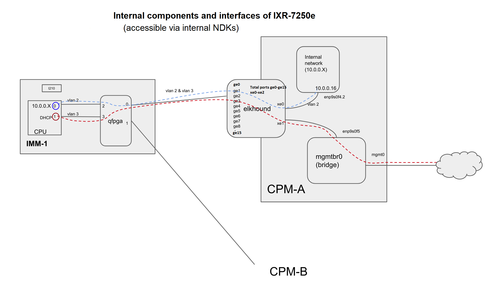

**NDK Internal API Test Plan**

 - [Introduction](#intro)
 - [Scope](#scope)
 - [Test Setup](#setup)
 - [Test Cases](#test-cases)
     - [ethmgr::show-port-status](#port-status)
     - [ethmgr::show-vlan](#vlan)
     - [ethmgr::show-mac](#mac)
     - [ethmgr::show-stats](#stats)
     - [ethmgr::show-drop-counters](#drop-counters)
     - [ethmgr::clear-stats](#clear-stats)
     - [ethmgr::show-link-tracker](#link-tracker)
     - [devmgr::hwPconShowChannelsJson](#pcon)
     - [devmgr::hwPconShowChannelsSfmJson](#pconSfm)
     - [devmgr::hwPconShowRailConfigJson](#pconRail)
     - [devmgr::hwPconShowRailConfigSfmJson](#pconRailSfm) 
     - [devmgr::hwHiTelemShowJson](#hotswap)
     - [devmgr::hwHiTelemSfmShowJson](#hotswapSfm) 
     - [QfpgaJson](#qfpga)
     - [Fail-over](#fail-over)
     - [Watchdog](#watchdog)

   
# Introduction 

This is the test plan for NDK internal APIs, for devmgr, ethmgr, qfpgamg and fail-over handling.

The functionalities covered in this test plan are:
 Internal API related to devmgr, ethmgr and qfpgamgr
 Fail-over handling

# Scope 

External NDK APIs (which will be shared with the customer) are covered in a [separate test plan](https://gitlabsr.nuq.ion.nokia.net/sr/linux/sonic/sonic-mgmt/-/blob/nokia-dev/nokia-docs/testplans/ndk_testplan.md). The test cases reside [here](https://gitlabsr.nuq.ion.nokia.net/sr/linux/sonic/sonic-mgmt/-/tree/nokia-dev/tests/nokia/suites/platform) and these test cases will not be shared outside of Nokia and are for internal use only.

These APIs are not required by SONiC and hence, are not covered in the [OC PMON testplan](https://github.com/Azure/sonic-mgmt/blob/master/docs/testplan/PMON-Chassis-Enhancements-test-plan.md#51-test-api-get_minimum_recorded).
 
This testplan assumes that this HW will be deployed using SONiC.

The following picture in test setup shows the internal components against which this test plan is written. This architecture is specific to IXR-7250e. The current version of this test plan is written for a 10-slot chassis.

# Test Setup 
 A fully loaded chassis with one CPM on slot A.

# Test Cases 

## ethmgr::show-port-status 

#### Test Case 1. Verify total number of ports

##### Test Objective
Verify total number of ports on elkhound

##### Automation Status:
Status: Pending

##### Test Steps
* Run command ethmgr::show-port-status on platform ndk cli
* Count the total number of ports returned

##### PASS/FAIL criteria
Number of ports should be equal to 19 (16 ge ports and 3 xe ports independent of platform)
    
#### Test Case 2. Verify all ports 'AdminStatus' 
##### Test Objective
Verify all ports 'AdminStatus' 

##### Automation Status:
Status: Pending

##### Test Steps
* Run command ethmgr::show-port-status on platform ndk cli
* Check AdminStatus of each port

##### PASS/FAIL criteria
Should be "AdminStatus": "enabled"

#### Test Case 3.  Verify all ports 'OperStatus'

##### Test Objective
Verify 'OperStatus' is up for the imm connected and up for all xe ports

##### Automation Status:
Status: Pending

##### Test Steps
* Run command ethmgr::show-port-status on platform ndk cli
* Check OperStatus of each port

##### PASS/FAIL criteria
Should be up for the imm connected ports and down for other ports "OperStatus": "down",
 for xe port operstatus should be up for all 3 ports 

#### Test Case 4. Verify stpstate for all the ports
##### Test Objective
Verify stpstate for all the ports is forward

##### Automation Status:
Status: Pending

##### Test Steps
* Run command ethmgr::show-port-status on platform ndk cli
* Check StpState of each port 
##### PASS/FAIL criteria
Stpstate should be forward for each port  "StpState": "Forward"

#### Test Case 5.  Verify Autoneg on all ports
##### Test Objective
Verify Autoneg is enabled on all xe ports and disabled on all ge ports

##### Automation Status:
Status: Pending

##### Test Steps
* Run command ethmgr::show-port-status on platform ndk cli
* Check Autoneg of each port 

##### PASS/FAIL criteria
Autoneg should be enabled on all xe ports and disabled on ge ports

#### Test Case 6.  Verify speed on all ports
##### Test Objective
Verify speed of all ports should be 2.5 on ge ports and 10 on xe ports

##### Automation Status:
Status: Pending

##### Test Steps
* Run command ethmgr::show-port-status on platform ndk cli

##### PASS/FAIL criteria
Speed of all ports should be 2.5 on ge ports and 10 on xe ports

## ethmgr::show-vlan  

#### Test Case 1. Verify total number of vlan

##### Test Objective
Verify total number of vlan 

##### Automation Status:
Status: Pending

##### Test Steps
* Run command ethmgr::show-vlan on platform ndk cli
* Count number of vlan

##### PASS/FAIL criteria  
Total vlan should be equal to 4(vlan1-vlan3, untagged) independent of platform

#### Test Case 2. Verify all ports are member of vlan1 

##### Test Objective
Verify vlan1 members

##### Automation Status:
Status: Pending

##### Test Steps
* Run command ethmgr::show-vlan on platform ndk cli
* Count number of vlan members of vlan1 

##### PASS/FAIL criteria
Should be equal to 20 (19 ports+cpu0) independent of platform 

#### Test Case 3. Verify untagged vlan members

##### Test Objective
Verify untagged vlan has 19 members (19 ports) independent of platform 

##### Automation Status:
Status: Pending

##### Test Steps
* Run command ethmgr::show-vlan on platform ndk cli
* Count number of vlan members of untagged vlan

##### PASS/FAIL criteria
Vlan members of Untagged vlan should be equal to 19 independent of platform 

#### Test Case 4. Verify xe0 and all ge port are part of vlan2 
##### Test Objective
Verify xe0 and all ge port are part of vlan2

##### Automation Status:
Status: Pending

##### Test Steps
* Run command ethmgr::show-vlan on platform ndk cli

##### PASS/FAIL criteria
Check xe0 and all ge ports are part of vlan2, independent of platform 

#### Test Case 5. Verify xe1 and all ge ports are members of vlan3

##### Test Objective  
Verify xe1 and all ge ports are members of the all vlan

##### Automation Status:
Status: Pending

##### Test Steps
* Run command ethmgr::show-vlan on platform ndk cli
* Check xe1 and all ge ports are member of vlan3

##### PASS/FAIL criteria
xe1 should be untagged , independent of platform 

## ethmgr::show-mac 

#### Test Case 1. Verify the mac address is "dynamic" 

##### Test Objective
Verify MAC address assigned to all vlan2-vlan3 are "dynamic"

##### Automation Status:
Status: Pending

##### Test Steps
* Send command 'ethmgr::show-mac' to get mac address

##### PASS/FAIL criteria
verify all vlan2 - vlan3 members have mac address type 'dynamic', independent of platform 

#### Test Case 2. Verify the mac address for vlan2 ports follows a pattern 
##### Test Objective
Verify MAC address assigned to vlan2 ports follows the pattern 'mac=02:00:00:00:01:00'
 second last octate is equal to the linecard slot 
 
##### Automation Status:
Status: Pending

##### Test Steps
* Send command 'ethmgr::show-mac' to get mac address

##### PASS/FAIL criteria
verify all vlan2 ports have mac address in pattern 'mac=02:00:00:00:01:00'
where second last pattern is ==  linecard slot number
mac=02:00:00:00:01:00 vlan=2 GPORT=0x17 modid=0 port=23/ge13 Hit

## show-stats 

#### Test Case 1.  show stats should not show any error or fail message      
##### Test Objective
Verify show stats doesn't show any error or fail messages
 
##### Automation Status:
Status: Pending

##### Test Steps
1. collect stats
2. verify there are no error or fail message
3. run different ping packets with different size
4. collect stats
5. verify there are no error or fail messages 
5. send ping packets to diffeent host
5. verify packets

##### PASS/FAIL Criteria 
verify there are no fail message or error in stats

## ethmgr::show-drop-counters 

#### Test Case 1.  Verify there are no drop packets on any of the port                
##### Test Objective
Verify no packets are dropped on any of the port

##### Automation Status:
Status: Pending

##### Test Steps
* Send command ethmgr::show-drop-counter 

##### PASS/FAIL Criteria 
Check "InDiscards" on each port, should be None

## ethmgr::clear-stats 

#### Test Case 1.  Verify clear stats    
             
##### Test Objective
Verify clear-stats should clear all the stats if any

##### Automation Status:
Status: Pending

##### Test Steps
* Send command ethmgr::clear-stats

##### PASS/FAIL Criteria 
get stats again, should be None

## ethmgr::show-link-tracker 

#### Test Case 1.  Verify show link tracker                 
##### Test Objective
Verify show-link-tracker keeps track of links

##### Automation Status:
Status: Pending

##### Test Steps
* Send command ethmgr::show-link-tacker, record the links stats
* make any ge port down

##### PASS/FAIL Criteria 
Verify the stats of the link should have 'down' and 'up' 1 more than the previous stats 

## devmgr::hwPconShowChannelsJson 

#### Test Case 1. Verify number of pcon device present             
##### Test Objective
Verify number of pcon device present on the dut 

##### Automation Status:
Status: Done
[Automation](https://gitlabsr.nuq.ion.nokia.net/sr/linux/sonic/sonic-mgmt/-/blob/nokia-dev/tests/nokia/suites/platform/ndk/test_pcon.py)

##### Test Steps
* Send command 'hwPconShowChannelsJson' on sr_platform_ndk_cli
* count number of device present in the output

##### PASS/FAIL Criteria 
Verify number of Pcon device present in output are same as expected in expected data file. 

#### Test Case 2. Verify pcon channel enabled           
##### Test Objective
Verify all pcon channel for each pcon device are enabled

##### Automation Status:
Status: Done
[Automation](https://gitlabsr.nuq.ion.nokia.net/sr/linux/sonic/sonic-mgmt/-/blob/nokia-dev/tests/nokia/suites/platform/ndk/test_pcon.py)

##### Test Steps
* Send command 'hwPconShowChannelsJson' on sr_platform_ndk_cli

##### PASS/FAIL Criteria 
check each pcon channel for each pcon device is enabled. 

#### Test Case 3. Verify master pcon channel voltage  
        
##### Test Objective
Verify for all pcon master channels, the voltage is more than zero. 

##### Automation Status:
Status: Done
[Automation](https://gitlabsr.nuq.ion.nokia.net/sr/linux/sonic/sonic-mgmt/-/blob/nokia-dev/tests/nokia/suites/platform/ndk/test_pcon.py)

##### Test Steps
* Send command 'hwPconShowChannelsJson' on sr_platform_ndk_cli

##### PASS/FAIL Criteria 
check for master pcon channel, the voltage is more than zero.

#### Test Case 4. Verify pcon channel current 
         
##### Test Objective
Verify for all pcon channels, the current is within the min/max limit

##### Automation Status:
Status: Done
[Automation](https://gitlabsr.nuq.ion.nokia.net/sr/linux/sonic/sonic-mgmt/-/blob/nokia-dev/tests/nokia/suites/platform/ndk/test_pcon.py)

##### Test Steps
* Send command 'hwPconShowChannelsJson' on sr_platform_ndk_cli

##### PASS/FAIL Criteria 
check for pcon channel voltage is within the min/max limit.

## devmgr hwPconShowChannelsSfmJson 

#### Test Case 1. Verify total number of pcon device per sfm 
            
##### Test Objective
Verify total number of pcon device per sfm

##### Automation Status:
Status: Done
[Automation](https://gitlabsr.nuq.ion.nokia.net/sr/linux/sonic/sonic-mgmt/-/blob/nokia-dev/tests/nokia/suites/platform/ndk/test_pcon.py)

##### Test Steps
* Send command 'hwPconShowChannelsSfmJson' on sr_platform_ndk_cli
* count number of device present in the output

##### PASS/FAIL Criteria 
Verify number of Pcon device present in output are same as expected in expected data file. 

#### Test Case 2. Verify each pcon channel for a sfm are enabled             
##### Test Objective
Verify for a sfm all pcon channels are enabled. 

##### Automation Status:
Status: Done

##### Test Steps
* Send command 'hwPconShowChannelsSfmJson' on sr_platform_ndk_cli

##### PASS/FAIL Criteria 
Verify all channels are enabled. 

#### Test Case 3. Verify master pcon channel voltage for each sfm 
        
##### Test Objective
Verify for all pcon master channels, the voltage is more than zero for each sfm

##### Automation Status:
Status: Done
[Automation](https://gitlabsr.nuq.ion.nokia.net/sr/linux/sonic/sonic-mgmt/-/blob/nokia-dev/tests/nokia/suites/platform/ndk/test_pcon.py)

##### Test Steps
* Send command 'hwPconShowChannelsJson' on sr_platform_ndk_cli

##### PASS/FAIL Criteria 
Check for master pcon channel, the voltage is more than zero.

#### Test Case 4. Verify pcon channel the current for each sfm 
      
##### Test Objective
Verify for all pcon channels, the current is within the min/max limit for each sfm

##### Automation Status:
Status: Done
[Automation](https://gitlabsr.nuq.ion.nokia.net/sr/linux/sonic/sonic-mgmt/-/blob/nokia-dev/tests/nokia/suites/platform/ndk/test_pcon.py)

##### Test Steps
* Send command 'hwPconShowChannelsJson' on sr_platform_ndk_cli

##### PASS/FAIL Criteria 
Check for pcon channel voltage is within the min/max limit.

## devmgr::hwPconShowRailConfigJson 

#### Test Case 1. Verify number of rails are equal to number of master channels         
##### Test Objective
Verify number of pcon rails are equal to number of master pcon channels 

##### Automation Status:
Status: Pending

##### Test Steps
* Send command 'hwPconShowChannelsJson' on sr_platform_ndk_cli get number of master channels
* Send command 'hwPconShowRailConfigJson' to get number of rail

##### PASS/FAIL Criteria 
Verify number of master channels from step 1 are same as rail from step2 

#### Test Case 2. Verify measured voltage on each rail is withn under-voltage and over-voltage        
##### Test Objective
Verify measured voltage for each rail is within under-voltage and over-voltage 

##### Automation Status:
Status: Pending

##### Test Steps
* Send command 'hwPconShowRailConfigJson' on sr_platform_ndk_cli
* Get measured voltage, under-voltage and over-voltage for each rail

##### PASS/FAIL Criteria 
Verify measured voltage is within under and over voltage.

#### Test Case 3. Verify measured voltage is within +-x of configured voltage        
##### Test Objective
Verify measured voltage for each rail is within +-x of configured voltage

##### Automation Status:
Status: Pending

##### Test Steps
* Send command 'hwPconShowRailConfigJson' on sr_platform_ndk_cli
* Get measured voltage and configured voltage

##### PASS/FAIL Criteria 
Verify measured voltage is within +-x of configured voltage 

## devmgr::hwPconShowRailConfigSfmJson sfm_num

#### Test Case 1. Verify number of rails are equal to number of master channels for each sfm        
##### Test Objective
Verify number of pcon rails are equal to number of master pcon channels for each sfm

##### Automation Status:
Status: Pending

##### Test Steps
* Send command 'hwPconShowChannelsSfmJson sfm_num' on sr_platform_ndk_cli get number of master channels
* Send command 'hwPconShowRailConfigSfmJson sfm_num' to get number of rail

##### PASS/FAIL Criteria 
Verify number of master channels from step 1 are same as rail from step2 

#### Test Case 2. Verify measured voltage on each rail is within under-voltage and over-voltage for each sfm    
##### Test Objective
Verify measured voltage for each rail is within under-voltage and over-voltage 

##### Automation Status:
Status: Pending

##### Test Steps
* Send command 'hwPconShowRailConfigSfmJson sfm_num' on sr_platform_ndk_cli
* Get measured voltage, under-voltage and over-voltage for each rail

##### PASS/FAIL Criteria 
Verify measured voltage is within under and over voltage.

#### Test Case 3. Verify measured voltage is within +-x of configured voltage for each sfm        
##### Test Objective
Verify measured voltage for each rail is within +-x of configured voltage

##### Automation Status:
Status: Pending

##### Test Steps
* Send command 'hwPconShowRailConfigSfmJson sfm_num' on sr_platform_ndk_cli
* Get measured voltage and configured voltage

##### PASS/FAIL Criteria 
Verify measured voltage is within +-x of configured voltage 

## devmgr::hwHiTelemShowJson hotswap API 

#### Test Case 1. Verify current in for each hotswap           
##### Test Objective
Verify current in for each hotswap

##### Automation Status:
Status: Done
[Automation](https://gitlabsr.nuq.ion.nokia.net/sr/linux/sonic/sonic-mgmt/-/blob/nokia-dev/tests/nokia/suites/platform/ndk/test_hotswap.py)

##### Test Steps
* Send command 'hwHiTelemShowJson' on sr_platform_ndk_cli

##### PASS/FAIL Criteria 
Verify current in for each hotswap is same as expected.

#### Test Case 2. Verify voltage in and out in each hotswap     
##### Test Objective
Verify voltage in and out for each hotswap

##### Automation Status:
Status:  Done
[Automation](https://gitlabsr.nuq.ion.nokia.net/sr/linux/sonic/sonic-mgmt/-/blob/nokia-dev/tests/nokia/suites/platform/ndk/test_hotswap.py)

##### Test Steps
* Send command 'hwHiTelemShowJson' on sr_platform_ndk_cli

##### PASS/FAIL Criteria 
Verify voltage in and out for each hotswap is same as expected

#### Test Case 3. Verify hotswap power in      
##### Test Objective
Verify each hotswap power in 

##### Automation Status:
Status:  Done
[Automation](https://gitlabsr.nuq.ion.nokia.net/sr/linux/sonic/sonic-mgmt/-/blob/nokia-dev/tests/nokia/suites/platform/ndk/test_hotswap.py)

##### Test Steps
* Send command 'hwHiTelemShowJson' on sr_platform_ndk_cli

##### PASS/FAIL Criteria 
Verify power in for each hotswap is same as expected

#### Test Case 4. Verify hotswap temperature    
##### Test Objective
Verify each hotswap temperature 
  
##### Automation Status:
Status:  Done
[Automation](https://gitlabsr.nuq.ion.nokia.net/sr/linux/sonic/sonic-mgmt/-/blob/nokia-dev/tests/nokia/suites/platform/ndk/test_hotswap.py)

##### Test Steps
* Send command 'hwHiTelemShowJson' on sr_platform_ndk_cli

##### PASS/FAIL Criteria 
Verify temperature for each hotswap is same as expected

#### Test Case 5. Verify hotswap peak power watts
##### Test Objective
Verify each hotswap peak power watts 

##### Automation Status:
Status:  Done
[Automation](https://gitlabsr.nuq.ion.nokia.net/sr/linux/sonic/sonic-mgmt/-/blob/nokia-dev/tests/nokia/suites/platform/ndk/test_hotswap.py)

##### Test Steps
* Send command 'hwHiTelemShowJson' on sr_platform_ndk_cli

##### PASS/FAIL Criteria 
Verify each hotswap peak power watts

## devmgr hwHiTelemShowSfmJson hotswap API 

#### Test Case 1. Verify 'current in' for each hotswap in each sfm          
##### Test Objective
Verify 'current in' for each hotswap in each sfm

##### Automation Status:
Status:  Done
[Automation](https://gitlabsr.nuq.ion.nokia.net/sr/linux/sonic/sonic-mgmt/-/blob/nokia-dev/tests/nokia/suites/platform/ndk/test_hotswap.py)
 
##### Test Steps
* Send command 'hwHiTelemShowJson' on sr_platform_ndk_cli

##### PASS/FAIL Criteria 
Verify 'current in' for each hotswap for each sfm is same as expected.

#### Test Case 2. Verify 'power in' for each hotswap in each sfm          
##### Test Objective
Verify 'power in' for each hotswap in each sfm

##### Automation Status:
Status:  Done
[Automation](https://gitlabsr.nuq.ion.nokia.net/sr/linux/sonic/sonic-mgmt/-/blob/nokia-dev/tests/nokia/suites/platform/ndk/test_hotswap.py)

##### Test Steps
* Send command 'hwHiTelemShowJson' on sr_platform_ndk_cli

##### PASS/FAIL Criteria 
Verify 'power in' for each hotswap for each sfm is same as expected.

#### Test Case 3. Verify 'temperature' for each hotswap in each sfm          
##### Test Objective
Verify 'temperature' for each hotswap in each sfm
 
##### Automation Status:
Status:  Done
[Automation](https://gitlabsr.nuq.ion.nokia.net/sr/linux/sonic/sonic-mgmt/-/blob/nokia-dev/tests/nokia/suites/platform/ndk/test_hotswap.py)

##### Test Steps
* Send command 'hwHiTelemShowJson' on sr_platform_ndk_cli

##### PASS/FAIL Criteria 
Verify 'temperature' for each hotswap for each sfm is same as expected.

#### Test Case 4. Verify 'power watts' for each hotswap in each sfm          
##### Test Objective
Verify 'power watts' for each hotswap in each sfm

##### Automation Status:
Status:  Done
[Automation](https://gitlabsr.nuq.ion.nokia.net/sr/linux/sonic/sonic-mgmt/-/blob/nokia-dev/tests/nokia/suites/platform/ndk/test_hotswap.py)

##### Test Steps
* Send command 'hwHiTelemShowJson' on sr_platform_ndk_cli

##### PASS/FAIL Criteria 
Verify 'power watts' for each hotswap for each sfm is same as expected.

#### Test Case 5. Verify 'voltage in and out' for each hotswap in each sfm  
        
##### Test Objective
Verify 'voltage in and out' for each hotswap in each sfm

##### Automation Status:
Status:  Done
[Automation](https://gitlabsr.nuq.ion.nokia.net/sr/linux/sonic/sonic-mgmt/-/blob/nokia-dev/tests/nokia/suites/platform/ndk/test_hotswap.py)

##### Test Steps
* Send command 'hwHiTelemShowJson' on sr_platform_ndk_cli

##### PASS/FAIL Criteria 
Verify 'voltage in and out' for each hotswap for each sfm is same as expected.

## devmgr::reboot hotswap API 

#### Test Case 1. verify reboot devmgr service          
##### Test Objective
Verify after Reboot devmgr service, chassis should come up

##### Automation Status:
Status:  Pending

##### Test Steps
* Reboot devmgr service

##### PASS/FAIL Criteria 
Verify chassis comes up and stable

## QfpgaJson 

#### Test Case 1. Verify total number of ports 'show-ports'

##### Test Objective
Verify total number of ports are equal to 4, independent of platform

##### Automation Status:
Status: Pending

##### Test Steps
* Run command QfpgaJson::show-ports on platform ndk cli
* Count the total number of ports returned

##### PASS/FAIL Criteria 
Number of ports should be equal to 4, independent of platform

#### Test Case 2. Verify all ports 'OperStatus'

##### Test Objective
Verify all ports 'OperStatus'

##### Automation Status:
Status: Pending

##### Test Steps
* Run command QfpgaJson::show-ports on platform ndk cli
* Get status of all ports 

##### PASS/FAIL Criteria 
OperStatus of all the ports should be 'UP' other than 'port1'

#### Test Case 3. Verify speed of all the ports 

##### Test Objective
Verify speed of all the ports 

##### Automation Status:
Status: Pending

##### Test Steps
* Run command QfpgaJson::show-ports on platform ndk cli

##### PASS/FAIL Criteria 
Verify speed of each port should be 2.5

#### Test Case 4. Verify speed of all the ports 

##### Test Objective
Verify speed of all the ports 

##### Automation Status:
Status: Pending

##### Test Steps
* Run command QfpgaJson::show-ports on platform ndk cli

##### PASS/FAIL Criteria 
Verify speed of each port should be 2.5

#### Test Case 5. Verify vlan on all the ports 

##### Test Objective
Verify vlan of all the ports 

##### Automation Status:
Status: Pending

##### Test Steps
* Run command QfpgaJson::show-ports on platform ndk cli

##### PASS/FAIL Criteria 
Verify vlan on port2 should be '2' on port3 should be '3', on pot0 should be 2 and 3.

#### Test Case 6. Verify show-counters

##### Test Objective
Verify show counters should not show any 'PolicerDrop' or 'QueueDrop' packets

##### Automation Status:
Status: Pending

##### Test Steps
* Run command to get counters
 
##### PASS/FAIL Criteria 
Counters should not have any PolicerDrop or QueueDrop packets

#### Test Case 7. Verify show-stats

##### Test Objective
Verify show stats should not show any 'fcsError' or 'runtError

##### Automation Status:
Status: Pending

##### Test Steps
* Run command QfpgaJson::show-stats on platform ndk cli
* Collect stats
* Run ping packets with different size 
* Verify there are no error or fail message
* Run ping packets to different host 

##### PASS/FAIL Criteria 
should not have any error or fail messages

#### Test Case 8. Verify restart qfpa manager service

##### Test Objective
Verify after restart qfpga manager service, chassis is stable

##### Automation Status:
Status: Pending

##### Test Steps
* Restart qfpga manager

##### PASS/FAIL Criteria 
Verify chassis can recover and come back up

## Fail-over 

#### Test Case 1. Verify linecard is not reachable and platform.json has monitor_action 'warn' on cpm and linecard      
##### Test Objective
Verify if linecard is not reachable on cpm and '/etc/sonic/platform.json' on cpm and linecard has "monitor_action": "warn"
 warn messages should be present on linecard and cpm in syslog 

##### Automation Status:
Status: Pending

##### Test Steps
* check linecard is reachable to cpm, cpm syslog and linecard syslog should not have
 'linecard not reachable' message in syslog
* edit /etc/sonic/platform.json file on cpm and linecard to have "stringval": "warn"
* make linecard unreachable to cpm(add iptables)
* verify on linecard and cpm syslog warn message 'not reachable' should be present
* remove iptables

##### PASS/FAIL Criteria 
linecard should be able to connect back to cpm

#### Test Case 2. Verify linecard is not reachable and platform.json has monitor_action 'reboot' on cpm and linecard     
##### Test Objective
Verify if linecard is not reachable on cpm and /etc/sonic/platform.json has "monitor_action": "reboot"
 once linecard is not reachable 'reboot self' in linecard syslog or 'reboot linecard' message should present in syslog
 
##### Automation Status:
Status: Pending

##### Test Steps
* check linecard is reachable to cpm, cpm syslog and linecard syslog should not have
 'not reachable' message in syslog
* modify /etc/sonic/platform.json file on cpm and linecard to have "stringval": 'reboot'
* reboot chassis
* Make linecards unreachable to cpm (configure iptables rule)
* verify on linecard and cpm syslog message 'is not reachable' and 'reboot self' should be present
* linecards should reboot 
* remove iptables 
##### PASS/FAIL Criteria 
Linecard should be able to connect back to cpm  

#### Test Case 3. Verify linecard is not reachable and platform.json has monitor_action 'reboot' on cpm and 'warn' on linecard     
##### Test Objective
Verify if linecard is not reachable on cpm and /etc/sonic/platform.json has "monitor_action": "reboot" and "warn" on linecard
 linecard reboots after a while
  
##### Automation Status:
Status: Pending

##### Test Steps
* Check linecard is reachable to cpm, cpm syslog and linecard syslog should not have
 'linecard not reachable' message in syslog
* modify /etc/sonic/platform.json file on cpm to have monitor_action as 'reboot' and on linecard 'warn'
* make linecard unreachable to cpm (add iptables)
* verify on linecard in syslog warning message 'cpm not reachable' should be present
* Verify on CPM 'Slot x not reachable' and 'reboot slot' message should be present
* linecard should reboot after a while
* remove iptables

##### PASS/FAIL Criteria 
linecard should be able to connect back to the cpm

#### Test Case 4. Verify linecard is not reachable and platform.json has monitor_action 'warn' on cpm and 'reboot' on linecard     
##### Test Objective
Verify if linecard is not reachable on cpm and /etc/sonic/platform.json has "monitor_action": "warn" and "reboot" on linecard
 linecard reboots after a while

##### Automation Status:
Status: Pending

##### Test Steps
* check linecard is reachable to cpm, cpm syslog and linecard syslog should not have
 'linecard not reachable' message in syslog
* modify /etc/sonic/platform.json file on cpm to have 'warn' and on linecard 'reboot' as monitor action
* make linecard unreachable to cpm (configure iptables)
* verify on cpm in syslog 'slot x not reachable' warn message should present
* Verify on linecard 'cpm not reachable' and 'reboot self' message should be present and linecard should reboot
* Remove iptables

##### PASS/FAIL Criteria 
linecard should be able to connect back to cpm 

## Watchdog 

#### Test Case 1. Verify if device-manager dies on linecard   
##### Test Objective
Verify if device manager dies on linecard, linecard should reboot after around 2 minute
 
##### Automation Status:
Status: Pending

##### Test Steps
* Stop device manager on linecard
* verify watchdog logs should have failed messages

##### PASS/FAIL Criteria 
Verify after around 2 minute card should reboot

