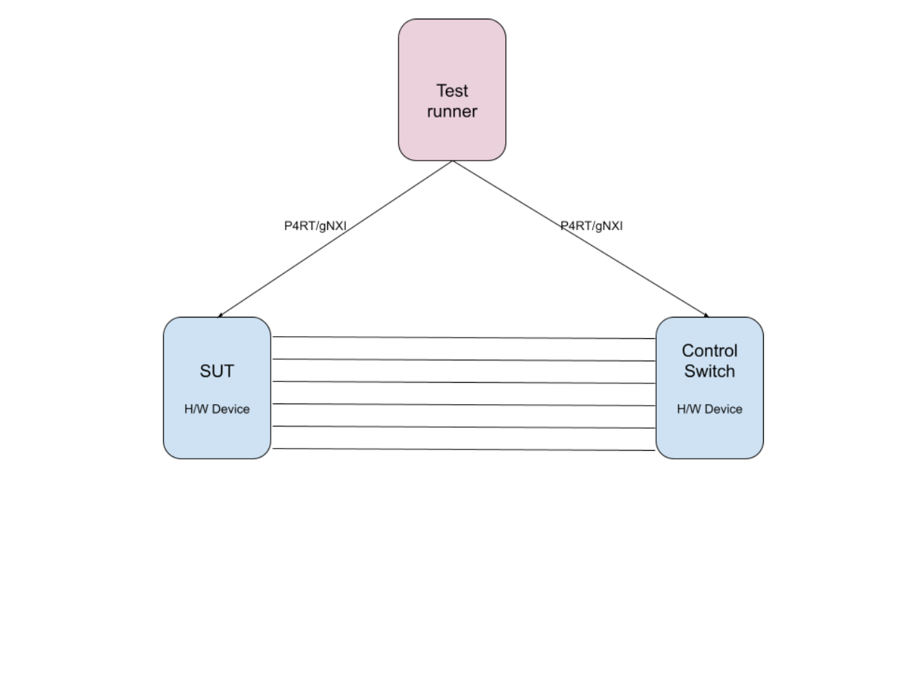

# SONiC-Ondatra Test Framework


## [**Summary**](#summary)

Google developed hundreds of tests to verify the functionality of switch software based on SONiC. The tests are developed on the Ondatra framework. Google proposes to open source these tests to the SONiC community to improve test coverage.  Ondatra is an open-source testing framework for network devices. It provides an infrastructure to write and run tests against network devices. Ondatra is written in Go and uses the gRPC protocol to communicate with the devices under test. More details about Ondatra can be found here [https://github.com/openconfig/ondatra/blob/main/README.md](https://github.com/openconfig/ondatra/blob/main/README.md)

This document covers the details of topologies that these tests can run and also cover the customizations required to run them in the upstream SONiC topology.


### [**Advantages of Ondatra**](#advantages-of-ondatra)

* Uses standard gRPC interfaces to Device under tests in topology
* In built API support for yang models
    * APIs for gNMI GET and SET
    * API to validate gNMI SET payload
    * API to validate GET/Telemetry responses
    * API for gNOI operations
* Open Traffic Generator Interface support alleviates the problem of vendor lockin for traffic generator
* Supports physical and virtual topologies
* Already [upstreamed](https://github.com/openconfig/ondatra/blob/main/README.md) available in openconfig and well tested framework
* Minimal integration effort


## [**Topologies**](#topologies)

Ondatra framework is generic and supports both physical and virtual topologies. We use the following topology to run our tests.


### Dual Node Topology  (SUT and Control switch running SONiC)




In this topology the DUT is connected to the Control switch with a minimum set of links required by the test definition. Test runner uses standard openconfig interfaces gNMI, gNOI, gNSI  and P4RT to interact with the SUT and Control device.

* gNMI for configuration and telemetry
* gNOI for operations  ex: Reboot, Install, file creation/deletion
* gNSI for Security operations ex: Rotate certs, keys
* P4RT for packet I/O and flow programming


## [Test categories](test-categories)

The following are the test categories
* Operations ex: Installation, reboot, link qualification,  file add/delete
* Configuration
    * Verify the configuration and state of the device matches for all the openconfig model that google uses
    * Save on set
* Telemetry
* Features
    * Port management
    * Dynamic Port breakout
    * LACP
    * Link event damp
    * Inband manager
    * ACL
    * Flow Programming
    * Packet forwarding
    * QOS
    * Stress

Most of the tests are written in GO lang using the Ondatra framework. But few categories of tests such as flow programming, packet forwarding, and QOS tests are written in C++ due to their dependency on C++ based libraries. As part of upstreaming Google also upstream the glue code that enables these C++ tests to run on Ondatra.


## [Sample Ondatra Test](sample-ondatra-test)

``` GO
// Sample test that fetches oper status for set of interfaces.
func TestGetInterfaceOperStatus(t *testing.T) {
 dut := ondatra.DUT(t, "DUT")
 frontPanelPorts := []string{"Ethernet0", "Ethernet1", "Ethernet2", "Ethernet3", "Ethernet4"}
 for _, intf := range frontPanelPorts {
   operStatus := gnmi.Get(t, dut, gnmi.OC().Interface(intf).OperStatus().State())
   if operStatus != oc.Interface_OperStatus_UP {
     t.Logf("%v OperStatus is %v, wanted UP", intf, operStatus)
   }
 }
}
```

## [Test Execution and dependent tool chain](test-execution-and-dependent-tool-chain)

Each test case mandates the topology requirements for the test to run. An example of of Build rule for ondatra test

``` python
ondatra_test(
name = "dual_node_sample_gpins_test",
srcs = ["dual_node_sample_gpins_test.go"],
glaze_kind = "go_test",
testbed = "//gpins/testing/ondatra/testbeds:dualnode.textproto",
deps = [
"//third_party/openconfig/ondatra",
"//third_party/openconfig/ondatra/gnmi",
"//third_party/openconfig/ondatra/gnmi/oc",
"//third_party/pins_infra/ondatra/binding:gpinsbind",
],
)
```


The below box has the contents of file  dualnode.textproto. It shows the topology requirements to run the test “[dual_node_sample_gpins_test](https://source.corp.google.com/piper///depot/google3/platforms/networking/gpins/testing/ondatra/tests/BUILD;bpv=1;bpt=1;l=35?gsn=dual_node_sample_gpins_test&gs=KYTHE%3A%2F%2Fkythe%3A%2F%2Fgoogle3%3Flang%3Dbazel%23build%253Aplatforms%252Fnetworking%252Fgpins%252Ftesting%252Fondatra%252Ftests%253Adual_node_sample_gpins_test)”.  It has 2 devices “DUT” and “CONTROL” with each having 4 links connected between them.


``` GO
duts {
    id: "DUT"
    ports {
        id: "port1"
    }
    ports {
        id: "port2"
    }
    ports {
        id: "port3"
    }
    ports {
        id: "port4"
    }
}

duts {
    id: "CONTROL"
    ports {
        id: "port1"
    }
    ports {
        id: "port2"
    }
    ports {
        id: "port3"
    }
    ports {
        id: "port4"
    }
}


links {
    a: "DUT:port1"
    b: "CONTROL:port1"
}
links {
    a: "DUT:port2"
    b: "CONTROL:port2"
}
links {
    a: "DUT:port3"
    b: "CONTROL:port3"
}
links {
    a: "DUT:port4"
    b: "CONTROL:port4"
}
```


All the required dependencies to run ondatra tests are already open sourced and available in github.

User can run an Ondatra test using bazel command as below


``` shell
bazel test //gpins/testing/ondatra/tests :dual_node_sample_gpins_test
```


This command reserves the testbed matching the testbed requirements and executes the test on the reserved testbed. The reservation is an Ondatra interface that should be filled. The next section covers the details of various binding services that need to be implemented to run Ondatra tests.


## [Ondatra Customizations](ondatra-customizations)

Ondatra supports the following binding interfaces that need to be implemented for test running.  Please refer to the file [gpins_binding](https://github.com/openconfig/ondatra/blob/main/binding/binding.go) to understand the binding requirements. The required bindings to run the tests are:

``` GO
type Binding interface {
    // Reserving a testbed matching the test requirements.
    Reserve(ctx context.Context, tb *opb.Testbed, runTime, waitTime time.Duration, partial map[string]string) (*Reservation, error)
    // Releasing the reserved testbed.
	Release(ctx context.Context) error
}
```
``` GO
type DUT interface {
	DialGNMI(context.Context, ...grpc.DialOption) (gpb.GNMIClient, error)
	DialGNOI(context.Context, ...grpc.DialOption) (GNOIClients, error)
	DialGNSI(context.Context, ...grpc.DialOption) (GNSIClients, error)
	DialP4RT(context.Context, ...grpc.DialOption) (p4pb.P4RuntimeClient, error)
}
```
``` GO
type ATE interface {
	DialOTG(context.Context, ...grpc.DialOption) (gosnappi.GosnappiApi, error)
}
```

We will upstream the above interface implementations that support the above  topologies along with the tests.
