# SONiC Testbed Topologies

This Document contains the details of all the Topologies which are being used by different Platforms for various Roles and Tests which they support.
The information provided below can be used for setting up testbeds and running the associated tests. 

## Topologies Overview

For each of the Topologies listed below, where applicable the following details are provided:

* Reference/Logical Topology
* Physical Testbed Sample & Components
* Platforms using this Topology
* Topo File/Connection Info

&nbsp;
&nbsp;

### T1 type topology

The T1 type topology is to simulate a SONiC DUT running as a T1 device. For this type of topology, a set of DUT ports are connected to VMs simulating upstream T2 neighbors. Another set of DUT ports are connected to VMs simulating downstream T0 neighbors.

Below are the details of the various T1 Topologies used within Cisco across different platforms

&nbsp;
&nbsp;
&nbsp;

#### T1-64-LAG (topology_id: t1-64-lag)

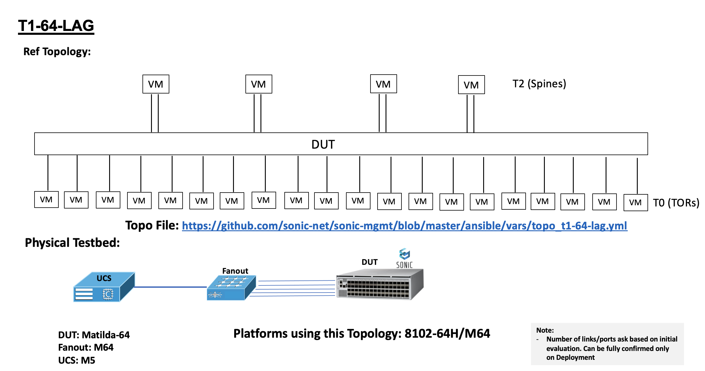

* Platforms using this Topology: 8102-64H(M64)
* Topo File: https://github.com/sonic-net/sonic-mgmt/blob/master/ansible/vars/topo_t1-64-lag.yml 

&nbsp;
&nbsp;
&nbsp;

#### T1-56-LAG (topology_id: t1-56-lag)

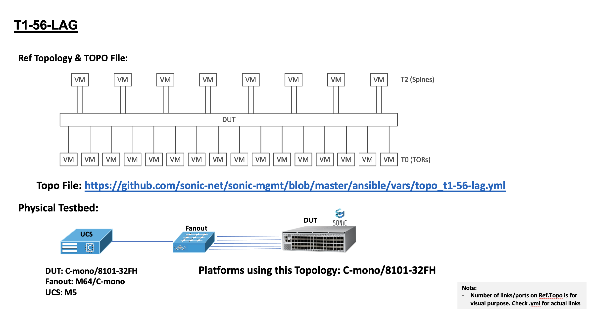

* Platforms using this Topology: 8101-32FH(C-Mono)
* Topo File: https://github.com/sonic-net/sonic-mgmt/blob/master/ansible/vars/topo_t1-56-lag.yml 

&nbsp;
&nbsp;
&nbsp;

#### T1-LAG (topology_id: t1-lag)

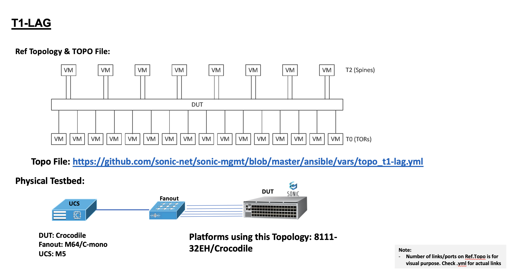

* Platforms using this Topology: 8111-32EH(Crocodile)
* Topo File: https://github.com/sonic-net/sonic-mgmt/blob/master/ansible/vars/topo_t1-lag.yml 

&nbsp;
&nbsp;
&nbsp;

#### T1-LAG-Lightning (topology_id: t1-lag-lightning)

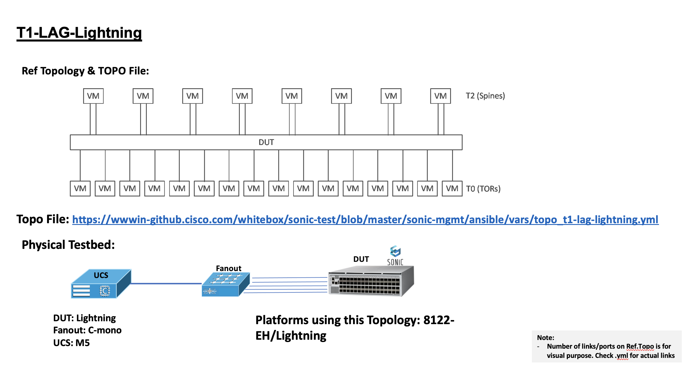

* Platforms using this Topology: 8122-64EH(Lightning)
* Topo File: https://wwwin-github.cisco.com/whitebox/sonic-test/blob/master/sonic-mgmt/ansible/vars/topo_t1-lag-lightning.yml

&nbsp;
&nbsp;
&nbsp;

#### T1-LAG-Superbolt (topology_id: t1-lag-superbolt)

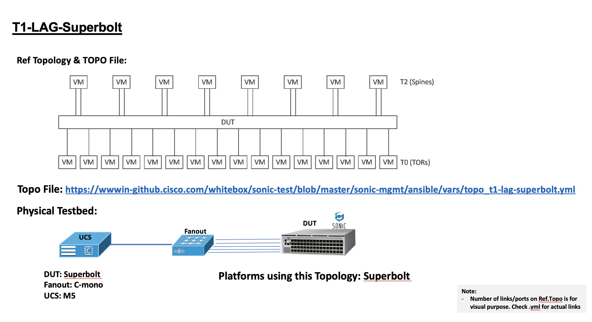

* Platforms using this Topology: 8122-64EH(Superbolt)
* Topo File: https://wwwin-github.cisco.com/whitebox/sonic-test/blob/master/sonic-mgmt/ansible/vars/topo_t1-lag-superbolt.yml

&nbsp;
&nbsp;
&nbsp;

### T0 type topology

The T0 type topology is to simulate a SONiC DUT running as a T0 device.

For this type of topology, a set of of the DUT ports are connected to VMs simulating upstream T1 neighbors. Rest of the ports are connected to a PTF docker simulating downstream servers.

Below are details of some of the T0 variations:

&nbsp;
&nbsp;
&nbsp;

#### T0-64 (topology_id: t0-64)

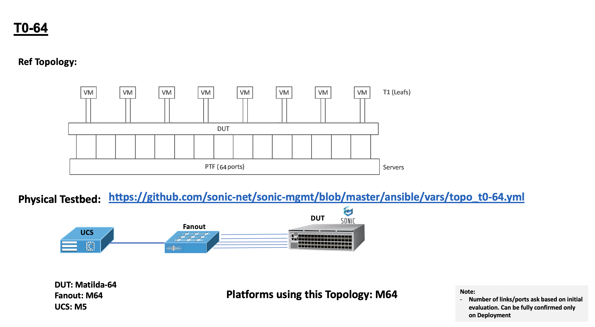

* Platforms using this Topology: 8102-64H(M64)
* Topo File: https://github.com/sonic-net/sonic-mgmt/blob/master/ansible/vars/topo_t0-64.yml 

&nbsp;
&nbsp;
&nbsp;

#### T0 (topology_id: t0)

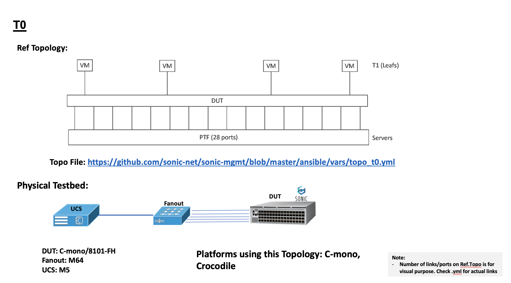

* Platforms using this Topology: 8101-32FH(Churchill-Monno), 8111-32EH(Crocodile)
* Topo File: https://github.com/sonic-net/sonic-mgmt/blob/master/ansible/vars/topo_t0.yml 

&nbsp;
&nbsp;
&nbsp;

#### T0-Lightning (topology_id: t0-lightning)

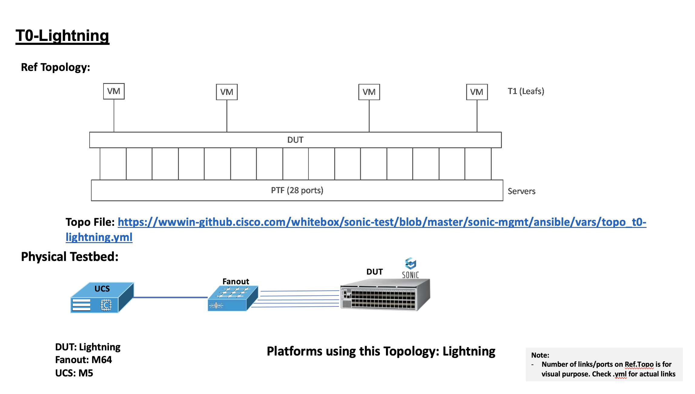

* Platforms using this Topology: 8122-64EH(Lightning)
* Topo File: https://wwwin-github.cisco.com/whitebox/sonic-test/blob/master/sonic-mgmt/ansible/vars/topo_t0-lightning.yml  

&nbsp;
&nbsp;
&nbsp;

### DualToR type Topology

Below are the details of the DualToR variations:

#### DualToR-56 (topology_id: dualtor-56)

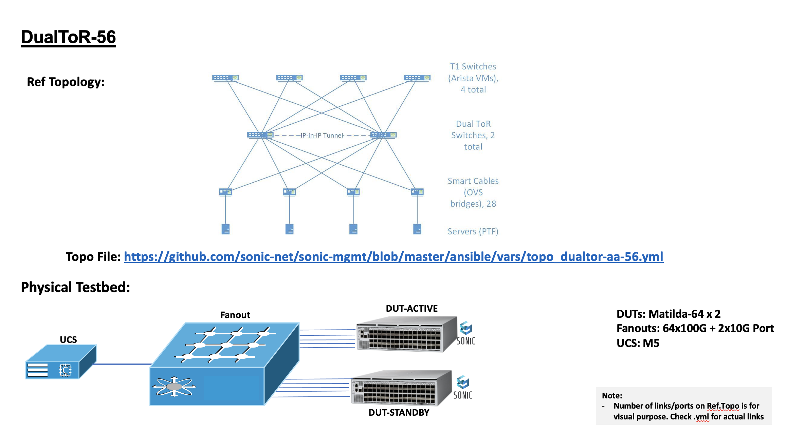

* Platforms using this Topology: 8101-64H(M64)
* Topo File: https://github.com/sonic-net/sonic-mgmt/blob/master/ansible/vars/topo_dualtor-aa-56.yml 

&nbsp;
&nbsp;
&nbsp;

### T2 type Topology

Below are the details of the T2 variations for Modular Chassis:

#### T2 SF-D (topology_id: t2-sfd)

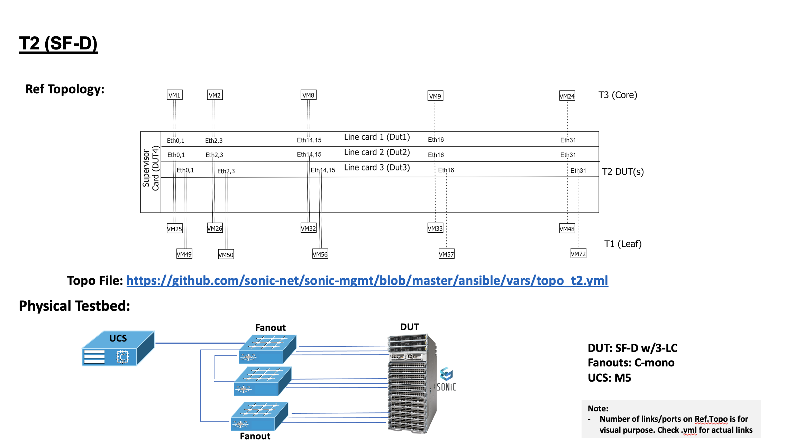

* Platforms using this Topology: 8800 with 3 LC (Vanguard, Gauntlet)
* Topo File: https://github.com/sonic-net/sonic-mgmt/blob/master/ansible/vars/topo_t2.yml  

&nbsp;
&nbsp;
&nbsp;

### Smartswitch type Topology

Below are the details of the Smartswitch variations:

&nbsp;
&nbsp;
&nbsp;

### Mt.Fuji T1 Topology (topology_id: mt-fuji-t1)

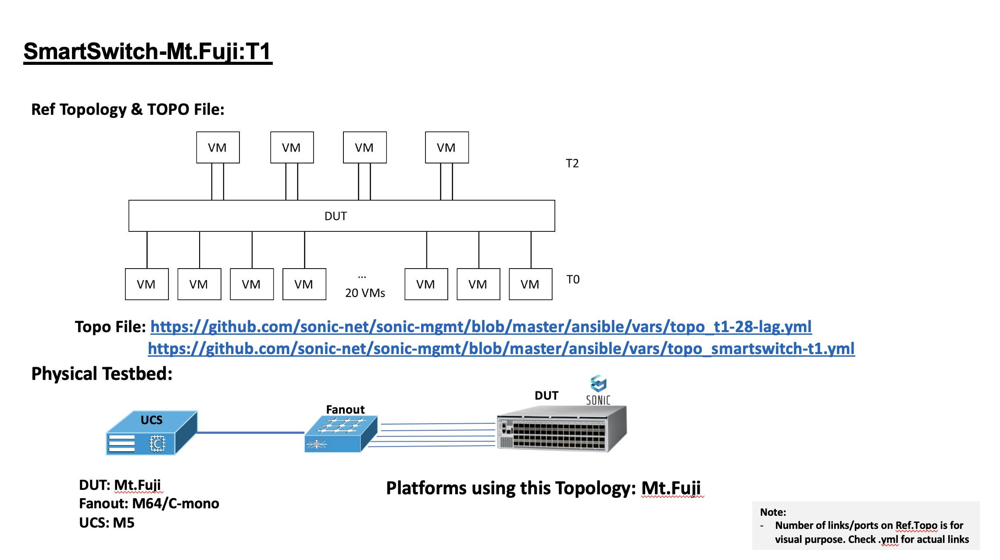

* Platforms using this Topology: Mt.Fuji
* Topo File: https://github.com/sonic-net/sonic-mgmt/blob/master/ansible/vars/topo_smartswitch-t1.yml

&nbsp;
&nbsp;
&nbsp;

### SONiC B2B(Back-to-Back) type Topology

#### SONiC Tests: B2B Topology (topology_id: sonic-tests-b2b)

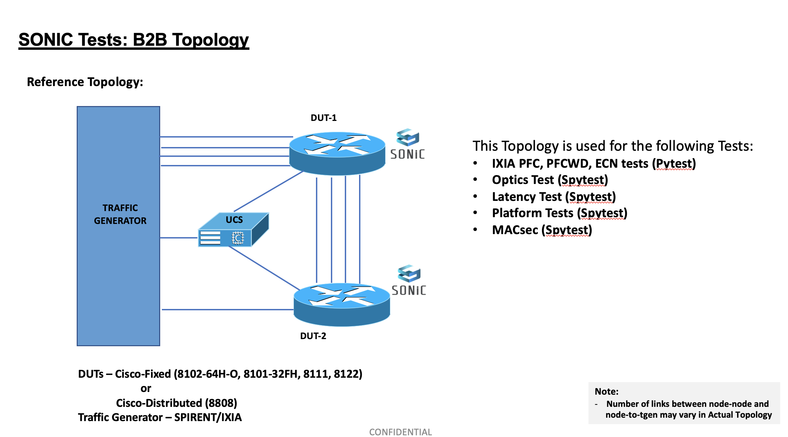

This reference topology is used for the following tests: ('test-name' 'Framework')

* IXIA PFC, PFCWD, ECN tests (Pytest)
* Optics Test (Spytest)
* Latency Test (Spytest)
* Platform Tests (Spytest)
* MACsec (Spytest)

Additional details regarding the exact topo used for each of these B2B tests is provided below

&nbsp;
&nbsp;
&nbsp;

### Other Topology Types

The topologies in this section are **purpose-built** test setups that do not fit cleanly into the standard T0/T1/T2/DualToR categories.
Each subsection below includes the reference diagram and notes on the platforms/tests that use it.

#### SONiC-Mgmt Pytest TGEN Topology (topology_id: N/A - Use above 'sonic-tests-b2b' for this)

These are IXIA based topologies mainly used to execute Pytest PFC, PFCWD, ECN tests
Theses topologies utilize the above B2B setup

Reference Wikis with additional details to bringup this topology are below.

Fixed Systems:

* https://wiki.cisco.com/display/HEROBU/PFC+SETUPs 
* https://wiki.cisco.com/display/HEROBU/Troubleshooting+Ixia+scripts 
* https://wiki.cisco.com/display/WHITEBOX/Running+IXIA+Sonic-mgmt+test+on+SONiC

* Platforms using this Topology: 8102-64H-O, 8101-32FH, 8111, 8122

Chassis/T2 Systems:

* https://wiki.cisco.com/display/HEROBU/T2-Ixia
* https://github.com/sonic-net/sonic-mgmt/blob/master/ansible/vars/topo_t2-ixia-3lc-4.yml 
* https://github.com/sonic-net/sonic-mgmt/blob/master/ansible/vars/topo_t2-ixia-2lc-4.yml 

* Platforms using this Topology: Cisco-Distributed (8808)

Note: For both of these, the Topo bringup is done via handcrafted Minigraph 

&nbsp;
&nbsp;
&nbsp;

#### Latency Tests Topology (topology_id: latency-tests)

This test also leverages the above B2B topology

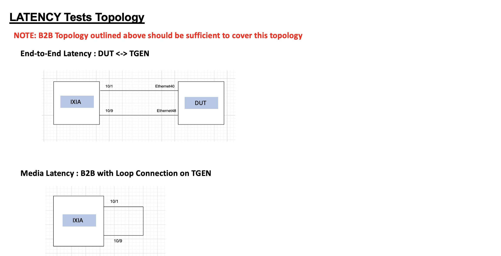

The above topology is used for Latency tests

* Platforms using this topology: 8111, 8122

&nbsp;
&nbsp;
&nbsp;

#### Optics Tests Topology (topology_id: optics-tests)

This test also leverages the above B2B topology

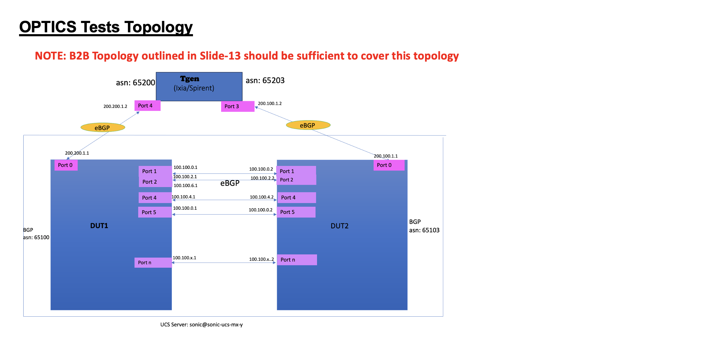

The above topology is used for Optics tests

* Platforms using this topology: ALL

&nbsp;
&nbsp;
&nbsp;

#### SNT VRF Test Topology (topology_id: vrf-snake-test)

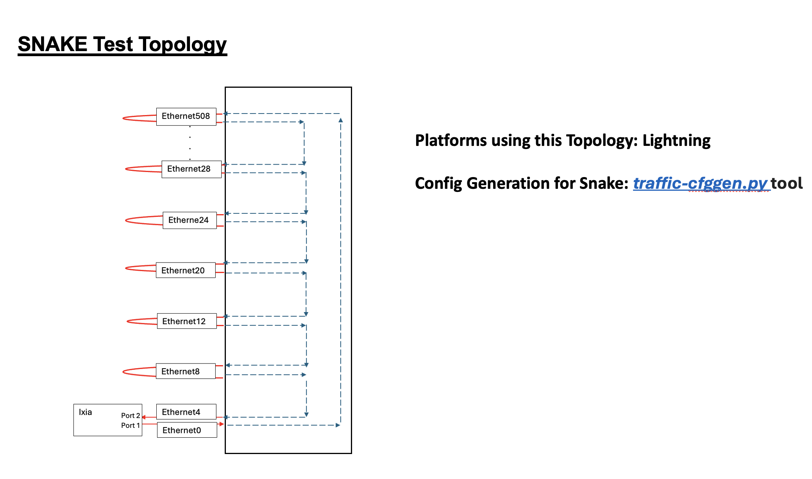

The above topology is used for Snake test using VRF

* Platforms using this topology: 8201/8101/8122

&nbsp;
&nbsp;
&nbsp;

#### EDVT L2Vlan Test Topology (topology_id: vlan-snake-test)

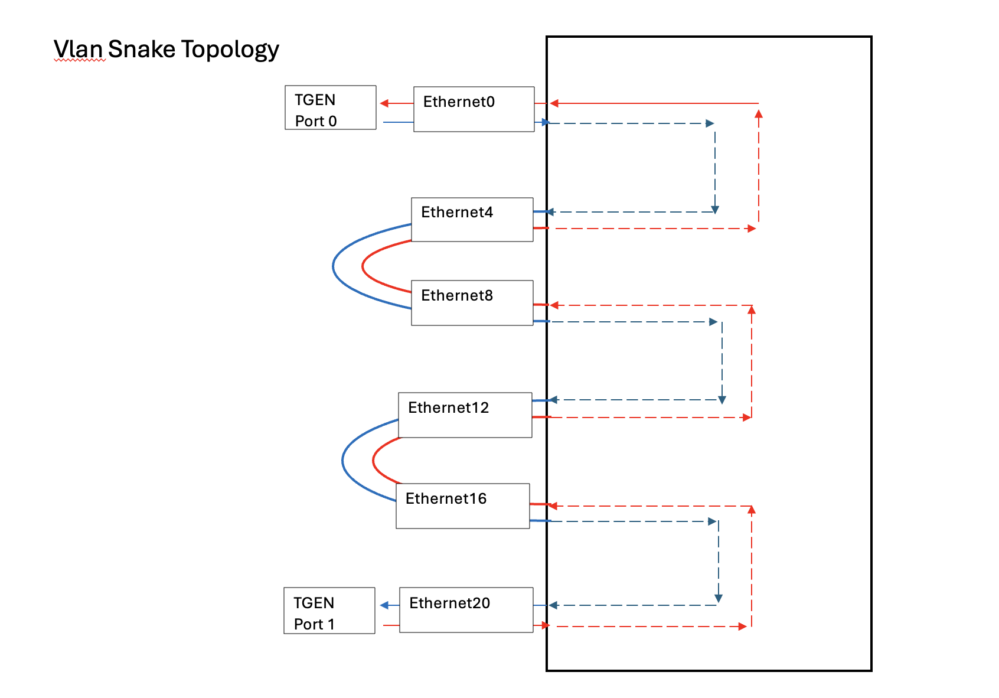

* Platforms using this topology: 8201/8101/8122

### Tortuga Test Topologies

Below are the reference topologies for various Tortuga Test activities

#### Tortuga: Dev and CI/CD Test Topology (topology_id: tortuga-dev-cicd-test)

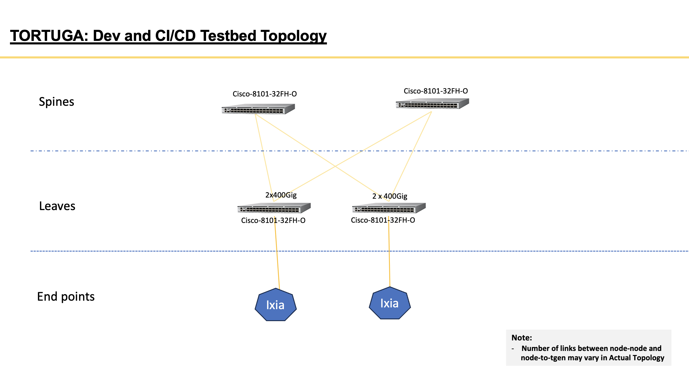

&nbsp;
&nbsp;
&nbsp;

#### Tortuga: Solution Test Topology (topology_id: tortuga-solution-test)

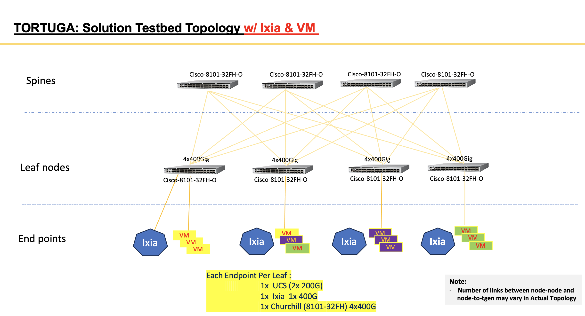

&nbsp;
&nbsp;
&nbsp;

#### Tortuga: Performance & Scale Test Topology (topology_id: tortuga-performance-scale-test)

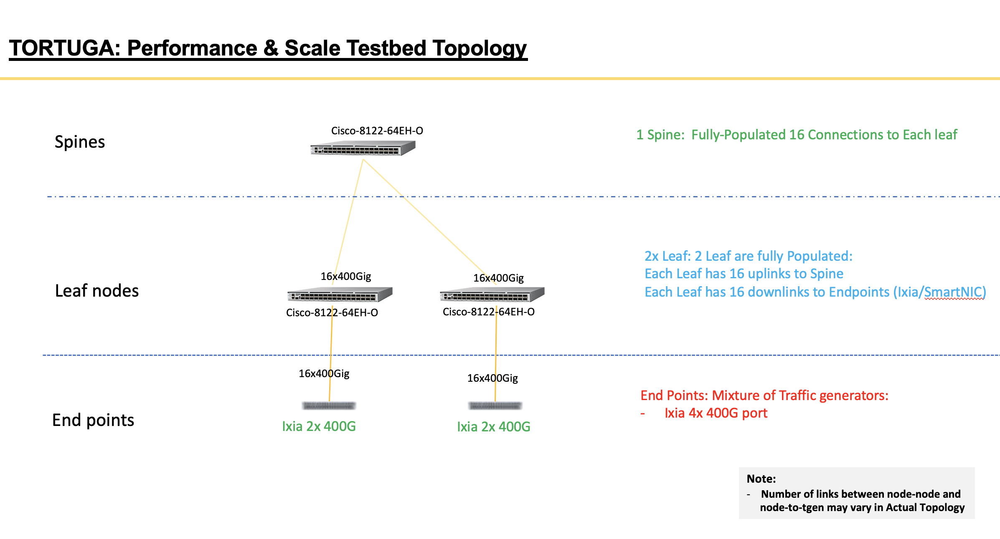

&nbsp;
&nbsp;
&nbsp;

#### Ostara: Solution Test Topology (topology_id: ostara-solution-test)

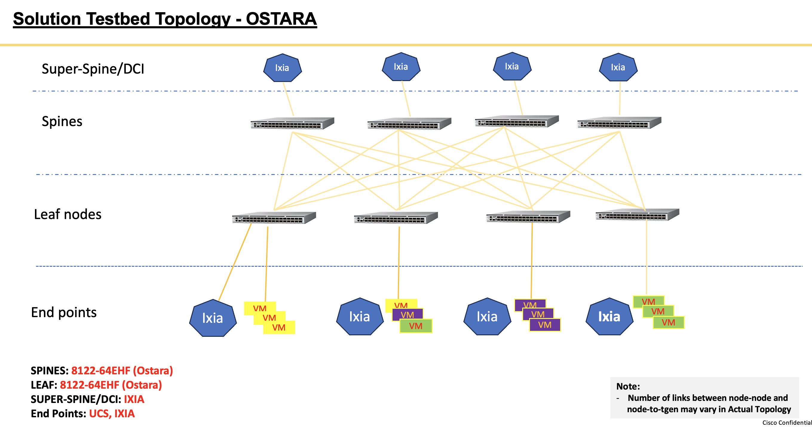
