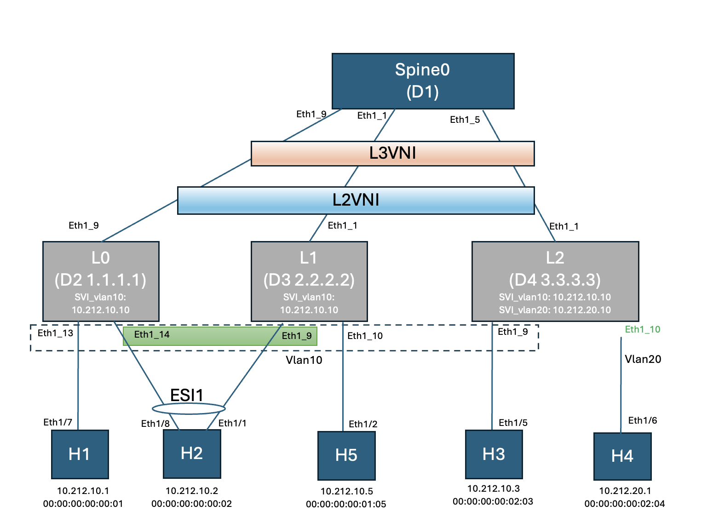

Steps to run Spytest:
1. Make changes in pyvxr_yaml_files/tortuga_spytest_5D_linux_ixia_cmono.yaml to load your image
2. vxr.py clean
3. vxr.py start pyvxr_yaml_files/tortuga_spytest_5D_linux_ixia_cmono.yaml
4. vxr.py ports 
5. Login to sonic-mgmt
6. Follow steps from sonic-mgmt/spytest/tests/cisco/tortuga/README.md
7. ./bin/spytest --testbed tortuga_spytest_topo_EVPN_MH.yaml --device-feature-group master --module-init-max-timeout=7200 --tc-max-timeout=7200 /data/tests/cisco/tortuga/vxlan/test_evpn_mh_v6.py
