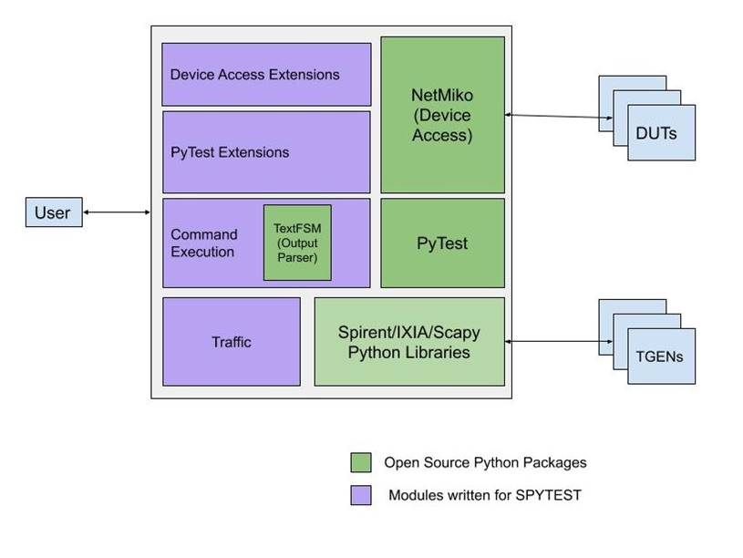
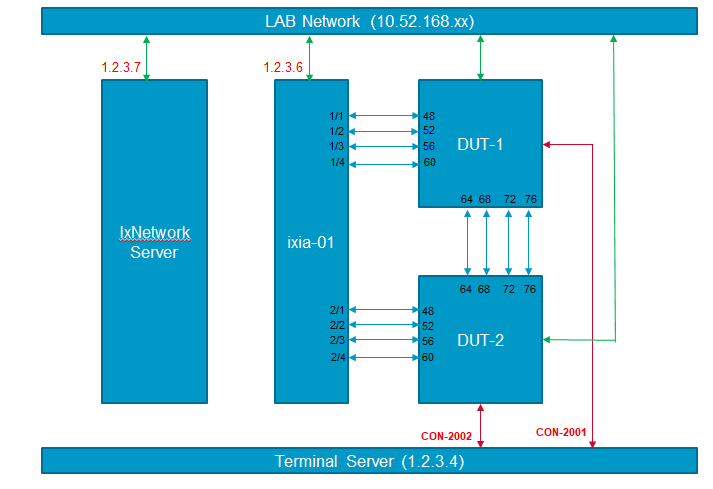
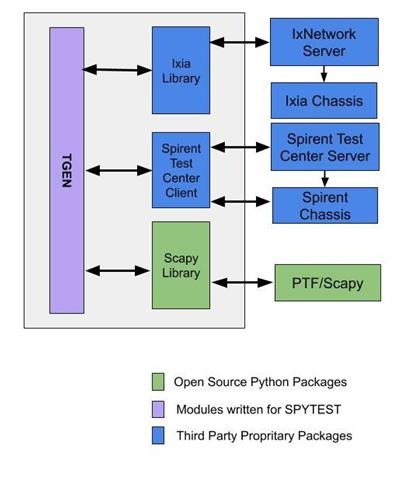
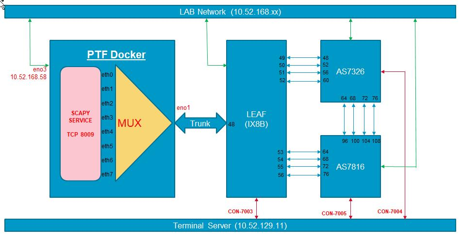
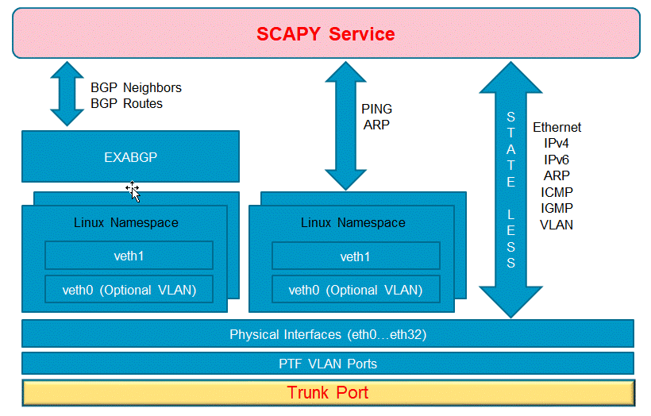

Overview
========

The SPyTest is test automation for validating SONiC. It is based on **PyTest** and is developed leveraging open source Python packages available for device access/interaction and CLI output parsing.

SPyTest constitutes of following components.

    * Framework
    * TGen API
    * Feature API
    * Utility API
    * TextFSM Templates
    * Test Scripts

Please read [ROOT] as [git-repo-clone]/spytest in this document.

##### Framework
Please refer to [ROOT]/spytest/infra.py for list of functions.

These functions are expected to be called from feature API and they abstract the device interaction and other common operations like below.

* Error Pattern Detection and Result Classification
* Crash Detection and Recovery
* Power cycle operations using Remote Power Supply (RPS)

##### TGen API

The SPyTest uses **HLTAPI** to interface commercial traffic generators (TGen) like Ixia and Spirent.
The same API are implemented using Scapy to generate traffic in PTF environment. More details are in **Traffic Generation** section of this document.

##### Feature API
Please refer to [ROOT]/apis/***/*.py for list of functions.

These functions are expected to be called from test scripts and they abstract the UI and version differences.

##### Utility API
Please refer to [ROOT]/utilities/*.py for list of functions.

These functions provide commonly used utility functions to avoid code duplication.
As a guideline, we should avoid adding DUT specific functions in utilities.

##### TextFSM Templates

The SPyTest uses SONiC CLI to interface with DUTs (Devices under Test).
It uses **Netmiko** library to execute the commands on telnet/ssh connections.
The CLI output is parsed using **TextFSM** templates to convert into Python dictionary for further processing.

The framework API applies TextFSM templates for show command output and returns the parsed output to the caller. The templates need to be added at [ROOT]/templates and update the index file in the same directory. Sample TextFSM templates are available for large number of commands in github [ntc-templates](https://github.com/networktocode/ntc-templates)

Please refer to the [TEXTFSM](https://github.com/google/textfsm/wiki/TextFSM) document on github.

##### Test Scripts

Test Script (also referred as module) is a logical collection of discrete test functions, grouped together based on functionality. It contains one or more test functions each verifies one or more test cases.

Testbed
=======
The testbed file specifies the topology information as described below and it is mandatory input to SPyTest run.

#### Sample topology

testbed file content for this topology is given below.

    version: 2.0
    services: {default: !include sonic_services.yaml}

    params: !include sonic_params.yaml
    instrument: !include sonic_instrument.yaml
    builds: !include sonic_builds.yaml
    speeds: !include sonic_speeds.yaml
    errors: !include sonic_errors.yaml
    configs: !include sonic_configs_all.yaml

    devices:
        DUT-01:
            device_type: sonic
            access: {protocol: telnet, ip: 1.2.3.4, port: 2001}
            credentials: {username: admin, password: password, altpassword: YourPaSsWoRd}
            properties: {config: default, build: default, services: default, speed: default}
            breakout: {Ethernet0: 4x10, Ethernet8: 4x10}
            rps: {model: Raritan, ip: 1.2.3.5, outlet: 10, username: admin, password: admin}
        DUT-02:
            device_type: sonic
            access: {protocol: telnet, ip: 1.2.3.4, port: 2001}
            credentials: {username: admin, password: password, altpassword: YourPaSsWoRd}
            properties: {config: default, build: default, services: default, speed: default}
            breakout: {}
            rps: {model: Raritan, ip: 1.2.3.5, outlet: 11, username: admin, password: admin}
        ixia-01:
            device_type: TGEN
            properties: {type: ixia, version: "8.42", ip: 1.2.3.6, ix_server: 1.2.3.7}
        stc-01:
            device_type: TGEN
            properties: {type: stc, version: 4.91, ip: 1.2.3.8}
        scapy-01:
            device_type: TGEN
            properties: {type: scapy, version: 1.0, ip: 1.2.3.8}

    topology:
        DUT-01:
            interfaces:
                Ethernet64: {EndDevice: DUT-02, EndPort: Ethernet64}
                Ethernet68: {EndDevice: DUT-02, EndPort: Ethernet68}
                Ethernet72: {EndDevice: DUT-02, EndPort: Ethernet72}
                Ethernet76: {EndDevice: DUT-02, EndPort: Ethernet76}
                Ethernet48: {EndDevice: ixia-01, EndPort: 1/1}
                Ethernet52: {EndDevice: ixia-01, EndPort: 1/2}
                Ethernet56: {EndDevice: ixia-01, EndPort: 1/3}
                Ethernet60: {EndDevice: ixia-01, EndPort: 1/4}
        DUT-02:
            interfaces:
                Ethernet48: {EndDevice: ixia-01, EndPort: 2/1}
                Ethernet52: {EndDevice: ixia-01, EndPort: 2/2}
                Ethernet56: {EndDevice: ixia-01, EndPort: 2/3}
                Ethernet60: {EndDevice: ixia-01, EndPort: 2/4}

The **services** section contains details on external services like radius/tacacs. The data in each service is decided by test scripts. This helps to abstract the service details from test scripts. Refer to testbeds/sonic_services.yaml for more details

The **builds** section contains details on build locations.
Refer to testbeds/sonic_builds.yaml for more details

The **speeds** section contains details on speed profiles.
Refer to testbeds/sonic_speeds.yaml for more details

The **errors** section contains details on error patterns. This is used to classify the test result when a specific pattern of errors are seen in the CLI output.
Refer to testbeds/sonic_errors.yaml for more details

The **configs** section contains details on configuration to be applied before executing test scripts. Refer to testbeds/sonic_configs.yaml for more details.

**Note:** The above sections can be filled in line or included from other files in testbeds folder

The **devices** section contains list of devices, which are referred in **topology** section.
Each child of of this node represents single device, which can be DUT or TGen as denoted by **device_type** attribute.

* **device_type**
   * Type of the device
   * currently supported devices [sonic, TGEN]

 The details of DUT attributes are as given below:

* **access**
   * DUT access details
     * **protocol**
       * DUT access protocol
       * currently supported access protocols [telnet, ssh]
     * **ip**
       * IP address for telnet/ssh connection to DUT
       * Only IPv4 address is currently supported
     * **port**
       * TCP port for telnet/ssh connection to DUT

* **credentials**
   * DUT access credentials
     * **username**
       * DUT access username
     * **password**
       * DUT access password
     * **altpassword**
       * DUT access alternative password
       * This is useful if we need to change the default password on first boot

* **properties**
   * DUT properties
     * **config**
       * Configuration profile name to be applied before executing test scripts
       * The profile details read from yaml section name matching with this name under **configs**
       * Refer to testbeds/sonic_configs.yaml for more details
     * **build**
       * Build profile name to be applied before executing test scripts
       * The profile details read from yaml section name matching with this name under **builds**
       * Refer to testbeds/sonic_builds.yaml for more details
     * **services**
       * Services profile name to be used for external services like radius/tacacs
       * The profile details read from yaml section name matching with this name under **services**
       * Refer to testbeds/sonic_services.yaml for more details
       * TODO: add mode details
     * **speed**
       * Speed profile name to be applied before executing test scripts
       * The profile details read from yaml section name matching with this name under **speeds**
       * Refer to testbeds/sonic_speeds.yaml for sample

* **breakout**
   * Static port breakout configuration
   * This is essentially list of interface-name, breakout-mode pairs.

* **rps**
   * Remote Power Supply (PDU) details
     * **model**
       * RPS Model
       * currently supported models [Raritan, ServerTech, Avocent]
       * Telnet protocol to interface with RPS
     * **ip**
       * IP address of RPS
       * Only IPv4 address is currently supported
     * **outlet**
       * RPS outlet identification
     * **username**
       * RPS telnet username
     * **password**
       * RPS telnet password

 The details of TGen attributes are as given below:

* **properties**
   * TGen properties
     * **type**
       * Traffic Generator Type
       * Currently supported TGen types [ixia, stc, scapy]
     * **version**
       * Traffic Generator version
       * Supported versions:
         * ixia 8.42
         * stc 4.91
         * scapy 1.0 [scapy TGEN version is just a place holder and not used]
     * **ip**
       * Traffic Generator chassis IP address
       * Only IPv4 address is currently supported
     * **ix_server**
       * This is only applicable for Ixia
       * This is IxNetwork Server IP Address
       * Only IPv4 address is currently supported
       * TODO: Add section on IxNetwork

The **topology** section gives interconnect details between DUTs as well as interconnect between each device with TGen. Each child of of this node represents a topology element and should be a DUT name from **devices** section. The interconnections are specified in **interfaces** child of each topology element. Each connected interface will have **EndDevice** and **EndPort** attributes representing the partner and its link.

Traffic Generation
==================

The SPyTest supports Ixia and Spirent third party traffic generators, which provide client libraries to talk to hardware.

#####   Ixia

* Ixia is supported in the IxNetwork Server mode
* User should use an intermediate server to host the IxNetwork Server
* Start IxNetwork API server in the server where the IxNetwork Server is installed
* The IxNetwork Server IP address needs to be given in setup file as "ix_server"
* Currently SPyTest is verified with below IxNetwork versions
    * 8.42
* There are differences in the way to install and launch these versions.
  Please consult the Ixia documentation for more details.

#####   Spirent

* Spirent is supported in Spirent Testcenter client mode
* Currently SPyTest is verified with below Spirent versions
    * 4.91

##### API

All the HLTAPIs are exposed as wrapper functions in the format "tg_[HLTAPI]". There are few differences between Ixia and Spirent which are handled in these wrapper functions. As and when any new differences are identified, we should be able to add them easily in these wrapper functions.

Users can refer to either the Ixia or Spirent HLTAPI reference guides and invoke the tg_[HLTAPI].

#####   Scapy

* Scapy is supported using the Scapy service in PTF docker
* Scapy service implements tg_[HLTAPI] functions which are remotely called from SPyTest
* Currently PTF does not support connections between devices through fan-out switch.
  Once this is implemented the direct connections between devices can be removed.
* The PTF docker can also be used for legacy PTF test scripts execution as the Scapy Service will not take control of the PTF ports without SPyTest connecting to it.
* Refer to **Execution Modes**/**PTF Mode** for instructions on setting up PTF environment

* Stateless Traffic Support
    * Only packet types that are exercised are in SPyTest are implemented
        * For example: Ether/Dot1Q/ARP/IPv4/IPv6/UDP/TCP/ICMP/IGMP/Custom Payload
        * Will add new packet types as and when required
    * Various frame sizes
    * Start/Stop/Enable/Disable/Modify streams
    * Capture Clear/Start/Stop/Fetch
    * Stats Reset/Fetch
    * Increment/Decrement
        * SRC/DST MAC/IPv4/TCP Ports/UDP Ports/VLAN
* Host Emulation Support
    * Create/Delete Interfaces
    * Assign IPv4/IPv6 Addresses
    * Ping Support
    * ARP support
* Protocol Emulation Support
    * Currently Not supported fully
    * Only basic BGP neighborship is unit tested

Execution Modes
===============

The SPyTest supports executing tests in standalone environment and PTF environment.

#### PTF Mode

Refer to [README.testbed.md](https://github.com/Azure/sonic-mgmt/blob/master/ansible/README.testbed.md) for setting up PTF-32  or PTF-64 topology.

#### Standalone Mode

In standalone mode, the DUTs can be connected to each other and TGen.

Environment - PTF Mode
==============================

Refer to [README.testbed.Overview.md](https://github.com/Azure/sonic-mgmt/blob/master/ansible/doc/README.testbed.Overview.md) for setting up PTF environment details.

Environment - Standalone Mode
==============================

SPyTest currently supports Python2 and pip. The needed packages can be installed using

    [ROOT]/bin/upgrade_requirements.sh

The below environment file need to be modified to suit to your needs

    [ROOT]/bin/env

The traffic generator libraries are expected to be present at below location. The path can be customized using environment variable SCID_TGEN_PATH also.

    /projects/scid/tgen

The traffic generator libraries installation should look similar to content in below file

    [ROOT]/bin/tgen_folders.txt

*Please refer to install.md for more details on installation*

Executing Tests
===============

First step is to create the testbed file with physical connection details.

#### Running test script(s)

    [ROOT]/bin/spytest --testbed testbed_file.yaml  \
        [ROOT]/tests/sanity/test_sanity_l2.py \
        [ROOT]/tests/sanity/test_sanity_l3.py \
        --logs-path <folder-to-create-logs>

#### Running tests using PyTest marker

    [ROOT]/bin/spytest --testbed testbed_file.yaml  \
        -m community_pass --logs-path <folder-to-create-logs>

#### Running tests using suite name

    [ROOT]/bin/spytest --testbed testbed_file.yaml  \
        --test-suite <suite name> --logs-path <folder-to-create-logs>

The test suite files are expected to be present in [ROOT]/reporting/suites folder.
*Please refer to community-ptf for example suite definition.

#### Execution Results and Logs

The results are stored in a CSV file with the date (YYYY-MM-DD) and time (HH-MM-SS) included in the file name
e.g. results_2020_04_04_15_27_result.csv

The log messages are stored in a log file with the date (YYYY-MM-DD) and time (HH-MM-SS) included in the file name
e.g. results_2020_04_04_15_27_logs.log

#### Command line arguments

The following custom command line options are added to SPyTest in addition to existing PyTest [options](https://docs.pytest.org/en/latest/)

*   --testbed-file=[file path]
    * testbed file path -- default: ./testbed.yaml
*   --tclist-file=[file path]
    * file with test function names
*   --tclist-csv=[csv]
    * comma separated list of test functions
*   --logs-path=[logs folder path]
    * logs folder -- default: [current directory]
*   --email=EMAIL
    * Email address(es) to send report to
*   --port-defaults={breakout,speed,both,none}
    * set port defaults -- default: none
*   --load-image={installer,onie,none}
    * Loading image before and after execution using specified method -- default: onie
*   --memory-check={test,module,none}
    * read memory usage default: none
    * The setting determines when the logs need to be collected
        * none - never
        * test - at the end of test function
        * module - at the end of module
*   --syslog-check={emerg,alert,crit,err,warning,notice,info,debug,none}
    * read syslog messages of given level at the end of every module. default: err
*   --save-sairedis={none,test,module}
    * Fetch the sairedis logs from DUT to logs location
    * The setting determines when the logs need to be collected
        * none - never
        * test - at the end of test function
        * module - at the end of module
*   --port-init-wait=PORT_INIT_WAIT
    * Wait time in seconds for ports to come up after clearing configurationn -- default: 300
*   --fetch-core-files={always,onfail,none,onerror,session,onfail-epilog,module-always,module-onfail,module-onerror}
    * Fetch the core files from DUT to logs location -- default: session
    * The setting determines when the core files need to be collected
        * always - at the end of every test function
        * onfail - at the end of every failed test function
        * none - never
        * onerror - at the end of every test function if it is failed with errors as given in sonic_errors.yaml
        * session - at the end of entire run
        * module-always - at the end of every module
        * module-onfail - at the end of every module if it has at least one test function is failed
        * module-onerror - at the end of every module if it has at least one test function is failed with errors as given in sonic_errors.yaml
*   --get-tech-support={always,onfail,none,onerror,session,onfail-epilog,module-always,module-onfail,module-onerror}
    * Get the tech-support information from DUT to logs location -- default: onfail-epilog
    * The setting determines when the tech support need to be collected
        * always - at the end of every test function
        * onfail - at the end of every failed test function
        * onfail-epilog - at the end of every failed test function before cleanup
        * none - never
        * onerror - at the end of every test function if it is failed with errors as given in sonic_errors.yaml
        * session - at the end of entire run
        * module-always - at the end of every module
        * module-onfail - at the end of every module if it has at least one test function is failed
        * module-onerror - at the end of every module if it has at least one test function is failed with errors as given in sonic_errors.yaml
*   --tc-max-timeout=TC_MAX_TIMEOUT
    * Max time that a testcase can take to execute -- default: 600
*   --module-init-max-timeout=MODULE_INIT_MAX_TIMEOUT
    * Max time that a module initialization can take to execute -- default: 1200
*   --random-order={0,1}
    * Enable executing tests in random order -- default: 1
*   --community-build={none,master,201911}
    * Community build support -- default: none

Log Files
=========
List of logs files generated are as given below where [PREFIX] = "results_%Y_%m_%d_%H_%M_%S"

* [PREFIX]_dlog-[DUTID]-[DUTNAME].log
    * This contains per DUT log, where DUTID is D1,D2 etc and DUTNAME is as given in testbed file
    * One file will be generated for each DUT in the testbed file
* [PREFIX]_logs.log
    * This is consolidate log for all the entire run
* [PREFIX]_stdout.log
    * This is same as [PREFIX]_logs.log except that any stdout/stderr messages from SPyTest and dependent libraries also get logged
* [PREFIX]_summary.txt
    * This contains final summary of run with how many tests executed, time taken, pass rate etc.
* [PREFIX]_functions.csv
    * This contains result of each test function executed in the run
    * It also contain result, description, time taken etc.
* [PREFIX]_functions.html
    * This is same as [PREFIX]_functions.csv in HTML table for readily viewing in browser.
* [PREFIX]_testcases.csv
    * This contains result of each test case executed in the run
    * As mentioned in the beginning each test function may have one or more test cases
    * It also contain result, description, time taken etc.
* [PREFIX]_testcases.html
    * This is same as [PREFIX]_testcases.csv in HTML table for readily viewing in browser.
* [PREFIX]_modules.csv
    * This contains result counts (number of test functions) in various categories per test module and the time taken for each module
* [PREFIX]_modules.html
    * This is same as [PREFIX]_modules.csv in HTML table for readily viewing in browser.
* [PREFIX]_features.csv
    * This contains result counts (number of test cases) in various categories per test component and the time taken for each
    * Please refer to [ROOT]/reporting/tcmap.csv for test cases association to components
    * Example component names: Regression, NAT
* [PREFIX]_features.html
    * This is same as [PREFIX]_features.csv in HTML table for readily viewing in browser.
* [PREFIX]_stats.txt
    * This contains statistics on time spent in each CLI command and TGen operation for each module
* [PREFIX]_stats.csv
    * This contains statistics on total time spent in CLI and TGen for each module
* [PREFIX]_stats.html
    * This is same as [PREFIX]_stats.csv in HTML table for readily viewing in browser.
* [PREFIX]_syslog.csv
    * This contains syslog messages collected on all DUTs in each test module
    * Please check for --syslog-check command line option to configure the severity of messages to be collected and frequency
* [PREFIX]_syslog.html
    * This is same as [PREFIX]_syslog.csv in HTML table for readily viewing in browser.
* [PREFIX]_mlog_[module].log
    * This is same as [PREFIX]_logs.log but per module
* [PREFIX]_tgen
    * This contains TGen specific debug logs

Dashboard
===============
The dashboard.html contains links to various files generated

Internals
===============
### Init sequence

SPyTest performs below operations before executing the test modules.

* Validate the testbed file specified.
* Connect to all devices and TGen specified in testbed file.
* Upgrade the software on DUTs as specified in command line arguments
  or as given in testbed build profile.
* Remove all entries except for "DEVICE_METADATA" and "PORT" entries in config_db.json
* Perform static port breakout as specified in testbed file
* Configure port speeds as given in testbed speed profile
* Apply the configuration as given in the testbed config profile
* Save the resultant configuration as base configuration

### Base Configuration
As described in **Init Sequence** section, base configuration is created during the SPyTest initialization. The framework ensures that the system is brought to base configuration before starting any test modules.

### Module Configuration
The test modules are expected to configure the device and TGen in the module prologue and clean it up in module epilogue. Below example shows the way modules register these hooks.

    @pytest.fixture(scope="module", autouse=True)
    def sanity_l2_module_hooks(request):
        ########### module prologue #################
        yield
        ########### module epilogue #################

The framework will ensure to call prologue before any test functions in the module are executed. Similarly epilogue is executed after all test functions are executed.

### Customize Error Patterns
    TODO

### Batch Processing
    TODO

### Scheduling
    TODO

### Static Analysis
    [ROOT]/bin/lint.sh script can be used to perform static analysis.
    This invokes PyLint with flags to disable some of unsupported options

### Best Practices
    TODO

### Known Issues
    TODO

### Known Limitations
    TODO

### Roadmap
    TODO
