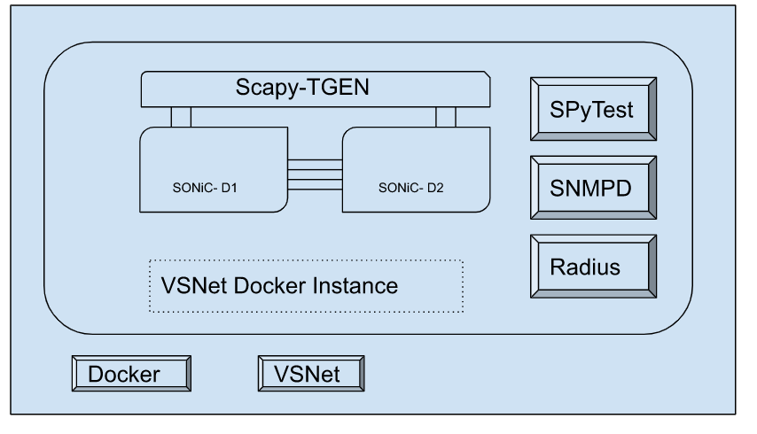

# VSNet - Virtual SONiC Network Helper

_Rev v0.1_

- [Revision](#revision)
- [Scope](#scope)
- [Definitions/Abbreviations](#definitionsabbreviations)
- [Overview](#overview)
- [Requirements](#requirements)
- [High-Level Design](#high-level-design)
	- [BUILD Phase](#build-phase)
	- [TOPO Phase](#topo-phase)
	- [Test Phase](#test-phase)
	- [Traffic Generator](#traffic-generator)
- [Server Requirements](#server-requirements)
- [Open/Action Items](#openaction-items)
- [Limitation/Known Issues](#limitationsknown-issues)

## Revision

Rev  | RevDate    | Author(s)   | Change Description
---- | ---------- | ----------- | ------------------
v0.1 | 05/05/2023 | Broadcom    | Initial Version

## Scope

This document describes the high-level design for VSNet helper.

## Definitions/Abbreviations

* **KVM** [Kernel-based virtual machine](https://en.wikipedia.org/wiki/Kernel-based_Virtual_Machine)
* **NBD** [Network Block Device](https://en.wikipedia.org/wiki/Network_block_device)
* **OVS** [Open vSwitch](https://en.wikipedia.org/wiki/Open_vSwitch)
* **TGEN** Traffic Generator
* **SPyTest** [Test Automation Framework existing in sonic-mgmt](https://github.com/sonic-net/sonic-mgmt/blob/master/spytest/Doc/intro.md)
* **SCAPY-TGEN** [Software based traffic generator with minimal HLTAPI interface](https://github.com/sonic-net/sonic-mgmt/blob/master/spytest/Doc/intro.md#traffic-generation)

## Overview

Creating a network of virtual SONiC instances using the manual steps outlined in the sonic-mgmt [documentation.](https://github.com/sonic-net/sonic-mgmt/blob/master/docs/testbed/README.testbed.VsSetup.md) can be a complex process. It involves several intricate steps that require careful attention to detail and a solid understanding of the underlying technologies involved.

The process begins with installing Ubuntu AMD64 on your host machine or virtual machine (VM) and ensuring that Python and the required pip packages are installed. Additionally, the installation and configuration of the docker-ce package are required to enable the use of Docker containers. Once installed the management bridge network needs to be configured. The sonic and partner build images needs to be unpacked into specific folder structure. All testbed configuration steps and tests are run from a sonic-mgmt docker container and hence this needs to be created and started. During the setup process, it may be necessary to make modifications to the ansible files along with setting up SSH keys. Finally the VMs can be started using testbed-cli.sh utility. Overall, creating a network of virtual SONiC instances through these manual steps can be a challenging endeavor. It demands a strong understanding of the underlying technologies, careful execution of each step, and troubleshooting skills to overcome potential obstacles that may arise during the process.

VSNet is an efficient tool that simplifies the process of creating virtual instances of the SONiC operating system within a controlled environment and connecting them based on the specified network topology. It is designed to be used on a server or virtual machine (referred to as a "SERVER" throughout), where the Docker daemon is already active. To facilitate scaling, it also provides the option of running these instances as containers instead of virtual machines.

To simplify the language, we will refer to each virtual SONiC instance as a "DUT" moving forward, while the term "HOST" will refer to the environment in which they are contained.

## Requirements

Functional requirements:
* should provide easy and concise way to specify the topology
* should depend on very few dependencies on host system
* should provide option to execute SPyTest test modules
* should support both VM and container based virtual instances

## High-Level Design

The VSNet architecture consists of three key phases, namely BUILD, TOPO, and TEST.

### BUILD Phase

In the BUILD phase, VSNet generates a Dockerfile that includes all the necessary Linux components for running virtual machines (VMs) and containers, such as systemd, docker-ce, libvirt, and python. This Dockerfile is used to create the HOST image, which is a one-time process if we are running on a dedicated SERVER. In other circumstances, such as on-demand cloud platforms, the build step might be used repeatedly. We can use --host argument if we are trying to use a remote docker or define DOCKER_HOST as environment variable.

	vsnet build --host <DOCKER_HOST>|unix:///var/run/docker.sock

### TOPO Phase
	
VSNet first creates the HOST using the container image prepared in the BUILD phase. Any previously created instances with the same --name are deleted before a new instance is created. This will ensure that our environment is clean.	

The topology specified is parsed to identify the number of DUTs to be created and the inter-connections needed between them as well as to the virtual traffic generator. For example, <b>--topology POD:A D1D2:4 T1D1:2 T1D2:2 </b> indicates the need for two DUTs with names A1 and A2 to be connected with 4 links, and each of the DUTs is connected to the virtual traffic generator with 2 links. The POD:A indicates the prefix to be used for the DUTs, and 'T1' here indicates the virtual traffic generator. Although multiple virtual traffic generators in one topology are not supported, it is kept as T1 to be consistent with the DUT naming.

To instantiate DUTs, VSNet uses VMs by default, but users can opt to use containers instead by specifying the --platform docker command-line parameter. The <b><u>virsh</u></b> utility from the <b><u>libvirt</u></b> package is utilized to define the VM by passing a domain xml file, which is created by VSNet for each DUT. This xml file contains information on memory/CPU resource limits, image path, and interfaces required by the VM based on the topology.

	virsh -q define A1.xml
	virsh start A1

After starting the VMs, the interfaces that were defined in the xml files are visible to the HOST. However, in order to establish connectivity between the VMs, these interfaces need to be added to a bridge. This can be achieved using either a Linux bridge or an Open vSwitch (OVS) bridge. However, the Linux bridge requires patching of the kernel to forward Link Aggregation Control Protocol (LACP) packets, whereas OVS does not. Hence, VSNet utilizes the OVS bridge for this purpose. The <b><u>ovs-ofctl</u></b> utility from the <b><u>openvswitch</u></b> package is used to add two open-flow rules with "output" action for each interconnection, thus enabling communication between the VMs.

	ovs-vsctl add-br bridge -- set Bridge bridge fail-mode=secure
	ovs-ofctl add-flow bridge in_port=D1P0,action=output:D2P0
	ovs-ofctl add-flow bridge in_port=D2P0,action=output:D1P0
	
For the container/docker platform type, the process of creating a DUT instance involves extracting the DUT container image from the QCOW2 build image. To achieve this, the qemu-nbd tool is utilized to connect, mount, and copy the required files. The squashfs root filesystem binary is then located and extracted using the unsquashfs utility. This extracted root file system is saved as DUT container image. In addition, the overlay file system is identified, which corresponds to the container images created during the SONiC build process. This is saved as docker volume. It is important to note that these images and volumes are stored in the HOST Docker rather than the SERVER Docker. Once the images and volumes are extracted, DUT instances can be created and started using Docker commands. To establish connections between devices, veth interfaces can be created and added to the DUT namespace, serving as a simple mechanism instead of using bridges.	

	ln -sfT /proc/$(docker inspect -f {{.State.Pid}} V1)/ns/net /var/run/netns/V1
	ln -sfT /proc/$(docker inspect -f {{.State.Pid}} V2)/ns/net /var/run/netns/V2
	ip link add D1P20 type veth peer name D2P20
	ip link set netns V1 dev D1P20
	ip netns exec V1 ip link set D1P20 name eth6
	ip netns exec V1 ip link set eth6 up
	ip link set netns V2 dev D2P20
	ip netns exec V2 ip link set D2P20 name eth6
	ip netns exec V2 ip link set eth6 up

In both VM and Docker platform types, the instantiation of the virtual traffic generator (SCAPY-TGEN) follows a similar process. It is initiated as a systemd service that waits for requests within its own namespace. To establish communication between the traffic generator and the DUT, we create virtual Ethernet (veth) interfaces on the host machine and inject one end into the traffic generator's namespace. In the case of VM platform type, the other end of the veth interface is added to the OVS bridge, whereas for the Docker platform type, it is added to the DUT Docker instance's namespace. This process ensures seamless communication between the traffic generator and the DUT, regardless of the platform type used.

### Test Phase

In this phase, VSNet triggers the SPyTest using the run arguments provided. 

The SPyTest is test automation framework for validating SONiC. This was originally used to verify physical sonic devices and it is now extended to verify virtual SONiC instances. It interfaces with HW traffic generators like IXIA/STC while testing with physical devices. It was also used in PTF topology using SCAPY-TGEN. We can find more details on the SPyTest [here.](https://github.com/sonic-net/sonic-mgmt/blob/master/spytest/Doc/intro.md)

All the necessary environment for the SPyTest is contained within HOST. SPyTest relies on services like SNMPD and Radius and hence these are also bundled in the HOST.

### Traffic Generator

SCAPY-TGEN is a traffic generator tool that operates as an RPC (Remote Procedure Call) server, which receives HLTAPI (High-Level Test Application Programming Interface) requests. Upon receiving a request, SCAPY-TGEN uses the open-source SCAPY Python package to create packets and send them over the virtual links that are established by the tool. To provide a realistic network emulation environment, SCAPY-TGEN also creates namespaces that represent hosts. Namespaces are a feature of the Linux operating system that allows for the creation of isolated environments within a single host. This way, SCAPY-TGEN can emulate multiple hosts in a single physical machine and generate traffic between them. Additionally, SCAPY-TGEN uses the EXABGP Python package to emulate a BGP (Border Gateway Protocol) router. BGP is a routing protocol used in large-scale networks, and its emulation allows for testing the behavior of network devices in realistic scenarios.

More details on this can be found [here.](https://github.com/sonic-net/sonic-mgmt/blob/master/spytest/Doc/intro.md#traffic-generation)

### USAGE

    usage: vsnet [-h] [--noop] [--name NAME] [--platform {vm,docker}] [--host HOST]
                 [--topology TOPOLOGY [TOPOLOGY ...]] [--cpu CPU] [--mem MEM]
                 [--lanes LANES] [--share SHARE] [--image IMAGE] [--repo REPO]
                 [--run-args RUN_ARGS [RUN_ARGS ...]]
                 {build,remove,topo,test} [{build,remove,topo,test} ...]

    Virtual SONiC Network Helper.

    positional arguments:
      {build,remove,topo,test}  operation(s) to be performed.

    optional arguments:
      -h, --help                show this help message and exit
      --noop                    No operation, can be used to terminate multiple value arguments.
      --name NAME               Name of the network instance. default: vsnet
      --platform {vm,docker}    Underlying platform type to run SONiC. default: vm
      --host HOST               Docker host to run. default: <DOCKER_HOST>|unix:///var/run/docker.sock
      --topology TOPOLOGY [TOPOLOGY ...]
                                default: ['POD:V D1D2:6 D1D3:4 D1D4:4 D2D3:4 D2D4:4 D3D4:6 T1D1:4 T1D2:4 T1D3:4 T1D4:4']
      --cpu CPU                 Maximum CPU cores per SONiC instance. default: 4
      --mem MEM                 Maximum memory in GB per SONiC instance. default: 8
      --lanes LANES             Number of interface lanes in SONiC. default: 4
      --share SHARE             Path in the host to store results and temporary files. default: /data
      --image IMAGE             SONiC Build Path on the host. default: <share>/images/sonic-vs.img
      --repo REPO               SPyTest repo path in host. default: <share>/sonic-mgmt/spytest/
      --run-args RUN_ARGS [RUN_ARGS ...]
                                SPyTest run arguments.

The sample invocation is as given below.

    vsnet build test --topology POD:A D1D2:4 T1D1:2 T1D2:2 --image /data/images/sonic-vs.img --share /data/sandbox
              --repo /data/sonic-mgmt/spytest -- <SPyTest run arguments>

The other possible operations are 'remove' to destroy the parent container along with the topology inside and
'topo' to create the topology without starting SPyTest run.

## Server Requirements

* docker daemon
* openvswitch-switch package
* 32 GB RAM
* 16 vCPU
* KVM and NBD modules

## Open/Action Items

* Support for other NOS Images
* Support for different SONiC images for different devices
* Support for multiple VSNet instances across docker servers

## Limitations/Known Issues
* If the platform type is not VM, login to container is supported through SSH only, which is not the case with VM platform type.
