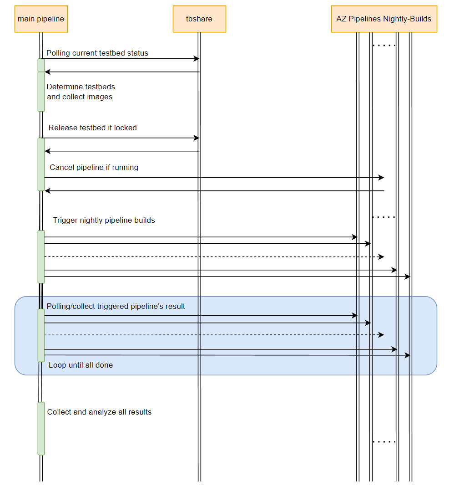

# Nightly Hawk Released Branch Verification #

- [Nightly Hawk Released Branch Verification](#nightly-hawk-released-branch-verification)
    - [Overview](#overview)
    - [Scope](#scope)
    - [High-Level Design](#high-level-design)
    - [Details-Module Design](#details-module-design)
      - [Testbeds pool](#testbeds-pool)
      - [Prepare for running test](#prepare-for-running-test)
      - [Trigger and waiting nightly test pipelien build](#trigger-and-waiting-nightly-test-pipelien-build)

### Overview

Currently, SONiC has serveral branchs and would has more and more feature branchs in the feature.
It takes a long time to verify these branchs.

Nighty-Hawk provides a released branch verification tool which could verify the branch more automatically and efficiently.

### Scope

The scope of this document covers the architecture of released-branch-verification tool and how to use it.

### High-Level Design

The released-branch-verification tool based on Azure pipeline.

Main pipeline would determine the testbeds and collect the correct images, then trigger the nightly build for all these testbeds.

Finanlly waiting all these nightly build done and collect the result.

### Details-Module Design

#### Testbeds pool

In order to verify the release branch, all different type images which based on this branch need to be verified.

Defaultly, The released-branch-verification tool would determine the key images which need to be verified and put at lease one related testbed into the testbeds pool. And select the testbeds from the pool and choose the correct latest images automatically according to the branch name.

The released-branch-verification tool also provides input parameter for special branch verifcation.
The input parameter is a list which should including all testbeds you want to verify.

#### Prepare for running test

Before trigger nightly test pipeline build, we need to make sure the testbed and pipelien build ready. Need to release the testbed if locked, cancel the current build if running.

#### Trigger and waiting nightly test pipelien build
The released-branch-verification tool would trigger nightly test pipeline build for all testbed which be selected to verify the branch. And polling and waiting until all done. then collect the result.

