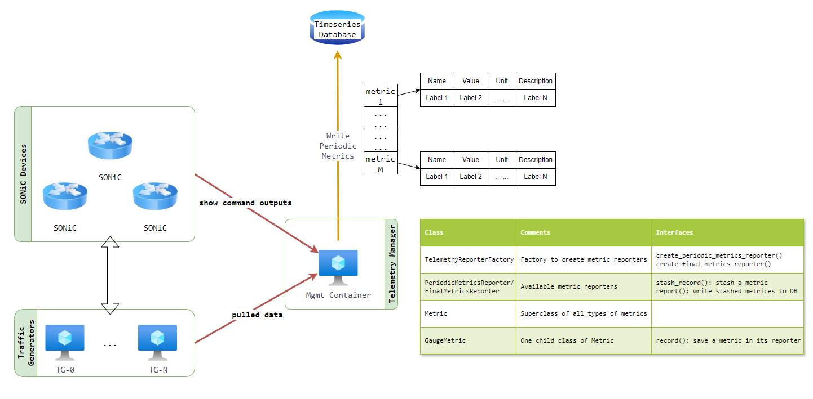

# Telemetry Data Reporting: Interface Usage Guide

## Overview

This toolkit is a framework designed to emit telemetry data, including (but not limited to) traces, metrics, and logs.
It also provides a user interface to take and organize the data collected from SONiC devices and traffic generateors.



## How it works

### Organization of Metric Labels

Each telemetry data point is identified by labels, which are organized into two levels:

#### Test-Level Labels

These labels provide general information applicable to all metrics within a test. Their naming convention begins with "test" and is structured hierarchically using periods ("."). Examples include:

| Label                   | Value             | Description                              |
| ----------------------- | ----------------- | ---------------------------------------- |
| METRIC_LABEL_TESTBED    | `test.testbed`    | Represents the testbed name or ID.       |
| METRIC_LABEL_TEST_BUILD | `test.os.version` | Specifies the software or build version. |
| METRIC_LABEL_TEST_CASE  | `test.testcase`   | Identifies the test case name or ID.     |
| METRIC_LABEL_TEST_FILE  | `test.file`       | Refers to the test file name.            |
| METRIC_LABEL_TEST_JOBID | `test.job.id`     | Denotes the test job ID.                 |

#### Metric-Specific Labels

These labels are specific to individual metrics and follow a consistent naming convention. Each label begins with "device" and is structured hierarchically using periods ("."). Examples include:

| Label                          | Value               | Description                      |
| ------------------------------ | ------------------- | -------------------------------- |
| METRIC_LABEL_DEVICE_ID         | `device.id`         | Represents the device ID.        |
| METRIC_LABEL_DEVICE_PORT_ID    | `device.port.id`    | Specifies the port ID.           |
| METRIC_LABEL_DEVICE_PSU_ID     | `device.psu.id`     | Identifies the PSU ID.           |
| METRIC_LABEL_DEVICE_PSU_MODEL  | `device.psu.model`  | Denotes the PSU model.           |
| METRIC_LABEL_DEVICE_PSU_SERIAL | `device.psu.serial` | Refers to the PSU serial number. |

### User interface and backend operations

    Frontend:
    The user interface accepts a metric's name, value along with its associated labels.

    Backend:
    The framework performs the following operations:
    Creates a data entry for the submitted metric.
    Exports the data entry to a database.

    Reporters:
    Metrics collected periodically are handled by the PeriodicMetricsReporter.
    Final status data for test results are handled by the FinalMetricsReporter.
    The framework is designed to support the addition of new reporters and metric types, offering scalability and flexibility.

## How to use

An example of using this tool in Python to report a switch's PSU metrics is provided.

1. Collect test-level information and generate common labels.

    ```python
    common_labels = {
       METRIC_LABEL_TESTBED: "TB-XYZ",
       METRIC_LABEL_TEST_BUILD: "2024.1103",
       METRIC_LABEL_TEST_CASE: "mock-case",
       METRIC_LABEL_TEST_FILE: "mock-test.py",
       METRIC_LABEL_TEST_JOBID: "2024_1225_0621"
    }
    ```

2. Create a metric reporter using the common labels.

    ```python
    reporter = TelemetryReporterFactory.create_periodic_metrics_reporter(common_labels)
    ```

3. Collect device and component information, along with metrics' names and values.

    ```python
    metric_labels = {METRIC_LABEL_DEVICE_ID: "switch-A"}

    voltage = GaugeMetric(
       name="Voltage",
       description="Power supply unit voltage reading",
       unit="V",
       reporter=reporter
    )

    current = GaugeMetric(
       name="Current",
       description="Power supply unit current reading",
       unit="A",
       reporter=reporter
    )

    power = GaugeMetric(
       name="Power",
       description="Power supply unit power reading",
       unit="W",
       reporter=reporter
    )
    ```

4. Generate metric-specific labels and record metrics, one metric at a time.

    ```python
    metric_labels[METRIC_LABEL_DEVICE_PSU_ID] = "PSU 1"
    metric_labels[METRIC_LABEL_DEVICE_PSU_MODEL] = "PWR-ABCD"
    metric_labels[METRIC_LABEL_DEVICE_PSU_SERIAL] = "1Z011010112349Q"

    voltage.record(metric_labels, 12.09)
    current.record(metric_labels, 18.38)
    power.record(metric_labels, 222.00)
    ```

5. Report the metrics.

    ```python
    reporter.report()
    ```

6. Access the data entries in the database using tools like **Grafana**.

## Rules

Only labels defined in metrics.py are permitted.

Ensure proper use of labels to maintain consistency and compatibility with the framework.
