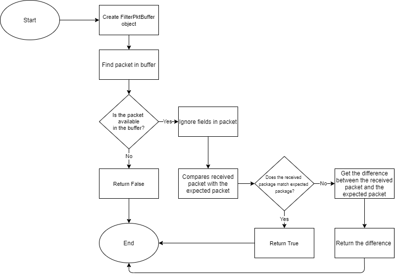

# Filter packet in buffer tool HLD

- [Feature name](#Feature-name)
- [Revision](#Revision)
- [Overview](#Overview)
- [Definition/Abbreviation](#Definition/Abbreviation)
- [Design](#Design)
- [Functionality](#Functionality)
  - [Functionality of filter_pkt_in_buffer method](#Functionality-of-filter_pkt_in_buffer-method)
  - [Functionality of show_packet method](#Functionality-of-show_packet-method)
  - [Functionality of convert_pkt_to_dict function](#Functionality-of-convert_pkt_to_dict-function)

## Revision

| Rev |     Date    |       Author             | Change Description                 |
|:---:|:-----------:|:-------------------------|:-----------------------------------|
| 0.1 |  5/24/2021 | Intel: Oleksandr Kozodoi |          Initial version           |

## Feature name
Filter packet in buffer
## Overview
This document provides general information about the "Filter packet in the buffer" tool. This tool finds the packet in the buffer of PTF and finds the difference between this packet and the received packet.

## Definition/Abbreviation
| Term |     Meaning    |
|:---:|:-----------:|
| PTF |  Packet Testing Framework |
## Design
Below diagram shows the flow for finding the packet in buffer.


## Functionality
Should be create FilterPktBuffer object for using of tool. For example:
```
filter = FilterPktBuffer(ptfadapter=ptfadapter,
                          exp_pkt=exp_pkt,
                          dst_port_number=dst_port_number,
                          match_fields=[
                                        ("802.1Q", "vlan"),
                                        ("Ethernet", "src"),
                                        ("Ethernet", "dst"),
                                        ("IP", "src"),
                                        ("IP", "dst"),
                                        ("TCP", "dport")
                                       ],
                          ignore_fields=[
                                         ("IP", "chksum"),
                                         ("IP", 'ttl')
                                        ]
                          )
```
#### Description of parameters
##### `ptfadapter` - PTF adapter
##### `exp_pkt` - expected packet
##### `dst_port_number` - destination port number
##### `match_fields` - list of packet fields that should be matched
##### `ignore_fields` - list of packet fields that should be ignored
We can use general functionality after that.
### Functionality of filter_pkt_in_buffer method
The method finds the packet in the buffer by using matched fields and compares this packet with the expected packet.
```
pkt_in_buffer = filter.filter_pkt_in_buffer()
```
##### If the packet is available in the buffer, the method returns True value.
```
>>> pkt_in_buffer
True
```
##### If the packet is not available in the buffer, the method returns False value.
```
>>> pkt_in_buffer
False
```
##### The method returns difference between the expected packet and the received packet if the packet is available in the buffer, but some fields are different.
```
>>> pkt_in_buffer
['IP ttl=63', 'IP len=86', 'IP ihl=5', 'IP chksum=7029', 'TCP dataofs=5', 'TCP chksum=13013', 'TCP options=[]']
```
### Functionality of show_packet method
The method prints the packet structure without ignored fields.
```
filter.show_packet(pkt_type='expected')
```
#### Description of parameters
##### `pkt_type` - type of packet (expected or received)
##### Expected packet
```
>>> filter.show_packet(pkt_type='expected')
Expected packet:
{
    "Ethernet": {
        "src": "00:90:fb:60:e2:68",
        "dst": "50:6b:4b:b6:35:02",
        "type": "33024"
    },
    "802.1Q": {
        "vlan": "40",
        "type": "2048",
        "id": "0",
        "prio": "0"
    },
    "IP": {
        "frag": "0",
        "src": "172.16.4.2",
        "proto": "6",
        "tos": "0",
        "dst": "172.16.4.14",
        "len": "None",
        "id": "1",
        "version": "4",
        "flags": "0",
        "ihl": "None",
        "options": "[]"
    },
    "TCP": {
        "reserved": "0",
        "seq": "0",
        "ack": "0",
        "dataofs": "None",
        "dport": "80",
        "window": "8192",
        "flags": "2",
        "chksum": "None",
        "urgptr": "0",
        "sport": "80",
        "options": "{}"
    },
    "Raw": {
        "load": "\u0000\u0001\u0002\u0003\u0004\u0005\u0006\u0007\b\t\n\u000b\f\r\u000e\u000f\u0010\u0011\u0012\u0013\u0014\u0015\u0016\u0017\u0018\u0019\u001a\u001b\u001c\u001d\u001e\u001f !\"#$%&'()*+,-"
    }
}
```
##### Received packet
```
>>> filter.show_packet(pkt_type='received')
Received packet:
{
    "Ethernet": {
        "src": "00:90:fb:60:e2:68",
        "dst": "50:6b:4b:b6:35:02",
        "type": "33024"
    },
    "802.1Q": {
        "vlan": "40",
        "type": "2048",
        "id": "0",
        "prio": "0"
    },
    "IP": {
        "frag": "0",
        "src": "172.16.4.2",
        "proto": "6",
        "tos": "0",
        "dst": "172.16.4.14",
        "len": "86",
        "id": "1",
        "version": "4",
        "flags": "0",
        "ihl": "5",
        "options": "[]"
    },
    "TCP": {
        "reserved": "0",
        "seq": "0",
        "ack": "0",
        "dataofs": "5",
        "dport": "80",
        "window": "8192",
        "flags": "2",
        "chksum": "13009",
        "urgptr": "0",
        "sport": "80",
        "options": "[]"
    },
    "Raw": {
        "load": "\u0000\u0001\u0002\u0003\u0004\u0005\u0006\u0007\b\t\n\u000b\f\r\u000e\u000f\u0010\u0011\u0012\u0013\u0014\u0015\u0016\u0017\u0018\u0019\u001a\u001b\u001c\u001d\u001e\u001f !\"#$%&'()*+,-"
    }
}
```
#### Note:
The received packet will be available after finding the packet in the buffer. Otherwise, it will be not available.
```
>>> filter.show_packet(pkt_type='received')
Received packet not available
```
### Functionality of convert_pkt_to_dict function
The module has convert_pkt_to_dict function which works without creating of FilterPktBuffer object. The function converts scapy packet to dictionary.
```
convert_pkt_to_dict(pkt)
```
#### Description of parameters
##### `pkt` - scapy packet
```
>>> from tests.common.pkt_filter.filter_pkt_in_buffer import convert_pkt_to_dict
>>> pkt_dict = convert_pkt_to_dict(pkt)
>>> pkt_dict
OrderedDict([('Ethernet', {'src': '50:6b:4b:b6:35:01', 'dst': '00:90:fb:60:e2:68', 'type': '33024'}), ('802.1Q', {'vlan': '40', 'type': '2048', 'id': '0', 'prio': '0'}), ('IP', {'frag': '0', 'src': '172.16.0.14', 'proto': '6', 'tos': '0', 'dst': '172.16.0.10', 'chksum': 'None', 'len': 'None', 'options': '[]', 'version': '4', 'flags': '0', 'ihl': 'None', 'ttl': '64', 'id': '1'}), ('TCP', {'reserved': '0', 'seq': '0', 'ack': '0', 'dataofs': 'None', 'urgptr': '0', 'window': '8192', 'flags': '2', 'chksum': 'None', 'dport': '80', 'sport': '80', 'options': '{}'}), ('Raw', {'load': '\x00\x01\x02\x03\x04\x05\x06\x07\x08\t\n\x0b\x0c\r\x0e\x0f\x10\x11\x12\x13\x14\x15\x16\x17\x18\x19\x1a\x1b\x1c\x1d\x1e\x1f !"#$%&\'()*+,-'})])
```
