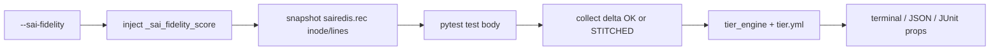

# High-Level Design: SAI Fidelity Scoring for SONiC VS (`libsaivs`)

## Document control

| Field | Value |
| ----- | ----- |
| **HLD version** | 1.0 |
| **Last updated** | 2026-09-30 |
| **Canonical code** | `tests/common/plugins/fidelity/` |
| **Quickstart** | `tests/common/plugins/fidelity/README.md` |

### Revision history

| HLD version | Date | Summary |
| ----------- | ---- | ------- |
| 1.0 | 2026-09-30 | Initial HLD: opt-in plugin, `sairedis.rec` inode windowing, `tier.yml` scoring, empty→1.0 policy, suite stats, caveats and futures |

---

## 1. Purpose and scope

### 1.1 Problem

On Virtual Switch (VS), `syncd` uses **`libsaivs`** instead of a vendor ASIC SAI. Tests can still **PASS** while exercising SAI surfaces that are:

- fully faithful on VS (e.g. route / neighbor / LAG programming that maps to the Linux/kernel path),
- stored in ASIC_DB but **not** enforced like hardware (e.g. ACL / QoS),
- stubbed or canned (e.g. many counters / watermarks).

Existing VS machinery (notably `skip_traffic_test`) can **stub PTF `verify*`** so dataplane asserts always succeed. That avoids false failures; it does **not** say how close the exercised SAI path was to hardware.

### 1.2 Goal

Provide an **opt-in**, **per-test** fidelity score derived from **SAI operations observed at runtime** during that test — not a static per-testfile lookup table.

Example lines:

```text
47 SAI calls — 32 tier 1, 12 tier 2, 3 tier 3 (score 0.83)
0 SAI calls — hardware-equivalent (score 1.00)
```

Interpretation: *“This pytest ran on VS — how close to hardware was the SAI work it caused (or, if it caused none, is it CP-only / HW-equivalent)?”*

### 1.3 In scope

- Opt-in pytest plugin registered via `pytest_plugins`
- Capture of `/var/log/swss/sairedis.rec` (and multi-ASIC `sairedis.asic{N}.rec`) deltas
- Inode-aware windowing (logrotate stitch; honest `score=None` on unrecoverable wipe)
- Declarative classification via `tier.yml` + pure `tier_engine`
- Terminal summary, JSON report, JUnit `user_properties`
- Standalone unit tests (no DUT)

### 1.4 Out of scope

- Changing pytest pass/fail based on fidelity score
- SAI Player / offline replay pipelines
- Patching `libsaivs` or rebuilding VS images (called out only as future work)
- Rewriting individual sonic-mgmt tests
- Proving packet dataplane correctness (that remains PTF / hardware)

---

## 2. Definitions

### 2.1 Tiers (authoritative policy in `tier.yml`)

| Tier | Meaning on libsaivs | Examples |
|------|---------------------|----------|
| **1** | Fully faithful — behaves like hardware for practical VS purposes | `ROUTE_ENTRY`, `NEXT_HOP*`, `NEIGHBOR_ENTRY`, `HOSTIF*`, `VIRTUAL_ROUTER`, `VLAN*`, `LAG*`, `PORT` (non-stat), `SWITCH` (non-stub attrs), tunnels |
| **2** | Stored in ASIC_DB, not enforced in a real ASIC forwarding pipeline | `ACL_*`, QoS maps, schedulers, WRED, buffers, policers, mirrors |
| **3** | Stubbed / missing / canned | `get` / `stats` / `clearstats` ops; port/queue stats; PFC/ECN/watermark attrs; unknowns |

Unknown `SAI_OBJECT_TYPE_*` values default to **tier 3** (`default:unknown`) and are logged at WARNING so they can be audited and promoted later. They are never silently scored as faithful.

### 2.2 Score

```text
score = (w1*n1 + w2*n2 + w3*n3) / (n1 + n2 + n3)
```

Default weights (`tier.yml`): `w1=1.0`, `w2=0.5`, `w3=0.0`.

| Situation | Score |
|-----------|-------|
| Trusted window (`OK` / `STITCHED`) and zero scored SAI ops | **`1.0`** — hardware-equivalent (control-plane-only / no SAI exercised) |
| Untrusted window (`HISTORY_LOST`, `RECORDER_RESET`, …) and empty delta | **`None`** — do not award `1.0` (empty may mean wipe) |
| Trusted window with N > 0 ops | Weighted mean as above |

**Fidelity here means closeness to hardware**, not “test quality.” A quiet LLDP read that issues no SAI is as meaningful on VS as on hardware for what it checks → `1.0`. A wipe that destroys the log is *unknown* → `None`.

### 2.3 Contrast with `skip_traffic_test`

| Mechanism | What it does |
|-----------|----------------|
| `skip_traffic_test` | On VS, stubs `ptf.testutils.verify*` to always return True (dataplane check bypassed) |
| SAI fidelity plugin | Annotates how faithful observed SAI ops were; does **not** stub traffic |

They are complementary. A test can PASS with `skip_traffic_test` and still show a **low** fidelity score if it programmed many tier-2/3 objects.

---

## 3. Architecture



### 3.1 Lifecycle (per test)

1. **Collection:** if `--sai-fidelity` and tier table loaded, append fixture `_sai_fidelity_score` to each item.
2. **Setup:** resolve VS DUTs (`asic_type == vs`); snapshot each `sairedis*.rec` path (`inode`, `size`, `line_count`).
3. **Call:** test runs unchanged.
4. **Teardown:** collect delta with inode-aware logic; parse SAI ops; classify; write record. Exceptions never fail the test.
5. **Session end:** terminal summary + JSON report.

### 3.2 Key modules

| Module | Role |
|--------|------|
| `__init__.py` | CLI options, marker, fixture injection, scoring orchestration, terminal/JSON/JUnit |
| `sairedis_window.py` | Snapshot + OK / STITCHED / unreliable statuses |
| `tier_engine.py` | Load `tier.yml`, classify, `calc_score`, summaries |
| `tier.yml` | Weights + operation/object/attribute rules |
| `tests/dash/sairedis_utils.py` | Shared rec path discovery + parse (generalized for fidelity ops) |
| `unit_test/` | Offline unit tests (no `tests.common` / scapy import) |

Registration: `tests/conftest.py` → `pytest_plugins` entry `tests.common.plugins.fidelity`.

---

## 4. What it does

### 4.1 Opt-in CLI

| Option | Default | Purpose |
|--------|---------|---------|
| `--sai-fidelity` | off | Enable plugin |
| `--sai-fidelity-report` | `logs/sai_fidelity.json` | JSON output path (relative to tests cwd) |
| `--sai-fidelity-tier-file` | packaged `tier.yml` | Override tier map |

### 4.2 Scope of scoring

- Only hosts with `duthost.facts["asic_type"] == "vs"`
- All VS DUTs × all `sairedis[.asicN].rec` paths discovered for the host
- Ops scored: `create`, `remove`, `set`, `get`, `stats`, `clearstats`
- Ops skipped: `notify` (events, not fidelity API surface)

### 4.3 Inode-aware `sairedis.rec` windowing

Before each test the plugin stores `(path, inode, size, lines)`. After the test:

| Status | Meaning | Scoring |
|--------|---------|---------|
| `OK` | Same inode; read new lines only | Normal |
| `STITCHED` | Rotated (e.g. to `.1`); remainder of old inode + newer files combined | Normal; summary may show `[stitched]` |
| `HISTORY_LOST` | Start inode not found among active/rotates | Empty → `score=None` |
| `RECORDER_RESET` | Start inode gone; new file has `recording on:` / `logrotate on:` | Empty → `score=None` |
| `TRUNCATED` | Same inode but fewer lines than snapshot | Empty → `score=None` |
| `MISSING` / `TOO_LARGE` / `ERROR` | Missing path, oversize pull, or failure | Empty → `score=None` |

Unreliable statuses are listed in `UNRELIABLE_EMPTY`. **Never** award hardware-equivalent `1.0` on an untrusted empty window.

Soft cap on stitched pull: ~32 MiB (`DEFAULT_MAX_BYTES`).

### 4.4 Classification rules

- Operation rules apply first (e.g. all `get`/`stats`/`clearstats` → tier 3).
- Object/attribute rules from `tier.yml`; worst (highest) tier wins when multiple match.
- No match → `default:unknown` → `default_tier` (3) + WARNING.

### 4.5 Outputs

**Terminal** (session summary):

- Per-test: nodeid, outcome, summary, `window=…`, `score=…`
- Suite line: `scored % | None(wipe) % | None(other) % | mean=…`
- Call totals: aggregate t1/t2/t3 counts

**JSON** (`--sai-fidelity-report`):

- Top-level: `generated_at`, `tier_file`, `run_score` (mean of per-test scores), `stats`, `tests[]`
- Per test: `nodeid`, `outcome`, `total`, `n1`, `n2`, `n3`, `score`, `window_status`, `breakdown`, `summary`, `error`
- `stats`: `n_tests`, `n_scored`, `pct_scored`, `n_none_wipe`, `pct_none_wipe`, `n_none_other`, `pct_none_other`, `mean_score`

**JUnit `user_properties`** (when junit XML is enabled):

- `sai_calls`, `sai_tier1`, `sai_tier2`, `sai_tier3`, `sai_fidelity_score`, `sai_fidelity_window`

### 4.6 Safety and opt-out

- Scoring failures are logged; the pytest test outcome is unchanged.
- `@pytest.mark.sai_fidelity(enabled=False)` skips scoring for that item when the flag is on.

---

## 5. What it does not do

- Does **not** replace hardware validation or prove forwarding/ACL/QoS enforcement.
- Does **not** use SAI Player or replay a recorded stream into vslib.
- Does **not** auto-derive tiers from `libsaivs` source; `tier.yml` is expert policy.
- Does **not** reconstruct SAI history when the start inode is deleted and no rotate archive remains.
- Does **not** score non-VS ASICs (`asic_type != vs`).
- Does **not** alter `skip_traffic_test` or conditional skip YAML.
- Does **not** subtract background orchagent activity that happens to fall inside the same time window.
- Does **not** fail CI solely because fidelity is low (unless a future policy chooses to gate on it).

---

## 6. Caveats and limitations

| Caveat | Detail |
|--------|--------|
| **Logrotate vs wipe** | Rename to `.1` is recoverable (`STITCHED`). Deleting archives / recreating the recorder without the old inode → `HISTORY_LOST` / `RECORDER_RESET` → `score=None`. |
| **Fixture ordering** | If swss/syncd restart runs in **another fixture’s setup** before `_sai_fidelity_score` snapshots, the wipe is outside the scored window. A quiet test body then looks like trusted empty → `1.0`, not a wipe demo. |
| **Incomplete `tier.yml`** | Unmapped types → tier 3. Scores are **conservative**, not “complete coverage.” Curate from WARNING / breakdown over time. |
| **`config_reload` storms** | Often append-only with huge SAI create/set volume; score is real but noisy (background + reload). |
| **Suite `mean` / `run_score`** | Average of per-test scores **includes** CP-only `1.0`s. A suite of quiet tests will look very high even if little SAI was exercised. |
| **Partial recovery** | Unreliable status with *some* recovered text may still produce a numeric score plus an `error` note (“partial after …”). |
| **PASSED ≠ high fidelity** | A green test with a low score exercised stubbed/unenforced paths — treat as “verify on hardware.” |
| **Signal source** | Live `sairedis.rec` is a side log of syncd, not an instrumented fidelity channel inside vslib. |

---

## 7. How to use

Plugin is **off by default**. Enable only when you want scores. You do **not** edit individual test files to “add” the plugin — it is registered in `tests/conftest.py` and activates when you pass `--sai-fidelity`.

### 7.1 Prerequisites

- A **VS** DUT (`asic_type == vs`) with reachable `/var/log/swss/sairedis.rec` (or `sairedis.asic{N}.rec` on multi-ASIC)
- sonic-mgmt run environment (typically `docker-sonic-mgmt`) with this branch’s fidelity plugin present
- Working inventory / testbed (`-n`, `-d`, `-f`, `-i`) for your lab

### 7.2 Enable on a VS / KVM run

From the sonic-mgmt **tests** directory:

```bash
cd tests   # or /data/sonic-mgmt/tests inside docker-sonic-mgmt

./run_tests.sh \
  -n <testbed> \
  -d <dut> \
  -f vtestbed.yaml \
  -i <inventory> \
  -t t0,any \
  -u \
  -c "bgp/test_bgp_speaker.py::test_bgp_speaker_announce_routes" \
  -e "--sai-fidelity --sai-fidelity-report logs/sai_fidelity.json"
```

| Flag | Meaning |
|------|---------|
| `--sai-fidelity` | Turn scoring on |
| `--sai-fidelity-report PATH` | JSON report path (default `logs/sai_fidelity.json`) |
| `--sai-fidelity-tier-file PATH` | Optional override of `tier.yml` |

Any `-c` selection works (BGP, ACL, LLDP, PortChannel, …). Mix quiet and mutating tests if you want both `score=1.00` (trusted empty) and weighted scores.

**Example — quiet + mutating:**

```bash
./run_tests.sh \
  -n <testbed> -d <dut> -f vtestbed.yaml -i <inventory> -t t0,any -u \
  -c "lldp/test_lldp.py::test_lldp pc/test_po_update.py::test_po_update" \
  -e "--sai-fidelity --sai-fidelity-report logs/sai_fidelity_demo.json"
```

### 7.3 Where to read results

| Location | Content |
|----------|---------|
| End of pytest terminal | `===== SAI fidelity summary =====` — per-test lines + `scored % \| None(wipe) % \| mean` |
| JSON file | Path from `--sai-fidelity-report` under the tests working directory |
| Test logs | `SAI fidelity: <nodeid> — … (window=…)` |
| JUnit XML | `user_properties`: `sai_calls`, `sai_tier1/2/3`, `sai_fidelity_score`, `sai_fidelity_window` |

**How to read a line**

| You see | Meaning |
|---------|---------|
| `… (score 0.83)` `window=OK` | Trusted window; weighted fidelity of observed SAI |
| `0 SAI calls — hardware-equivalent (score 1.00)` | Trusted empty window (CP-only / no SAI) |
| `window STITCHED` + score | Log rotated; history recovered via `.1` (etc.) |
| `window HISTORY_LOST` / `RECORDER_RESET` + `score=None` | Untrusted empty — do not treat as HW-equivalent |
| `PASSED` + low score | Test passed on VS but exercised much tier 2/3 SAI — verify on hardware |

### 7.4 Opt out one test

```python
@pytest.mark.sai_fidelity(enabled=False)
def test_something(...):
    ...
```

### 7.5 Offline unit tests (no DUT)

`tests/common/__init__.py` pulls scapy, so prefer path-based unit tests from the sonic-mgmt repo root:

```bash
python3 tests/common/plugins/fidelity/unit_test/unit_test_tier_engine.py -v
python3 tests/common/plugins/fidelity/unit_test/unit_test_sairedis_window.py -v
```

### 7.6 Short quickstart

See [`../README.md`](../README.md) for the short quickstart.

---

## 8. Relationship to existing VS mechanisms

| Mechanism | Role |
|-----------|------|
| `tests_mark_conditions_skip_traffic_test.yaml` | On `asic_type in ['vs']`, mark suites so `pytest_runtest_call` wraps PTF verify in `DummyTestUtils` |
| `tests_mark_conditions*.yaml` skips | Skip tests unsupported or flaky on VS |
| `@pytest.mark.device_type('physical')` | Prefer / require hardware when filtered |
| **SAI fidelity plugin** | Annotate closeness-to-hardware of **observed SAI**; does not skip or stub |

Recommended reading of a VS result:

1. Pytest outcome (pass/fail/skip)
2. Whether traffic was stubbed (`skip_traffic_test`)
3. Fidelity score / window status (trust of SAI surface exercised)

---

## 9. Future improvements

Prioritized; none of these are required for the mgmt MVP to be useful.

1. **Live stitch / restart-in-window validation** — Prove `STITCHED` on DUT; clarify fixture ordering so swss restart inside the scored window is detectable.
2. **Unknown harvest** — Aggregate `default:unknown` counts into JSON; workflow to promote types in `tier.yml`.
3. **`skip_traffic_test` score cap** — Optionally cap fidelity (e.g. ≤ 0.5) when traffic verify was stubbed, so CP-only `1.0` is not confused with “full dataplane trust.”
4. **ASIC_DB before/after fallback** — When the rec window is untrusted, diff `ASIC_STATE:*` for create/remove-ish signal (misses get/stats).
5. **Build-image route** — Instrument `libsaivs` (`SwitchStateBase`) to emit ops/tiers to Redis/STATE_DB; plugin diffs counters. Survives log wipe; requires VS image rebuild.

Out of band / not planned as part of this plugin: SAI Player as the primary per-pytest scorer (wrong problem shape for live attribution).

---

## 10. Code map

| Path | Hooks / symbols |
|------|-----------------|
| `tests/conftest.py` | `pytest_plugins` → `tests.common.plugins.fidelity` |
| `tests/common/plugins/fidelity/__init__.py` | `pytest_addoption`, `pytest_configure`, `pytest_collection_modifyitems`, `_sai_fidelity_score`, `pytest_runtest_makereport`, `pytest_terminal_summary` |
| `tests/common/plugins/fidelity/sairedis_window.py` | `RecSnapshot`, `collect_delta_*`, `UNRELIABLE_EMPTY`, status constants |
| `tests/common/plugins/fidelity/tier_engine.py` | `load_tiers`, `classify`, `count_tiers`, `calc_score`, `format_summary` |
| `tests/common/plugins/fidelity/tier.yml` | `weights`, `default_tier`, `operations`, `objects` |
| `tests/dash/sairedis_utils.py` | `sairedis_rec_paths`, `parse_sairedis_text` / `parse_sairedis_changes` |
| `tests/common/plugins/fidelity/unit_test/` | `unit_test_tier_engine.py`, `unit_test_sairedis_window.py`, `sample_sairedis.rec` |

---

## 11. Reading guide for PR reviewers

- **Default off** — merging does not change CI behavior unless `--sai-fidelity` is passed.
- **Score semantics** — closeness to hardware; trusted empty = `1.0`; wipe empty = `None`.
- **`tier.yml` is incomplete by design** — unknowns → tier 3; expect WARNING noise on first broad runs.
- **Low score + PASSED** — still a valid VS pass; flag for hardware follow-up on those SAI paths.
- **Quickstart** remains in the plugin `README.md`; this HLD is the detailed design reference.
