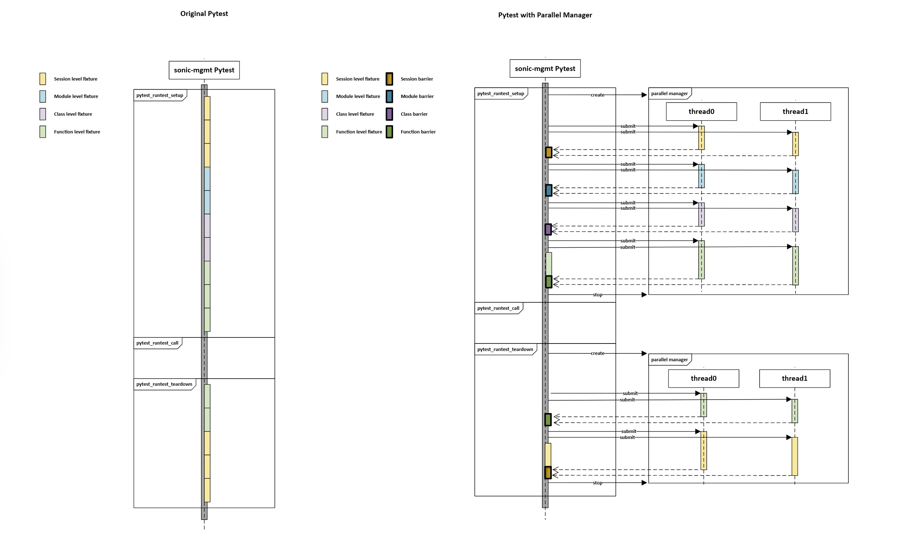
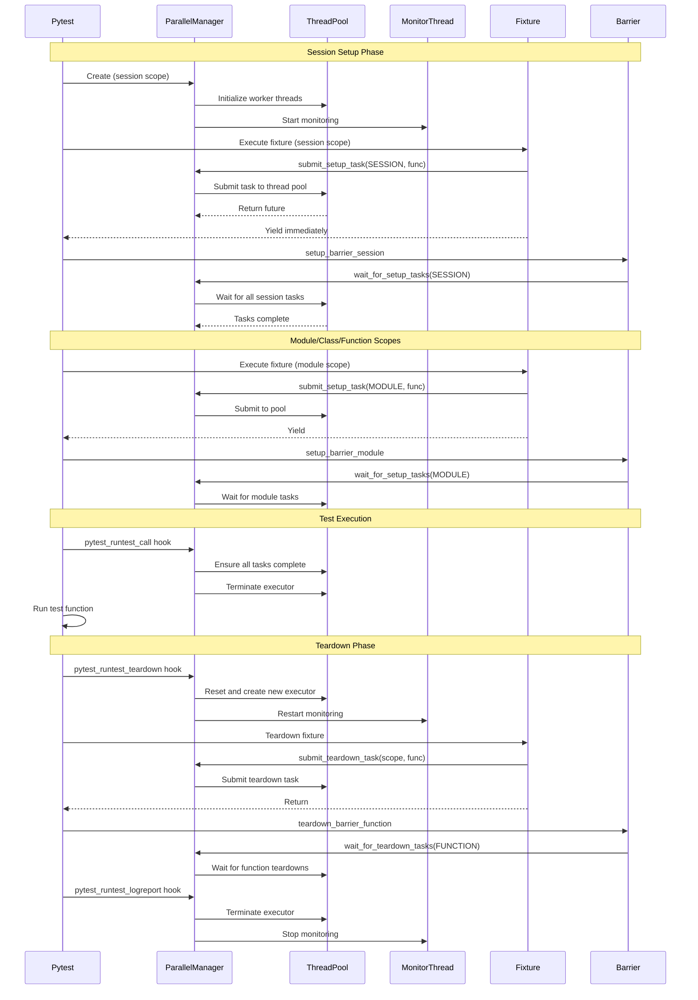
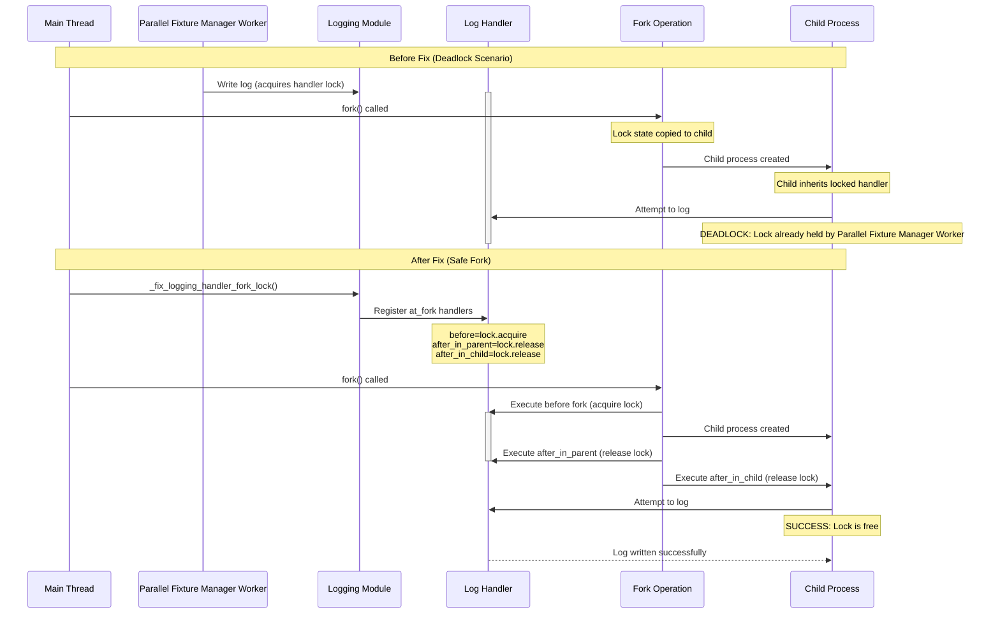

# Parallel Fixture Manager Design Document

## 1. Overview

The **Parallel Fixture Manager** is a pytest plugin designed to optimize test execution time by parallelizing the setup and teardown of fixtures. The sonic-mgmt fixture setup/teardowns often involves blocking I/O operations such as device configuration, service restarts, or waiting for convergence. By offloading these tasks to a thread pool, the manager allows multiple same-level fixtures to setup/teardown concurrently, which could reduce the overall test execution time.



## 2. Requirements

The Parallel Fixture Manager is designed to address specific challenges in the SONiC testing infrastructure. The key requirements are:

* **Test Fixture Setup/Teardown Parallelization**
* **Scope-Based Synchronization**
    * The system must strictly enforce pytest scoping rules:
        1. All background tasks associated with a specific scope (Session, Module, Class, Function) in setup must complete successfully before the test runner proceeds to a narrower scope or executes the test function.
        2. All background tasks associated with a specific scope (Session, Module, Class, Function) in teardown must complete successfully before the test runner proceeds to a broader scope or finish the test execution.
* **Fail-Fast Reliability**
    * The system must immediately detect the exception and abort the ongoing test setup to prevent cascading failures, resource wastage, and misleading test results.
* **Non-Intrusive Integration**
    * The system must expose a minimal and intuitive API. Existing fixtures should be able to adopt parallel execution patterns with minimal code changes, preserving the standard pytest fixture structure.
* **Safe Termination & Cleanup**
    * The system must handle interruptions and timeouts gracefully. It must ensure that background threads are properly terminated and resources are cleaned up, even in the event of a test failure or user interruption.

## 3. Architecture

### 3.1 Core Components

*   **`ParallelFixtureManager`**: The central thread pool controller exposed as a session-scoped fixture (`parallel_manager`).
    * **Executor**: Uses `concurrent.futures.ThreadPoolExecutor` to execute tasks.
    * **Monitor Thread**: A daemon thread (`_monitor_workers`) that polls active futures to log task execution status and any exception in worker thread.
    * **Task Queues**: Maintains separate lists of futures for setup and teardown tasks, categorized by scope.
* **`TaskScope`**: Enum defining the lifecycle scopes: `SESSION`, `MODULE`, `CLASS`, and `FUNCTION`.
* **`Barriers`**: Autouse fixtures that enforce synchronization. They block the main thread until all background tasks for a specific scope are complete.
    * Setup Barriers:
        * `setup_barrier_session`
        * `setup_barrier_module`
        * `setup_barrier_class`
        * `setup_barrier_function`
    * Teardown Barriers:
        * `teardown_barrier_session`
        * `teardown_barrier_module`
        * `teardown_barrier_class`
        * `teardown_barrier_function`

### 3.2 Execution Lifecycle

The manager hooks into the pytest lifecycle to coordinate parallel execution:



#### Setup Phase

1. **Submission**: Fixtures submit setup functions using `parallel_manager.submit_setup_task(scope, func, *args, **kwargs)`.
2. **Non-Blocking Return/Yield**: The fixture yields/Returns immediately, allowing pytest to proceed to the next fixture.
3. **Barrier Enforcement**: At the end of a scope (e.g., after all module-scoped fixtures have run), a barrier fixture waits for all submitted tasks of that scope to complete.

#### Test Execution Phase

1. **Pre-Test Wait**: Before the test function runs, the manager ensures all setup tasks are finished.
2. **Termination**: The setup executor is terminated to ensure a stable environment during the test.

#### Teardown Phase

1. **Restart**: The manager is restarted to handle teardown tasks.
2. **Submission**: Fixtures submit teardown functions using `parallel_manager.submit_teardown_task(scope, func, *args, **kwargs)`.
3. **Barrier Enforcement**: Teardown barriers wait for tasks to complete before moving to the next scope.

## 4. Exception Handling Strategy

The system implements a **Fail-Fast** strategy to detect exceptions in the background threads and fail the main Pytest thread timely, which helps prevent cascading failures and wasted execution time.

* **Background Exception Logging**: The monitor thread detects and logs exceptions in worker threads as they happen.
* **Checkpoints**:
    * **`pytest_fixture_setup`**: Before starting *any* fixture, the manager checks if a background task has failed. If so, it raises `ParallelTaskRuntimeError` immediately, aborting the test setup immediately.
    * **Barriers**: When waiting at a barrier, exceptions from failed tasks are re-raised in the main thread.
* **Forced Termination**: In cases of interrupts or critical failures, `ctypes` is used to inject exceptions into worker threads to force immediate termination.

## 5. Pytest Hooks Integration

The plugin relies on several pytest hooks to orchestrate the flow:

* **`pytest_runtest_setup`**: Dynamically reorders fixtures to ensure that barrier fixtures always execute **after** all other fixtures of the same scope.
* **`pytest_fixture_setup`**: Performs as exception handling checkpoint to interrupt the test execution in case of any exceptions are detected in the background threads.
* **`pytest_runtest_call`**: Acts as a final gate before the test runs, ensuring all setup tasks are done and terminating the setup executor.
* **`pytest_exception_interact`**: Handles exceptions during setup/call to terminate the manager gracefully.
* **`pytest_runtest_teardown`**: Restarts the parallel manager to prepare for the teardown phase.
* **`pytest_runtest_logreport`**: Terminates the parallel manager gracefully after teardown is complete.

## 6. Deadlock Handling

The Parallel Fixture Manager introduces multi-threading to the test execution environment. When combined with multi-processing (e.g., Ansible execution, `multiprocessing.Process`), this creates a risk of deadlocks, particularly involving logging locks.

A common scenario is:
1. Thread A (main thread) calls a logging function and acquires the logging lock.
2. Thread B (parallel fixture manager worker) forks a new process (e.g., to run an Ansible task).
3. The child process inherits the memory state, including the held logging lock.
4. Since Thread A does not exist in the child process, the lock remains held indefinitely.
5. If the child process tries to log something, it attempts to acquire the lock and deadlocks.

To prevent this, the framework (in `tests/common/helpers/parallel.py`) leverages `os.register_at_fork` hooks to:
*   Acquire logging locks before forking.
*   Release logging locks after forking (in both parent and child).
*   Handle Ansible display locks similarly.

This ensures that **locks are always in a released state within the child process immediately after forking**.



## 7. Usage Example

Fixtures interact with the parallel manager via the `parallel_manager` fixture.

```python
import pytest
from tests.common.plugins.parallel_fixture import TaskScope

@pytest.fixture(scope="module")
def heavy_initialization(parallel_manager):
    def setup_logic():
        # Configure DUT
        ...

    def teardown_logic():
        # Cleanup resources
        ...

    # Submit setup task to run in background
    future = parallel_manager.submit_setup_task(TaskScope.MODULE, setup_logic)

    # Yield immediately to let other fixtures start
    yield

    # Submit teardown only if setup completed successfully
    if parallel_manager.is_task_finished(future):
        parallel_manager.submit_teardown_task(TaskScope.MODULE, teardown_logic)
```
