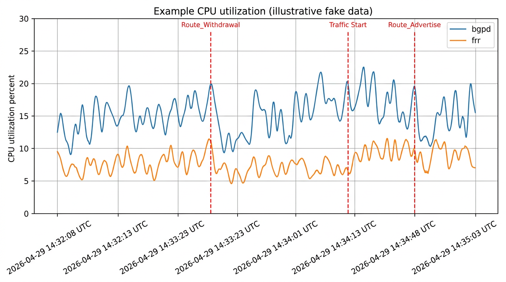
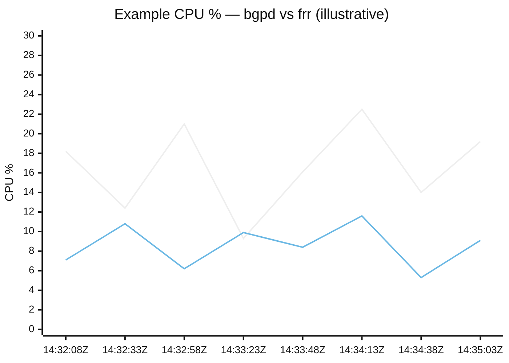
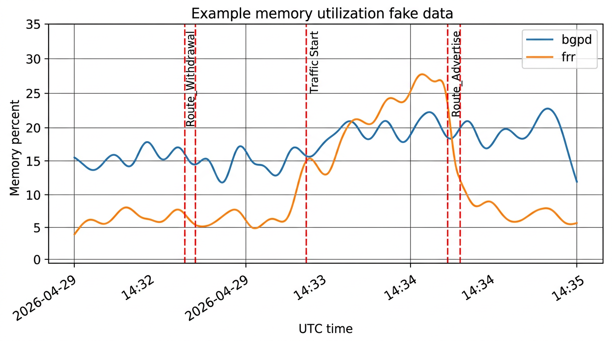
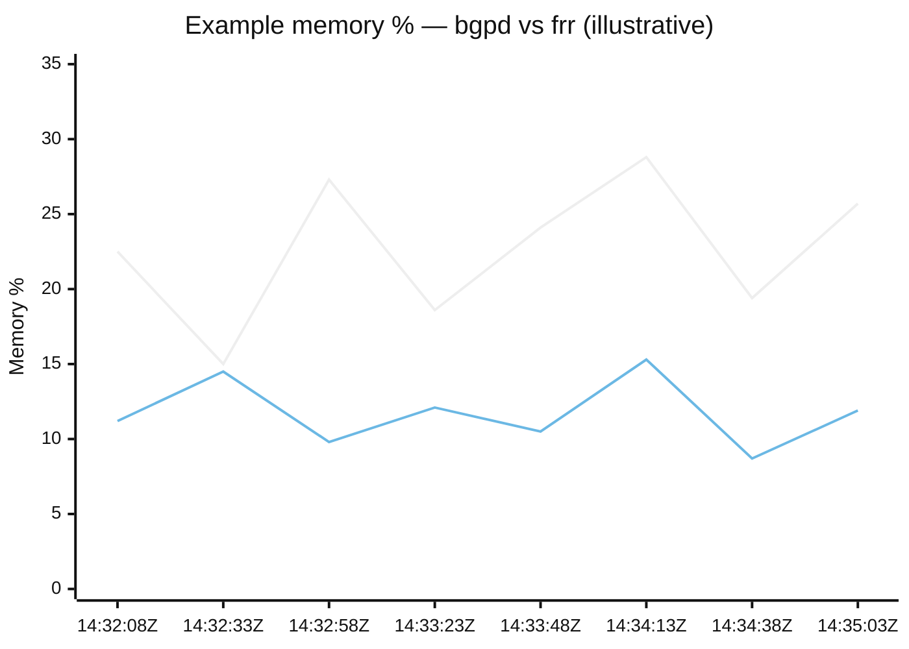

# Example CPU and memory plots (illustrative)

This document shows **mock** charts for the planned `mem_cpu_monitor` `plot()` output. Values are **random / illustrative**, not from a real DUT.

**Processes shown:** `bgpd` and `frr` (two series in each chart).

**Axes:** **Wall-clock time** on **X** (example timestamps in **UTC**), utilization **(%)** on **Y**.

**Event markers:** the table lists example **snapshot** times. The **PNG figures** below include vertical reference lines at those times (illustrative). Mermaid charts list the same times on the X-axis but cannot draw vlines.

| Event               | Example UTC timestamp   |
| ------------------- | ----------------------- |
| Route_Withdrawal    | 2026-04-29T14:33:23Z    |
| Traffic Start       | 2026-04-29T14:34:13Z    |
| Route_Advertise     | 2026-04-29T14:34:48Z    |

Sample times for the line series (UTC, 25 s spacing): starting at **2026-04-29T14:32:08Z** through **14:35:03Z**.

---

## CPU utilization — PNG (illustrative, AI-generated)

X-axis uses **wall-clock style** time labels (UTC example date). Values are **not** from a DUT.

---

## CPU utilization — Mermaid (same fake series)

*Illustrative only.* Production `plot()` should read **`t_wall`** (or timezone-aware datetime) from stored samples so the X-axis shows **actual timestamps**, not elapsed seconds since `start()`.

---

## Memory utilization — PNG (illustrative, AI-generated)

---

## Memory utilization — Mermaid (same fake series)

---

## Regenerating PNGs

For **reproducible** plots (exact data and typography), replace the files under [`example_plots/`](example_plots/) with a small `matplotlib` script driven by the same timestamp grid and fake series as the Mermaid blocks (or by real sampler output once the plugin exists).

---

## Notes for implementation

- Prefer **timezone-aware** datetimes on the axis (e.g. UTC) for log correlation; allow override (local time) via `plot()` argument if needed.
- Event markers correspond to `snapshot(event="...")` calls: draw **vlines** at the snapshot’s **`t_wall`** (not at index positions).
- Filenames for saved PNGs can follow the planned pattern (testcase id, DUT hostname, UTC keyword in the name).
