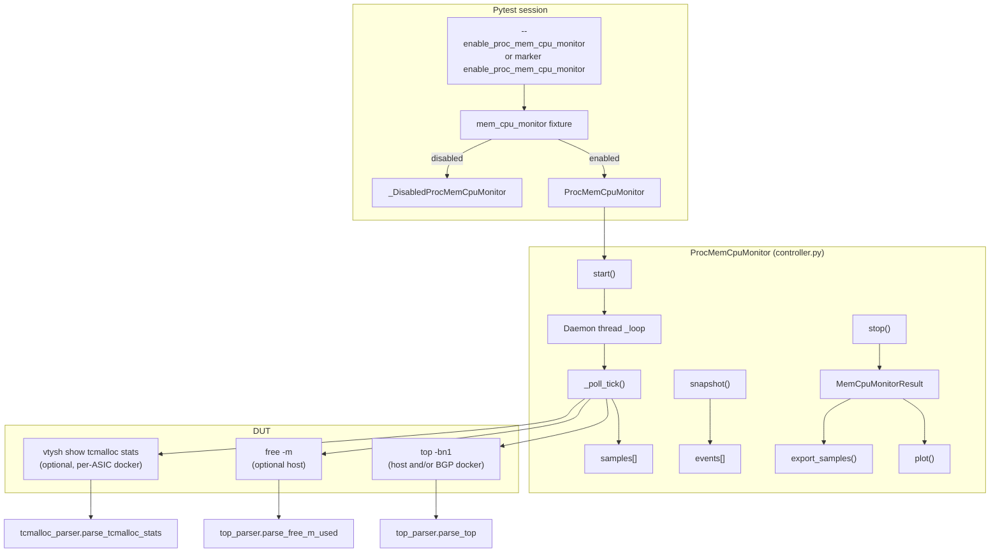
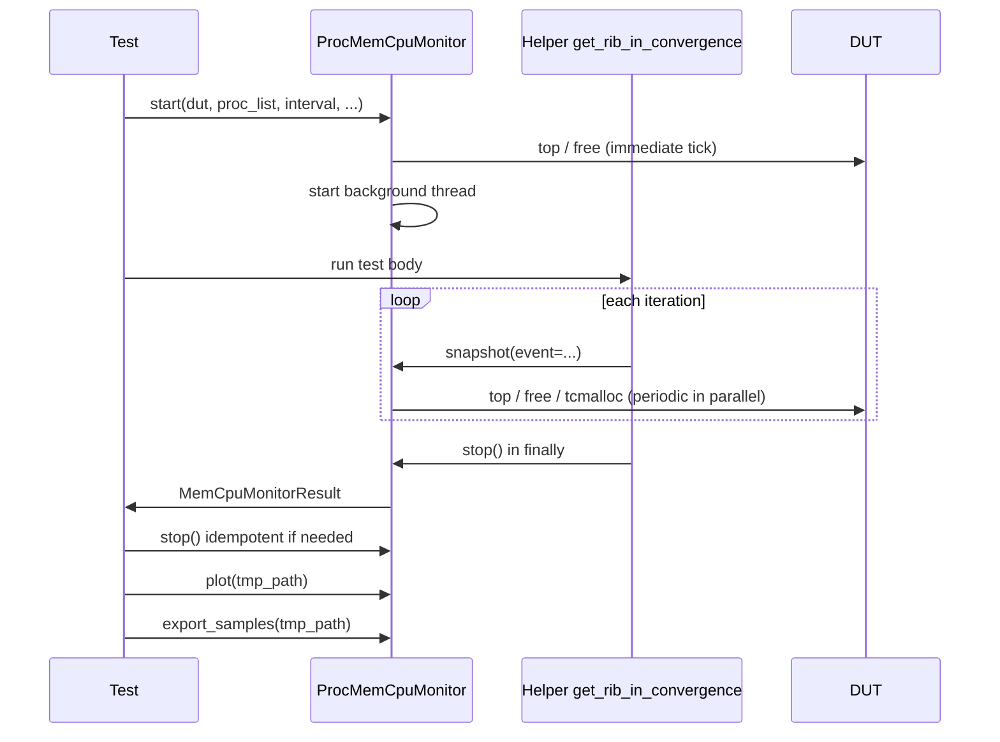

# High-Level Design: CPU and memory monitoring and plot - `proc_mem_cpu_monitor` (CPU / memory capture, storage, plot, export)

## Document control

| Field | Value |
| ----- | ----- |
| **HLD version** | 1.1 |
| **Last updated** | 2026-06-09 |
| **Canonical code** | `tests/common/plugins/proc_mem_cpu_monitor/` (this HLD should track code and README changes). |

### Authors

| Name | Organization | Role |
| ---- | -------------- | ---- |
| Amit Pawar & Amol Rawal | Nokia | Initial Draft |

### Revision history

| HLD version | Date | Authors / editor | Summary |
| ----------- | ---- | ------------------ | ------- |
| 1.0 | 2026-05-11 | Amit Pawar & Amol Rawal | First structured HLD: opt-in fixture, `ProcMemCpuMonitor`, parsers, sampling, mem leak snapshot, PNG/JSON/CSV, host-wide `top`, raw logs, RIB-IN integration pointers. |
| 1.1 | 2026-06-09 | HLD update | Document **tcmalloc** optional probe (`show tcmalloc stats`), dedicated raw log, plot/export behavior, and `tcmalloc_parser`; align diagram and key-files table. |

Add a new row for each material HLD or behavior change (bump **HLD version** when sections are rewritten or semantics change).

## 1. Purpose and scope

This feature adds an **opt-in** pytest fixture, **`mem_cpu_monitor`**, that periodically samples **process CPU% and memory** on SONiC DUTs using **`top -bn1`** (and optionally **`free -m`** on the host), optionally **`vtysh` “show tcmalloc stats”** inside the BGP (or chosen) docker per ASIC, records a **timeline of samples and events**, supports an optional **memory drift check** against the first reading, and can **plot** (PNG) and **export** (JSON/CSV) the same data used for charts.

It is intentionally **separate** from the autouse [`memory_utilization`](../../memory_utilization/) plugin: no background work unless the test or CLI enables this plugin.

## 2. Architecture overview

## 3. Enablement model

| Mechanism | Effect |
| --------- | ------ |
| CLI `--enable_proc_mem_cpu_monitor` | Fixture is live for the whole session. |
| `@pytest.mark.enable_proc_mem_cpu_monitor` | Fixture is live for marked tests. |
| Neither | Fixture yields **`_DisabledProcMemCpuMonitor`**: `start` / `snapshot` no-op; `stop` returns empty result; `plot` / `export_samples` return `None` / `{}`. |

Plugin registration: root [`tests/conftest.py`](../../../../conftest.py) includes **`tests.common.plugins.proc_mem_cpu_monitor`** in **`pytest_plugins`**.

## 4. Data capture logic

### 4.1 Target construction (`start()`)

- **DUTs**: Normalized from a single host, `DutHosts`, or iterable (`_normalize_duts`).
- **Per-DUT targets** (each polled every `interval` seconds):
  - **Host-wide `top`**: when **`host_top_all_procs=True`**, one host `top -bn1` per DUT; **`parse_top_host_all`** parses **all** rows with **`process`** = command basename, **`pid`**, one row per basename per snapshot (largest RES wins if duplicated). **Storage** then applies **`_host_top_capture_names`**: keep the top **`jumper_top_n`** basenames by RSS (tie-break **`%MEM`**), or if **`proc_list`** is non-empty, the union of substring matches plus **N − k** additional highest-RSS processes (**k** = how many user matches already lie in the global top-**N** RSS set). By default **docker `top` targets are omitted** unless **`skip_docker_top=False`**.
  - **Filtered host `top`**: when **`include_host_top=True`** and **`host_top_all_procs=False`**, host `top` filtered by **`proc_list`**.
  - **Per ASIC docker `top`**: when **`skip_docker_top`** is false, `sudo docker exec <container> top -bn1` (same as before); rows use **`proc_list`** substring matching on `COMMAND`.
  - **Optional** host **`free -m`** when **`include_host_free=True`**.
  - **Optional per-ASIC tcmalloc** when **`include_tcmalloc_stats=True`**: for each ASIC in the same **`asics`** scope as docker `top` (**`frontend`** or **`all`**), append a target **`kind="tcmalloc"`** whose command is **`docker exec <bgp> vtysh -c "show tcmalloc stats"`** (via **`_tcmalloc_cmd_docker`**). Parsed rows become samples with **`probe_transport="tcmalloc"`**, **`process`** = daemon name from the block header, **`tcmalloc_heap_size_bytes`**, **`tcmalloc_pageheap_free_bytes`**, and **`mem_res_mib`** derived from heap size for plotting. A dedicated raw log file **`tcmalloc_raw_log_path`** (default **`mem_cpu_monitor_tcmalloc_raw.log`** under **`tmp_path`**) is created when any tcmalloc target exists; **`_append_tcmalloc_raw_log`** appends full stdout for **`kind="tcmalloc"`** only.
- **Process filter**: for filtered `top` modes, **`proc_list`** matches the **`COMMAND`** column. For **`host_top_all_procs`**, **`proc_list`** drives **which extra** processes are always stored (substring on basename) and **mem-leak baselines** on host rows (every stored process when **`proc_list`** is empty; only matches when non-empty). If **`proc_list`** is empty, **`include_host_free=True`** and/or **`host_top_all_procs=True`** and/or **`include_tcmalloc_stats=True`** can still enable probes (host-wide storage is then top-**N** RSS only).
- **Sampling interval** (`start(..., interval=...)`): wall-clock **seconds between completed poll rounds** (stored as **`_interval`**, `float`). **Default `1.0`** if the caller omits **`interval`** (see `ProcMemCpuMonitor.start` in `controller.py`). The value is recorded on the **`start`** timeline event **`extra`** as **`interval`**.

On `start()`, state is reset, a **`start`** timeline event is appended, **one immediate `_poll_tick()`** runs (so the first samples exist before the background thread’s first sleep), then the **sampler thread** starts.

### 4.2 Sampler thread (`_loop` / `_poll_tick`)

The background thread runs **`_poll_tick()`** (one full pass over **all** configured targets in order), then **`_stop_event.wait(interval)`** so the **pause happens between rounds**, not before the very first synchronous tick. **`interval`** is therefore the **nominal spacing between the start of consecutive poll rounds**; the actual wall spacing also includes command latency for every `top` / `free` / **tcmalloc** / docker `top` probe in that round.

Each tick, for every target:

1. Run `duthost.command(cmd, module_ignore_errors=True)` inside **`_suppress_devices_base_debug()`** (temporarily raises **`tests.common.devices.base`** to **INFO** so pytest **DEBUG** is not flooded with Ansible JSON); failures log a warning and yield empty stdout (tick continues).
2. **`kind == "free"`** (`free -m`): `parse_free_m_used` → synthetic process name **`free_used`**: `mem_pct` = 100×used/total, `mem_mib_used` / `mem_res_mib` from used MiB, `cpu_pct` = `None`, `probe_transport` = `"free"`.
3. **`kind == "tcmalloc"`** (`show tcmalloc stats`): **`parse_tcmalloc_stats(stdout)`** in **`tcmalloc_parser.py`** splits on daemon blocks (`tcmalloc statistics for <name>:`), reads **`generic.heap_size`** and **`tcmalloc.pageheap_free_bytes`**, emits one **sample** per daemon with **`probe_transport="tcmalloc"`** (CPU/%MEM columns are `None`; **`mem_unit`** is **`bytes`** for heap fields). **Plot/export** treat tcmalloc series separately from `top`/`free` (see §5 / §6).
4. **`kind == "top_all"`** (host-wide): **`parse_top_host_all(stdout)`** → one sample per process basename per tick (see README for dedupe).
5. **`kind == "top"`** (filtered): **`parse_top(stdout, proc_list)`** as before.

Each **sample** record includes: `kind="sample"`, `dut`, `scope` (e.g. `host`, `docker:bgp:0`, `host:free`), `process`, metrics, **`t_wall`** (UTC `datetime`), **`t_mono`** (`time.monotonic()`), monotonic **`seq`**.

**Baseline map** (`_baseline_mem`): for **host-wide** rows, baselines apply to **every stored** process when **`proc_list`** is empty (those rows are already the top-**N** RSS subset), and only to substring matches when **`proc_list`** is non-empty (avoids baselining RSS filler processes the user did not name). Filtered `top` and **`free_used`** behave as before (baseline on first sight).

### 4.3 Raw command log (optional)

When **`start(..., capture_raw_stdout=True)`**, every **`duthost.command`** used for probes (including **`mem_leak`** re-parses) appends a timestamped block (hostname, scope, kind, full command line, stdout) to **`raw_log_path`** (default **`mem_cpu_monitor_raw_commands.log`** under pytest **`tmp_path`**). This is for manual verification against parsed CSV/JSON.

Whenever the sampler includes a **`top`** probe (**`kind`** `top` or `top_all`), **`_append_top_raw_log`** writes the same style of block (hostname, scope, kind, command, full stdout) to **`top_raw_log_path`** (default **`mem_cpu_monitor_top_raw.log`** under **`tmp_path`**). **`free`**-only runs do not create this file. **`stop()`** / **`plot()`** / **`export_samples()`** log the path at **INFO**; JSON export includes **`top_raw_log`**; **`MemCpuMonitorResult.top_raw_log_path`** mirrors the path after **`stop()`**.

When **`include_tcmalloc_stats=True`**, **`_append_tcmalloc_raw_log`** writes **tcmalloc-only** stdout to **`tcmalloc_raw_log_path`** (default **`mem_cpu_monitor_tcmalloc_raw.log`**). **`MemCpuMonitorResult.tcmalloc_raw_log_path`** is set on **`stop()`**; **`plot()`** / **`export_samples()`** log it at **INFO** when present; JSON export includes **`tcmalloc_raw_log`** and the returned paths dict may include **`tcmalloc_raw_log`** (same pattern as **`top_raw_log`**).

### 4.4 Timeline events (`snapshot()` / internal)

- **`_append_event`**: appends `kind="event"` with `event` name, `t_wall`, `t_mono`, `seq`.
- **`snapshot(event, threshold, strict)`**: default event label `snapshot`. If `event == MEM_LEAK_EVENT` (`"mem_leak"`) and `threshold` is set (e.g. `"10%"`), **`_run_mem_leak_compare`** runs: re-parses current `top`/`free` state, compares each tracked process’s **current `mem_pct`** to **first-sample baseline** within a **relative band** (not step-to-step). On failure with `strict=True`, **`pytest.fail`**. Then the event is still recorded (with failure details in `extra` when applicable).

### 4.5 Stop and in-memory storage (`stop()`)

- Signals the thread to stop, joins, appends **`stop`** event.
- Returns **`MemCpuMonitorResult`**: **`samples`**, **`events`**, **`timeline`** (merged, sorted by `(t_mono, seq)`), **`top_raw_log_path`** when a `top` raw file was created, **`tcmalloc_raw_log_path`** when tcmalloc probing was enabled and the dedicated log file was opened.
- Result is also cached on **`_last_result`** for `plot()` / `export_samples()` without passing `result=`.

## 5. Plotting (`plot()`) and adaptive subset

- **Requires matplotlib**; otherwise logs and returns `None`.
- **Tcmalloc overlay**: **`_filter_samples_for_plot`** excludes **`probe_transport in ("tcmalloc",)`** from the main CPU / %MEM / MiB series (those panels stay **`top`** + **`free_used`**). **`_tcmalloc_samples_for_plot`** selects tcmalloc samples. If **any** tcmalloc samples exist after filtering, **`plot()`** builds **five** rows: the usual three (**CPU %**, **MEM %**, **MiB**) plus **tcmalloc heap (MiB)** and **tcmalloc pageheap free (MiB)** per daemon; legends follow the same bottom layout. If there are **no** `top`/`free` series but there **are** tcmalloc samples, the figure still renders (tcmalloc-only).
- **Default subset** when **`proc_subset` is `None`**:
  - If **`host_top_all_procs`** was **not** set in **`start()`** (or **`auto_host_jumper_subset=False`** on **`plot`/`export_samples`**): plot **all** stored samples (legacy).
  - If **`host_top_all_procs`** was **true** and adaptive subsetting is on (**`auto_host_jumper_subset`** not **`False`**): plot **all stored** host `top` series (capture already applied the RSS ∪ **`proc_list`** rule), add **`free_used`** if present, and include non-host **`top`** rows (e.g. docker) that match **`proc_list`** when those probes exist.
  - Legacy path (**`host_top_all_procs`** false but adaptive forced): **`effective_adaptive_plot_processes`** ranks host samples by **(max %CPU − min %CPU) + (max %MEM − min %MEM)**; empty **`proc_list`** returns every distinct host process in samples; non-empty **`proc_list`** unions interest matches with top **`jumper_top_n`** jumpers when needed.
- If **`proc_subset`** is a non-`None` list, it selects processes **exactly** by the stored **`process`** string (no adaptive logic).
- **Output path**: `out_dir` from argument, else **`tmp_path`** fixture, else `"."`. Directory is created as needed.
- **Filename stem**: configurable via **`start(..., output_basename_style=...)`** or per-call **`plot`/`export_samples(..., basename_style=...)`**: **`full`** (sanitized full ``nodeid``), **`short_node`** (``node.name``), or **`dut_ts_hash`** (DUT + compact time + 10-char hash of ``nodeid``). Companion **PNG / JSON / CSV** share the same stem.
- **Three subplots** (shared time axis, UTC):
  1. **CPU %** — missing CPU treated as **0** for the line (same as chart logic).
  2. **MEM %** — `top` `%MEM` or host `free` used% for `free_used`.
  3. **MiB** — `mem_res_mib` if present, else **`mem_mib_used`** (e.g. `free_used`).
- When **tcmalloc** samples are present, **two** additional panels (**tcmalloc heap MiB**, **tcmalloc pageheap free MiB**) are stacked below the MiB row (see opening bullets in this section).
- **Legends** are drawn **below** each subplot (outside the axes) so they do not cover the data lines.
- **Reference line** (figure-level, above panels): **currently not drawn on PNG** (code commented in ``plot()``); **`total_mem`** / **`num_cores`** probing in ``start()`` remains for timeline ``extra`` / future use. Previously: first **`free -m`** **Mem:** **total** (MiB); **logical CPU count** from **`cat /proc/cpuinfo | grep processor | wc -l`** on the **first DUT** in probe order (once per **`start()`**).
- **Snapshot markers**: vertical lines at each timeline event; the **event label** is repeated at the **top** of **each** Y panel in the figure (all rows).

## 6. Persistent export (`export_samples()`)

- **No matplotlib dependency.**
- Same **`result`**, **`proc_subset`**, **`out_dir`** semantics as `plot()`.
- **`formats`**: subset of `("json", "csv")` (default both).
- **JSON**: `nodeid`, `proc_subset`, **`plot_proc_subset_resolved`**, **`raw_command_log`** (path or null), **`top_raw_log`** (path or null), **`tcmalloc_raw_log`** (path or null when tcmalloc raw logging was not configured), **`samples`** (includes **`top`**, **`free`**, and **`tcmalloc`** transports as exported), **`events`** (serialized, ISO `t_wall`).
- **CSV**: one row per exported sample (**`top`**, **`free`**, and **`tcmalloc`** rows share one flat schema; tcmalloc-specific columns are populated only for **`probe_transport="tcmalloc"`** — see **`_build_export_sample_row`** in `controller.py`).
- Returns paths for each written format (e.g. **`json`**, **`csv`**) plus **`top_raw_log`** / **`tcmalloc_raw_log`** when those raw logs exist (same keys as in the JSON payload’s path fields, where applicable).

## 7. Integration: Snappi RIB-IN convergence

- **`run_rib_in_convergence_test(..., mem_cpu_monitor=None)`** forwards the handle to **`get_rib_in_convergence(..., mem_cpu_monitor=None)`**.
- **`get_rib_in_convergence`** calls **`snapshot()`** at protocol start (per iteration), before/after route advertise, and before RIB-IN metrics; in **`finally`**, waits **60 seconds** (continued background sampling), then **`mem_cpu_monitor.stop()`** so sampling stops even on assertion failures (tests may **`start()`** again if they run multiple phases).
- **`test_bgp_rib_route_optimztn_perf_v1`**: enables **`host_top_all_procs=True`**, **`include_host_free=True`**, **`capture_raw_stdout=True`**, optionally **`include_tcmalloc_stats=True`** in variants that want heap / pageheap-free time series, then **`plot`/`export_samples`** with adaptive subsetting.

## 8. Key files (roles)

| File | Role |
| ---- | ---- |
| `__init__.py` | Fixture, CLI option, marker, disabled stub, exports. |
| `controller.py` | `ProcMemCpuMonitor`, threading, DUT commands, plot, export, mem leak check. |
| `top_parser.py` | `parse_top`, **`parse_top_host_all`**, `parse_free_m_used`, RES→MiB via shared helper. |
| `tcmalloc_parser.py` | **`parse_tcmalloc_stats`**: FRR **`show tcmalloc stats`** block split, heap and pageheap-free bytes per daemon. |
| `constants.py` | `MEM_LEAK_EVENT` string. |
| `test_top_parser.py` | Unit tests for parsers, host RSS capture helper, and adaptive subset helper. |
| `README.md` | User-facing API and enablement. |
| `docs/HLD.md` | This document. |
| `docs/EXAMPLE_PLOTS.md` | Illustrative / mock plot documentation (not live DUT data). |

## 9. Design decisions and limitations

- **Batch `top`** per interval (not continuous `top` in TTY) keeps implementation simple and matches existing automation patterns.
- **Substring match** on `COMMAND` can collide if multiple processes match the same token; callers should pass distinctive substrings (e.g. `bgpd`, `zebra`).
- **Mem leak** compares to **first** sample per key, not the previous tick—suited for “did we drift from baseline during the test?” rather than spike detection between adjacent samples.
- **Chassis / multi-linecard**: caller passes the intended `duthost` list to `start()`; no automatic fan-out beyond per-host ASIC iteration.
- **Parser**: prefers procps-style `top`; includes a looser fallback path in `top_parser` for odd formats (see code and unit tests).

## 10. Sequence diagram (typical test)

