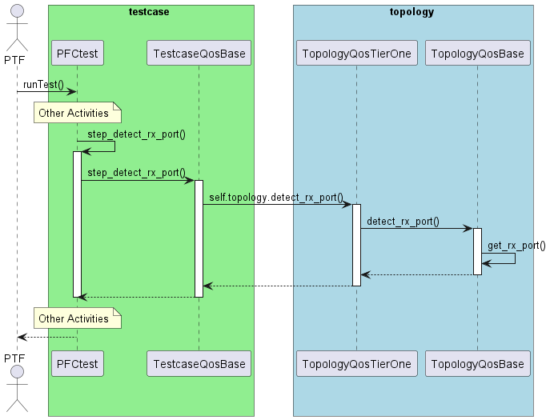
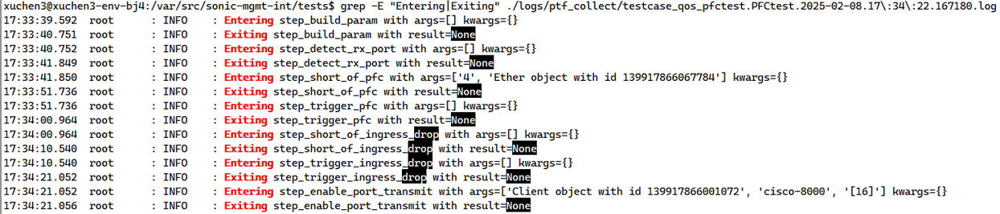

# QoS SAI PTF Test Refactoring Design
**xuchen@microsoft.com**

## Agenda
- What is QosS SAI PTF test
- Pain Points
- Class Hierarchy Refactoring
- How to add new testcase class
- How to add new platform class
- Instantiate Platform Sequence
- Calling Platform Function Sequence
- Calling Topology Function Sequence
- Test Step Decorator

## What is QoS SAI PTF Test

- Locate in “/tests/saitests/” in the sonic-mgmt repo, so also called “saitests”
- Run in PTF docker, send traffic to DUT via PTF, and measure  DUT MMU behaviors
- In addition, “test_qos_sai” is another part of QoS SAI test, which is used to prepare test environment, and start PTF command to trigger “saitests”. But it is not the focus of this article

## Pain Points

| **Description of pain points**                                                       | **Addressed in this refactoring**                      |
| ------------------------------------------------------------------------------------ | ------------------------------------------------------ |
| Regression caused by mix PI and PD code           | Yes                 |
| Difficult to troubleshooting                      | Yes                 |
| Difficult to maintain                             | Yes                 |
| Miss PR test, and lead to undetected syntax error | Yes                 |
| Difficult to triage issue                         | Yes                 |
| Frequent nightly failure due to port selection                                       | Will address in following "test_qos_sai"'s refactoring |
| Long test duration                                                                   | Will address in following "test_qos_sai"'s refactoring |
| Frequent nightly failure due to syncd rpc image download issue                       | Will address in following "test_qos_sai"'s refactoring |
| Frequent nightly failure due to fixture order inconsistencies                        | Will address in following "test_qos_sai"'s refactoring |
| Test scenario miss                                                                   | Will address in following "test_qos_sai"'s refactoring |

## Class Hierarchy Refactoring

## How to add new testcase class

## How to add new platform class

## Instantiate Platform Sequence

## Calling Platform Function Sequence

## Calling Topology Function Sequence

## Test Step Decorator

- Support decorator function's execution at entry, exit, or both
- Support add decorator function for printing banner, results, and diagnostic counters, and other message to aid in troubleshooting.
- Also support to add plugin function via decorators for small additions without changing step implementation.
- Therefore, in test step implement, we can focus on the key test logic instead of auxiliary code

### Decorator Output Sample

