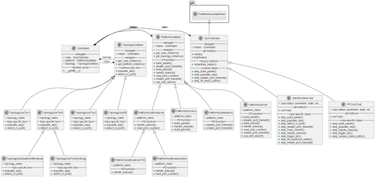
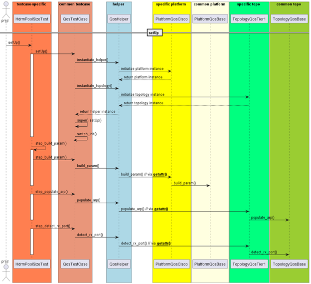
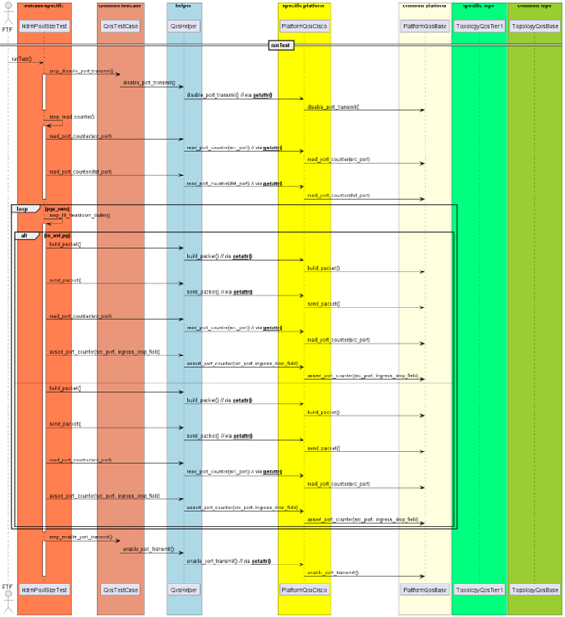
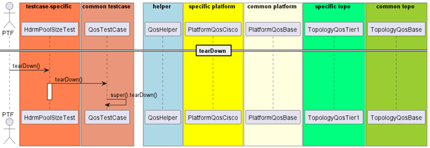

# Refactor Design for saitest

## Overview

Need to abstract QoS SAI test to resolve below pain points.

## Proposal and priority

### Pain point

#### [P0] Abstraction of testcase

- Difficult to troubleshooting
- Difficult to maintain
- Issues caused by combining PI and PD code

And we split this requirement to two stages: abstraction for “saitest” and abstraction for “test_qos_sai”.

This document describes the first stage refactoring approach applied to the “saitest”, targeting improved modularity, maintainability, and platform flexibility. The new structure separates platform-independent test logic from platform-specific implementations, enabling the entire QoS test suite to support diverse hardware platforms with minimal code duplication. This design uses “PFCXonTest” as an example test case to illustrate the refactored framework.

## Design Goal

The refactoring effort aimed to achieve the following goals:

- **Modularity**: Separate platform-independent logic from platform-specific details, promoting code organization and readability.
- **Reusability**: Create a common base class that contains shared functionality for all test cases, reducing duplication.
- **Platform Independence**: Enable test cases to execute across various ASIC platforms with minimal modifications.
- **Maintainability**: Simplify the process of updating test cases by isolating platform-dependent code, making the suite easier to maintain and enhance.
- **Compatibility**: Preserve existing PTF test interfaces, allowing incremental commits of refactored code alongside legacy code. This ensures both versions can coexist and run independently, enabling a smooth transition without changes outside of saitest.

## Class Hierarchy

The refactored QoS test suite follows a hierarchical class structure designed to accommodate both shared logic and platform-specific functionality:



### Class Descriptions

#### QosTestCase

QosTestCase is the base class for all QoS test cases. It encapsulates platform-independent logic, providing methods for managing the test lifecycle (e.g., setUp(), tearDown()) and common test steps. It delegates platform-specific and topology-specific logic to the QosHelper, which simplifies interactions and hides underlying details. This ensures that test cases remain platform-agnostic.

**Key Features:**

- Provides lifecycle methods (setUp(), tearDown()) for initializing and cleaning up tests.
- Delegates platform- and topology-specific logic to the QosHelper.
- Implements common test steps, such as step_build_param() and step_fill_share_buffer().
- Serves as the foundation for test case-specific subclasses.

#### Testcase-specific Class (e.g., HdrmPoolSizeTest, PFCXonTest)

Each test case class inherits from QosTestCase and implements the logic specific to its test. It defines a runTest() method, along with case-specific test steps such as populating ARP tables, detecting ports, triggering PFC events, and managing buffer states. By extending QosTestCase, these classes reuse common logic while focusing on test-specific requirements.

**HdrmPoolSizeTest Features:**

- Implements steps like step_populate_arp(), step_detect_rx_port(), and step_handle_leakout().
- Tests headroom buffer management under specific conditions.
- Manages case-specific parameters and states.

**PFCXonTest Features:**

- Focuses on validating PFC Xon behavior.
- Implements steps like step_trigger_pfc() and step_release_share_buffer().
- Tailored for testing flow control behavior in congestion scenarios.

#### QosHelper

QosHelper is a core utility class that bridges the test case with platform-specific and topology-specific logic. It uses delegation to PlatformQosBase and TopologyQosBase for platform- and topology-dependent operations. Through dynamic proxying (__getattr__), it transparently routes method calls to the correct platform or topology-specific implementation, abstracting away the differences. This design allows test cases to focus solely on test logic without worrying about platform or topology details.

**Key Features:**

- Delegates to PlatformQosBase and TopologyQosBase for specific logic.
- Uses __getattr__ to dynamically resolve method calls to the appropriate implementation.
- Provides a run_iterations() method for managing iterative test runs.
- Maintains references to QosTestCase, PlatformQosBase, and TopologyQosBase.

#### PlatformQosBase

PlatformQosBase is the base class for all platform-specific QoS logic. It provides common functionality like parameter building, packet handling, and port management. Subclasses implement platform-dependent logic by overriding specific methods. This class also offers wrappers to interact with the test case (get_case_instance()) and topology (get_topology_instance()).

**Key Features:**

- Provides common platform-independent methods like build_param(), disable_port_transmit(), and handle_leakout().
- Acts as the base class for all platform-specific subclasses.
- Supports platform detection via is_platform().

#### Platform-specific Classes

Platform-specific classes inherit from PlatformQosBase and implement platform-dependent functionality. Each class customizes methods to align with the unique requirements of the platform it represents.

**PlatformQosCisco Features:**

- Implements Cisco-specific methods like build_param() and build_packet().
- Handles platform-specific leakout and packet construction.

**PlatformQosMellanox Features:**

- Focuses on Mellanox-specific port management with methods like disable_port_transmit() and enable_port_transmit().

**PlatformQosBroadcom Features:**

- Provides Broadcom-specific leakout handling and counter reading.

**PlatformQosBroadcomTd3 and PlatformQosBroadcomDnx Features:**

- Specializes Broadcom logic for specific chipsets, e.g., Trident 3 and DNX.

**PlatformQosKvm Features:**

- Offers comprehensive virtualized platform support. So far, just bypass platform related behaviors to go through all code flow without break to support PR test.

#### TopologyQosBase

TopologyQosBase is the base class for topology-specific QoS logic. It defines common methods for interacting with the topology, such as ARP table population and port detection. Subclasses implement topology-specific logic while reusing shared functionality. This class also provides wrappers to access the test case (get_case_instance()) and platform (get_platform_instance()).

**Key Features:**

- Implements shared topology functionality like populate_arp() and detect_rx_port().
- Serves as the base class for all topology-specific subclasses.
- Enables topology detection with is_topology().

#### Topology-specific Classes

Topology-specific classes inherit from TopologyQosBase and customize methods for the topologies they represent.

**TopologyQosTier0 Features:**

- Implements methods like populate_arp() for Tier 0 topologies.
- Serves as the base for more specialized Tier 0 configurations, such as TopologyQosDualtor64Breakout and TopologyQosTierZero8Lag.

**TopologyQosTier1 Features:**

- Supports Tier 1-specific methods for ARP and port detection.

**TopologyQosTier2 Features:**

- Focuses on Tier 2-specific topologies with shared and customized methods.

**TopologyQosDualtor64Breakout Features:**

- Extends Tier 0 functionality for Dual Tor breakout scenarios.

**TopologyQosTierZero8Lag Features:**

- Specializes Tier 0 logic for 8-LAG setups.

**TopologyQosPtf Features:**

- Implements topology functionality specific to PTF-based environments.

## Sequence flow (taking HdrmPoolSizeTest as an example)

### Setup stage



### Runtest state



### Teardown stage



## Design Considerations

### How to instantiate platform-specific class and invoking

In the setup phase, the platform-specific class and topology-specific class are instantiated based on the platform type and topology type by using the instantiate_helper() method within the setUp() function of the Base QosTestCase class. This ensures that the correct subclass of PlatformQos and TopologyQos is created dynamically, enabling flexibility across different hardware and topology. As below example:

```python
def find_subclass(base_class, target_name, attr_name="platform_name"):
    # Dynamically find a subclass of base_class where the attr_name matches target_name
    for subclass in base_class.__subclasses__():
        if getattr(subclass, attr_name, None) == target_name:
            return subclass
    return base_class

def instantiate_helper(case_instance, platform_name, topology_name):
    # Factory method to instantiate QosHelper with platform and topology
    platform_class = find_subclass(PlatformQosBase, platform_name, attr_name="platform_name")
    topology_class = find_subclass(TopologyQosBase, topology_name, attr_name="topology_name")
    platform_instance = platform_class()
    topology_instance = topology_class()
    helper = QosHelper(case_instance, platform_instance, topology_instance)
    platform_instance.associate_helper(helper)
    topology_instance.associate_helper(helper)
    return helper

class QosTestCase:
    def setUp(self):
        self.helper = instantiate_helper(self, platform_name, topology_name)

class QosHelper:
    def __init__(self, case, platform, topology):
        self.case = case
        self.platform = platform
        self.topology = topology

    def __getattr__(self, name):
        # Dynamic proxy to delegate calls to platform or topology based on method availability
        if hasattr(self.platform, name):
            return getattr(self.platform, name)
        elif hasattr(self.topology, name):
            return getattr(self.topology, name)
        raise AttributeError(f"'{name}' not found in either platform or topology")

class HdrmPoolSizeTest(QosTestCase):
    def step_detect_rx_port(self):
        # get correct instance’s method via helper’s __getattr__() method and call
        self.helper.detect_rx_port()
```

### Flexible Method Resolution Strategy: Inheritance, Overriding, and Composition

Developers of platform-specific code know how a function needs to inherit, override, or combine PI and PD code. So we allow developers of pd functions to use these strategies flexibly, such as the following scenario:

#### Inheritance Common Implementation

Platform-specific class method don’t override common helper class method

```python
class PlatformQosBase():
    def build_packet(self):
        return construct_ip_pkt(packet_length, pkt_dst_mac, src_port_mac, src_port_ip,
                                dst_port_ip, dscp, src_port_vlan, ecn=ecn, ttl=ttl)

class PlatformQosMellanox(PlatformQosBase):
    # Mellanox follow common build_packet method, not override it
```

#### Override common Implementation

Platform-specific class method have its own implement, override common method

```python
class PlatformQosBase():
    def build_packet(self):
        return construct_ip_pkt(packet_length, pkt_dst_mac, src_port_mac, src_port_ip,
                                dst_port_ip, dscp, src_port_vlan, ecn=ecn, ttl=ttl)

class PlatfomrQosCisco(PlatformQosBase):
    # cisco have ownself method, override it
    def build_packet(self):
        return get_multiple_flows(self, pkt_dst_mac3, dst_port_3_id, dst_port_3_ip,
                    src_port_vlan, dscp, ecn, ttl, packet_length,
                    [(src_port_id, src_port_ip)], packets_per_port=1)[src_port_id][0]
```

#### Combine Common Implementation with platform or topology specific Logic

can call PI code at any position in PD code

```python
class TopologyQosBase():
    def detect_rx_port(self, …):
        …
        pkt = self.construct_ip_pkt(…)
        self.send_packet(…)
        result = dp.dataplane.poll(…)
        return result.port

class TopologyQosDualtor64Breakout(TopologyQosBase):
    def detect_rx_port(self, …):
        log_message("dst_port_id:{}, src_port_id:{}".format(dst_port_id, src_port_id), to_stderr=True)
        # in case dst_port_id is part of LAG, find out the actual dst port
        # for given IP parameters
        dst_port_id = super().detect_rx_port(
            self, 0, src_port_id, pkt_dst_mac, dst_port_ip, src_port_ip, src_vlan
        )
        log_message("actual dst_port_id: {}".format(dst_port_id), to_stderr=True)
        return dst_port_id
```

### Log Points and Troubleshooting Information Collection

The current design structures each method in the TestCase class to correspond directly to a single test step. This makes each test step a natural point for logging and troubleshooting information collection.
One way to achieve this is by using a decorator to handle log messages and gather troubleshooting data at the entry and exit points of these step_xxx methods. This approach generates essential debug information without cluttering the core test logic, keeping method implementations focused purely on testing steps and ensuring high code readability without sacrificing debug capability.
Another possible approach is to automate log and troubleshooting outputs by scanning all step_xxx methods during the TestCase class’s setup phase. This would allow for automatic log messages and troubleshooting data collection at method entry and exit points.
These techniques are coding strategies rather than design elements, so they aren’t explicitly shown in the class hierarchy or sequence flow. Either method can be chosen as appropriate during implementation.

### Why Encapsulate Each Test Step as a Method in TestCase Classes?

When designing methods in a TestCase class, it’s useful to encapsulate each test step as a dedicated method. The idea is to select relevant helper functions to build each test step according to its specific requirements, then combine these test step methods in runTest to form the full test case logic. This approach offers several advantages:

#### Clear Test Steps:
It keeps test steps clearly structured and easy to follow, which makes the case easier to understand and maintain.

#### Logging and Troubleshooting:
Each test step method can support detailed logging and information collection, simplifying troubleshooting and issue analysis. (Take it later)

Even if a test step only involves calling a single helper function, it’s still best to wrap it as a step_xxx method, rather than calling the helper directly in runTest. This structure provides consistency, readability, and flexibility for potential future extensions.

### Ensuring Compatibility

Refactoring all cases in saitest quickly and at once isn’t feasible, so backward compatibility during this process is essential. To achieve this, each refactored test case class keeps the original naming and inherits from ptf, supporting ptf's setUp, tearDown, and runTest methods.
This approach allows existing saitest test cases to run seamlessly without altering ptf commands, enabling legacy and refactored code to coexist smoothly and maintain compatibility throughout the transition period.

### Purpose of the QosTestCase Class

Many test steps in saitest are commonly used across multiple test cases, such as step_fill_share_buffer(). By centralizing shared test steps in QosTestCase, we improve code reuse and avoid rewriting similar methods in each individual test case.
Additionally, QosTestCase handles interactions with ptf and its auxiliary modules—such as invoking switch_init() or running setUp in ThriftInterfaceDataPlane—which require ptf class inheritance to function correctly. These dependencies aren’t suitable for inclusion in QosHelper.
Ultimately, this common QosTestCase class simplifies testcase-specific classes by consolidating shared logic and dependencies, enhancing maintainability and reducing redundancy.

### Managing Test State

The test state of a running test case is maintained through testcase-specific class member variables. For example, in a looped test scenario, information such as the DSCP values that have passed or failed is stored in these class variables.
While the testcase class can easily update its own state, QosHelper does not inherit from ptf and thus lacks direct access to ptf-related methods. Instead, QosHelper relies on the test case instance, passed as a parameter during dynamic instantiation, to access and modify state variables.
From this perspective, QosHelper is stateless by design; it operates as a proxy, updating the test state via the testcase instance without maintaining any state of its own. Developers should be mindful of this dependency model when designing helper functions.

### Code File Organization

To maintain compatibility, all testcase-specific classes should remain in tests/saitests/py3/sai_qos_tests.py.
New file structure recommendations:

#### QosTestCase: 

Place in a new file under tests/saitests/py3/, ideally named to reflect common test logic.

#### QosHelper: 

Place in a separate file in tests/saitests/py3/ to encapsulate general helper functions for QoS operations.

#### Platform-specific classes: 

Organize into individual files under tests/saitests/py3/, grouped by platform (e.g., Cisco, Broadcom, Mellanox) to facilitate platform-specific implementations.

### Supporting PR Tests with Device Emulation

To enable PR testing, add PlatformQosKvm class to support. The PlatformQosKvm will bypass many platform related calling, and then the code flow continues and is not broken by unsupported hardware behaviors. Finally, PR test can go through all the test code and get test result.

## Future Work

### Enforcing Naming and Soft Conventions with Unit Tests and Decorators

Some design considerations involve soft constraints, such as:

- Test step methods must follow the step_xxx naming convention.
- All steps in runTest should be wrapped in dedicated test step methods.
- QosHelper should not maintain its own state; it can only modify the case's state.

These conventions largely rely on developer awareness and code review. To enforce consistency, unit tests and decorators can be used to automate checks, ensuring compliance with naming and design conventions without manual intervention.
