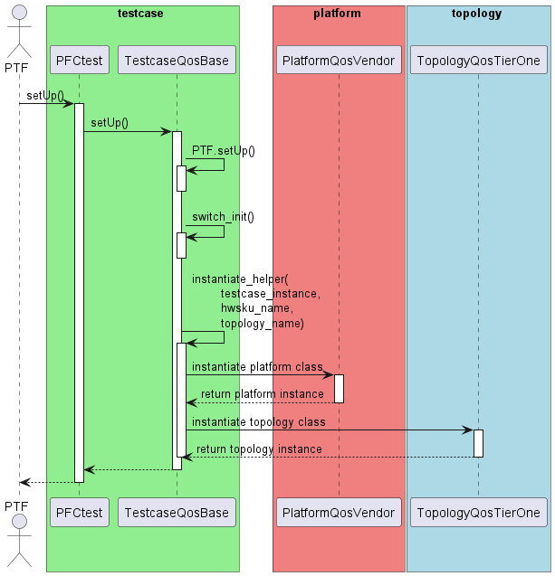
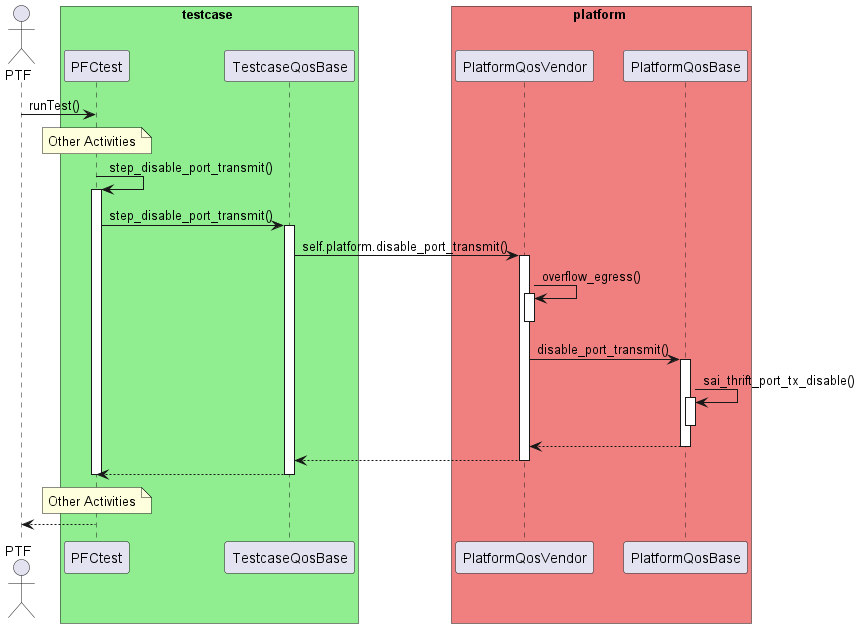

# saitests refactor design and POC demo
**MSFT SONiC team**

## Agenda
- Pain Points
- Refactor Design
- Sequence Detail
- Test Step Encapsulation
- Test Step Decorator
- Design Summary
- Smooth Transition and Compatibility

## Pain Points

## Ref doc and Pain Points
Previously completed documents:
- SONiC QoS Test Refactoring Scope
- Refactor Design for saitest

saitest’s Pain points:
- Difficult to troubleshoot
- Difficult to maintain
- Issues caused by combining PI and PD code
- Miss PR test, and frequent nightly failure due to PR test miss
- Difficult to triage issues

## One Regression Example

In the above PR, we have 30 conversations for changes:
- Requested fix for several duplicated unnecessary conflict code, syntax issues, incorrect functions
- Manually run local test at MSFT side to avoid bad fixes. It was for Cisco multi-asic device, should not impact other vendor’s single box device. Unfortunately, it changed packet building method for XON case, and test will run into endless loop on non-Cisco platform, causing regression.

## Refactor Design

## Testcase and Platform Abstraction

## Add new testcase

## Add new platform

## Sequence Detail

## Instantiate Platform class

## Invoke Platform function

## Invoke Topology function

## Test Step Encapsulation

## setUp before refactor

## setUp after refactor

## Build parameter before refactor

## Build parameter after refactor

## Build packet before refactor

## Build packet after refactor

## Detect RX port before refactor

## Detect RX port after refactor

## Disable TX before refactor

## Disable TX after refactor

## Short of triggering PFC before refactor

## Short of triggering PFC after refactor

## Trigger PFC before refactor

## Trigger PFC after refactor

## Short of triggering ingress drop before refactor

## Short of triggering ingress drop after refactor

## Trigger ingress drop before refactor

## Trigger ingress drop after refactor

## Enable TX before refactor

## Enable TX after refactor

## Finally, Get clear testcase

## Test Step Decorator

## Decorator Usage

- Assign additional activities to test steps using the “saitests_decorator.”
- Set the decorator function's execution time, supporting entry, exit, or both.
- Introduce plugin functions via decorators for small additions without changing step implementation.
- Support printing step banner info, execution results, and diagnostic counters.
- Print human-readable messages to aid in troubleshooting.
- Output register dumps before and after steps for easier troubleshooting.

## Example of step banner and result

## Example of step diagnostic counter

## Design Summary

- The separation of PI and PD code **isolates platform-dependent errors**, making it easier to manage permissions and ensure the **stability and robustness** of platform-independent code.

- The classification of code into Testcase, Platform, and Topology categories facilitates **maintenance, extension, and management**. Especially, support add fake platform to bypass hardware activity to **support PR test in KVM**.

- Encapsulating test steps makes the testing objectives and processes clear and maintainable. Each test step is defined as a distinct method, improving **readability** and simplifying the **debugging process**.

- By using decorators to handle non-test step behaviors, the main code remains **clean and focused on the core testing logic**. This approach enhances maintainability and provides **flexible debugging capabilities**, improving fault diagnosis.

## Smooth Transition and Compatibility

- Compatibility: Maintain original file paths and class names to ensure seamless execution of legacy test cases.

- Coexistence: Commit refactored code to a separate directory (e.g. from saitests to saitests-refactor) to allow parallel development and run legecy testcase and refactored testcase at same time.

- Step-by-Step Refactoring: Refactor and replace test cases incrementally to minimize risks.
