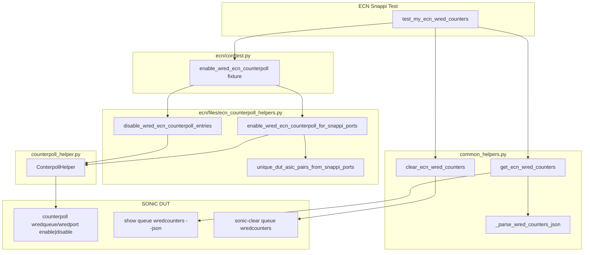

# HLD: ECN WRED Counter Support for Snappi Tests

## 1. Overview

This document describes the high-level design for ECN/WRED counter infrastructure
in sonic-mgmt snappi ECN tests. The implementation provides three capabilities:

1. **Enable** WRED ECN counterpoll (`wredqueue` + `wredport`) on the DUT/ASICs
   used by a test.
2. **Disable** counterpoll on teardown (only what the test enabled).
3. **Read and clear** WRED/ECN queue counters via `show queue wredcounters --json`.

The design deliberately separates concerns:

| Layer | Location | Responsibility |
| ----- | -------- | -------------- |
| Counterpoll setup/teardown | `snappi_tests/ecn/files/ecn_counterpoll_helpers.py` | Enable/disable `counterpoll wredqueue` / `wredport` |
| Pytest fixture wiring | `snappi_tests/ecn/conftest.py` | Opt-in module fixture for tests |
| Counter read/clear + JSON parsing | `common/snappi_tests/common_helpers.py` | CLI read/clear and normalized counter dict |
| Unit tests | `snappi_tests/unit_tests/ecn/` | VS-independent parsing validation |

Counterpoll management reuses upstream `ConterpollHelper` from
`tests/common/helpers/counterpoll_helper.py` (master API). On multi-ASIC
platforms, commands are issued by passing a `SonicAsic` instance as the
command target rather than using a separate `asic` function argument.

---

## 2. Architecture



### 2.1 Data flow (typical test)

```text
Setup (fixture)
  get_snappi_ports
    -> unique (duthost, asic) pairs
    -> counterpoll show (check already enabled)
    -> counterpoll wredqueue/wredport enable (if needed)

Test body
  clear_ecn_wred_counters(duthost, asic=...)
  ... send traffic ...
  get_ecn_wred_counters(duthost, interface=..., priority=..., ...)

Teardown (fixture)
  disable only (duthost, asic, counter_type) entries enabled by fixture
```

---

## 3. File map

| File | Role |
| ---- | ---- |
| `tests/snappi_tests/ecn/conftest.py` | Defines `enable_wred_ecn_counterpoll` pytest fixture |
| `tests/snappi_tests/ecn/files/ecn_counterpoll_helpers.py` | Counterpoll enable/disable logic scoped to snappi ports |
| `tests/common/snappi_tests/common_helpers.py` | `get_ecn_wred_counters`, `clear_ecn_wred_counters`, JSON parsers |
| `tests/common/helpers/counterpoll_helper.py` | Upstream `ConterpollHelper` (reused, not modified by this feature) |
| `tests/common/constants.py` | `WRED_QUEUE`, `WRED_PORT`, stat type constants |
| `tests/snappi_tests/unit_tests/ecn/unit_test_ecn_wred_counter_parsing.py` | Unit tests for parsing helpers |
| `tests/snappi_tests/unit_tests/ecn/README.md` | How to run unit tests |

---

## 4. Counterpoll enable / disable

### 4.1 `tests/snappi_tests/ecn/conftest.py`

#### `enable_wred_ecn_counterpoll` (pytest fixture)

| Property | Value |
| -------- | ----- |
| Scope | `module` |
| Autouse | `False` (test must opt in) |
| Depends on | `get_snappi_ports` (from `snappi_fixtures.py`) |

**Implementation:**

1. **Setup:** calls `enable_wred_ecn_counterpoll_for_snappi_ports(get_snappi_ports)`.
2. **Yield:** returns `enabled_by_us` list for optional inspection.
3. **Teardown:** calls `disable_wred_ecn_counterpoll_entries(enabled_by_us)`.

**Behavior:**

- Enables counterpoll only for `(duthost, asic)` pairs referenced by `snappi_ports`.
- Leaves already-enabled counter types unchanged.
- Disables only counter types the fixture enabled (per `wredqueue` / `wredport`).

---

### 4.2 `tests/snappi_tests/ecn/files/ecn_counterpoll_helpers.py`

#### Constants: `WRED_ECN_COUNTERPOLLS`

Maps counterpoll **show** stat types to CLI subcommands:

| Stat type (`counterpoll show`) | CLI type | Command |
| ------------------------------ | -------- | ------- |
| `WRED_ECN_QUEUE_STAT` | `wredqueue` | `counterpoll wredqueue enable` |
| `WRED_ECN_PORT_STAT` | `wredport` | `counterpoll wredport enable` |

---

#### `_asic_instance_from_snappi_port(duthost, port)`

Resolves the `SonicAsic` instance for a snappi port entry.

- **Single-ASIC:** returns `duthost.asic_instance()`.
- **Multi-ASIC:** uses `port['asic_value']` (e.g. `asic0`) or infers from `port['peer_port']`.

---

#### `unique_dut_asic_pairs_from_snappi_ports(snappi_ports)`

Returns deduplicated `[(duthost, asic_inst), ...]` from the snappi port list.

- Dedup key: `(duthost.hostname, asic_index)`.
- Ensures counterpoll is scoped to ASICs the test actually uses, not every ASIC on the DUT.

---

#### `_counterpoll_target(duthost, asic_inst)`

Returns the object passed to `ConterpollHelper` for CLI execution:

- **Multi-ASIC:** `asic_inst` (`SonicAsic`)
- **Single-ASIC:** `duthost` (`SonicHost`)

This matches the master `ConterpollHelper` API which has no separate `asic` parameter.

---

#### `_get_parsed_counterpoll_show(duthost, asic_inst)`

Runs `counterpoll show` on the correct target and returns a parsed dict:

```python
{
    'WRED_ECN_QUEUE_STAT': {'interval (in ms)': '10000', 'status': 'enable'},
    'WRED_ECN_PORT_STAT':  {'interval (in ms)': '10000', 'status': 'disable'},
    ...
}
```

---

#### `is_wred_ecn_counterpoll_enabled(duthost, asic_inst, stat_type)`

Returns `True` if `stat_type` exists in `counterpoll show` output and `status == 'enable'`.
Missing entries are treated as not enabled.

---

#### `_ensure_wred_ecn_counterpoll_available(duthost)`

Checks `counterpoll --help` for `wredqueue` and `wredport` via
`ConterpollHelper.get_available_counterpoll_types()`. Calls `pytest.skip()` if
either is missing on the platform.

---

#### `enable_wred_ecn_counterpoll_for_snappi_ports(snappi_ports)` (primary)

**Purpose:** Enable WRED ECN counterpoll for ASICs used by the test.

**Algorithm:**

```text
FOR each unique (duthost, asic_inst) in snappi_ports:
    IF first time seeing duthost:
        skip test if wredqueue/wredport not supported
    FOR each (stat_type, cli_type) in WRED_ECN_COUNTERPOLLS:
        IF already enabled on this ASIC:
            log and continue
        ELSE:
            add cli_type to to_enable list
    IF to_enable not empty:
        ConterpollHelper.enable_counterpoll(target, to_enable)
        track each enabled cli_type in enabled_by_us
RETURN enabled_by_us
```

**Returns:** `[(duthost, asic_inst, cli_type), ...]` — used for selective teardown.

---

#### `disable_wred_ecn_counterpoll_entries(enabled_by_us)` (primary)

**Purpose:** Teardown helper — disable only what the fixture enabled.

**Algorithm:**

```text
FOR each (duthost, asic_inst, cli_type) in enabled_by_us:
    skip duplicates
    ConterpollHelper.disable_counterpoll(target, [cli_type])
```

---

#### `disable_wred_ecn_counterpoll(duthost, asic=None)` (primary)

**Purpose:** Explicit disable API for tests that need manual control (outside the fixture).

- **`asic` specified:** disable both `wredqueue` and `wredport` on that ASIC.
- **`asic` is None, multi-ASIC:** loop all `duthost.asics`.
- **`asic` is None, single-ASIC:** disable on `duthost`.

---

## 5. Counter read / clear / parse

### 5.1 `tests/common/snappi_tests/common_helpers.py`

All WRED counter read/clear logic lives here. This file does **not** use
`ConterpollHelper`; it calls SONiC CLI directly.

---

#### `_parse_int_counter(value)` (internal)

Normalizes counter values from JSON strings:

| Input | Output |
| ----- | ------ |
| `"1,234"` | `1234` |
| `"N/A"`, `"n/a"`, `""` | `0` |
| `"42"` | `42` |

Fixes reviewer bug: upstream `wredstat` emits `N/A` when COUNTERS_DB has no value.

---

#### `_txq_from_priority(priority, voq=False)` (internal)

Maps test `priority` argument to TxQ label in JSON output:

| Input | `voq=False` | `voq=True` |
| ----- | ----------- | ---------- |
| `3` | `UC3` | `VOQ3` |
| `"UC3"` | `UC3` | `UC3` |
| `None` | `None` (no filter) | `None` |

Supports chassis/modular platforms where queue labels are `VOQ<n>` not `UC<n>`.

---

#### `_normalize_wred_counter_entry(entry)` (internal)

Maps one queue's JSON fields to the test API schema:

| JSON key (`wredstat`) | API key |
| --------------------- | ------- |
| `wreddroppacket` | `wred_drop_pkts` |
| `wreddropbytes` | `wred_drop_bytes` |
| `ecnmarkedpacket` | `ecn_marked_pkts` |
| `ecnmarkedbytes` | `ecn_marked_bytes` |

---

#### `_parse_wred_counters_json(data)` (internal)

Parses full `show queue wredcounters --json` output.

**Skips:** `time`, `cached_time` metadata keys.

**Returns:**

```python
{
    'Ethernet8': {
        'UC3': {
            'wred_drop_pkts': 0,
            'wred_drop_bytes': 0,
            'ecn_marked_pkts': 3920376576,
            'ecn_marked_bytes': 3998784107520,
        },
        'UC4': { ... },
    }
}
```

**Empty result:** If CLI returns only `{"Ethernet0": {"time": "..."}}` (e.g. with
`--nonzero` and no nonzero counters), returns `{}`.

---

#### `_build_show_queue_wredcounters_cmd(...)` (internal)

Builds CLI string:

```text
show queue wredcounters --json [-n <asic>] [<interface>] [--nonzero] [--voq]
```

---

#### `_run_show_queue_wredcounters_json(...)` (internal)

Executes the CLI via `duthost.shell()`, parses JSON stdout, calls
`_parse_wred_counters_json()`.

---

#### `_filter_wred_counters_by_priority(counters, txq_filter)` (internal)

If `txq_filter` is set (e.g. `UC3`), returns only matching TxQ per port.
If `txq_filter` is `None`, returns full `counters` unchanged.

---

#### `get_ecn_wred_counters(duthost, interface=None, asic=None, priority=None, nonzero=False, voq=False)` (primary)

**Purpose:** Read normalized WRED/ECN queue counters from the DUT.

**CLI:**

```text
show queue wredcounters --json [-n <asic>] [<port>] [--nonzero] [--voq]
```

**Parameters:**

| Parameter | Description |
| --------- | ----------- |
| `duthost` | SONiC host under test |
| `interface` | Port name (e.g. `Ethernet8`). `None` = all ports |
| `asic` | Target ASIC (`SonicAsic`, index, or namespace string). Inferred from `interface` on multi-ASIC if omitted |
| `priority` | Queue priority / TxQ filter (`3`, `UC3`, `VOQ3`, etc.). `None` = all TxQs |
| `nonzero` | Pass `--nonzero` to CLI |
| `voq` | Pass `--voq` to CLI; numeric priority maps to `VOQ<n>` |

**Read paths:**

1. **`interface` or `asic` set:** single targeted read.
2. **Both `None`, multi-ASIC:** loop all ASICs, merge results per port.
3. **Both `None`, single-ASIC:** one global read.

**Returns:** nested dict `{port: {txq: {counter_fields}}}` or `{}` if no counters.

---

#### `clear_ecn_wred_counters(duthost, asic=None)` (primary)

**Purpose:** Clear WRED queue counters before/after traffic.

**CLI:**

```text
sonic-clear queue wredcounters [-n <asic>]
```

| `asic` | Behavior |
| ------ | -------- |
| Specified | Clear on that ASIC (multi-ASIC uses `-n`) |
| `None`, multi-ASIC | Clear on every ASIC |
| `None`, single-ASIC | Clear globally |

---

## 6. Unit tests

### 6.1 `tests/snappi_tests/unit_tests/ecn/unit_test_ecn_wred_counter_parsing.py`

Lightweight unit tests for parsing helpers only. Uses `ast` to extract functions
from `common_helpers.py` without importing heavy sonic-mgmt dependencies.

**Run:**

```bash
python3 -m pytest --noconftest \
  tests/snappi_tests/unit_tests/ecn/unit_test_ecn_wred_counter_parsing.py -v
```

**Coverage:**

| Test | Validates |
| ---- | --------- |
| `test_parse_int_counter` | `N/A`, commas, whitespace |
| `test_txq_from_priority` | `UC`/`VOQ` mapping |
| `test_parse_wred_counters_json_*` | metadata skip, key rename, empty input |
| `test_filter_wred_counters_by_priority_*` | filter match / miss |

See `tests/snappi_tests/unit_tests/ecn/README.md` for full details.

---

## 7. How to use in a test

### 7.1 Prerequisites

1. Test file lives under `tests/snappi_tests/ecn/`.
2. Import `get_snappi_ports` from `snappi_fixtures` (registers fixture chain).
3. Opt in to `enable_wred_ecn_counterpoll` in the test signature.

### 7.2 Example test

```python
import pytest

from tests.common.snappi_tests.snappi_fixtures import (
    get_snappi_ports,   # noqa: F401 — required for fixture chain
    snappi_api,         # noqa: F811
)
from tests.common.snappi_tests.common_helpers import (
    clear_ecn_wred_counters,
    get_ecn_wred_counters,
)


def test_my_ecn_wred_counters(
        get_snappi_ports,              # noqa: F811
        enable_wred_ecn_counterpoll):   # noqa: F811 — opt-in fixture

    duthost = get_snappi_ports[0]['duthost']
    interface = get_snappi_ports[0]['peer_port']
    asic = get_snappi_ports[0].get('asic_value')  # e.g. 'asic0' or None

    # Clear before traffic
    clear_ecn_wred_counters(duthost, asic=asic)

    # ... run traffic ...

    # Read counters (fixture already enabled wredqueue + wredport)
    counters = get_ecn_wred_counters(
        duthost,
        interface=interface,
        asic=asic,
        priority=3,
        nonzero=True,
        voq=False,   # voq=True on VOQ chassis
    )

    assert counters[interface]['UC3']['ecn_marked_pkts'] > 0
```

### 7.3 Fixture lifecycle

```text
test collection
  -> enable_wred_ecn_counterpoll (module setup, once per test file)
       -> enable wredqueue/wredport on test ASICs
  -> test function runs
       -> clear_ecn_wred_counters()
       -> traffic
       -> get_ecn_wred_counters()
  -> enable_wred_ecn_counterpoll (module teardown)
       -> disable only counter types enabled by fixture
```

### 7.4 Manual disable (without fixture)

```python
from tests.snappi_tests.ecn.files.ecn_counterpoll_helpers import (
    disable_wred_ecn_counterpoll,
)

disable_wred_ecn_counterpoll(duthost, asic=0)
```

---

## 8. Multi-ASIC behavior summary

| Operation | Single-ASIC | Multi-ASIC |
| --------- | ----------- | ---------- |
| Enable counterpoll | `ConterpollHelper` on `duthost` | `ConterpollHelper` on `asic_inst` |
| Read counters | `show queue wredcounters --json <port>` | `show queue wredcounters --json -n asic0 <port>` |
| Clear counters | `sonic-clear queue wredcounters` | `sonic-clear queue wredcounters -n asic0` |
| Scope | From `snappi_ports` `(duthost, asic_value)` | Same — only ASICs used by test ports |

---

## 9. Design decisions

| Decision | Rationale |
| -------- | ----------- |
| JSON-only parsing (no table parser) | Avoids `N/A` crash and `"Last cached time was..."` banner crash from human-readable output |
| Counterpoll in ECN conftest, not `common_helpers` | ECN-specific setup; avoids duplication with `ConterpollHelper` |
| Conditional enable / selective disable | Does not disturb DUTs that already had counterpoll enabled; true before/after consistency |
| `voq` parameter (default `False`) | Explicit chassis control per issue #25595 multi-line platform requirement |
| Unit tests via `ast` extraction | No DUT/Snappi/Ansible required; fast CI-friendly validation |
| Master `ConterpollHelper` API | Aligns with upstream sonic-mgmt; multi-ASIC via `SonicAsic` command target |

---

## 10. Related upstream references

- Issue: [sonic-mgmt #25595](https://github.com/sonic-net/sonic-mgmt/issues/25595) — ECN WRED counter infra
- CLI source: `sonic-utilities/scripts/wredstat`
- Existing pattern: `tests/wred/test_wred_counters.py` (JSON read)
- Counterpoll helper: [counterpoll_helper.py](https://github.com/sonic-net/sonic-mgmt/blob/master/tests/common/helpers/counterpoll_helper.py)
