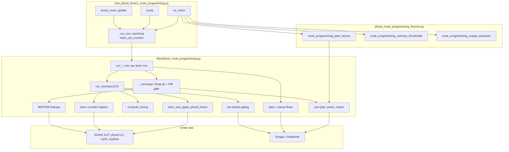

# HLD: PFCWD Timers under BGP Route Programming Load (Snappi Tests)

## 1. Overview

This HLD describes the proposed PFCWD timer tests under BGP route-programming load in
`tests/snappi_tests/pfcwd/`. It addresses the following questions:

1. Does PFCWD detect, drop and restore correctly across a range of polling / detection /
   restoration timer values?
2. Does it still do so when the forwarding path contains a **BGP-programmed route set**
   rather than connected routes?
3. What is the **control-plane cost** of that, in per-process memory and CPU, and does it
   change with the timer values?

Question 3 is why every test row is wrapped in the `mem_cpu_monitor` fixture (section 9).

The suite is three independent pytest functions, each parametrized over the same seven-row
timer matrix, so a scenario can be run on its own with `-k`:

| Scenario | Test function | Runner | Description |
| -------- | ------------- | ------ | ----------- |
| 1 | `test_pfcwd_timers_no_churn` | `run_no_churn_row` | One egress peer, 30k routes, no churn |
| 2 | `test_pfcwd_timers_ecmp_member_flap` | `run_ecmp_row` | 30k routes over two-way ECMP, one member flapped |
| 3 | `test_pfcwd_timers_route_update_under_storm` | `run_ecmp_route_update_row` | 10k routes converge on a second ECMP group **while PFCWD is dropping** |

7 timer rows x 3 scenarios = **21 test cases**, each producing its own memory/CPU export.

---

## 2. Architecture



### 2.1 File map

**Proposed source layout.** The current infrastruture responsibilities will be
consolidated into one module at `snappi_tests/pfcwd/files/pfcwd_route_programming.py`, keeping
this suite self-contained under `snappi_tests/pfcwd/`. The test names describe the scenario and
deliberately omit scale-oriented and experiment-oriented wording.

| File | Responsibility |
| ---- | -------------- |
| `snappi_tests/pfcwd/test_pfcwd_timers_route_programming.py` | Three test functions, timer-matrix parametrization, `mem_cpu_monitor` lifecycle |
| `snappi_tests/pfcwd/pfcwd_route_programming_fixtures.py` | Port-plan factory, memory alarm thresholds, and Snappi protocol teardown |
| `snappi_tests/pfcwd/files/pfcwd_route_programming.py` | Route sets and constants; port-plan resolution; Snappi topology, eBGP peers, and route control; flows and IxNetwork gating; DUT diagnostics; PFCWD handling; per-row orchestration; and the three scenario bodies |

Deliberately **not** a `conftest.py`: pytest treats any module-level `pytest_*` name in a
conftest as a hook, which breaks on the `pytest_assert` import. The fixtures are loaded via
`pytest_plugins` instead.

---

## 3. Testbed and topology

### 3.1 Requirements

| Item | Value | Source |
| ---- | ----- | ------ |
| Topology mark | `tgen` | `pytestmark` |
| ASIC mark | `broadcom` | `pytestmark` |
| Required option | `--bgp_pc_config` | asserted in `route_programming_plan_factory` |
| DUT count | 1 (`duthost`) | test signature |
| Tester | Snappi / IxNetwork (`snappi_api`) | |
| Log analyzer | disabled | `pytest.mark.disable_loganalyzer` |
| Memory/CPU monitor | enabled | `pytest.mark.enable_proc_mem_cpu_monitor` |

`--bgp_pc_config` is load-bearing: it is what makes `tgen_ports` describe **PortChannel**
interfaces with preexisting BGP sessions rather than plain physical ports.

### 3.1.1 Assumptions and preconditions

- The testbed provides at least **five** available tester/DUT physical-port pairs: one ingress
  pair and four egress pairs. All selected DUT ports are downlink ports.
- `--bgp_pc_config` describes the selected PortChannels and their preexisting eBGP sessions;
  the test does not create PortChannels or configure BGP on the ports.
- The PortChannel ordering exposed through `tgen_ports` assigns index 0 to the ingress pair and
  indices 14 to the egress pairs. This ordering is used to select each scenario's ports.
- The selected eBGP peers accept the test route advertisements without route filters or
  maximum-prefix limits below 30k for each route-A peer and 10k for each route-B peer.
  Scenario 3 therefore requires capacity for 40k distinct eBGP routes while both route sets
  are advertised.
- No other peer advertises the route-A or route-B prefix blocks during the test. The route
  ranges must remain unique so traffic and FIB checks measure the intended routes.

### 3.2 Physical and logical shape

Every tester port sits in its own LACP LAG and peers with a DUT PortChannel that has
**exactly one member port** (`resolve_physical_port` asserts this). The single-member rule is
required because PFCWD is configured and counted **per physical port**, while `tgen_ports`
reports only the PortChannel  so every PFCWD CLI call and storm-counter read must be
resolved down to the member interface.

```
        Snappi / IxNetwork                         DUT (single Broadcom ASIC)
  +-----------------------------+            +------------------------------------+
  | Test_Port_1 / lag1 (tgen 0) |===========>| PortChannelX - EthernetA  (ingress)|
  |                             |            |                                    |
  | Test_Port_2 / lag2 (tgen 1) |<===========| PortChannelY - EthernetB  route A  |
  | Test_Port_3 / lag3 (tgen 2) |<===========| PortChannelZ - EthernetC  route A  |
  | Test_Port_4 / lag4 (tgen 3) |<===========| PortChannelW - EthernetD  route B  |
  | Test_Port_5 / lag5 (tgen 4) |<===========| PortChannelV - EthernetE  route B  |
  +-----------------------------+            +------------------------------------+
         eBGP peer per egress port                PFCWD armed on EthernetB..E
         data flows: tgen0 --> advertised prefixes --> egress peers
         PFC pause:  egress port --> DUT (raw, port based)
```

`tgen_ports` is ordered by PortChannel number, so selection is by index; the resolved DUT
interfaces are logged at the start of every scenario (`log_port_plan`) because the mapping is
not obvious from the index alone.

| tgen index | Role | Route set | Constant |
| ---------- | ---- | --------- | -------- |
| 0 | ingress (all traffic sources here) |  | `INGRESS_TGEN_INDEX` |
| 1, 2 | egress, steady-state scale | A (30k) | `ROUTE_A_EGRESS_INDICES` |
| 3, 4 | egress, churn set | B (10k) | `ROUTE_B_EGRESS_INDICES` |

### 3.3 Interfaces used per scenario

A scenario configures **only** the ports it drives, so it never brings up a port it does not
send to. The port plan is built per scenario and cached per egress set.

| Scenario | Egress indices | Tester ports | DUT PortChannels | DUT physical ports | eBGP sessions | Egress ports paused |
| -------- | -------------- | ------------ | ---------------- | ------------------ | ------------- | ------------------- |
| 1 (no churn) | `(1,)` | 2 | 2 | 2 | 1 | 1 |
| 2 (ECMP) | `(1, 2)` | 3 | 3 | 3 | 2 | 2 |
| 3 (ECMP + route update) | `(1, 2, 3, 4)` | 5 | 5 | 5 | 4 | 4 |

PFCWD itself is started with `all`, i.e. on every port; the last column is how many egress
ports the scenario actually pauses and reads storm counters on.

### 3.4 Route sets

| Set | Prefixes | Base | Mask | Advertised by | When |
| --- | -------- | ---- | ---- | ------------- | ---- |
| A | 30,000 (`ROUTES_A_COUNT`) | `200.1.0.1` | /24 | egress peers 12 | during bring-up, before any traffic |
| B | 10,000 (`ROUTES_B_COUNT`) | `210.1.0.1` | /24 | egress peers 34 | scenario 3 only, mid-run, under a live storm |

Both counts are overridable by env (`PFCWD_EXPERIMENT_ROUTES_A` / `_B`). The blocks must not
overlap: 30k /24s from `200.1.0.0` span 7.68M addresses and end near `200.118.47.0`, so B
starts at `210.1.0.0`.

Each peer carries exactly **one** route range, because `snappi_ixnetwork` compacts ranges
that share a device group into a single IxNetwork object and `Ngpf.set_route_state` then
raises `KeyError` when one call names two merged ranges. Both route-A peers advertise the
*same* prefixes, which is what makes them an ECMP pair  two peers therefore still put 30k
routes in the FIB, just with two next hops.

### 3.5 Traffic construction

| Property | Value |
| -------- | ----- |
| Data flow endpoints | device based: tx = ingress IPv4 device, rx = **BGP route ranges**, so the BGP-programmed route set is in the forwarding path and one flow hashes across every peer advertising the set |
| Data packet size | 1024 B (`DATA_PKT_SIZE`) |
| Entropy per flow | 100 incrementing UDP source ports (`DATA_FLOW_STREAM_COUNT`) |
| Priority marking | `eth.pfc_queue` plus DSCP from `prio_dscp_map` |
| Lossless priorities | first two of `lossless_prio_list`; scenarios 2 and 3 call them **storm prio** and **clean prio** |
| Pause flows | port based (raw PFC frames from an egress tester port toward the DUT), 64 B, quanta `0xffff` on the selected priorities, rate approximately 2 frames per quanta interval so the pause never lapses |
| Offered rate | 100% of line rate per phase (`LINE_RATE_PERCENT`), split evenly across the flows in that phase |

### 3.6 PFCWD timer matrix

| Row / pytest id | polling (ms) | detection (ms) | restoration (ms) | Storm window (s) | Victim offset (s) | Storm phase (s) |
| --------------- | ------------ | -------------- | ---------------- | ---------------- | ----------------- | --------------- |
| `poll1000_det1800_rest1800` | 1000 | 1800 | 1800 | 3 | 0.90 | 3.90 |
| `poll100_det200_rest200` | 100 | 200 | 200 | 1 | 0.10 | 1.10 |
| `poll100_det400_rest400` | 100 | 400 | 400 | 1 | 0.20 | 1.20 |
| `poll100_det600_rest600` | 100 | 600 | 600 | 1 | 0.30 | 1.30 |
| `poll200_det200_rest200` | 200 | 200 | 200 | 1 | 0.10 | 1.10 |
| `poll200_det400_rest400` | 200 | 400 | 400 | 1 | 0.20 | 1.20 |
| `poll200_det600_rest600` | 200 | 600 | 600 | 1 | 0.30 | 1.30 |

Derived by `compute_timing` for scenarios 1 and 2: storm window = `ceil(detect + poll + 0.1)`
seconds, the victim flow opens `restoration / 2` into the storm and runs a full storm window,
so the phase ends with the victim rather than the pause. Both stay in the same phase, so
IxNetwork schedules them off one transmit trigger and the offset holds precisely.

Because of the `ceil`, six of the seven rows share an identical 1-second storm window and
differ only in the victim's sub-second offset; `poll1000_det1800_rest1800` is the only row
with a materially different shape. Six near-identical memory/CPU timelines are therefore the
expected result, not a bug in the capture. See section 11.

---

## 4. Stages common to every row

Each of the 21 cases runs this preamble before its scenario-specific stages.

| # | Stage | What happens | Verification | Budget |
| - | ----- | ------------ | ------------ | ------ |
| 0 | Monitor start | `mem_cpu_monitor.start(duthost, [syncd, swss, orchagent, bgpd, zebra], interval=2.0, include_host_free=True, host_top_all_procs=True)` | none (instrumentation) |  |
| 1 | Build Snappi config | Ports, LAGs, ingress device, one eBGP peer per egress with its route range; UDP port allocator reset; flows added for this row's timing | flow construction only |  |
| 2 | Push and bring up | `set_config`, force AS-SEQ on the prefix pools, start all protocols, **withdraw B**, advertise A | `wait_for_bgp_peer_prefix_count` for **each** route-A peer individually; a total prefix count cannot confirm both sides of an ECMP pair are populated | 600 s, poll 15 s |
| 3 | ARP / ND | `wait_for_arp` on the Snappi devices | resolution succeeds | 30 x 2 s |
| 4 | FIB programming | Fixed `ROUTE_PROGRAMMING_DELAY_SEC` wait, then read the FIB column of `show ip route summary` | `wait_for_fib_route_count >= 30000` from source `ebgp`; failure attaches PortChannel and BGP summary diagnostics | 90 s wait + 600 s, poll 5 s |
| 5 | Settle | `FIB_SETTLE_SEC` |  | 1 s |
| 6 | Arm PFCWD | `pfcwd stop`, wait until `show pfcwd config` has **no** port rows, `pfcwd interval <poll>`, `pfcwd start --action drop all <detect> --restoration-time <restore>` | every CLI `rc == 0`; config confirmed empty before re-arming (30 s, poll 2 s); poll/detect/restore then **read back** off the physical port and compared with the requested values | ~35 s |
| 7 | Baseline counters | `storm_counter_snapshot` records `(detected, restored)` per (port, prio) from `show pfcwd stats`. Scenario 3 takes one baseline for the row; scenarios 1 and 2 take a fresh one at the start of **each** storm attempt |  |  |

Storm counters are always compared **against a baseline**, never against zero, because the
counters are cumulative across rows within a session. Scenarios 1 and 2 re-baseline per
attempt for a second reason: a baseline shared across attempts would count the first
attempt's increment again on every later one, so one detection would read as three.

---

## 5. Scenario 1  no churn

`test_pfcwd_timers_no_churn`

### 5.1 Topology

One ingress, one egress peer holding route set A: **2 tester ports, 2 DUT PortChannels, 2
physical ports, 1 eBGP session.** Both lossless priorities are paused, which makes this the
closest analogue to `pfcwd_basic_helper`  the difference being that traffic is forwarded by
30k learned routes instead of a connected route.

```
  tgen0 --[100% of line rate, split over prio P0 and P1]--> DUT --> tgen1 (30k routes, set A)
                                                                <-- PFC pause on P0+P1
```

### 5.2 Stages

| # | Stage | Duration | What happens | Verifications |
| - | ----- | -------- | ------------ | ------------- |
| 1 | **warm up** | 1 s | Data on both lossless prios at 50% each, no pause | loss **exactly 0**. Nothing is congested and the FIB is fully programmed, so any loss here means the baseline is dirty and every later number is measured against a broken path |
| 2 | **storm**, x`STORM_MODE_ATTEMPTS` | (1.13.9 s + restore gate + 5 s) per attempt | Pause opens the phase on both prios; the victim flow starts `restoration / 2` later and outlasts the pause. PFCWD should detect and set the port to drop. Stages 2 and 3 repeat as one unit, three times | victim loss **reported** against **[0.65, 1.0]** (`1 - PFCWD_LOSS_DEVIATION_BRCM`, the same deviation `pfcwd_basic_helper` uses for Broadcom), not asserted |
| 3 | **restore gate** | <= 60 s per attempt | Poll the PFCWD restored counter instead of assuming a fixed restoration-plus-poll gap has elapsed; separate phases have no shared transmit start to count from. A timeout here only warns | `check_storm_detected_and_restored` **reports** whether detected **and** restored advanced past that attempt's baseline for every (port, prio) |
| 4 | **summary** |  | One line per scenario: how many attempts landed in the loss window and how many both detected and restored |  |
| 5 | **post storm** | 1 s | Fresh data flows on both prios, no pause | loss **exactly 0**  forwarding is fully back |

The storm window is replayed because the DUT does not reliably detect a storm from a single
window while it is holding the BGP-programmed route set. All three attempts run whatever the earlier ones
did, and the result is logged rather than asserted, so a row reports the detection **rate**
instead of failing on the first miss. The last attempt's restore gate is also the gate the
post-storm phase needs, so no separate wait follows the loop  but the post-storm phase still
asserts zero loss, which means a DUT left dropping after the final attempt fails the row
there.

Independently of the loss bounds, every phase asserts its fixed-duration flows stopped within
`PHASE_STOP_MARGIN_SEC` (60 s) of the phase window closing, and every loss measurement 
reported or asserted  still asserts the flow transmitted a non-zero frame count first, so a
flow that never started cannot read as zero loss or as a failed attempt.

### 5.3 Memory / CPU markers

| Marker as recorded | Normalized | Raised at |
| ------------------ | ---------- | --------- |
| `start` | `start` | monitor start, t0 for all offsets |
| `<tag>_bgp_setup_start` | `bgp_setup_start` | before `set_config` / protocol start |
| `<tag>_bgp_converged` | `bgp_converged` | after 30k routes confirmed in the FIB |
| `scenario1_traffic_start` | unchanged | after PFCWD armed, before the warm-up phase |
| `scenario1_storm_complete_attempt<N>` | unchanged | immediately after each storm attempt's statistics are read, `N` = 1..`STORM_MODE_ATTEMPTS` |
| `<tag>_row_complete` | `row_complete` | end of the row |
| `stop` | `stop` | monitor stop |

`<tag>` is this row's `timer_tag`, for example `poll100_det200_rest200`. Section 9.2 explains
the two marker prefixes.

The resulting phase windows are: RIB build (`bgp_setup_start` to `bgp_converged`), PFCWD arm
(to `traffic_start`), traffic and storm attempts (to `storm_complete_attempt3`), restore and
post-storm (to `row_complete`). The first window dominates the wall clock  a 90 s fixed wait plus 30k-route
programming  and is where bgpd/zebra growth is expected.

---

## 6. Scenario 2  ECMP with a member flap

`test_pfcwd_timers_ecmp_member_flap`

### 6.1 Topology

Route set A over **two-way ECMP**: **3 tester ports, 3 DUT PortChannels, 3 physical ports,
2 eBGP sessions.** Both peers advertise the same 30k prefixes, so the FIB holds 30k routes
with two next hops. Only the **storm priority** is paused, on **both** egress ports; the
**clean priority** runs throughout and is the queue whose health is measured.

```
  tgen0 --[storm prio: victim]--+--> DUT --> tgen1 (set A)  <-- pause on storm prio
        --[clean prio: clean ]--+           --> tgen2 (set A)  <-- pause on storm prio
                                                    ^
                                    tgen2 link flapped down/up in the last phase
```

The clean flow is continuous and is re-enabled by every phase that needs it, so its counters
restart at each phase boundary. That is what the flap phase wants: frames counted from the
moment the flap phase begins, not from the start of the scenario.

### 6.2 Stages

| # | Stage | Duration | What happens | Verifications |
| - | ----- | -------- | ------------ | ------------- |
| 1 | **warm up** | 1 s | Both prios at 50% each across the ECMP pair | loss exactly 0 |
| 2 | **storm**, x`STORM_MODE_ATTEMPTS` | (1.13.9 s + restore gate + 5 s) per attempt | Pause on the storm prio on **both** egress ports; victim flow on the storm prio plus the continuous clean flow. Stages 2 and 3 repeat as one unit, three times, exactly as in scenario 1 | victim loss **reported** against **[0.65, 1.0]**, not asserted; clean-queue loss logged per attempt, since applying the phase clears its counters |
| 3 | **restore gate** | <= 60 s per attempt | Poll restored counters on both ports | **reports** whether detected **and** restored advanced past that attempt's baseline on **every** (port, storm prio) |
| 4 | **summary** |  | Attempts in the loss window and attempts that both detected and restored |  |
| 5 | **post storm** | 1 s | Storm-prio flow again, plus clean | loss exactly 0 |
| 6 | **flap** | ~65 s plus BGP relearn | Clean queue only, at 50%. Settle 5 s, take the last ECMP member's tester link **down** for 30 s, back **up** for 30 s, then wait for that peer to relearn route set A | (a) the flapped peer relearns its full 30k prefixes (`wait_for_bgp_peer_prefix_count`, 600 s / 15 s), required because otherwise the next timer row would expect a PFC storm on an egress port carrying no traffic; (b) the clean flow transmitted at all across the flap; (c) clean-queue **rx/tx rate ratio >= 0.90** (`CONVERGED_RX_RATIO`) once the member is back up |

The flap phase deliberately leaves half the line rate unused: with one ECMP member down the
survivor absorbs everything that was hashed to both, and a full line rate there would
congest it into a PFC storm on the very port whose recovery this phase is measuring.

### 6.3 Memory / CPU markers

| Marker | Normalized | Raised at |
| ------ | ---------- | --------- |
| `start` | `start` | monitor start |
| `<tag>_bgp_setup_start` | `bgp_setup_start` | before bring-up |
| `<tag>_bgp_converged` | `bgp_converged` | 30k in FIB across both peers |
| `scenario2_traffic_start` | unchanged | PFCWD armed, before warm up |
| `scenario2_storm_complete_attempt<N>` | unchanged | after each storm attempt's statistics are read, `N` = 1..`STORM_MODE_ATTEMPTS` |
| `scenario2_ecmp_member_down` | unchanged | 30 s after the member link went down |
| `scenario2_ecmp_member_up` | unchanged | 30 s after the member link came back |
| `scenario2_ecmp_member_reconverged` | unchanged | after the flapped peer relearned 30k prefixes |
| `<tag>_row_complete` | `row_complete` | end of the row |
| `stop` | `stop` | monitor stop |

Scenario 2 is the richest scenario for memory/CPU analysis: the `ecmp_member_down` ->
`ecmp_member_up` -> `ecmp_member_reconverged` triple brackets a full 30k-route withdraw and
relearn, which is where bgpd / zebra / orchagent churn should show most clearly, and it
happens with PFCWD armed.

---

## 7. Scenario 3  route update under a live storm

`test_pfcwd_timers_route_update_under_storm`

### 7.1 Topology

Two independent ECMP groups: **5 tester ports, 5 DUT PortChannels, 5 physical ports, 4 eBGP
sessions.** Route set A (30k) on egress 12, route set B (10k) on egress 34. Four
continuous data flows at 25% each (storm prio and clean prio toward A, and toward B), plus a
continuous pause on the storm prio on **all four** egress ports, stopped explicitly at the
end.

No `compute_timing` and no phase gating: this scenario's phases (a 10k route convergence)
are orders of magnitude longer than any timer value, so every boundary is polled instead of
scheduled, and its four continuous flows at 25% come to exactly line rate on their own.

```
  tgen0 --25% RouteA victim (storm prio)--> DUT --> tgen1, tgen2   set A (30k, already up)
        --25% RouteA clean  (clean prio)-->                        <-- continuous pause
        --25% RouteB victim (storm prio)-->       --> tgen3, tgen4  set B (10k, mid-run)
        --25% RouteB clean  (clean prio)-->                        <-- continuous pause
```

### 7.2 Stages

| # | Stage | Duration | What happens | Verifications |
| - | ----- | -------- | ------------ | ------------- |
| 1 | **steady state** | 10 s | Single phase applied with all four data flows plus the pause; **data only** started; settle | (a) route-A clean rx/tx ratio **>= 0.90**, so A is forwarding before the storm; (b) route-B clean ratio **< 0.90**, so B is *not* already forwarding and its convergence can be measured. The second assertion is what makes the headline measurement meaningful |
| 2 | **pause start** | <= 60 s | Start the continuous pause on the storm prio on all four egress ports | `wait_for_storm_detected` on the **route-A** ports (60 s, poll 2 s): PFCWD must actually be dropping before the route update begins |
| 3 | **route B advertised** | instant | `set_route_advertise_state(B, True)`; the AS-SEQ segment type is logged again | none directly |
| 4 | **route B convergence** | <= 90 s, poll 5 s | Poll the route-B clean flow rx/tx ratio until >= 0.90; `converged_sec` is the time since the advertise call. **This is the headline measurement** | convergence happened within `S3_CONVERGENCE_TIMEOUT_SEC`; on failure the DUT's BGP prefix count is attached; on success paths received across peers are logged |
| 5 | **storm on B** | <= 60 s |  | `wait_for_storm_detected` on the **route-B** ports: once B forwards, its egress queues fill under the same pause and PFCWD must detect there too |
| 6 | **restore** | <= 60 s | Stop the pause flows | `wait_for_storm_restored` on **all four** egress ports (60 s, poll 2 s); counters logged before and after |
| 7 | **teardown** |  | Loss logged for all four flows, all flows stopped, route set B withdrawn | loss **logged only**: the flows ran across storm, convergence and restore in one continuous window, so no single loss bound applies |

`converged_sec` is returned by `run_scenario3` and logged as
`route set B convergence under PFCWD load: N.NNs`. It is currently reported, not asserted
against a bound beyond the 90 s timeout; comparing it across the seven timer rows is the
analysis this scenario exists for.

### 7.3 Memory / CPU markers

| Marker | Normalized | Raised at |
| ------ | ---------- | --------- |
| `start` | `start` | monitor start |
| `<tag>_bgp_setup_start` | `bgp_setup_start` | before bring-up (A up, B withdrawn) |
| `<tag>_bgp_converged` | `bgp_converged` | 30k route-A prefixes in the FIB |
| `scenario3_pause_start` | unchanged | just before the continuous pause starts |
| `scenario3_storm_detected` | unchanged | PFCWD confirmed dropping on route-A egress |
| `scenario3_route_b_advertised` | unchanged | immediately after the advertise call |
| `scenario3_route_b_converged` | unchanged | route-B data plane reached 90% of tx rate |
| `scenario3_storm_restored` | unchanged | PFCWD restored on all four egress ports |
| `<tag>_row_complete` | `row_complete` | end of the row |
| `stop` | `stop` | monitor stop |

The window `route_b_advertised` to `route_b_converged` is the one to read first: 10k routes
being learned, programmed and forwarded **while PFCWD is actively dropping on another ECMP
group**. Its mean and peak per-process memory and CPU is the number this experiment was built
to produce. `storm_detected` to `route_b_advertised` is the control window: same storm, no
route churn.

---

## 8. What each scenario isolates

| | Scenario 1 | Scenario 2 | Scenario 3 |
| --- | ---------- | ---------- | ---------- |
| PFCWD role | subject under test | subject under test | **background load** |
| Convergence role | background scale (static 30k) | injected churn (30k relearn) | **subject under test** |
| Storm and churn overlap | no churn | churn after the storm, PFCWD armed | **simultaneous** |
| Headline result | detect/restore counters plus loss windows | clean-queue ratio >= 0.90 across a flap | `converged_sec` for 10k routes |
| Priorities paused | both lossless | storm prio only | storm prio only |
| Egress ports paused | 1 | 2 | 4 |

Read as a progression:

1. **Scenario 1** establishes that PFCWD behaves correctly at each timer setting when the
   forwarding path is a 30k-route RIB rather than connected routes. The RIB is load here,
   not the variable.
2. **Scenario 2** keeps PFCWD as the subject but adds control-plane churn, and separates the
   two lossless priorities so one queue can be shown to survive what the other is subjected
   to. The flap makes the DUT withdraw and relearn 30k routes while a watchdog is armed.
3. **Scenario 3** inverts the roles. PFCWD dropping becomes the environment, and the question
   becomes whether, and how fast, a fresh 10k-route ECMP group can converge inside it. The
   timer sweep then asks whether more aggressive polling and detection slow that convergence
   down, which is where the timer values could plausibly interact with the control plane
   rather than only with the data plane.

The memory/CPU instrumentation connects them: the same five processes are sampled across all
21 rows, so per-phase means can be compared row to row and scenario to scenario.

---

## 9. Memory / CPU instrumentation

### 9.1 What is captured

`_run_row` starts the monitor before the runner and always stops, plots and exports it in a
`finally`, so a failing row still yields data.

| Setting | Value | Effect |
| ------- | ----- | ------ |
| processes | `syncd`, `swss`, `orchagent`, `bgpd`, `zebra` | requested per-process series |
| `interval` | 2.0 s | sampling tick |
| `include_host_free` | True | host-level `free -m` alongside per-process `top` |
| `host_top_all_procs` | True | store all / top-N processes seen in `top`, not only the requested list |
| `capture_raw_stdout` | True | raw `top` output retained for post-hoc reparsing |
| `output_basename_style` | `short_node` | artifact names derived from the parametrized node id |

Artifacts land in that row's `tmp_path`: a PNG timeline plus JSON and CSV sample exports, with
paths logged at `INFO`.

`route_programming_memory_thresholds` raises the stock `memory_utilization` alarm thresholds to the
values `test_bgp_rib_route_optimztn_perf_v1` uses. Without it every row would fail in the
shared memory teardown on an `[ALARM]`: these scenarios hold 30k routes, so bgpd and zebra
legitimately grow far past the default limits, and the row's own result would be masked.

### 9.2 Marker naming: two prefixes

Markers are raised from two layers and are prefixed differently:

| Raised in | Prefix | Markers |
| --------- | ------ | ------- |
| `pfcwd_route_programming` (per row) | this row's `timer_tag`, e.g. `poll100_det200_rest200` | `bgp_setup_start`, `bgp_converged`, `row_complete` |
| `pfcwd_route_programming` (per scenario) | the scenario label, `scenario1` / `scenario2` / `scenario3` | everything else |

The timer-tagged markers identify the setup and completion points for a specific timer row.
The scenario markers identify the workload phases within that row.

### 9.3 Reviewing row artifacts

Review the PNG timeline and JSON/CSV samples emitted for each row. The markers bracket route
programming, PFCWD arming, storm activity, restoration, and row completion, enabling
per-row inspection of the sampled process memory and CPU.

Note that `top` truncates command names at 8 characters, so `orchagent` is stored as
`orchage+`. Whether a sample is stored is decided by the monitor's requested-process matching
and its `jumper_top_n` RSS ranking, so `orchagent` coverage can be thinner than the others.
Confirm the available samples before drawing conclusions from an orchagent series.

---

## 10. Design decisions

**Three tests rather than one parametrized over scenarios.** Each scenario configures only
the ports, BGP peers and flows it drives, so a scenario never brings up a port it does not
send to, and any one of them can be run alone with `-k`.

**Phases applied one at a time (scenarios 1 and 2).** IxNetwork sums the configured rates of
all flow groups transmitting from one LAG and rejects the apply with "Lag Port is
Oversubscribed" past line rate  statically, ignoring the start delays that keep the phases
apart. Scenario 1's six flow groups at 50% read as 300%. `pfcwd_basic_helper` builds the same
pattern and is never rejected only because its flows sit on plain ports where the check does
not run. Disabling a traffic item does remove it from that sum, so each phase is applied with
only its own flows enabled and every phase then offers a full 100% of line rate. Dividing
line rate between phases that never run together would have made these numbers incomparable
with `pfcwd_basic_helper`. Two consequences: applying a phase **clears the flow counters**, so
each phase's statistics cover that phase alone and need no before/after subtraction; and
phase statistics must be read before the next phase is applied.

**Rates written before `Generate`, never after.** A config element is a template and the flow
groups generated from it are what the ports transmit; `Generate` copies one into the other and
`Apply` only pushes flow groups that already exist. Setting a rate afterwards leaves the config
element reading the phase rate while the flow groups keep the previous one, which silently cost
two thirds of line rate and produced entirely plausible loss figures.
`_verify_flow_group_rates` refuses to transmit unless the flow groups carry the phase's rate,
so that failure cannot recur.

**Traffic control through the raw IxNetwork session, not snappi.** snappi's
`set_control_state` regenerates flow groups before transmitting, which would discard the
per-phase rates and enable flags that gating depends on, and would reset counters mid-phase.
snappi still pushes the config, reads metrics and drives port link state;
`snappi_tests/ecn/files/restpy_multidut_helper.py` mixes the two the same way.

**A fixed wait *and* a FIB count.** A peer reporting every prefix received says nothing about
the forwarding plane holding them, and warm-up traffic sent into a half-programmed FIB loses
frames for reasons unrelated to PFCWD. So routes get a fixed programming window and the FIB
column of `show ip route summary` is then confirmed, rather than either one alone.

**Per-peer prefix waits rather than a total.** The ECMP scenarios need both sides of the pair
populated, which a total prefix count cannot confirm. `bgp_ipv4_prefix_count` takes the
per-peer maximum for the same reason: every peer advertises its own set, so the maximum tracks
the largest set that has finished arriving and is unaffected by smaller sets coming and going.

**PFCWD fully torn down and confirmed empty before each row.** `show pfcwd config` must have
no port rows before the new timers are applied, and the applied values are read back off the
physical port, so a row can never silently inherit the previous row's timers.

**Storm counters compared against a baseline, re-taken per storm attempt.** The counters are
cumulative across rows within a session, so every check is relative to
`storm_counter_snapshot` rather than to zero. Scenarios 1 and 2 snapshot again at the top of
every storm attempt, because one baseline shared across attempts would count the first
attempt's increment on every later one and turn a single detection into three.

**The storm window is replayed and reported, not asserted once.** A single window does not
reliably make PFCWD detect while the DUT holds the BGP-programmed route set, and a row that fails on the
first miss says nothing about how often detection works. Scenarios 1 and 2 therefore run the
storm phase `STORM_MODE_ATTEMPTS` (3) times, log each attempt's loss and counters, and
summarise the rate. `STORM_ATTEMPT_SETTLE_SEC` separates attempts so the paused queue
quiesces; after an attempt that never restored, the restore gate has already provided that
gap. What still fails a row is the post-storm phase's zero-loss check, so a DUT left dropping
after the last attempt is not passed over.

**The restore gate polls instead of sleeping.** `pfcwd_basic_helper` delays its post-storm
flow a fixed restoration-plus-poll interval from one shared transmit start. Separate phases
have no shared start to count from, so the restored counter is polled directly; a timeout only
warns, because `check_storm_detected_and_restored` is what records the result. The gate runs
inside the attempt loop, so the last attempt's gate is also the one the post-storm phase needs.

**One route range per peer.** `snappi_ixnetwork` compacts ranges sharing a device group into
one IxNetwork object, and `Ngpf.set_route_state` then raises `KeyError` when a call names two
merged ranges.

**AS-SEQ forced on the prefix pools and logged repeatedly.** The `AS_SEQ` set on the snappi
route range does not reliably survive translation, so `apply_ixia_as_seq` forces it on the
IxNetwork objects. Anything that re-pushes route properties can put the original back, and
advertise/withdraw goes through `set_control_state`, so route set B could otherwise reach the
DUT with a different segment type from route set A purely because it is advertised later 
which would look like scenario 3 alone failing to forward. The segment type is therefore logged
after the override, after protocol start, and after route set B is advertised.

**Fixtures are not a `conftest.py`.** pytest treats any module-level `pytest_*` name in a
conftest as a hook, which breaks on the `pytest_assert` import.

---

## 11. Known gaps and follow-ups

1. **`compute_timing`'s `ceil` flattens the sweep.** Six of seven rows get an identical
   1-second storm window and differ only in the victim's sub-second offset (section 3.6). The
   matrix therefore sweeps timer *settings* much more than storm *duration*. If varying storm
   duration with detection time is wanted, the `ceil` is where to change it.
2. **Scenario 3's `converged_sec` has no pass/fail bound** beyond the 90 s timeout. It is
   reported for comparison across rows; the scenario is an experiment rather than a
   pass/fail conformance check in that respect.
3. **Clean-queue loss in scenario 2's storm phase is logged, not asserted.** If the clean
   queue is meant to be unaffected by a storm on the other priority, that could carry a bound.
4. **Scenarios 1 and 2 report a storm detection rate rather than asserting one.** Three
   attempts are run and summarised, so a row where PFCWD detected once out of three still
   passes unless the post-storm phase loses frames. Once the detection rate on a BGP-programmed route set is
   understood, this is where to put a threshold back  for example requiring some minimum
   number of the attempts to detect and restore.
5. **Scenario 3 asserts no per-flow loss bound**, by design: its flows span storm,
   convergence and restore in one continuous window.
6. **`orchagent` series coverage can be thin** because of `top` name truncation interacting
   with the monitor's RSS top-N storage rule (section 9.3).
7. **Interface counts in section 3.3 are derived** from the index constants and the
   one-member-per-PortChannel assertion, not observed on a live testbed. Actual DUT interface
   and PortChannel names, measured `converged_sec` per timer row, and typical per-phase memory
   deltas for bgpd/zebra are still to be filled in from a real run.

---

## 12. Related references

| Topic | Location |
| ----- | -------- |
| Test suite | `tests/snappi_tests/pfcwd/` |
| Operator guide | `tests/snappi_tests/pfcwd/README.md` |
| Reference PFCWD helper this suite is kept comparable with | `tests/snappi_tests/pfcwd/files/pfcwd_basic_helper.py`, driven by `tests/snappi_tests/pfcwd/test_pfcwd_basic_with_snappi.py` |
| Route-scale memory thresholds copied from | `tests/snappi_tests/bgp/test_bgp_rib_route_optimztn_perf.py` |
| Memory/CPU monitor plugin | `tests/common/plugins/proc_mem_cpu_monitor/` |
| Mixed snappi / restpy precedent | `tests/snappi_tests/ecn/files/restpy_multidut_helper.py` |
