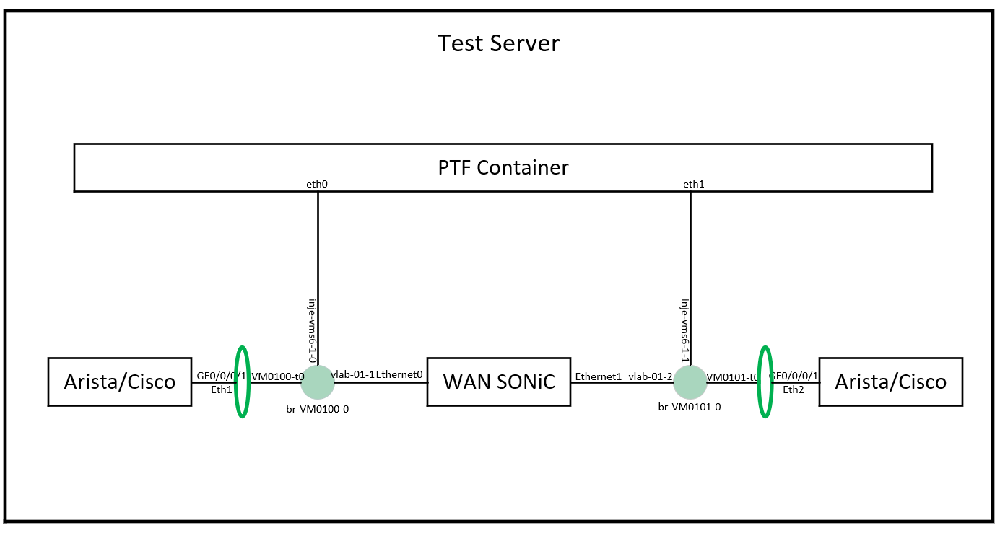
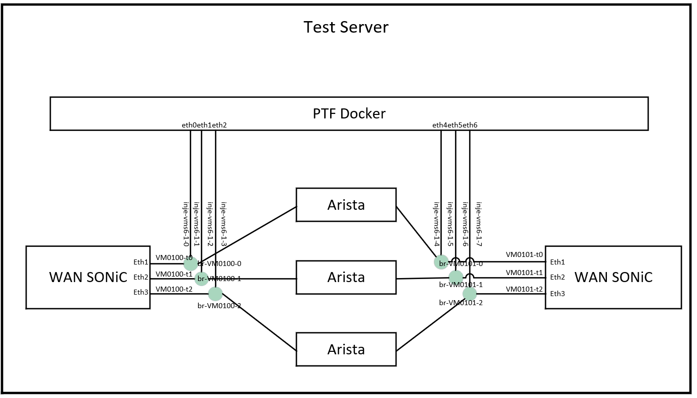

# WAN SONiC Automation Testcases summary
This document describes WAN testcases and common topology for WAN SONiC.

## Common topology for WAN SONiC testcases verification
We classified WAN topology into two categories: one is wan-common, most of testcases can be run based on it, the other is wan-ecmp, which is to verify multi-path ECMP.

1. wan-common topology

2. wan-ecmp topology

## Common workflow of WAN SONiC test automation

## WAN SONiC testcases summary

|     Service      |          Test File Name                   | Covered Function                                                                                                                         |
| :--------------: | :---------------------------------------- | ---------------------------------------------------------------------------------------------------------------------------------------- |
|      LACP        | test_wan_lag_min_link.py                  | Verify LACP minimal members, verify traffic lost and logicl interface status with member interface operations, such as shut/unshut cmd.  |
|                  | test_wan_lag_member.py                    | Verify LACP with traffic, leverage PTF to generate traffic and verify traffic in PTF container.                                          |
|                  | test_wan_lacp.py                          | Verify LACP slow/fast mode.                                                                                                              |
|      LLDP        | test_wan_lldp.py                          | Verify LLDP basic function from running config and from peer device.                                                                     |
|      IS-IS       | test_isis_authentication.py               | Verify basic authentication function, included clear/md5 password, and area/interface scope authentication.                              |
|                  | test_isis_csnp_interval.py                | Verify basic IS-IS CSNP interval function, check periodical CNSP based on different interval setting.                                    |
|                  | test_isis_dynamic_hostname.py             | Verify dynamic hostname function of FRR, include enable/disable function check.                                                          |
|                  | test_isis_ecmp.py                         | Verify multi-path ECMP based on virtual topo, Note, virtual env is using kernel forwarding, should focus on hardware platform.           |
|                  | test_isis_hello_interval.py               | Basic hello interval testing, verified several hello interval setting, check hello packets from pcap.                                    |
|                  | test_isis_hello_pad.py                    | Basic hello padding function test, disable/enable hello padding, check it from adajency establish and pcap.                              |
|                  | test_isis_holdtime.py                     | Verify adjacency holdon timer, based on different timer setting, check adjacency status after peer interface shut down or config remove. |
|                  | test_isis_intf_passive.py                 | Passive interface testing, check adjacency status based on passive/active interface setting.                                             |
|                  | test_isis_level_capacity.py               | Check adjacency based on different interface level setting.                                                                              |
|                  | test_isis_lsp_fragment.py                 | Basic LSP fragment testing, not including fragment extending testing now.                                                                |
|                  | test_isis_lsp_gen_interval.py             | LSP generate timer testing, simulate network topology change, then change LSP sent interval.                                             |
|                  | test_isis_lsp_lifetime.py                 | LSP lifetime testing, check lsp database/LSP packets to check lifetime.                                                                  |
|                  | test_isis_lsp_refresh.py                  | LSP refresh timer testing, check LSP sent according to different refresh timer setting.                                                  |
|                  | test_isis_metric_wide.py                  | Check wide metric based on setting larger number of metric, check it from LSP database/packets.                                          |
|                  | test_isis_neighbor.py                     | Basic function checking, simulate different network situation, then check adjacency status.                                              |
|                  | test_isis_overload_bit.py                 | Overload bit testing, check it from LSP database according set/unset overload bit.                                                       |
|                  | test_isis_redistribute.py                 | IS-IS redistribut static route testing, import static route into IS-IS network, check this rout in peer device.                          |
|                  | test_isis_spf_default_interval.py         | Default SPF compute timer testing, check basic function of SPF compute.                                                                  |
|                  | test_isis_spf_ietf_interval.py            | ITEF SPF compute timer testing, check IETF state machine, and SPF compute timer.                                                         |
|       Traffic    | test_traffic.py                           | Leverage containerized T-Rex, based on wan-common topology to verify basic traffic forwarding.                                           |
